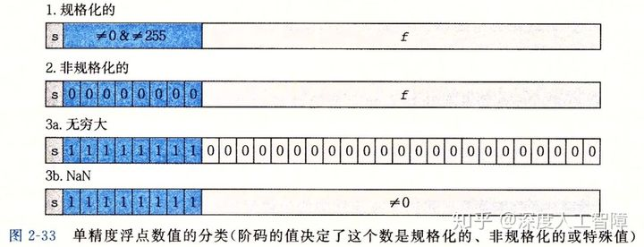
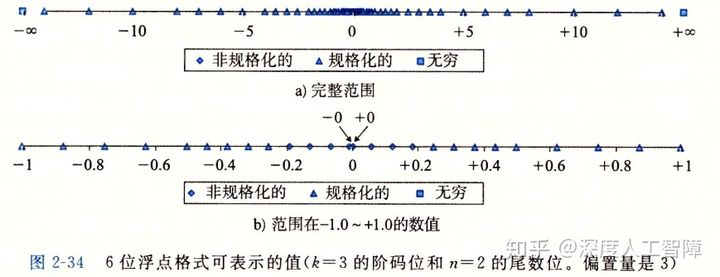
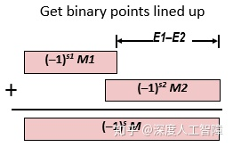

**视频地址：**

[【精校中英字幕】2015 CMU 15-213 CSAPP 深入理解计算机系统 课程视频_哔哩哔哩 (゜-゜)つロ 干杯~-bilibiliwww.bilibili.com/video/av31289365?p=4](https://link.zhihu.com/?target=https%3A//www.bilibili.com/video/av31289365%3Fp%3D4)

**课件地址：**

[http://www.cs.cmu.edu/afs/cs/academic/class/15213-f15/www/lectures/04-float.pdfwww.cs.cmu.edu/afs/cs/academic/class/15213-f15/www/lectures/04-float.pdf](https://link.zhihu.com/?target=http%3A//www.cs.cmu.edu/afs/cs/academic/class/15213-f15/www/lectures/04-float.pdf)

对应于书本的2.4。

**如有错误请指出，谢谢。**

------

## 1 浮点数简介

浮点表示对形如$V=x*2^y$的有理数进行编码，比较适用于非常大的数字、非常接近0的数字。它常常不会太多关注运算的准确性，而是把实现的速度和简便性看得比数字精确性更重要。1985年提出了IEEE标准754，仔细制定了表示浮点数机器运算的标准，后续所有计算机都支持这个标准，极大提高了程序可移植性。

首先会介绍IEEE浮点表示方法，然后由于数字不能精确被表示，所以会介绍浮点数的舍入问题。最后介绍浮点数相关的运算。

## 2 IEEE浮点表示

IEEE浮点表示使用$V=(-1)^s*M*2^E$表示数字。其中包含三部分：

- **符号（Sign）s：**用来确定V的正负性，当s=0时表示正数，s=1时表示负数。用一个单独的符号位直接进行编码。
- **尾数（Significand）M：** 是一个二进制小数，通常介于1和2之间的小数。使用k位二进制进行编码的小数。
- **阶码（Exponent）E：**对浮点数进行加权。使用n位进行编码的正数$e_{k-1},e_{k-2},...,e_0$。

C语言中有单精度精浮点数`float`，其中s=1、k=8、n=23；还有双精度浮点数`double`，其中s=1、k=11、n=52。

我们可以根据尾数和阶码的不同取值，将其分成三种情况：

1. **规格化的值：**当$exp \in(0,2^w-1)$时，$E=exp-Bias$，其中$Bias=2^{k-1}-1$，由此能将E重新投影到正负值，并且能够和非规格化进行平滑；$M=1+frac$，因为我们可以通过调整E使得$1\le M \lt 2$，所以通过这种形式将尾数变成$1.f_{n-1},f_{n-2},...,f_0$的形式，就能获得额外的精度。g规格化数能够表示大范围的数。
2. **非规格化的值：**当$exp=0$时，$E=1-Bias$，由此来保证和规格化值的连续性；$M=frac=0.f_{n-1},f_{n-2},...,f_0$。非规格化数能够表示正负0以及趋近于0的数。
3. **特殊值：**当阶码全为1时，如果尾数全为0，则表示无穷，比如两个很大的数相乘，或除以0时；否则表示NaN（Not a Number），比如求-1的根号。

通过上面我们可以观察到几个**现象**：

1. 非规格数稠密地分布在靠近0的区域；
2. 有些数的间隔是等距的，因为当exp值不变，在`frac`尾数区域进行增加会乘上相同的指数；
3. 越大的数间隔越大，因为比较大的数，它的指数 ![[公式]](https://www.zhihu.com/equation?tex=2%5EE) 会比较大，使得每次变化量会比较大。

**根据二进制编码计算数值：**

1. 计算$Bias=2^{k-1}-1$ 
2. 计算阶码的值exp和尾数的值frac
3. 如果为规格化值，则$E=exp-Bias$，$M=1+frac$；如果为非规格化值，则$E=1-Bias$， $M=frac$。
4. 计算最终的值$V=(-1)^s*M*2^E$

我们以正数为例（s=0），说明几个比较**特殊的值：**

- **0：**只有非规格化才能表示0，exp和frac全部为0时，结果为0。
- **最小的正非规格化数：**$E=1-(2^{k-1}-1)=2-2^{k-1}$是固定值，在frac取值范围内的最小值正数是$[0,0,...,1]$，则$M=frac=2^{-n}$，所以$V=M*2^E=2^{-n}*2^{2-2^{k-1}}=x^{-n+2-2^{k-1}}$。
- **最大非规格化数：**E还是固定值$2-2^{k-1}$，在frac取值范围内的最大值是$[1,1,...,1,0]$，则$M=frac=1-2^{-n}$，所以$V=(1-2^{-n})*2^{2-2^{k-1}}$。
- **最小规格化数：**exp的最小值为$[0,0,...,0,1]=1$，所以$E=exp-Bias=1-(2^{k-1}-1)=2-2^{k-1}$；frac全0时，M取得最小值1，所以$V=2^{2-2^{k-1}}$。
- **1：**要表示1，则需要用规格化来表示，当frac全为0时，M=1，需要让E=0，则$exp=Bias=2^{k-1}-1$，即exp为$[0,1,...,1]$。
- **最大规格化数：**exp的最大值为$[1,1,...,1,0]=2^k-2$，frac的最大值为全1，即$frac=1-2^{-n}$，所以$E=exp-Bias=2^k-2-(2^{k-1}-1)=2^{k-1}-1$，$M=1+frac=2-2^{-n}$，所以 $V=(2-2^{-n})*2^{2^{k-1}-1}=(1-2^{-n-1})*2^{k-1}$。

**IEEE设计的好处：**

1. 最大非规格化值$(1-2^{-n})*2^{2-2^{k-1}}$和最小规格化值$2^{2-2^{k-1}}$之间的幅度是$2^{-n}$，是n位尾数所能表示的最小值，可以看成是**光滑转变**。
2. 从最小非规格化数到最大规格化数的位向量的变化是顺序的，和无符号整数的排序相同。所以可以用无符号数的排序函数来对浮点数进行排序。**注意：**负无穷转化为无符号数进行比较时会有问题。

**将十进制化为浮点数表示：**

以12345为例，我们推算单精度浮点数的编码

1. 计算$Bias=2^{k-1}-1=2^7-1=127$
2. 将12345化为二进制数$[11000000111001]$
3. 首先将二进制数其化成小于1的科学技术法$0.11000000111001*2^{14}$，很明显指数14不为$1-Bias=-126$，所以是规格化数，所以将其转化为大于1的科学计数法$1.1000000111001*2^{13}$，所以$M=1.1000000111001,E=14$。
4. 因为$M=1+frac$，所以frac的编码为$[1000000111001]$ 。因为$E=exp-Bias=exp-127$ ，所以$exp=127+13=140=[10001100]$。
5. 将frac和exp的二进制编码扩展到对应位数并拼接在一起，补上符号位就为最终结果$01000110010000001110010000000000$。

**注意：**要在exp前面补0，在frac后面补0。因为exp表示整数，frac表示小数。

**对比无符号数的编码，我们可以发现：**因为无符号数一定大于0，所以相同的数想用浮点数编码只能使用规范化数进行编码，而规范化数会将frac的最高有效位1去掉，所以无符号数的编码和浮点数编码，在frac部分是相似的，浮点数会少了最高有效位的1。而无符号数的其他部分就是0，而浮点数的其他部分是表示指数的编码。

## 3 浮点数舍入

浮点数由于有限的位数，所以对于真实值x，我们想要用一种系统的方法来找到能够用浮点数表示的“最接近的x”匹配值x'，这个过程就称为**舍入**。

常见的舍入方法有四种：向零舍入、向上舍入、向下舍入以及向偶数舍入。以十进制为例可以看以下表格

其中比较特殊的是**向偶数舍入：**如果处于中间值，就朝着令最后一个有效位为偶数来舍入；否则朝着最近的值舍入。比如1.40，由于靠近1就朝1舍入；1.6靠近2就朝2舍入；1.50位于十进制的中间值，就朝着偶数舍入，所以为2。

**向偶数舍入的意义：**如果对一系列值进行向上舍入，则舍入后的平均值会比真实值更大；使用向下舍入，则舍入后的平均值会比真实值更小。通过向偶数舍入，每个值就有50%概率变大、50%概率变小，使得总的统计量保持较为稳定。

十进制的中间值为$500..._{10}$，比这个中间值大就向上舍入，比这个中间值小就向下舍入，否则朝着偶数舍入。

而二进制的中间值是$100..._2$，比如$101..._2$就比中间值大，$010..._2$就比中间值小。而且二进制中，当最后一个有效位为0时，为偶数。比如

- `10.00011`：由于`011`比中间值小，所以直接向下舍入，为`10.00`。
- `10.00110`：由于`110`比中间值大，所以直接向上舍入，为`10.01`。
- `10.11100`：由于`100`为中间值，而`10.11`最后一个有效位1位奇数，所以向上舍入为偶数`11.00`。
- `10.10100`：由于`100`为中间值，而`10.10`最后一个有效位0位偶数，所以直接向下舍入`10.10`。

## 4 浮点数运算

浮点数运算无法直接通过在位向量上运算得到。

### 4.1 浮点数乘法

对于两个浮点数$(-1)^{s_1}*M_1*2^{E_1}$和$(-1)^{s_2}*M_2*2^{E_2}$，计算结果为$(-1)^{s}*M*2^{E}$，其中$s=s_1XOR\ s_2,\ M=M_1*M_2,E=E_1+E_2$。

- 如果$M\ge 2$，就将frac右移一位，并对E加一。
- 如果E超过了表示范围，就发生了溢出。
- 如果M超过了表示范围，对frac进行舍入。

**数学性质：**

- 可交换
- 不可结合：可能出现溢出和不精确的舍入，比如$1e20*(1e20*1e-20)=1e20$，而$(1e20*1e20)*1e-20=INF$。
- 不可分配：如果分配了可能会出现NaN，比如$1e20*(1e20-1e20)=0$，而$1e20*1e20-1e20*1e20=NaN$。
- 保证，只要$a\ne NaN$，则$a*^ta\ge 0$。

### 4.2 浮点数加法

对于两个浮点数$(-1)^{s_1}*M_1*2^{E_1}$和$(-1)^{s_2}*M_2*2^{E_2}$，计算结果为$(-1)^{s}*M*2^{E}$ ，其中s和M是对其后的运算结果，$E=max(E_1,E_2)$。

- 如果$M\ge 2$，则frac右移一位，并对E加1。
- 如果$M \lt 1$，则frac左移一位，并对E减1。
- 如果E超过表示范围，就发生溢出。
- 如果M超过表示范围，就对frac进行舍入。

**数学性质：**

- 由于溢出，可能得到无穷之。
- 可交换
- 不可结合（由于舍入），因为较大的数和较小的数相加，由于舍入问题，会将较小的数舍入，比如$(3.14+1e10)-1e10=0$ 而$3.14+(1e10-1e10)=3.14$ 。
- 除了无穷和NaN，存在加法逆元。
- 满足单调性，如果$a\ge b$，则对于任意a、b和x，都有$x+a \ge x+b$ 。NaN除外。无符号数和补码由于溢出会发生值的跳变，所以不满足单调性。

**注意：**需要考虑好清楚数值的范围，如果计算的数值范围变化很大，需要重新结合或改变运算顺序，避免由于溢出或舍入出现计算问题。

## 5 C中的浮点数

C中提供了`float`和`double`两种精度的浮点数。由于编码不同，所以在浮点数和整型数之间强制类型转换时，会修改编码，并且会出现溢出和舍入。

- **float/double转换成int：**首先小数部分会被截断，也就是向0舍入。`float`的尾数部分为23字节，比int的32字节小，所以int可以精确表示float的整数部分，而`double`的尾数有52位，可能会出现舍入。并且当超过int的取值范围或NaN时，微处理器会指定$[100...0]$ 为整数不确定值，即对应的$TMin_w$ ，所以一个很大的浮点数转化为int时，可能会出现负数。
- **int或float转换为double：**double尾数有52位，而int只有32位，float只有23位，所以double会精确表示int和float，不会出现溢出和输入。
- **int转换为float：**不会发生溢出，但是由于float尾数位数比较少，会出现舍入。
- **double转换为float：**可能会出现溢出和舍入。

**总结：**超过数值表示范围，会发生溢出；尾数较短，会发生输入。

------

**课堂作业：**

- `x==(int)(float)x`：int有32位，float尾数有23位，从int强制类型转换到float会出现舍入，所以错误。
- `x==(int)(double)x`：int有32位，double尾数有52位，所以从int强制类型转换到float不会出现舍入，所以正确。
- `f==(float)(double)f`：double的精度和范围都比float大，所以能够无损地从float强制类型转换到double，所以正确。
- `d==(double)(float)d`：因为float的精度和范围都比double小，可能会出现溢出和输入，所以错误。
- `f==-(-f)`：因为只要改变一个符号位，所以正确。
- `2/3==2/3.0`： 因为`2/3`是int类型，会舍入变成0，而`2/3.0`是double类型，会得到数值，所以错误。
- `d<0.0`推出`((d*2)<0.0)`：乘2相当于exp加一，如果出现溢出，也是无穷小，所以正确。
- `d>f`推出`-f>-d`： 只要改变一个符号位，所以正确。
- `d*d>=0.0`： 正确。
- `(d+f)-d==f`：不符合结合律，可能会出现舍入和溢出。

------

接下来会完成课后练习题，然后完成Lab 。