**视频地址：**

[【精校中英字幕】2015 CMU 15-213 CSAPP 深入理解计算机系统 课程视频_哔哩哔哩 (゜-゜)つロ 干杯~-bilibiliwww.bilibili.com/video/av31289365?p=10](https://link.zhihu.com/?target=https%3A//www.bilibili.com/video/av31289365%3Fp%3D10)

**课件地址：**

[http://www.cs.cmu.edu/afs/cs/academic/class/15213-f15/www/lectures/10-optimization.pdfwww.cs.cmu.edu/afs/cs/academic/class/15213-f15/www/lectures/10-optimization.pdf](https://link.zhihu.com/?target=http%3A//www.cs.cmu.edu/afs/cs/academic/class/15213-f15/www/lectures/10-optimization.pdf)

对应书中的第五章。

**如有错误请指出，谢谢。**

------

- 使用内联方式来优化函数调用问题

- **优化方法：**

- - **基本编码原则：**

  - - **消除连续的函数引用**：识别要执行多次（比如在循环内）但是计算结果不会改变的计算，将该计算移到前面。同时也考虑减少循环中函数的调用。
    - **消除不必要的内存引用：**当在循环中使用指针时，会反复对内存进行读写，我们可以引入一个临时变量来保存中间结果，使其保存在寄存器中，就无需涉及内存引用了，最终再将寄存器中的值保存到指针中。

  - **低级优化：**

  - - **kx1循环展开：**一个循环中计算多个操作，减少需要的循环次数，能减少不必要的操作，但是没有消除数据相关，无法突破延迟界限。
    - **kxk循环展开：**声明多个独立变量，在循环中独立计算，能减少循环次数，并使用多个功能单元及其流水线，能消除数据相关突破延迟界限。当$k\ge C *L$时接近吞吐量界限，其中C为操作容量、L为操作延迟。
    - **重新结合：**通过修改结合方法，来减少目标寄存器上的操作，由此减少关键路径上的操作数。
    - 反复测试代码，使得汇编代码产生条件传送。

- 上下相同寄存器才会构成一段数据相关链

- **注意：**延迟是指执行一个操作所需的时钟周期，但是由于功能单元存在流水线，所以可以每个时钟周期都开始一个操作。只有当两个操作之间存在数据相关时，无法使用流水线了，才考虑操作的延迟。

- 数据相关是针对寄存器而言的

- 要在更大范围观察写/读相关，不一定存在一个迭代中，可能在相邻迭代中，只要发现有存储操作，而后执行相同地址的加载操作，就会有写/读相关。

------

编写高效程序要做到：

1. 选择合适的算法和数据结构
2. 编写出编译器能够有效优化以转化成高效可执行代码的源文件**（重要）**
3. 针对处理运算量较大的计算，可以将一个任务分成多个部分，然后在多核和多处理器的某些组合上并行计算。（第12章再介绍）

比较**理想的情况**是，编译器能够接受我们编写的任何代码，并产生尽可能高效的、具有指定行为的机器级程序。但是编译器会受到**optimization blocker（OB）**的影响，即程序行为中严重依赖于执行环境的方面，所以程序员要写出编译器容易优化的代码。

**程序优化的步骤：**

1. 消除不必要的工作，让代码尽可能有效地执行所期望的任务。包括消除不必要的函数调用、条件测试和内存引用。
2. 利用处理器提供的指令级并行能力来同时执行多条指令，会介绍降低一个计算不同部分之间的数据相关，来提高并行度。
3. 使用**代码剖析程序（Profiler）**来测量程序各部分性能，找到代码中效率最低的部分。

我们这里简单地将程序优化看成是一系列转换的线性变换，但是实际上我们需要通过汇编代码来确定代码执行的具体细节，比如寄存器使用不当、可以并行执行的操作、如何使用处理器资源等等，然后不断修改源代码使得编译器能够产生高效的代码就可以了，由此保证了代码的可移植性。

## 1 前言

### 1.1 编译器的能力和局限性

编译器能够提供对程序的不同优化级别，命令行选项`-Og`调用GCC使用一组基本的优化，而`-O1`、`-O2`和`-O3`可以让GCC进行更大量的优化， 但是过度的优化会使得程序规模变大，且更难调试，通常使用`-O2`级别的优化。

但是编译器只会提供安全的优化，保证优化前后的程序由一样的行为，这里会有两个OB使得编译器不会对其进行优化：

- **内存别名使用（Memory Aliasing）**：编译器会假设不同的指针可能会指向相同的位置，如果发现会改变程序行为，就会避免一些优化

```c
void twiddle1(long *xp, long *yp){
  *xp += *yp;
  *xp +== *yp;
}
```

以上代码需要6次内存引用（2次读取`yp`、2次读取`xp`和2次写`xp`），我们可以将其优化为

```c
void twiddle2(long *xp, long *yp){
  *xp += 2* *yp;
}
```

这里只需要3次内存引用（1次读取`yp`，1次读取`xp`和1次写`xp`），但是编译器会假设`xp`和`yp`指向相同的内存位置，由此函数`twiddle1`和`twiddle2`的计算结果就不同了，所以编译器不会讲`twiddle2`作为`twiddle1`的优化版本。

- **函数调用**：大多数编译器不会试图判断函数是否没有副作用，如果没有就会对函数调用进行优化，但是编译器会假设最坏的情况，保持所有函数的调用不变

```c
long f();
long func1(){
  return f()+f()+f()+f();
}
long func2(){
  return 4*f();
}
```

函数`func1`需要调用4次函数`f`，而函数`func2`只需要调用1次函数`f`，但是如果函数`f`是以下形式

```c
long count = 0;
long f(){
 return count++;
} 
```

就具有副作用，改变调用`f`的次数会改变程序行为，所以编译器不会将函数`func1`优化为`func2`。

> 对于会改变在哪里调用函数或调用次数的变化，编译器都会十分小心

我们通常可以使用**内联函数替换（Inline Substitution，内联）**来优化函数调用，它直接将函数调用替换成函数体，然后在对调用函数进行优化。比如以上例子中，会得到一个内联函数

```c
long func1in(){
  long t = count++;
  t += count++;
  t += count++;
  t += count++;
  return t;
} 
```

由此不仅减少了函数调用带来的开销，并且能够对代码进一步优化，得到以下形式

```c
long func1opt(){
  long t = 4*count+6;
  count += 4;
  return t;
}
```

在GCC中，我们可以使用`-finline`、`-O1`或更高级别的优化来得到这种优化。但是具有以下**缺点**：

- GCC只支持在单个文件中定义的函数的内联
- 当对某个函数调用使用了内联，则无法在该函数调用上使用断点和跟踪
- 当对某个函数调用使用了内联，则无法使用代码剖析来分析函数调用

### 1.2 表示程序性能

许多过程都含有在一组元素上迭代的循环，比如以下`psum1`是对一个长度为n的向量计算前置和，而`psum2`是使用**循环展开（Loop Unrolling）**技术对其进行优化

```c
void psum1(float a[], float p[], long n){
  long i;
  p[0] = a[0];
  for(i=1, i<n; i++){
    p[i] = p[i-1]+a[i];
  }
} 

void psum2(float a[], float p[], long n){
  long i;
  p[0] = a[0];
  for(i=1; i<n-1; i+=2){
    float mid_val = p[i-1]+a[i];
    p[i] = mid_val;
    p[i+1] = mid_val+a[i+1];
  }
  if(i<n){
    p[i] = p[i-1]+a[i];
  }
}
```

由于使用循环展开优化的函数，迭代次数通常会减少，并且我们更关注对于给定的向量长度`n`，程序运行的速度如何，所以我们使用度量标准**CPE（Cycles Per Element）**来度量计算每个元素需要的周期数，CPE更适合用来度量执行重复计算的程序。

我们可以调整输入的向量大小，得到以上两个函数计算时所需的周期数，然后使用最小二乘拟合来得到曲线图。`psum1`函数的结果为`368+9.0n`，而`psum2`的结果为`368+6.0n`，其中斜率就是CPE指标，所以`psum1`为9.0，`psum2`为6.0，所以根据CPE指标，`psum2`更优于`psum1`。

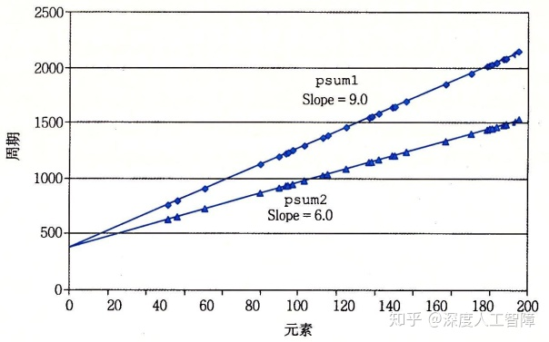

我们可以通过这种方式得到不同函数的曲线图，由此可以计算出各种函数性能最优的元素个数区间。

## 2 对程序进行优化

### 2.1 程序实例

我们定义了以下数据结构、生成向量、访问向量以及确定向量长度的基本过程

数据结构

生成向量、访问向量以及确定向量长度

我们通过声明数据类型`data_t`、初始值`IDENT`和运算符`OP`来测量整数/浮点数数据的累加/累乘函数的性能。首先给出合并运算的初始实现


对应的CPE度量值如下图所示


我们将在函数`combine1`的基础上对其进行优化来降低CPE度量值，**最好的方法**是实验加分析：反复尝试不同方法，进行测量，检查汇编代码来确定底层的性能瓶颈。

### 2.2 消除循环的低效率

我们对`combine1`函数进行编译得到如下图所示的汇编代码，可以发现每次循环迭代时都会执行`call vec_length`指令来计算向量长度，但是向量长度在该函数中是不变的，所以我们可以将计算向量长度的代码移到循环外面，得到`combine2`。

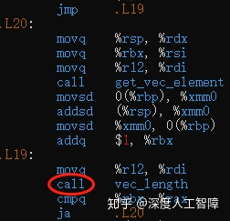


当前性能如下图所示


该优化称为**代码移动（Code Motion）**：识别要执行多次（比如在循环内）但是计算结果不会改变的计算（会增加很多额外的函数调用，出现`ret`指令会降低流水线效率），就将该计算移到前面。

> 由于存在函数调用OB，编译器会非常小心修改调用函数位置以及调用函数次数，所以编译器不会自动完成上述优化。

### 2.3 减少过程调用

过程调用通常会带来开销，并且会阻碍编译器对程序进行优化。

我们可以看到`combine2`函数在循环中会反复调用`get_vev_element`函数来获得下一个向量元素，而在`get_vev_element`函数中会反复检查数组边界，我们可以发现该步骤在`combine2`函数中是冗余的，会损害性能。

我们可以将其改为以下形式来减少函数调用


但是该函数的性能如下图所示，性能并没有提升，说明内循环中的其他操作才是瓶颈。


> 由于存在函数调用OB，编译器不会自动完成上述优化。

### 2.4 减少不必要的内存引用

我们对`combine3`进行编译，得到循环内对应的汇编代码


可以发现每次循环时，首先会从内存中读取`*dest`的值，然后将其写回内存中，再一次迭代时，又从内存中读取刚写入的`*dest`值，这就存在不必要的内存读写。

> 声明为指针的数据会保存在数据栈内存中，读取指针值时会读取内存，对指针值进行赋值时，会写入内存

我们可以将代码修改为以下形式


当函数中的局部变量数目少于寄存器数目时，就会将局部变量保存到寄存器中，就无须在内存中进行读写了，其对应的汇编代码为


对应的性能为


> 由于存在内存别名使用，两个函数可能会不同的行为，所以编译器不会自动进行优化。

## 3 现代处理器

以上方法只是减少过程调用的开销，消除一些重大的OB，但是想要进一步优化程序性能，就需要针对目标处理器微体系结构来进行优化。

现代处理器在指令运行中提供了大量的优化，支持**指令级并行**，使得能够同时对多条指令进行求值，并且通过一系列机制来确保指令级并行能获得机器级程序要求的顺序语义模型，这就使得处理器的实际操作和机器及程序描述的有很大差别。

### 3.1 整体操作

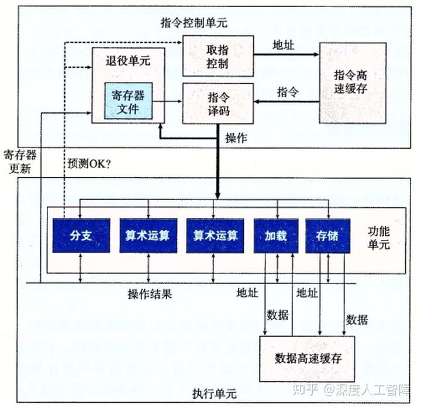乱序处理器框图

如上图所示是一个简化的Intel处理器的结构，包含**两个特点：**

- **超标量（Superscalar）：**处理器可以在每个时钟周期执行多个操作
- **乱序（Out-of-order）：**指令执行的顺序不一定和机器代码的顺序相同，提高指令级并行

该处理器主要由两部分构成：

- **指令控制单元（Instruction Control Unit，ICU）：**通过取值控制逻辑从指令高速缓存中读出指令序列，并根据这些指令序列生成一组针对程序数据的基本操作，然后发送到EU中。

- - **取指控制逻辑：**包含分支预测，来完成确定要取哪些指令。

  - - **分支预测（Branch Prediction）技术：**当程序遇到分支时，程序有两个可能的前进方向，处理器会猜测是否选择分支，同时预测分支的目标地址，直接取目标地址处的指令。

  - **指令高速缓存（Instruction Cache）：**特殊的高速存储器，包含最近访问的指令。ICU通常会很早就取指，给指令译码留出时间。

  - **指令译码逻辑：**接收实际的程序指令，将其转换成一组基本操作（微操作），并且可以在不同的硬件单元中并行地执行不同的基本操作。比如x86-64中的`addq %rax, 8(%rdx)`，可以分解成访问内存数据`8(%rdx)`、将其加到`%rax`上、将结果保存会内存中。

  - **退役单元（Retirement Unit）：**指令译码时会将指令信息放到队列中，确保它遵守机器级程序的顺序语义。队列中的指令主要包含两个状态：

  - - **退役（Retired）：**当指令完成，且引起这条指令的分支点预测正确，则这条指令会从队列中出队，然后完成对寄存器文件的更新。
    - **清空（Flushed）：**如果引起该指令的分支点预测错误，就会将该指令出队，并丢弃计算结果，由此保证预测错误不会改变程序状态。
    - **寄存器文件：**包含整数、浮点数和最近的SSE和AVX寄存器。

- **执行单元（Execution Unit，EU）：**使用投机执行技术执行由ICU产生的基本操作，通常每个时钟周期会接收多个基本操作，将这些操作分配到一组功能单元中来执行实际的操作。

- - **投机执行（Speculative Execution）技术：**直接执行ICU的预测指令，但是最终结果不会存放在程序寄存器或数据内存中，直到处理器能确定应该执行这些指令。分支操作会被送到EU中来确定分支预测是否正确。如果预测错误，EU会丢弃分支点之后计算出来的结果，并告诉分支模块。

  - **功能单元：**专门用来处理不同类型操作的模块，并且可以使用寄存器重命名机制将“操作结果”直接在不同单元间进行交换，这是数据转发技术的高级版本。

  - - **存储模块**和**加载模块**负责通过数据高速缓存来读写数据内存，各自包含一个**加法器**来完成地址的计算，并且单元内部都包含**缓冲区**来保存未完成的内存操作请求集合。每个时钟周期可完成开始一个操作。

    - **分支模块：**当得知分支预测错误，就会在正确的分支目的中取指。

    - **算数运算模块：**能够执行各种不同的操作。

    - **寄存器重命名机制（Register Renaming）：**会维护一个寄存器的重命名表来进行数据转发，主要有以下步骤

    - - 当执行一条更新寄存器`r`的指令`I1`，会产生一个指向该操作结果的唯一标识符`t`，然后将`(r, t)`加入重命名表中。
      - 当后续有需要用到寄存器`r`作为操作数的指令时，会将`t`作为操作数源的值输入到单元中进行执行
      - 当`I1`执行完成时，就会产生一个结果`(v, t)`，表示标识符`t`的操作产生了结果`v`，然后所有等待`t`作为源的操作都会使用`v`作为源值。
      - **意义：**使用寄存器重命名机制，可以将值从一个操作直接转发到另一个操作，而无需进行寄存器文件的读写，使得后续的操作能在第一个操作`I1`完成后尽快开始。并且投机执行中，在预测正确之前不会将结果写入寄存器中，而通过该机制就可以预测着执行操作的整个序列。
      - **注意：**重命名表只包含未进行寄存器写操作的寄存器，如果有个操作需要的寄存器没有在重命名表中，就可以直接从寄存器文件中获取值。

  - **数据高速缓存（Data Cache）：**存放最近访问的数据值。

### 3.2 功能单元的性能

我们提供一种参考机Intel Core i7 Haswell，总共具有8个功能单元

- 整数运算、浮点乘、整数和浮点数除法、分支
- 整数运算、浮点加、整数乘、浮点乘
- 加载、地址计算
- 加载、地址计算
- 存储
- 整数运算
- 整数运算、分支
- 存储、地址计算

其中，整数运算包含加法、位级操作和移位等等。存储操作需要两个功能单元，一个用于计算存储地址，一个使用保存数据。我们可以发现，其中有4个能进行整数运算的功能单元，说明处理器一个时钟周期内可执行4个整数运算操作。其中有2个能进行加载的功能单元，说明处理器一个时钟周期可读取两个操作数。

该参考机的算数运算性能如下图所示

参考机的运算性能

- **延迟（Latency）：**表示完成单独一个运算所需的时钟周期总数
- **发射时间（Issue Time）：**表示采用流水线时，两个连续的同类型运算之间需要的最小时钟周期数
- **容量（Capacity）：**表示能够执行该运算的功能单元数量

每个运算都能在对应的功能单元进行计算，每个功能单元内部都是用流水线实现的，使得运算在功能单元内是分阶段执行的。发射时间为1的运算，意味着对应的功能单元是**完全流水线化的（Fully Popelined）**，要求运算在功能单元内的各个阶段是连续的，且逻辑上独立的，才能每个时钟周期执行一个运算。当发射时间大于1，意味着该运算在功能单元内不是完全流水线化的，特别是除法运算的延迟等于发射时间，意味着需要完全执行完当前的除法运算，才能执行下一条除法运算。

从系统层次而言，可以通过吞吐量来衡量运算的性能，对于一个容量为`C`，发射时间为`I`的操作而言，其吞吐量为`C/I`。

根据以上运算性能，我们可以得到CPE值的两个基本界限，来描述程序的最大性能：

- **延迟界限：**

- - **意义：**当指令存在数据相关时，指令的执行必须严格顺序执行，就会限制了处理器指令级并行的能力，延迟界限就会限制程序性能。
  - **解释：**当存在数据相关时，指令是严格顺序执行的，意味着我们无法通过指令并行来进行加速。而通过参考机的运算性能知道执行每种运算所需的延迟，就确定了执行该运算所需的最小时钟周期数，此时CPE的延迟界限就是运算操作的延迟。比如整数乘法的延迟为3个时钟周期，意味着我们需要用3个时钟周期才能完成一个整数乘法运算，不可能更快了，所以当前的CPE值为3。

- **吞吐量界限：**

- - **意义：**刻画了处理器功能单元的原始计算能力，是程序性能的终极限制。
  - **解释：**表示我们考虑系统中的所有的功能单元，计算出来运算结果的最大速率。比如参考机含有4个可以执行整数加法的功能单元，且整数加法的发射时间为1，所以系统执行整数加法的吞吐量为4，意味着CPE值为0.25，但是参考机中只有两个支持加载的功能单元，意味着每个时钟周期只能读取两个操作数，所以这里的吞吐量就受到了加载的限制，CPE值为0.5。再比如参考机内只含有一个能执行整数乘法的功能单元，说明一个时钟周期只能执行一个整数乘法，此时性能吞吐量就受到了功能单元运算的限制，CPE值为1。


我们可以发现除了整数加法外，`combine4`的结果与延迟界限结果相同，说明`combine4`中存在数据相关问题。

### 3.3 处理器操作的抽象模型

这里介绍一种非正式的程序的**数据流（Data-flow）**表示，可以展示不同操作之间的数据相关是如何限制操作的执行顺序，并且图中的**关键路径（Cirtical Path）**给出了执行这些指令所需的时钟周期数的下界。

### 3.3.1 从机器级代码到数据流图

由于对于大向量而言，循环执行的计算是决定性能的主要因素，我们这里主要考虑循环的数据流图。首先可以得到循环对应的机器级代码


我们根据机器级代码可以获得寄存器在执行指令时进行的操作，然后可以得到以下对应的数据流图。

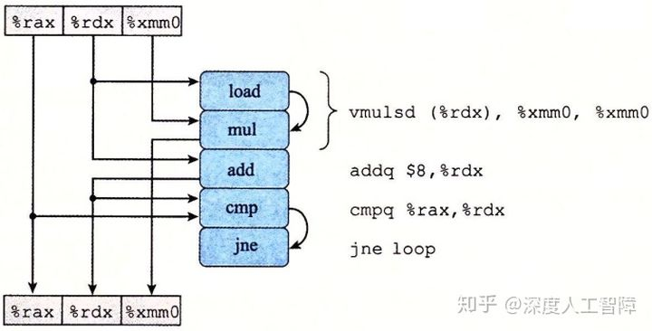

上方寄存器为输入的寄存器，下方寄存器为输出的寄存器，从寄存器指向操作的箭头表示该操作读取寄存器的值，从操作指向寄存器表示操作的结果保存在寄存器中，如果某些操作产生的值不对应于任何寄存器，就在操作间用弧线连接起来。其中，`vmulsd (%rdx), %xmm0, %xmm0`包含从内存中读取`(%rdx)`的值，然后计算浮点数乘法的基本操作。

根据数据流图可以将寄存器分成以下几种：

- **只读：**只包含寄存器指向操作的箭头，不包含从操作指向该寄存器的箭头。比如`%rax`。
- **只写：**只包含从操作指向该寄存器的箭头，不包含从寄存器指向操作的箭头。
- **局部：**寄存器值在循环内部修改和使用，迭代与迭代之间不相关。比如条件码寄存器。
- **循环：**寄存器既作为源又作为目的，并且一次迭代中产生的值会在另一次迭代中使用。比如`%rdx`和`%xmm0`。

**注意：**因为迭代之间是数据相关的，必须保证循环寄存器在上一轮迭代中计算完成，才能在下一轮迭代中使用该循环寄存器，所以循环寄存器之间的操作链决定了限制性能的数据相关。

我们可以对数据流图进行修改，上方寄存器只有只读寄存器和循环寄存器，下方寄存器只有只写寄存器和循环寄存器，得到如下图所示的数据流图

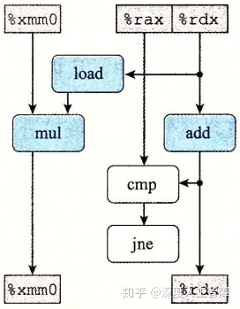

所以同时出现在上方和下方的寄存器为循环寄存器。我们删除非循环寄存器以外的寄存器，并删除不在循环寄存器之间的操作，得到以下简化的数据流图

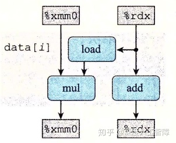

其中下方每个寄存器代表了一个数据相关：

- `%xmm0`：当前迭代中`%xmm0`的计算，需要上一轮计算出来的`%xmm0`以及`%rdx`
- `%rdx`：当前迭代中`%rdx`的计算，需要上一轮计算出来的`%rdx`

我们可以将上图中的数据流重复n次，就得到了函数中循环n次的数据流图

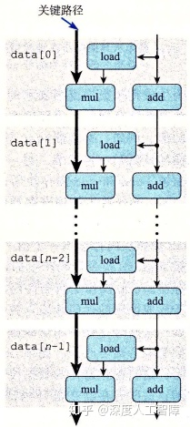

可以发现里面有两个数据相关链，只有当上方的计算完成时才会计算下一个。并且由于相邻迭代的循环寄存器存在数据相关，所以只能顺序执行，所以要独立地考虑操作对应的延迟。由于参考机中浮点数乘法的延迟为5个时钟周期，而整数加法的延迟为1个时钟周期，所以左侧数据相关链是关键路径，限制了程序的性能。只要左侧操作的延迟大于1个时钟周期（比右侧的延迟大），则程序的CPE就是该操作的延迟。

**注意：**数据流中的关键路径只是提供程序需要周期数的下界，还有很多其他因素会限制性能。比如当我们将左侧的操作变为整数加法时，根据数据流预测的CPE应该为1，但是由于这里的操作变得很快，使得其他操作供应数据的速度不够快，造成实际得到的CPE为1.27。

------

这里说明下习题5.5和5.6的原理

首先有一个函数

```c
double poly(double a[], double x, long degree){
  long i;
  double result = a[0];
  double xpwr = x;
  for(i=1; i<=degree; i++){
    result += a[i]*xpwr;
    xpwr = x*xpwr;
  }
  return result;
}
```

对应的汇编代码为

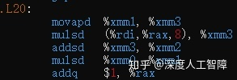

其中，`%xmm1`保存`xpwr`，`%rdi`保存`a`，`%rax`保存`i`，`%xmm2`保存`result`、`%xmm0`保存`x`。我们可以画出对应的数据流图

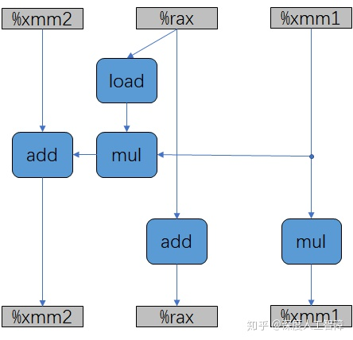

其中两个`mul`由于不存在数据相关，所以可以在不同的功能单元，或者在相同的功能单元中流水线执行。 一共有3个循环寄存器，所以存在3个数据相关，延迟最大的是`%xmm1`进行的浮点数乘法，需要5个时钟周期，所以该路径为关键路径，所以CPE为5。

另一个函数为

```c
double polyh(double a[], double x, long degree){
  long i;
  double result = a[degree];
  for(i=degree-1; i>=0; i--){
    result = a[i]+x*result;
  }
  return result;
}
```

对应的汇编代码为


其中，`%xmm0`保存`x`，`%xmm1`保存`reslut`，`%rdi`保存`a`，`%rsi`保存`i`。可以获得对应的数据流图


可以发现左侧的是关键路径，需要的延迟包含浮点数乘法和浮点数加法，所以CPE为8。

可以发现，迭代n次时，函数`poly`需要的加法次数为2n，乘法次数为2n；函数`polyh`需要的加法次数为2n，乘法次数为1n。虽然`polyh`计算次数减少了，但是CPE却变得更差了，说明函数具有更少的操作不意味着具有更好的性能。

**注意：**我们只要关注单独循环寄存器之间的延迟，然后再在各个循环寄存器之间进行比较，得到最大的延迟。

**（以上只是自己的推测，和课后答案有所区别，如有问题请指出，谢谢）**

------

### 3.4 循环展开

我们可以通过对函数实行循环展开，增加每次迭代计算的元素数量，减少循环的迭代次数。

这里介绍一种**kx1循环展开**方法，格式如下所示，将一个循环展开成了两部分，第一部分是每次循环处理k个元素，能够减少循环次数；第二部分处理剩下还没计算的元素，是逐个进行计算的。

```c
#define k 2
void combine5(vec_ptr v, data_t *dest){
  long i;
  long length = vec_length(v);
  long limit = length-k+1;
  data_t *data = get_vec_start(v);
  data_t acc = IDENT;
  for(i=0; i<limit; i+=k){
    acc = ((acc OP data[i]) OP data[i+1]) ... OP data[i+k-1];
  }
  for(; i<length; i++){
    acc = acc OP data[i];
  }
  return acc;
}
```

我们看到改程序具有以下性能


可以发现整数加法优化到了延迟界限，因为延迟展开能减少不必要的操作的数量（例如循环索引计算和条件分支），但是其他的并没有优化，因为其延迟界限是主要限制因素。

可以发现循环展开无法突破延迟界限。我们可以得到`combine5`循环部分的汇编代码


可以得到对应的数据流图

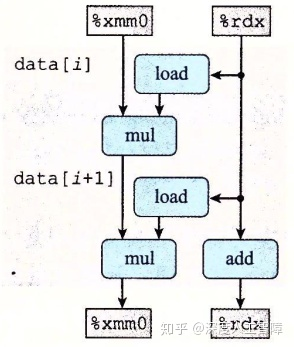

其中，`%xmm0`保存`acc`，`%rdx`保存`i`。可以发现循环展开虽然能将循环次数减少为原来的k分之一，但是每次迭代所需的时钟周期变为了原来的k倍，使得总体的延迟不变，无法突破延迟界限。

**总结：**延迟展开可以减少迭代次数，使得不必要的操作数量减少，但是没有解决数据相关问题，无法突破延迟界限。

### 3.5 多个变量提高并行性

我们可以通过引入多个变量来提高循环中的并行性。

这里介绍一种**kxk循环展开**方法，格式如下所示，将一个循环展开成了两部分，第一部分是每次循环处理k个元素，能够减少循环次数，并且引入k个变量保存结果；第二部分处理剩下还没计算的元素，是逐个进行计算的。

```c
#define K 2
void combine6(vec_ptr v, data_t *dest){
  long i;
  long length = vec_length(v);
  long limit = length-k+1;
  data_t *data = get_vec_start(v);
  data_t acc0 = IDENT;
  data_t acc1 = IDENT;
  ...
  data_t acck_1 = IDENT; //k个变量

  for(i=0; i<limit; i+=k){
    acc0 = acc0 OP data[0];
    acc1 = acc1 OP data[1];
    ...
    acck_1 = acck_1 OP data[k-1]; //更新k个变量
  }  
  for(; i<length; i++){
    acc0 = acc0 OP data[i];
  }
  *dest = acc0 OP acc1 OP ... OP acck_1;
}
```

我们看到改程序具有以下性能


可以通过循环对应的数据流图来分析

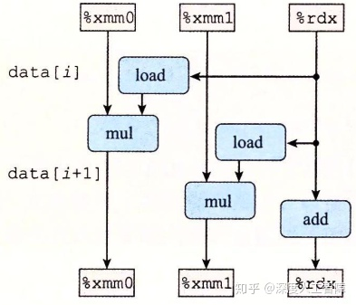

其中，`%xmm0`保存`acc0`，`%xmm`保存`%acc1`，`%rdx`保存`i`。可以发现，我们通过在循环中引入多个变量，使得原来在同一个循环寄存器中的浮点数乘法运算分配到不同的循环寄存器中，就消除了循环寄存器的数据相关限制，就可以使用不同的功能单元，或利用功能单元的流水线进行并行计算，就**能突破延迟界限**。

为了接近吞吐量界限，我们需要使用系统中的所有功能单元，并且保证功能单元的流水线始终是慢的，所以对于容量为C、延迟为L的操作而言，需要设置$k\ge C*L$（最快每个时钟周期执行一个操作)。

### 限制

使用kxk循环展开时，我们需要申请k个局部变量来保存中间结果，如果k大于寄存器的数目，则中间结果就会保存到内存的堆栈中，使得计算中间结果要反复读写内存，造成性能损失。


### 3.6 改变结合顺序提供并行性

`combine5`中还存在数据相关，是因为循环里中的计算如下所示

```c
acc = ((acc OP data[i]) OP data[i+1]) ... OP data[i+k-1];
```

中间计算的局部结果会不断保存到`acc`的循环寄存器中，使得数据流图如下所示


如果我们改变计算方法为下图所示

```c
acc = acc OP (data[i] OP (data[i+1]) (... OP data[i+k-1])));
```

则中间计算的局部结果不会直接保存到acc的循环寄存器中，数据流图变为如下所示

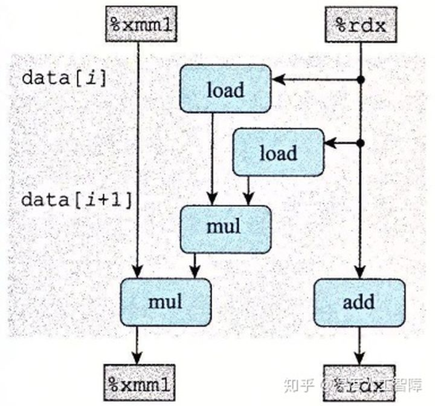

由此能减少关键路径中`%xmm0`的操作数量，并且通过循环展开来利用多个功能单元、及其功能单元的流水线，这样就能够**突破延迟界限**。

**注意：**我们可以统计对`acc`的操作次数，知道关键路径中有几个操作。

该方法的性能如下图所示


可以发现kx1a的性能类似于kxk的性能。

### 3.7 使用SIMD提高并行度

**参考：**

[吉良吉影：SIMD简介384 赞同 · 12 评论文章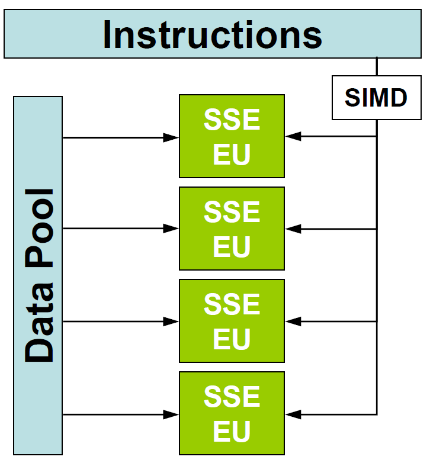](https://zhuanlan.zhihu.com/p/55327037)

[http://csapp.cs.cmu.edu/3e/waside/waside-simd.pdfcsapp.cs.cmu.edu/3e/waside/waside-simd.pdf](https://link.zhihu.com/?target=http%3A//csapp.cs.cmu.edu/3e/waside/waside-simd.pdf)


由于AVX指令集不包括64位整数的并行乘法指令，所以无法对其进行优化。

## 4 分支预测

在使用投机执行的处理器中，会直接执行预测分支的执行，并且EU不会直接修改寄存器或内存，知道确定预测是否正确，当分支预测错误时，会丢弃之前执行的结果，重新开始取指令过程，会造成性能损失。

但是一般分支是很容易预测的，比如函数`combine2`中的边界检查一定是正确的，循环操作除了最后一次分支是跳出循环以外，之前的分支都是继续循环操作，所以这些分支是可预测的，并且分支指令的执行和我们循环体的执行通常不会有数据相关，所以当我们使用AT策略预测分支时，能使得将其全部流水线化，不会造成很大的性能损失。

> 当分支是高度可预测，且分支和循环体不存在数据相关时，不会造成很大的性能损失

如果处理器将条件分支使用条件传送时，就能将其变为流水线的一部分，无需进行分支预测，也就没有了预测错误的处罚了。我们需要尝试不断修改代码使编译器将分支变成条件传送指令。

比如以下代码


会被翻译成条件控制形式，但是如果我们改成以下代码，就会翻译成条件传送

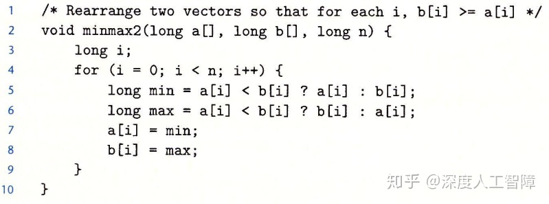

## 5 内存性能

所有现代处理器都包含一个或多个高速缓存存储器，现在考虑所有数据都存放在高速缓存中，研究设计加载（从内存到寄存器）和存储（从寄存器到内存）操作的程序性能。

### 5.1 加载性能

我们的参考机包含两个加载功能单元，意味着当流水线完全时，一个时钟周期最多能够执行两个加载操作，由于每个元素的计算需要加载一个值，所以CPE的最小值只能是0.5。对于每个元素的计算需要加载k个值的应用而言，CPE的最小值只能是k/2。

由于我们之前计算内存地址都是通过循环索引`i`，所以两个加载操作之间不存在数据相关（每一轮的加载操作只要根据`i`计算地址，无需等到上一轮加载操作完成才能计算当前轮的内存地址），也就不用考虑加载延迟。

但是对于如下所示的链表函数，计算当前加载地址，需要先获取上一轮的地址，由此加载操作之间就存在数据相关，就需要考虑加载延迟了。


循环中对应的汇编代码为


其中，`%rax`保存`len`，`%rdi`保存`ls`，我们可以得到对应的数据流图

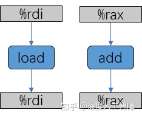

可以发现这里有两个数据相关的循环寄存器`%rdi`和`%rax`，其中加法操作需要的延迟通常比加载操作的延迟小，所以左侧为关键路径，这里测得该函数的CPE为4.0，就是加载操作对应的延迟。

### 5.2 存储性能

存储操作是将寄存器中的数据保存到内存中，所以存储操作不会产生数据相关，但是存储操作会影响加载操作，出现**写/读相关（Write/Read Dependency）**。

首先需要先了解加载和存储单元的细节。如下图所示，在存储单元中会有一个**存储缓冲区**，用来保存发射到存储单元但是还未保存到数据高速缓存的存储操作的地址和数据，由此避免存储操作之间的等待。并且加载操作会检查存储缓冲区中是否有需要的地址，如果有，则直接将存储缓冲区中的数据作为加载操作的结果。

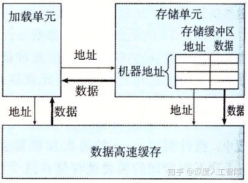

我们看以下代码，会从`*src`处读取数据，然后将其保存到`*dest`


循环内对应的汇编代码为


我们可以的带对应的数据流图


我们需要注意以下几点：

- `movq %rax, (%rsi)`表示存储操作，首先会进行`s_addr`操作计算存储操作的地址，在存储缓冲区创建一个条目，并设置该条目的地址字段。完成后才进行`s_data`操作来计算存储操作的数据字段。
- 后续`movq (%rdi), %rax`的`load`操作会等待`s_addr`操作计算完成后，判断加载操作的地址和`s_addr`操作计算出来的地址是否相同，如果相同，则需要等`s_data`操作将其结果保存到存储缓冲区中，如果不同，则`load`操作无需等待`s_data`操作。所以`load`操作和`s_addr`操作之间存在数据相关，而`load`操作和`s_data`操作之间存在有条件的数据相关。

对其进行重新排列，并且去除掉非循环寄存器，可以得到如下的数据流图


我们可以发现：

- 当加载操作和存储操作的地址相同：图中的虚线就存在，则`%rax`为循环寄存器，关键路径为左侧路径，包含存储数据计算、加载操作和加法操作，CPE大约为7.3。
- 当加载操作和存储操作的地址不同：图中的虚线就不存在，则`%rax`就不是循环寄存器，其中`s_data`操作和`load`操作可以并行执行，关键路径为右侧路径，只有一个减法操作，CPE大约为1.3。

**注意：**要在更大范围观察写/读相关，不一定存在一个迭代中，可能在相邻迭代中，只要发现有存储操作，而后执行相同地址的加载操作，就会有写/读相关。

## 6 程序剖析

**程序剖析（Profiling）**会在代码中插入工具代码，来确定程序的各个部分需要的时间。可以在实际的基准数据上运行实际程序的同时进行剖析，不过运行会比正常慢一些（2倍左右）。

Unix系统提供一个剖析程序GPROF，提供以下信息：

- 确定程序中每个函数运行的CPU时间，用来确定函数的重要性
- 计算每个函数被调用的次数，来理解程序的动态行为

GPROF具有以下特点：

- 计时不准确。编译过的程序为每个函数维护一个计时器，操作系统每隔x会中断一次程序，当中断时，会确定程序正在执行什么函数，然后将该函数的计时器加上x。
- 假设没有执行内联替换，则调用信息是可靠的
- 默认情况下，不会对库函数计时，将库函数的执行时间算到调用该库函数的函数上

**使用方法：**

- 程序要为剖析而编译和连接，加上`-pg`，并且确保没有进行内联替换优化函数调用

```text
gcc -Og -pg prog.c -o prog
```

- 正常执行程序，会产生一个文件`gmon.out`
- 使用GPROF分析`gmon.out`的数据

```text
gprof prog
```

书中的几个建议：

- 使用快速排序来进行排序
- 通常使用迭代来代替递归
- 使用哈希函数来对链表进行划分，减少链表扫描的时间
- 链表的创建要注意插入位置的影响
- 要尽量使得哈希函数分布均匀，并且要产生较大范围