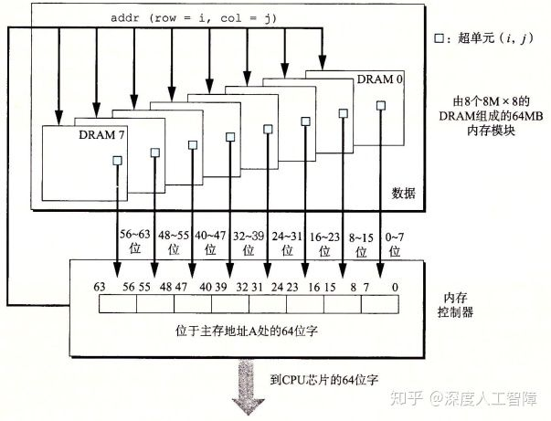
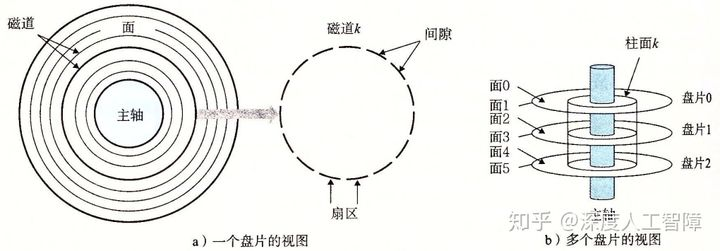
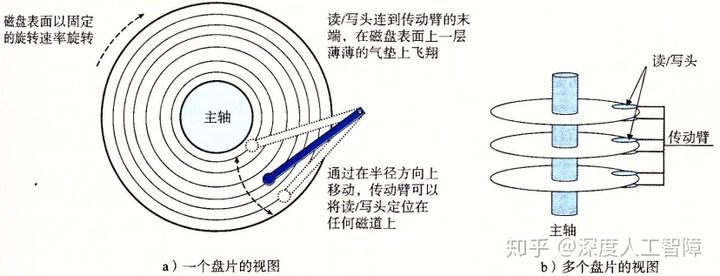
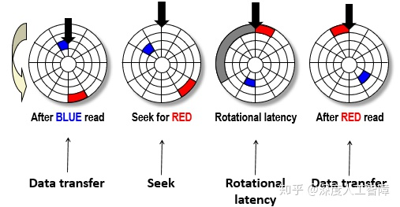
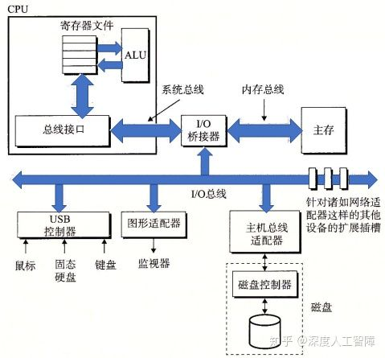
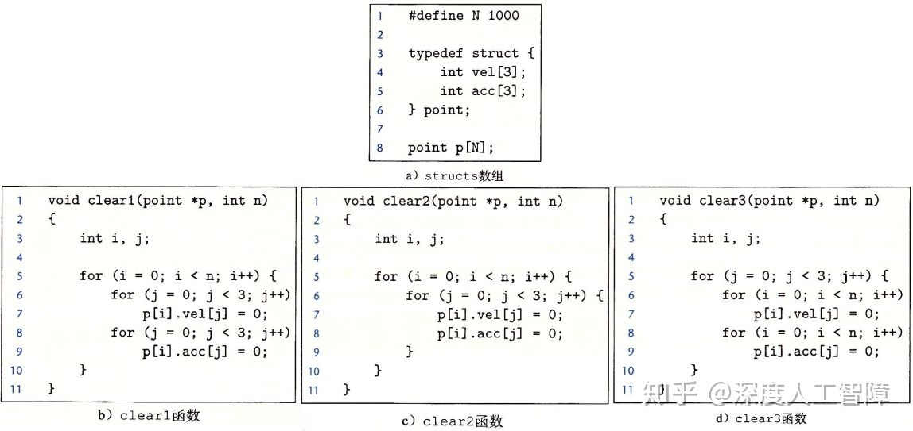
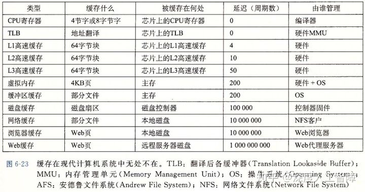

**视频地址：**

[【精校中英字幕】2015 CMU 15-213 CSAPP 深入理解计算机系统 课程视频_哔哩哔哩 (゜-゜)つロ 干杯~-bilibiliwww.bilibili.com/video/av31289365?p=11](https://link.zhihu.com/?target=https%3A//www.bilibili.com/video/av31289365%3Fp%3D11)

**课件地址：**

[http://www.cs.cmu.edu/afs/cs/academic/class/15213-f15/www/lectures/11-memory-hierarchy.pdfwww.cs.cmu.edu/afs/cs/academic/class/15213-f15/www/lectures/11-memory-hierarchy.pdf](https://link.zhihu.com/?target=http%3A//www.cs.cmu.edu/afs/cs/academic/class/15213-f15/www/lectures/11-memory-hierarchy.pdf)

对应于书中的6.1-6.3。

------

需要看到代码就能判断代码的局部性，避免代码出现差的局部性。

------

理想状态中，我们将存储器系统视为一个线性字节数组，CPU能在常数时间内访问每个存储器位置。但实际上**存储器系统（Memory System）**是一个具有不同容量、成本和访问时间的存储设备的层次结构，分别具有以下几部分：

1. CPU中的寄存器保存最常使用的数据，能在0个时钟周期内访问
2. **高速缓存存储器（Cache Memory）**是靠近CPU的、较小的快速存储器，保存一部分从**主存储器（Main Memory）**取出的常用指令和数据，能在4~75个时钟周期内访问
3. 主存缓存存储磁盘上的数据，需要上百个时钟周期访问
4. 磁盘存储通过网络连接的其他机器的磁盘或磁带上的数据，需要几千万格周期进行访问

上方存储器作为下方存储器的缓存，速度更快、容量更小。

存储器的层次结构之所有有效，是因为程序具有**局部性（Locality）**的基本属性，倾向于不断访问相同的数据项集合，或者倾向于访问相邻的数据项集合。我们希望程序能具有更好的局部性，使得数据项存储在较高层次的存储器中，这样程序就会倾向于从存储器结构中较高层次访问数据项，运行会更快。

## 1 存储技术

### 1.1 随机访问存储器

**随机访问存储器（Random-Access Memory，RAM）**根据存储单元实现方式可以分为两类：静态的RAM（SRAM）和动态的RAM（DRAM）。

### 1.1.1 SRAM

- 将每个位保存到由6个晶体管电路构成的**双稳态的（Bistable）**存储器单元。
- **属性：**可以无限期地保持在两个不同的电压配置或状态之一，而其他的都是不稳定状态，会迅速转移到两个稳定状态之一。
- **特点：**由于具有双稳态，所以只要有电，就会永远保持它的值，即使有干扰，当干扰消除时就会恢复到稳态。

由于SRAM存取速度较快，只要供电就会保持不变，对光和电噪音等干扰不敏感，但是每位的存储需要6个晶体管，使得造价较为昂贵，且密集度低，使其适合作为小容量高速的高速缓存存储器。

### 1.1.2 DRAM

- 将每个位保存为，对一个由访问晶体管控制的电容的充电。

- **特点：**

- - 由于每个存储单元比较小，DRAM可以制造的十分密集，可以作为主存或图形系统的帧缓冲区。
  - 由于通过电容电压来保存位，当电容电压受到扰动时就无法恢复了。并且电容存在漏电现象，存储单元10~100毫秒会失去电荷，使得内存系统必须周期性通过读出重写来刷新内存的每一位。
  - 暴露在光线中会导致电容电压改变。

我们可以将w个DRAM单元组成一个**超单元（Supercell）**，使得一个超单元就能存储w位的信息，并且将d个超单元组合在一个构成一个$d*w$**DRAM芯片**，能够存储dw位信息，并且能对每个超单元进行寻址。并且为了降低地址引脚的数量，我们可以将d个超单元组织成r行、c列的阵列形式。

如上图所示，我们有一个$16*8$的DRAM芯片，其中包含16个超单元，每个超单元由8个DRAM单元组成，使得每个超单元能存储8位信息。并且16个超单元被组成4行4列的阵列形式。由一个**内存控制器（Memory Controller)**通过`addr`引脚和`data`引脚将控制DRAM芯片数据的传入和传出，比如想要获得`(2,1)`处超单元的数据

1. 内存控制器发送**行地址（Row Access Strobe，RAS）**2到DRAM芯片，则DRAM芯片会将行2中的整行内容复制到**内部行缓冲区**。
2. 内存控制器发送**列地址（Column Access Strobe，CAS）**1到DRAM芯片，则DRAM芯片会从内部行缓冲区获得1列的数据，将其发送到内存控制器。

**注意：**

- 内存控制器发送RAS和CAS时，使用相同的`addr`引脚，使得必须分两步发送地址，会增加访问时间。
- 如果将16个DRAM单元组织成线性形式，则需要4位的地址引脚才能索引到每个超单元，但是将其组织成4行4列的阵列形式，只需要2位的地址引脚。

为了一次性能访问更多的数据，可以将多个DRAM芯片封装到一个**内存模块（Memory Module）**中，将其扎到主板的扩展槽中。

如上图所示是封装了8个$8M*8$DRAM芯片的内存模块，每个DRAM芯片负责8位数据，这样一次能对64位字进行读写。比如想要获得地址A处的字：

- 内存控制器首先将A转化为`(i,j)`的超单元地址，然后内存控制器依次将`i`和`j`广播到所有DRAM芯片中
- 每个DRAM芯片依次接收到RAS`i`和CAS`j`，会通过上述的方法输出8位数据
- 模块中的电路收集到所有DRAM芯片输出的8位数据，然后将其合并成一个64位的字，返回给内存控制器

为了进一步扩大存储能力，可以将多个内存模块连接到内存控制器，能够聚合成主存。当内存控制器想要读取地址A处的字时，会先找到包含地址A的内存模块k，然后根据上述步骤得到对应的字。

而基于传统的DRAM单元，可以做一些优化来提高访问基本DRAM单元的速度：

- **快页模式DRAM（Fast Page Mode DRAM，FPM DRAM）：**传统的DRAM芯片通过CAS获得数据后，会将那一行的数据从内部行缓冲区直接删掉，如果访问多个在同一行的超单元时，需要反复读取相同的行。而FPM DRAM能够获取一次行数据后，后面的读取直接从内部行缓冲区读取。
- **扩展数据输出DRAM（Extended Data Out DRAM，EDO DRAM）：**对FPM DRAM进行改进，使得各个CAS信号在时间上更加紧密。
- **同步DRAM（Synchronous DRAM，SDRAM）：**DRAM芯片与内存控制器的通信使用一组显示的控制信号，通常是异步的，而SDRAM使用了，控制内存控制器的外部时钟信号的上升沿来代替控制信号。
- **双倍数据速率同步DRAM（Double Data-Rate Sychronous DRAM，DDR SDRAM）：**对SDRAM的优化，通过使用两个时钟沿作为控制信号，从而使得DRAM的速度翻倍。
- **视频RAM（Video RAM，VRAM）：**用于图形系统的帧缓冲区，与FPM DRAM的区别：VRAM的输出是通过对内部缓冲区的移位得到的，VRAM允许对内存并行地读和写。

从更高层面来看，数据流是通过称为**总线（Bus）**的共享电子电路在处理器和DRAM主存之间传递数据的。总线是一组并行的导线，能够携带地址、数据和控制信号，也可以将数据和地址信号使用相同的导线。

如上图所示是一个连接CPU和DRAM主存的总线结构。其中**I/O桥接器（I/O Bridge）**芯片组包括内存控制器，能够将系统总线的电子信号和内存总线的电子信号互相翻译，也能将系统总线和内存总线连接到I/O总线。

当从内存加载数据到寄存器中：

1. CPU芯片通过**总线接口（Bus Interface）**在总线上发起**读事务（Read Transaction）**
2. CPU会将内存地址发送到系统总线上
3. I/O桥将信号传递到内存总线
4. 内存接收到内存总线上的地址信号，会从DRAM读取出数据字，然后将数据写到内存总线
5. I/O桥将内存总线信号翻译成系统总线信号，然后传递到系统总线上
6. CPU从总能线上读取数据，并将其复制到寄存器中

当将寄存器中的数据保存到内存中：

1. CPU芯片通过总线接口发起**写事务（Write Transaction）**
2. CPU会将内存地址发送到系统总线上
3. I/O桥将信号传递到内存总线
4. 内存接收到内存总线上的地址信号，会等待数据到达
5. CPU将寄存器中的数据字复制到系统总线
6. I/O桥将内存总线信号翻译成系统总线信号，然后传递到系统总线上
7. 内存从内存总线读出数据，并将其保存到DRAM中。

这里的读事务和写事务统称为**总线事务（Bus Transaction）**。

### 1.1.3 非易失性存储器

之前介绍的DRAM和SRAM在断电时都会丢失数据，所以是**易失的（Volatile）**，而**非易失性存储器（Nonvolatile Memory）**即使断电后，也会保存信息，该类存储器称为**只读存储器（Read-Only Memory，ROM）**，但是现在ROM中有的类型既可以读也可以写了，可以根据ROM能够重编程的次数以及对它们进行重编程所用的机制进行区分，包括：

- **可编程ROM（PROM）：**可以编程一次
- **可擦写PROM（EPROM）：**可以批量擦除
- **闪存（Flash Memory）：**具有部分（块级）擦除功能，大约擦除十万次后会耗尽

存储在ROM设备中的程序称为**固件（Firmware）**，包括BIOS、磁盘控制器、网卡、图形加速器和安全子系统等。当计算机系统通电后，会运行存储在ROM中的固件。

### 1.2 磁盘存储

**磁盘（Disk）**是被用来保存大量数据的存储设备，但是读信息的速度比DRAM慢10万倍，比SRAM慢100万倍。

如上图所示是一个磁盘的构造。磁盘是由多个叠放在一起的**盘片（Platter）**构成，每个盘片有两个覆盖着磁性记录材料的**表面（Surface）**。每个表面由一组称为**磁道（Track）**的同心圆组成，每个磁道被划分为若干**扇区（Sector）**，每个扇区包含相同数量的数据位（通常为512位）作为读写数据的基本单位。扇区之间通过**间隙（Gap）**分隔开来，间隙不保存数据信息，只用来表示扇区的格式化位。通常会使用**柱面（Cylinder）**来描述不同表面上相同磁道的集合，比如柱面k就是6个表面上磁道k的集合。盘片中央会有一个可以旋转的**主轴（Spindle）**，使得盘片以固定的旋**转速率（Rotational Rate）**旋转，单位通常为**RPM（Revolution Per Minute）**。

将磁盘能记录的最大位数称为最大容量（容量），主要由以下方面决定：

- **记录密度（Recording Density）：**一英寸的磁道中可以放入的位数
- **磁道密度（Track Density）：**从盘片中心出发，沿着半径方向一英寸，包含多少磁道
- **面密度（Areal Density）：**记录密度和磁道密度的乘积

磁盘容量的计算公式为：

在面密度较低时，每个磁道都被分成了相同的扇区，所以能够划分的扇区数由最内侧磁道能记录的扇区数决定，这就使得外侧的磁道具有很多间隙。现代大容量磁盘采用**多区记录（Multiple Zone Recording）**技术，将一组连续的柱面划分成一个区，在同一个区中，每个柱面的每条磁道都有相同数量的扇区，由该区中最内侧的磁道决定，由此使得外侧的区能划分成更多的扇区。

如上图所示，磁盘通过一个连接在**传动臂（Actuator Arm）**上的**读/写头（Read/Write Head）**来进行读写，对于有多个盘面的磁盘，会用多个位于同一柱面上的垂直排列的读/写头。对于扇区的**访问时间（Access Time）**由以下几部分构成：

- **寻道时间：**为了读取到目标扇区，会先控制传动臂将读/写头移动到该扇区对应的磁道上，该时间称为寻道时间。

- - **影响因素：**依赖于读/写头之前的位置，以及传动臂在盘面上移动的速度。
  - 通常为3~9ms，最大时间可为20ms。

- **旋转时间：**当读/写头处于目标磁道时，需要等待目标扇区的第一个位旋转到读/写头下。

- - **影响因素：**目标扇区之前的位置，以及磁盘的旋转速度。
  - $T_{\text {max rotation }}=\frac{1}{R P M} \cdot \frac{60 s}{1 \text { min }}$，平均旋转时间为一半

- **传送时间：**当读/写头处于目标扇区的第一位时，就可以进行传送了

- - **影响因素：**磁盘旋转速率，以及每条磁道的扇区数
  - $T_{\text {avg trans fer }}=\frac{1}{R P M} \cdot \frac{1}{\text { 平均每条磁道的扇区数 }} \times \frac{60 s}{1 \min }$

**可以发现：**寻道时间和旋转时间是主要影响部分，并且两者大致相等，通常可以寻道时间乘2来估计访问时间。

由于磁盘构造的复杂性，现代磁盘将其抽象为B个扇区大小的逻辑块序列，编号为`0,1,...,B-1`，通过磁盘中的**磁盘控制器**来维护逻辑块号和实际扇区之间的映射关系。为此需要通过磁盘控制器对磁盘进行格式化：

- 会用表示扇区的信息填写在扇区之间的间隙
- 表示出表面有故障的柱面，并且不进行使用
- 在每个区会预留一组柱面作为备用，没有映射为逻辑块。当损坏时，磁盘控制器会将数据复制到备用柱面，则磁盘就可以继续正常工作了。

当从磁盘读取数据到主存，需要以下步骤：

1. 操作系统发送一个命令到磁盘控制器，读取某个逻辑块号
2. 磁盘控制器上的固件执行快速表查找，得到该逻辑块号翻译成一个三元组`（盘面，磁道，扇区）`
3. 磁盘控制器解释三元组信息，将读/写头移动到对应的扇区
4. 将读取到的信息放到磁盘控制器的缓冲区中
5. 将缓冲区中的数据保存到主存中。

如上图所示是一个总线结构实例。对于像图形卡、鼠标、键盘、监视器这类输入/输出设备，都是通过**I/O总线**连接到CPU和主存的，比如Intel的**外围设备互联（Peripheral Component Interconnect，PCI）总线**，在PCI模型中，系统中所有的设备共享总线，一个时刻只能有一台设备访问这些线路，目前PCI总线已被PCEe总线取代了。虽然I/O总线比系统总线和内存总线慢，但是能容纳种类繁多的第三方I/O设备

- **通用串行总线（Universal Serial Bus，USB）控制器：**USB总线是一个广泛使用的标准，连接许多外围I/O设备，而USB控制器作为连接到USB总线的设备的中转站。
- **图形卡（或适配器）：**包含硬件和软件逻辑，负责CPU在显示器上画像素。
- **主机总线适配器：**用于将一个或多个磁盘连接到I/O总线，使用**主机总线接口**定义的通信协议，磁盘接口包括**SCSI**和**SATA**，通常SCSI磁盘比SATA磁盘速度更快更昂贵，且SCSI主机总线适配器可以支持多个磁盘驱动器，而SATA只能支持一个。
- **网络适配器：**可以通过将适配器插入到主板上空的插槽，从而连接到I/O总线。

**注意：**系统总线和内存总线是与CPU相关的，而PCI总线这样的I/O总线被设计成与底层CPU无关。

CPU会在地址空间中保留一块地址用于与I/O设备通信，每个地址称为**I/O端口（I/O Port）**，而连接到总线的设备会被映射到一个或多个端口，则处理器可通过端口地址来访问该I/O设备，该技术称为**内存映射I/O（Memory-mapped I/O）**。

假设磁盘控制器映射到端口`0xa0`，探讨磁盘的读取过程：

- CPU会通过对地址`0xa0`执行三个存储指令，将地址`0xa0`的内容保存到内存中，完成对磁盘的读取。发送完指令后，由于磁盘读取速度比CPU执行速度慢很多，所以CPU会先去执行其他工作。

- - 指令1：发送一个命令字，告诉磁盘发起一个Read
  - 指令2：指明应该读取的逻辑块号
  - 指令3：指明保存的内存地址

- 磁盘控制器接收到Read命令后，会通过上述方法直接将磁盘内容传送到主存中。这种设备可以自己执行读写总线事务而无需CPU干涉的过程，称为**直接内存访问（Direct Memory Access，DMA）**。

- 磁盘发送完数据后，会给CPU发送一个中断信号，暂停CPU正在做的工作，然后将控制返回到CPU被中断的地方。

### 1.3 固态硬盘

**固态硬盘（Solid State Disk，SSD）**是一种基于闪存的存储技术，插在I/O总线上标准硬盘插槽（通常为USB或SATA），处于磁盘和DRAM存储器的中间点。从CPU的角度来看，SSD与磁盘完全相同，有相同的接口和包装。

如上图所示是一个SSD的基本结构。它由**闪存**和**闪存翻译层（Flash Translation Layer）**组成

- 闪存翻译层是一个硬件/固件设备，用来将对逻辑块的请求翻译成对底层物理设备的访问。
- 闪存的基本属性决定了SSD随机读写的性能，通常由B个块的序列组成，每个块由P页组成，页作为数据的单位进行读写。通常页大小为512字节~4KB，块中包含32~128页，则块的大小有16KB~512KB。

当对页进行写操作时，首先需要先对该页所处的整个块进行擦除。

以上是Intel SSD 730的性能，IOPS是每秒I/O操作数，吞吐量数量基于4KB块的读写。我们可以发现随机写操作较慢，这是因为：

- 对页进行写操作时，通常需要花费较长时间来擦除块，比访问页所需的时间慢了一个数量级
- 当块中包含其他数据时，会先将块中带有有效数据的页复制到被擦出过的块中，才能对那个块进行擦除。在闪存翻译层中实现了复杂的逻辑，试图最小化这些重复的操作。

块的擦除次数是有限的，当块磨损后，就不能再使用了，闪存翻译层中的**平均磨损（Wear Leveling）**逻辑会试图将擦除平均到所有块中，来最大化每个块的寿命。

SSD的优缺点：

- **优点：**由于闪存是半导体存储器，没有移动的部件，所以速度比磁盘更快且磨损小，能耗低
- **缺点：**SSD每字节比磁盘贵大约30倍，所以常用的存储容量比磁盘小100倍左右。

### 1.4 存储技术趋势

具有以下重要思想：

- **不同存储技术有不同的价格和性能折中：**从性能而言，SRAM>DRAM>SSD>磁盘，而从每字节造价而言，SRAM>DRAM>SSD>磁盘。
- 不同存储技术的价格和性能属性以不同的速率变化着

从上一图中可看出，DRAM主存和磁盘的性能滞后于CPU性能，访问时间比单个处理器的周期时间更慢，而SRAM的性能虽然也滞后于CPU性能，但是还保持增长，所以现代计算机会使用基于SRAM的高速缓存，来弥补CPU和内存之间的差距。

## 2 局部性

具有良好**局部性（Locality）**的程序，会倾向于引用最近引用过的数据项本身，或者引用最近引用过的数据项周围的数据项。局部性主要具有两种形式：

- **时间局部性（Temporal Locality）：**引用过的数据项在不久会被多次引用。

- **空间局部性（Spatial Locality）：**引用过的数据项，在不久会引用附近的数据项。

从硬件到操作系统，再到应用程序，都利用了局部性

- **硬件：**在处理器和主存之间引入一个小而快速的高速缓存存储器，来保存最近引用的指令和数据，从而提高对主存的访问速度。
- **操作系统：**用主存来缓存虚拟空间中最近被引用的数据块。
- **应用程序：**比如Web浏览器会将最近引用的文档放入本地磁盘中，来缓存服务器的数据。

有良好局部性的程序比局部性较差的程序运行更快。

想要分析一个程序的局部性是否好，可以依次分析程序中的每个变量，然后根据所有变量的时间局部性和空间局部性来总和判断程序的局部性。

**例1：**

分析上述程序的局部性。对于变量`sum`，每一轮迭代都会引用一次，所以`sum`具有好的时间局部性，而`sum`是标量，所以没有空间局部性。对于变量`v`，其数据在内存中的分布如图b中所示，每一轮迭代都是引用不同的数据项，所以时间局部性较差，但是会按照内存存储的顺序依次引用数据项，所以空间局部性较好。 综合来说，该程序具有较好的局部性。

并且由于程序是以指令形式保存在内存中的，而CPU会从内存中读取指令，所以也可以考虑取指的局部性。由于该循环体内的指令是顺序保存在内存中的，而CPU会按顺序进行取指，所以具有良好的空间局部性，并且迭代多次会反复读取相同的指令，所以具有良好的时间局部性，所以该程序的局部性较好。

对于一个向量，如果每一轮引用的数据项之间在内存空间中相隔k，则称该程序具有**步长为k的引用模式（Stride-k Reference Pattern）**。步长k越大，则每一轮引用的数据在内存中间隔很大，则空间局部性越差。

**例2：**

对于以上代码，变量`sum`的时间局部性较好且不具有空间局部性，对于二维数组变量`v`，在内存中是按照行优先存储的，而代码中也是按照行优顺序进行应用的，所以变量`v`具有步长为1的引用模式，所以具有较好的空间局部性，而时间局部性较差。总体来说，该程序具有良好的局部性。

**例3：**

上述代码将变量`v`的引用顺序变为了列优先，则根据`v`的内存存储形式，变量`v`具有步长为N的引用模式，则时间局部性较差，且空间局部性也较差。总体来说，该程序的局部性较差。

**例4：**

我们需要判断以上三个函数的局部性。首先根据结构体的定义可以得到结构体数组在内存中的存储形式如下所示

则`clear1`函数的步长为1，具有良好的空间局部性；而`clear2`函数会在结构体中不同的字段中反复跳跃，空间局部性相对`clear1`差一些；而`clear3`函数会在相邻两个结构体中反复跳跃，空间局部性相比`clear2`更差。

**总体而言：**

- 重复引用相同变量的程序具有良好的时间局部性
- 考虑变量的内存存储形式，判断程序引用模式的步长，步长越大则空间局部性越差
- 从取指角度而言，具有循环体则空间局部性和时间局部性较好，而且循环体越小、迭代次数越多，则局部性越好。

## 3 存储器层次结构

通过上面两节，我们可以得到存储技术和软件的**基本属性：**

- 不同存储技术的访问时间相差较大，速度快的技术每字节的成本比速度慢的技术高，且容量小。并且CPU和主存之间的差距在变大。
- 编写良好的程序具有良好的局部性。

两者存在一定的互补，由此可以得到一种组织存储器系统的方法，**存储器层次结构（Memory Hierarchy）**。

如上图所示是一种经典的存储器层次结构，会使用基于SRAM的高速缓存存储器来解决CPU和DRAM主存之间的鸿沟，通常还可以在DRAM主存和本地磁盘之间添加一层SSD，来弥补两者之间的差距。通常还可以在本地磁盘下方添加一个本地磁带，提供成本更低的存储。

**高速缓存（Cache）**是一个小而快速的存储设备，用来作为存储在更大更慢设备中的数据对象的缓冲区域。而使用高速缓存的过程称为**缓存（Caching）**。

存储器层次结构的**中心思想**是让层次结构中的每一层来缓存低一层的数据对象，将第k层的更快更小的存储设备作为第k+1层的更大更慢的存储设备的缓存。

**该结构之所以有效**，是因为程序的局部性原理。相比于第k+1层的数据，程序会倾向于访问存储在第k层的数据。如果我们访问第k+1层存储的数据，我们会将其拷贝到第k层，因为根据局部性原理我们很有可能将再次访问该数据，由此我们就能以第k层的访问速度来访问数据。而且因为我们不经常访问第k+1层的数据，我们就可以使用速度更慢且更便宜的存储设备。

上图展示的是存储器层次结构的基本缓存原理。每一层存储器都会被划分成连续的数据对象组块，称为**块（Block）**，每个块都有一个唯一的地址或名字，并且通常块的大小都是固定的。第k层作为第k+1层的缓存，数据会以块大小作为**传送单元（Transfer Unit）**在第k层和第k+1层之间来回赋值，使得第k层保存第k+1层块的一个子集的副本。通常存储器层次结构中较低层的设备的访问时间较长，所以较低层中会使用较大的块。

### 3.1 缓存命中

当程序需要第k+1层的某个数据对象d时，会现在第k层的块中搜索d，如果d刚好缓存在第k层中，则成为**缓存命中（Cache Hit）**，则该程序会直接从第k层中读取d。根据存储器层次结构，可以知道第k层的读取速度更快，因此缓存命中会使得程序更快。

### 3.2 缓存不命中

如果第k层没有缓存数据对象d，则称为**缓存不命中（Cache Miss）**，则会从第k+1层中取出包含d的块，然后第k层的缓存会执行某个**放置策略（Placement Policy）**来决定该块要保存在第k层的什么位置

- 来自第k+1层的任意块能保存在第k层的任意块中，如果第k层的缓存满了，则会覆盖现存的一个**牺牲块（Victim Block）**，称为**替换（Replacing）**或**驱逐（Evicting）**这个牺牲块，会根据**替换策略（Replacement Policy）**来决定要替换第k层的哪个块

- - **随机替换策略：**会随机选择一个牺牲块
  - **最近最少被使用（LRU）替换策略：**选择最后被访问的时间离现在最远的块

随机放置块会使得定位起来代价很高。

- 可以采用更严格的放置策略，将第k+1层的某个块限制放置在第k层块的一个小的子集中，比如第k+1层的第i个块保存在第k层的`i mod 4`中。但是该放置策略会引起**冲突不命中（Conflict Miss）**，此时缓冲区足够大，但是由于需要的对象会反复映射到同一个缓存块，使得缓存一直不命中。此时就需要修改放置策略。

比较特殊的情况是第k层的缓存为空，那么对于任意的数据对象的访问都会不命中。空的缓存称为**冷缓存（Cold Cache）**，该不命中称为**强制性不命中（Compulsory Miss）**或**冷不命中（Cold Miss）**。

程序通常会按照一系列阶段来运行，每个阶段会访问缓存块的某个相对稳定不变的集合，则该集合称为**工作集（Working Set）**，如果工作集大小超过缓存大小，则缓存会出现**容量不命中（Capacity Miss）**，这是由缓存太小导致的。

## 3.3 缓存管理

对于每层存储器，都会有某种形式的逻辑来管理缓存：将缓存划分成块、在不同层之间传递块、判断缓存是否命中并进行处理。

- 编译器管理寄存器文件，当寄存器文件中不含有数据时出现不命中，它会决定何时发射加载操作，以及确定用哪个寄存器来存放数据。
- SRAM高速缓存是DRAM主存的缓存，由内置在缓存中的硬件逻辑管理的。
- 在有虚拟内存的系统中，DRAM主存是本地磁盘的缓存，由操作系统软件和CPU上的地址翻译硬件共同管理。
- 在具有分布式文件系统的机器中，本地磁盘作为缓存，由运行在本地机器上的客户端进程管理。

通过以上内容，就能解释局部性好的程序的优势：

- **时间局部性：**当一个数据对象在第一次不命中被复制到缓存中时，我们希望程序的时间局部性好，则在不久的将来就能反复在第k层访问到该块，使得程序运行更快。
- **空间局部性：**由于缓存中一个块包含多个数据对象，我们希望程序的空间局部性好，就可以直接利用第k层的数据块，避免再从第k+1层传输块到第k层。