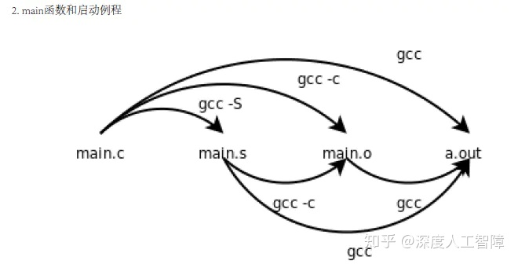

看CSAPP第七章 链接时，老是感觉迷迷糊糊的，所以实际看看程序的可重定位目标文件和可执行目标文件的内容。



------

我这里以书中的代码为例

```c
//main.c
int sum(int *a, int n);
int array[2] = {1,2};
int main(){
  int val = sum(array,2);
  return val;
}

//sum.c
int sum(int *a, int n){
  int i,s = 0;
  for(i=0; i<n; i++){
    s += a[i];
  }
  return s;
}
```

然后在命令行中运行

```text
gcc -Og -c main.c
```

可以得到`main.c`的可重定位目标文件`main.o`，然后使用以下命令行查看该ELF文件

```text
readelf -a -x .text -x .data main.o 
```

可重定位目标文件的ELF格式包含以下内容


我们依次查看其中不同的数据节

**ELF头：**

```text
ELF Header:
  Magic:   7f 45 4c 46 02 01 01 00 00 00 00 00 00 00 00 00 
  Class:                             ELF64
  Data:                              2's complement, little endian
  Version:                           1 (current)
  OS/ABI:                            UNIX - System V
  ABI Version:                       0
  Type:                              REL (Relocatable file)
  Machine:                           Advanced Micro Devices X86-64
  Version:                           0x1
  Entry point address:               0x0
  Start of program headers:          0 (bytes into file)
  Start of section headers:          704 (bytes into file)
  Flags:                             0x0
  Size of this header:               64 (bytes)
  Size of program headers:           0 (bytes)
  Number of program headers:         0
  Size of section headers:           64 (bytes)
  Number of section headers:         12
  Section header string table index: 11
```

可以看到ELF头主要描述改文件的生成信息，并且包含了节头部表的开始地址`Start of section headers`。

**节头部表：**

```text
Section Headers:
  [Nr] Name              Type             Address           Offset
       Size              EntSize          Flags  Link  Info  Align
  [ 0]                   NULL             0000000000000000  00000000
       0000000000000000  0000000000000000           0     0     0
  [ 1] .text             PROGBITS         0000000000000000  00000040
       000000000000001a  0000000000000000  AX       0     0     1
  [ 2] .rela.text        RELA             0000000000000000  00000218
       0000000000000030  0000000000000018   I       9     1     8
  [ 3] .data             PROGBITS         0000000000000000  00000060
       0000000000000008  0000000000000000  WA       0     0     8
  [ 4] .bss              NOBITS           0000000000000000  00000068
       0000000000000000  0000000000000000  WA       0     0     1
  [ 5] .comment          PROGBITS         0000000000000000  00000068
       000000000000002c  0000000000000001  MS       0     0     1
  [ 6] .note.GNU-stack   PROGBITS         0000000000000000  00000094
       0000000000000000  0000000000000000           0     0     1
  [ 7] .eh_frame         PROGBITS         0000000000000000  00000098
       0000000000000030  0000000000000000   A       0     0     8
  [ 8] .rela.eh_frame    RELA             0000000000000000  00000248
       0000000000000018  0000000000000018   I       9     7     8
  [ 9] .symtab           SYMTAB           0000000000000000  000000c8
       0000000000000120  0000000000000018          10     8     8
  [10] .strtab           STRTAB           0000000000000000  000001e8
       000000000000002d  0000000000000000           0     0     1
  [11] .shstrtab         STRTAB           0000000000000000  00000260
       0000000000000059  0000000000000000           0     0     1
Key to Flags:
  W (write), A (alloc), X (execute), M (merge), S (strings), I (info),
  L (link order), O (extra OS processing required), G (group), T (TLS),
  C (compressed), x (unknown), o (OS specific), E (exclude),
  l (large), p (processor specific)
```

可以看到，节头部表中含有一个表，其中每个数据项含有以下内容（我只挑我会的说）：`Nr`数据项的索引；`Name`数据项的名字，即该数据项是描述哪个数据节的；`Address`数据节所在的内存地址；`offset`数据节在目标文件中的偏移量；`size`数据节的大小。

**注意：**编译器和汇编器会从地址0开始生成数据节，没有考虑实际的内存地址，所以这里的`address`都是0。

**.text：**

```text
Hex dump of section '.text':
 NOTE: This section has relocations against it, but these have NOT been applied to this dump.
  0x00000000 4883ec08 be020000 00488d3d 00000000 H........H.=....
  0x00000010 e8000000 004883c4 08c3              .....H....
```

该部分主要保存代码片段，其中第一列为地址，后面的为十六进制编码的代码，我们可以通过以下命令行查看`.text`对应的汇编代码

```text
objdump -dx main.o
```

可以得到`.text`对应的汇编代码如下所示

```text
Disassembly of section .text:

0000000000000000 <main>:
   0:	48 83 ec 08          	sub    $0x8,%rsp
   4:	be 02 00 00 00       	mov    $0x2,%esi
   9:	48 8d 3d 00 00 00 00 	lea    0x0(%rip),%rdi        # 10 <main+0x10>
			c: R_X86_64_PC32	array-0x4
  10:	e8 00 00 00 00       	callq  15 <main+0x15>
			11: R_X86_64_PLT32	sum-0x4
  15:	48 83 c4 08          	add    $0x8,%rsp
  19:	c3                   	retq   
 
```

需要注意的一点是：编译器和汇编器并不知道程序在运行时会放在内存的什么位置，所以这里会先使用占位符。这里的数组`array`和函数`sum`的位置都不知道，可以看到第3行对`array`的引用的编码`48 8d 3d 00 00 00 00`除了操作码`48 8d 3d`以外都是0，来作为占位符，以及第5行对`sum`的调用的编码`e8 00 00 00 00`除了操作码`e8`以外都是0，来作为占位符。所以只有当分配了内存地址时，才能对这部分代码进行修改，也就是**重定位操作**。

这里可以看到两个重定位的类型，`R_X86_64_PC32`和`R_X86_64_PLT32`。

**`.rel.text`：**

```text
Relocation section '.rela.text' at offset 0x218 contains 2 entries:
  Offset          Info           Type           Sym. Value    Sym. Name + Addend
00000000000c  000900000002 R_X86_64_PC32     0000000000000000 array - 4
000000000011  000b00000004 R_X86_64_PLT32    0000000000000000 sum - 4 
```

该部分是汇编器对`.text`数据节生成的重定位条目，用来指示如何对`.text`节中地址未知的数据进行重定位操作。其中，`offset`表示要修改的位置位于`.text`中的偏移量，比如`array`中的`offset`为`0xc`，表示要从`.text`中偏移`0xc`处开始修改代码，即上面汇编代码中第3行的第4个字节的位置；`type`表示重定位类型，决定了修改内容的计算；`Sym.Name`是要修改的对应的符号，当链接器赋予符号内存地址时，可以通过这个来获取该符号在内存的位置。`Addend`修改内容的常量。

**`.data`：**

```text
Hex dump of section '.data':
  0x00000000 01000000 02000000                   ........ 
```

这里主要保存在代码中初始化的全局变量，我们这里只有一个`array`，这里采用小端法，所以可以看到，第一列为数据项在`.data`中的偏移量，而后就是数据内容。

**符号表：**

```text
Symbol table '.symtab' contains 12 entries:
   Num:    Value          Size Type    Bind   Vis      Ndx Name
     0: 0000000000000000     0 NOTYPE  LOCAL  DEFAULT  UND 
     1: 0000000000000000     0 FILE    LOCAL  DEFAULT  ABS main.c
     2: 0000000000000000     0 SECTION LOCAL  DEFAULT    1 
     3: 0000000000000000     0 SECTION LOCAL  DEFAULT    3 
     4: 0000000000000000     0 SECTION LOCAL  DEFAULT    4 
     5: 0000000000000000     0 SECTION LOCAL  DEFAULT    6 
     6: 0000000000000000     0 SECTION LOCAL  DEFAULT    7 
     7: 0000000000000000     0 SECTION LOCAL  DEFAULT    5 
     8: 0000000000000000    26 FUNC    GLOBAL DEFAULT    1 main
     9: 0000000000000000     8 OBJECT  GLOBAL DEFAULT    3 array
    10: 0000000000000000     0 NOTYPE  GLOBAL DEFAULT  UND _GLOBAL_OFFSET_TABLE_
    11: 0000000000000000     0 NOTYPE  GLOBAL DEFAULT  UND sum
```

汇编器构建了符号表，其中包含了`main.c`文件中的所有符号，在重定位目标文件中，`value`是该符号相对节位置的偏移量；`Size`为该符号对应数据的大小，可以通过`value`和`size`获得该符号的内容；`Bind`表示符号的类型，非静态的函数和全局变量的符号为全局符号，静态的函数和全局变量的符号为局部符号，别的模块定义的全局变量和函数的符号是外部符号，而外部符号也是全局符号；`Ndx`表示该符号所在的数据节的索引，比如`main`函数就处在`.text`节，`array`数组就处在`.data`节，而在可重定位目标文件中，还有3个不在节头部表的特殊伪节，`ABS`表示不要重定位的符号，`UND`表示未定义的符号，也就是在当前可重定位目标文件中引用了，但是没有找到对应定义的符号，这也是链接器在符号解析中需要解决的符号，`COMMON`保存未初始化的全局变量符号，因为未初始化的全局变量符号是弱符号，所以在对当前文件进行汇编时，汇编器不知道该符号最终会采用什么定义，可能会被其他可重定位目标文件修改，所以这里就将这类符号保存到`COMMON`中。`Name`就是符号。


当将可重定位目标文件、静态库和动态库通过链接器进行链接时

1. 链接器会根据符号表查看还有哪些符号是未定义的，然后根据其他文件中对该符号的定义进行解析，使得每个符号引用都与一个符号定义相关联。
2. 链接器会将不同可重定位目标文件和静态库中相同的数据节合并，然后分配内存地址，并且也对各个符号分配内存地址
3. 链接器会根据分配好的地址，然后根据重定位表`.rel.text`和`.rel.data`中需要重定位的内容，对`.text`和`.data`进行重定位，使其指向当前的内存地址


接下来可以将`main.c`和`sum.c`编译成可执行目标文件，然后查看该ELF中的内容

```text
gcc -Og main.c sum.c
readelf -a -x .text -x .data a.out
```

可执行目标文件的ELF格式包含以下内容


**ELF头：**

```text
ELF Header:
  Magic:   7f 45 4c 46 02 01 01 00 00 00 00 00 00 00 00 00 
  Class:                             ELF64
  Data:                              2's complement, little endian
  Version:                           1 (current)
  OS/ABI:                            UNIX - System V
  ABI Version:                       0
  Type:                              DYN (Shared object file)
  Machine:                           Advanced Micro Devices X86-64
  Version:                           0x1
  Entry point address:               0x4f0
  Start of program headers:          64 (bytes into file)
  Start of section headers:          6472 (bytes into file)
  Flags:                             0x0
  Size of this header:               64 (bytes)
  Size of program headers:           56 (bytes)
  Number of program headers:         9
  Size of section headers:           64 (bytes)
  Number of section headers:         28
  Section header string table index: 27
```

需要注意的是，这里可执行目标文件中多了一个段头部表的起始位置`Start of program headers`

**段头部表：**

```text
Program Headers:
  Type           Offset             VirtAddr           PhysAddr
                 FileSiz            MemSiz              Flags  Align
  PHDR           0x0000000000000040 0x0000000000000040 0x0000000000000040
                 0x00000000000001f8 0x00000000000001f8  R      0x8
  INTERP         0x0000000000000238 0x0000000000000238 0x0000000000000238
                 0x000000000000001c 0x000000000000001c  R      0x1
      [Requesting program interpreter: /lib64/ld-linux-x86-64.so.2]
  LOAD           0x0000000000000000 0x0000000000000000 0x0000000000000000
                 0x0000000000000810 0x0000000000000810  R E    0x200000
  LOAD           0x0000000000000df0 0x0000000000200df0 0x0000000000200df0
                 0x0000000000000228 0x0000000000000230  RW     0x200000
  DYNAMIC        0x0000000000000e00 0x0000000000200e00 0x0000000000200e00
                 0x00000000000001c0 0x00000000000001c0  RW     0x8
  NOTE           0x0000000000000254 0x0000000000000254 0x0000000000000254
                 0x0000000000000044 0x0000000000000044  R      0x4
  GNU_EH_FRAME   0x00000000000006b4 0x00000000000006b4 0x00000000000006b4
                 0x0000000000000044 0x0000000000000044  R      0x4
  GNU_STACK      0x0000000000000000 0x0000000000000000 0x0000000000000000
                 0x0000000000000000 0x0000000000000000  RW     0x10
  GNU_RELRO      0x0000000000000df0 0x0000000000200df0 0x0000000000200df0
                 0x0000000000000210 0x0000000000000210  R      0x1

 Section to Segment mapping:
  Segment Sections...
   00     
   01     .interp 
   02     .interp .note.ABI-tag .note.gnu.build-id .gnu.hash .dynsym .dynstr .gnu.version .gnu.version_r .rela.dyn .init .plt .plt.got .text .fini .rodata .eh_frame_hdr .eh_frame 
   03     .init_array .fini_array .dynamic .got .data .bss 
   04     .dynamic 
   05     .note.ABI-tag .note.gnu.build-id 
   06     .eh_frame_hdr 
   07     
   08     .init_array .fini_array .dynamic .got 
```

段头部表是可执行文件必须包含的内容，主要用来说明如何将可执行目标文件映射到内存空间中。可以注意到，它这里将可执行目标文件中不同的数据节根据不同读写执行的需要，分配成两个段：数据段和代码段，通过

```text
   02     .interp .note.ABI-tag .note.gnu.build-id .gnu.hash .dynsym .dynstr .gnu.version .gnu.version_r .rela.dyn .init .plt .plt.got .text .fini .rodata .eh_frame_hdr .eh_frame 
   03     .init_array .fini_array .dynamic .got .data .bss 
```

可以知道每个段包含的数据节，其中第一行为代码段，第二行为数据段。而段头部表会以段为单位将其映射到内存空间中。我们需要注意这两行

```text
  Type           Offset             VirtAddr           PhysAddr
                 FileSiz            MemSiz              Flags  Align
  LOAD           0x0000000000000000 0x0000000000000000 0x0000000000000000
                 0x0000000000000810 0x0000000000000810  R E    0x200000
  LOAD           0x0000000000000df0 0x0000000000200df0 0x0000000000200df0
                 0x0000000000000228 0x0000000000000230  RW     0x200000
```

这里说明了数据段和代码段对应的内存映射。其中，`offset`为可执行目标文件中的偏移量，由此来定位到段的起始位置；`VirtAddr`为分配的虚拟内存地址；`PhysAddr`为分配的真实物理地址；`FileSiz`为要加载的数据节的大小；`MemSiz`表示申请的内存空间；`Flags`表示段的属性，比如第一行代码段的`RE`表示可读可执行，第二行数据段的`RW`表示可读可写。

**节头部表：**

```text
Section Headers:
  [Nr] Name              Type             Address           Offset
       Size              EntSize          Flags  Link  Info  Align
  [ 0]                   NULL             0000000000000000  00000000
       0000000000000000  0000000000000000           0     0     0
  [ 1] .interp           PROGBITS         0000000000000238  00000238
       000000000000001c  0000000000000000   A       0     0     1
  [ 2] .note.ABI-tag     NOTE             0000000000000254  00000254
       0000000000000020  0000000000000000   A       0     0     4
  [ 3] .note.gnu.build-i NOTE             0000000000000274  00000274
       0000000000000024  0000000000000000   A       0     0     4
  [ 4] .gnu.hash         GNU_HASH         0000000000000298  00000298
       000000000000001c  0000000000000000   A       5     0     8
  [ 5] .dynsym           DYNSYM           00000000000002b8  000002b8
       0000000000000090  0000000000000018   A       6     1     8
  [ 6] .dynstr           STRTAB           0000000000000348  00000348
       000000000000007d  0000000000000000   A       0     0     1
  [ 7] .gnu.version      VERSYM           00000000000003c6  000003c6
       000000000000000c  0000000000000002   A       5     0     2
  [ 8] .gnu.version_r    VERNEED          00000000000003d8  000003d8
       0000000000000020  0000000000000000   A       6     1     8
  [ 9] .rela.dyn         RELA             00000000000003f8  000003f8
       00000000000000c0  0000000000000018   A       5     0     8
  [10] .init             PROGBITS         00000000000004b8  000004b8
       0000000000000017  0000000000000000  AX       0     0     4
  [11] .plt              PROGBITS         00000000000004d0  000004d0
       0000000000000010  0000000000000010  AX       0     0     16
  [12] .plt.got          PROGBITS         00000000000004e0  000004e0
       0000000000000008  0000000000000008  AX       0     0     8
  [13] .text             PROGBITS         00000000000004f0  000004f0
       00000000000001b2  0000000000000000  AX       0     0     16
  [14] .fini             PROGBITS         00000000000006a4  000006a4
       0000000000000009  0000000000000000  AX       0     0     4
  [15] .rodata           PROGBITS         00000000000006b0  000006b0
       0000000000000004  0000000000000004  AM       0     0     4
  [16] .eh_frame_hdr     PROGBITS         00000000000006b4  000006b4
       0000000000000044  0000000000000000   A       0     0     4
  [17] .eh_frame         PROGBITS         00000000000006f8  000006f8
       0000000000000118  0000000000000000   A       0     0     8
  [18] .init_array       INIT_ARRAY       0000000000200df0  00000df0
       0000000000000008  0000000000000008  WA       0     0     8
  [19] .fini_array       FINI_ARRAY       0000000000200df8  00000df8
       0000000000000008  0000000000000008  WA       0     0     8
  [20] .dynamic          DYNAMIC          0000000000200e00  00000e00
       00000000000001c0  0000000000000010  WA       6     0     8
  [21] .got              PROGBITS         0000000000200fc0  00000fc0
       0000000000000040  0000000000000008  WA       0     0     8
  [22] .data             PROGBITS         0000000000201000  00001000
       0000000000000018  0000000000000000  WA       0     0     8
  [23] .bss              NOBITS           0000000000201018  00001018
       0000000000000008  0000000000000000  WA       0     0     1
  [24] .comment          PROGBITS         0000000000000000  00001018
       000000000000002b  0000000000000001  MS       0     0     1
  [25] .symtab           SYMTAB           0000000000000000  00001048
       0000000000000600  0000000000000018          26    43     8
  [26] .strtab           STRTAB           0000000000000000  00001648
       0000000000000200  0000000000000000           0     0     1
  [27] .shstrtab         STRTAB           0000000000000000  00001848
       00000000000000f9  0000000000000000           0     0     1
Key to Flags:
  W (write), A (alloc), X (execute), M (merge), S (strings), I (info),
  L (link order), O (extra OS processing required), G (group), T (TLS),
  C (compressed), x (unknown), o (OS specific), E (exclude),
  l (large), p (processor specific)
```

这里需要注意到，`Address`项已经不是0了，链接器已为所有数据节分配了对应的内存地址，所以`Address`就是其真实的内存地址。而我们这里可以通过节头部表中的`offset`和段头部表中的`offset`将数据节对应起来。

其中多了几个特殊的数据节，当加载器将可执行目标文件根据段头部表将对应的数据段和代码段加载到内存后，加载器会根据`.init`跳转到由`ctrl.o`定义的`_start`函数，然后该函数会调用由`libc.so`定义的`__libc_start_main`函数来初始化执行环境，调用用户层的`main`函数，所以`.init`是作为程序的入口点。

`.interp`是包含动态链接器的路径名，而动态连接器本身就是共享目标（`ld-linux.so`），所以加载器可以加载和运行`.interp`中的动态链接器来完成动态链接。

并且我们可以看到，在可执行目标文件中，已经不包含了重定位内容`.rel.text`和`.rel.data`。

**`.text`：**

我们可以通过`objdump -dx`来查看`.text`中的汇编内容，我就挑选`main`和`sum`函数

```text
00000000000005fa <main>:
 5fa:	48 83 ec 08          	sub    $0x8,%rsp
 5fe:	be 02 00 00 00       	mov    $0x2,%esi
 603:	48 8d 3d 06 0a 20 00 	lea    0x200a06(%rip),%rdi        # 201010 <array>
 60a:	e8 05 00 00 00       	callq  614 <sum>
 60f:	48 83 c4 08          	add    $0x8,%rsp
 613:	c3                   	retq   

0000000000000614 <sum>:
 614:	b8 00 00 00 00       	mov    $0x0,%eax
 619:	ba 00 00 00 00       	mov    $0x0,%edx
 61e:	eb 09                	jmp    629 <sum+0x15>
 620:	48 63 ca             	movslq %edx,%rcx
 623:	03 04 8f             	add    (%rdi,%rcx,4),%eax
 626:	83 c2 01             	add    $0x1,%edx
 629:	39 f2                	cmp    %esi,%edx
 62b:	7c f3                	jl     620 <sum+0xc>
 62d:	f3 c3                	repz retq 
 62f:	90                   	nop
```

可以发现，原来在两个可重定位目标文件中的`main`和`sum`被合并到了可执行目标文件中的同一个`.text`中了。然后原本是占位符的编码，现在也变成了真实的内存地址，比如`array`的`48 8d 3d 06 0a 20 00`，根据小端法可以得到`0x200a06`，由于这里使用PC相对地址，所以可以根据下一条指令地址`0x60a`，计算出`array`的真实地址为`0x200a06+0x60a=0x201010`，也就能得到真实地址，根据`.data`的内容可知是正确的

```text
Hex dump of section '.data':
  0x00201000 00000000 00000000 08102000 00000000 .......... .....
  0x00201010 01000000 02000000                   ........ 
```