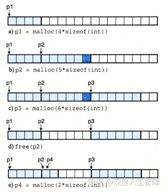
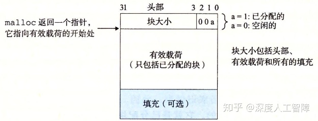
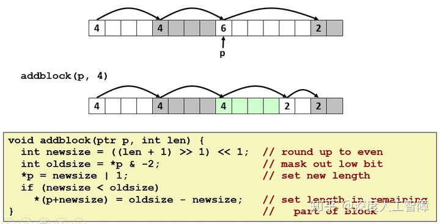
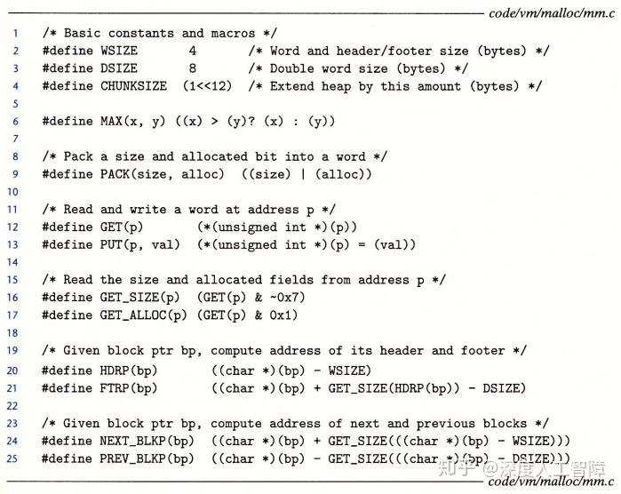
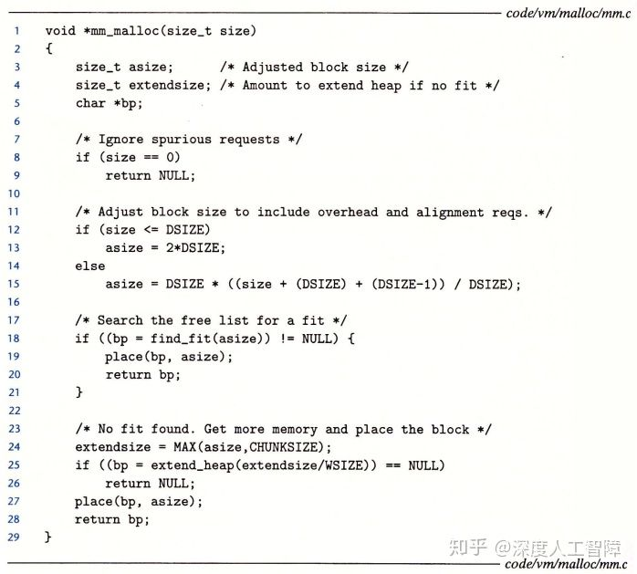

**视频地址：**

[【精校中英字幕】2015 CMU 15-213 CSAPP 深入理解计算机系统 课程视频_哔哩哔哩 (゜-゜)つロ 干杯~-bilibiliwww.bilibili.com/video/BV1iW411d7hd?p=19](https://link.zhihu.com/?target=https%3A//www.bilibili.com/video/BV1iW411d7hd%3Fp%3D19)

[https://www.bilibili.com/video/BV1iW411d7hd?p=20www.bilibili.com/video/BV1iW411d7hd?p=20](https://link.zhihu.com/?target=https%3A//www.bilibili.com/video/BV1iW411d7hd%3Fp%3D20)

**课件地址：**

[http://www.cs.cmu.edu/afs/cs/academic/class/15213-f15/www/lectures/19-malloc-basic.pdfwww.cs.cmu.edu/afs/cs/academic/class/15213-f15/www/lectures/19-malloc-basic.pdf](https://link.zhihu.com/?target=http%3A//www.cs.cmu.edu/afs/cs/academic/class/15213-f15/www/lectures/19-malloc-basic.pdf)

[http://www.cs.cmu.edu/afs/cs/academic/class/15213-f15/www/lectures/20-malloc-advanced.pdfwww.cs.cmu.edu/afs/cs/academic/class/15213-f15/www/lectures/20-malloc-advanced.pdf](https://link.zhihu.com/?target=http%3A//www.cs.cmu.edu/afs/cs/academic/class/15213-f15/www/lectures/20-malloc-advanced.pdf)

对应于书中的9.9。

------

不能分配小于最小块大小的块。

------

- 虚拟页的存在是作为虚拟内存和物理内存传输数据块的单位，是由一系列连续的虚拟内存地址组成的，并且这些虚拟地址的特点由虚拟页定义。而虚拟内存段是将一系列大量的连续的具有相似特点的虚拟地址聚集起来，且虚拟内存段也描述了这些虚拟地址的一些特点，并且这些虚拟地址以虚拟页为单位进行组织，即虚拟内存段包含虚拟页。
  我们使用虚拟内存时是以虚拟地址为单位的，只是根据我们对其使用方式的不同要求和权限，会处于不同虚拟段中的不同虚拟页中。
- 当调用`malloc`函数来分配块时，首先会在空闲链表中寻找是否有合适的空闲块，如果尝试了合并空闲块还是没找到，则会调用`sbrk`函数来向内核申请更大的堆内存。所以在一开始将堆与匿名文件映射时，堆内存为0，则第一次调用`malloc`函数时，会直接调用`sbrk`函数来申请得到一块大的空闲块，该空闲块可能会比你尝试分配的块大，然后就一直在这个堆中进行操作。
- 堆的起始地址到`brk`之间是已申请的堆内存，可以在里面进行动态内存分配，而`brk`之外的是未申请的堆内存，只有当找不到合适的空闲块时，才会向内核申请更大的可用空间，此时就会移动`brk`。

------

除了上一章介绍的通过`mmap`函数能让用户自定义内存映射，将磁盘文件映射到虚拟内存中以外，也可以在运行时使用**动态内存分配器（Dynamic Memory Allocator）**来分配额外的虚拟内存。动态内存分配器维护着虚拟内存中的堆段，将堆视为一组不同大小的块的集合，每个块由若干个连续的虚拟地址构成（一个块不一定处在同一个虚拟页），每个块具有**两种状态：**

- **已分配：**已分配的块能为应用程序所用，且块会保持已分配状态直到被释放
- **空闲的：**空闲的块无法使用，直到它被分配


而在最开始进行内存映射时，堆是与匿名文件关联起来的，所以堆是一个全0的段，即处于空闲状态，它紧跟在未初始的数据段后面，向地址更大的方向延伸，且内核对每个进程都维护了`brk`变量来指向堆顶。

动态内存分配器具有两种类型，都要求由应用程序显示分配块，但是由不同实体来负责释放已分配的块：

- **显示分配器（Explicit Allocator）：**要求应用程序显示释放已分配的块。比如C中通过`malloc`来分配块，再通过`free`来显示释放已分配的块，C++中的`new`和`delete`相同。
- **隐式分配器（Implicit Allocator）：**由分配器检测哪些块已不被应用程序使用，就自动释放这些块。这种隐式分配器称为**垃圾收集器（Garbage Collector）**，而这种过程称为**垃圾收集（Garbage Collection）**。比如Java、ML和Lisp。

程序使用动态内存分配器来动态分配内存的**意义在于：**有些数据结构只有在程序运行时才知道大小。通过这种方式就无需通过硬编码方式来指定数组大小，而是根据需要动态分配内存。

```c
#include <stdio.h>
#include <stdlib.h>
int main(){
  int *array, i, n;
  scanf("%d", &n);
  array = (int *)malloc(n*sizeof(int));
  for(i=0; i<n; i++){
    scanf("%d", &array[i]);
  }
  free(array);
  exit(0);
}
```

这一章主要介绍管理堆内存的显示分配器。

## 1 `malloc`和`free`函数

C中提供了malloc显示分配器，程序可以通过`malloc`函数来显示地从堆中分配块

```c
#include <stdlib.h>
void *malloc(size_t size); 
```

该函数会返回一个指向大小至少为`size`字节的未初始化内存块的指针，且根据程序的编译时选择的字长，来确定内存地址对齐的位数，比如`-m32`表示32位模式，地址与8对齐，`-m64`表示64位模式，地址与16对齐。如果函数出现错误，则返回NULL，并设置`errno`。我们也可以使用`calloc`函数来将分配的内存块初始化为0，也可以使用`realloc`函数来改变已分配块的大小。

程序可以通过`free`函数来释放已分配的堆块

```c
#include <stdlib.h>
void free(void *ptr);
```

其中`ptr`参数要指向通过`malloc`、`calloc`或`realloc`函数获得的堆内存。

动态内存分配器可以使用`mmap`和`munmap`函数，也可以使用`sbrk`函数来向内核申请堆内存空间，只有先申请获得堆内存空间后，才能尝试对块进行分配让应用程序使用。

```c
#include <unistd.h>
void *sbrk(intptr_t incr); 
int brk(void *addr);
brk`函数会将`brk`设置为`addr`指定的值。`sbrk`函数通过`incr`来增加`brk
```

- 当`incr`小于0时，会减小`brk`来解除已分配的堆内存
- 当`incr`等于0时，会返回当前的`brk`值
- 当`incr`大于0时，会增加`brk`来分配更多的堆内存

当`sbrk`函数运行正常时，会返回之前的`brk`值，否则会返回-1并设置`errno`为`ENOMEM`。

当我们使用`malloc`函数申请较小的堆内存时，会通过`brk`或`sbrk`函数设置`brk`来实现。`brk`和`sbrk`函数分配的对控件类似于缓冲池，每次`malloc`从缓冲池获得内存时，如果缓冲池大小不够，就会调用`brk`或`sbrk`函数来扩充缓冲池，然后从该缓冲池中获得对应的内存，而`free`函数就会将应用程序使用的内存空间归还缓冲池。

通过`sbrk`和`brk`函数来针对小块内存的申请，会产生内存碎片问题。对于大块内存的申请，会直接使用`mmap`函数，直接将大段的虚拟地址空间与匿名文件关联起来，就不会有内存碎片问题。

在本节课中，以字为单位进行操作，每个字为4字节，并进行双字对齐。



**注意：**

- 分配堆内存时，会进行地址对齐
- 释放内存后，其指针不会被删除，所以要谨慎被删除的指针的使用

**参考：**

[理解brk和sbrk - 在于思考 - 博客园](https://link.zhihu.com/?target=https%3A//www.cnblogs.com/chengxuyuancc/p/3566710.html)

[系统调用与内存管理（sbrk、brk、mmap、munmap）_运维_Apollon_krj的博客-CSDN博客](https://link.zhihu.com/?target=https%3A//blog.csdn.net/apollon_krj/article/details/54565768)

[何柄融：malloc 的实现原理 内存池 mmap sbrk 链表](https://zhuanlan.zhihu.com/p/57863097)

## 2 显示分配器的要求和目标

显示分配器的**要求**有：

- 只要满足每个释放请求都对应于一个由以前分配请求获得的已分配的块，则应用程序可以以任意顺序发送分配请求和释放请求。
- 分配器必须立即响应请求，不允许对请求进行重排列或缓存。
- 为了使分配器是可扩展的，分配器使用的任何非标量数据结构都必须保存在堆内。
- 为了能保存任意类型的数据对象，分配必须对齐块。（比如讲解`struct`时，它根据对齐要求对起始虚拟地址是有要求的）
- 当块被分配了，分配器不允许对其进行修改或移动，因为已分配块属于应用程序了。

显示分配器的**目标**为：吞吐率最大化和内存使用率最大化

- 吞吐率是指每个单位时间内完成的请求数。一个分配请求的最差运行时间与空闲块的数量成线性关系（要一次搜索每个空闲块来确定是否适合），而一个释放请求的运行时间是常数，则我们可以通过最小化分配请求和释放请求的平均运行时间来最大化吞吐率，主要约束项在分配请求。

- 一个系统中所有进程分配的虚拟内存的全部数量是受磁盘上的交换空间限制的，所以要尽可能最大化内存使用率。首先，我们给定n个分配请求和释放请求的序列$R_0,R_1,...,R_k,...,R_{n-1}$ ，然后定义以下概念：

- - **有效载荷（Payload）：**应用程序请求一个p字节的块，则该已分配的块的有效载荷为p字节。（分配器为了对齐要求和块的格式，可能会申请比p更大的块）
  
  - **聚集有效载荷（Aggregate Payload）**P：当前已分配的块的有效载荷之和
  
  - 然后我们可以通过`brk`变量来确定堆当前的大小$H_k$ （假设是单调不递减的）
    由此我们可以确定前k+1个请求的**峰值利用率（Peak Utilization）**
    $$
    U_{k}=\frac{m a x_{i \leq k} P_{i}}{H_{k}}
    $$
    通过峰值利用率就能确定分配器使用堆的效率，并且对于任意的分配和释放序列，最大的$P_i$是相同的。在理想状态下，每个块的内容都是有效载荷，所以利用率为1。

造成堆内存使用效率低下的主要原因是**碎片（Fragmentation）**现象，当空闲的内存不能满足分配请求时就会产生碎片，主要分为两种：

- **内部碎片（Internal Fragmentation）：**当已分配的块比有效载荷大时，就会产生内部碎片。比如分配器为了满足对齐要求或保存块的数据结构，就会对分配块增加额外的内存空间。我们可以通过已分配块的大小与其有效载荷的差来量化内部碎片，则内部碎片的数量主要取决于之前请求的模式和分配器的实现方法。


- **外部碎片（External Fragmentation）：**当空闲的内存合起来够满足一个分配请求，但单独一个空闲内存不够时，就会产生外部碎片。外部碎片比较难进行量化，因为它主要取决于未来请求的模式，所以分配器通常试图维持少量的大的空闲块。


为了让分配器能平衡吞吐率和利用率，需要考虑以下几个**问题：**

- 如何记录堆中空闲的块？
- 如何选择一个合适的空闲块来放置一个新分配的块？
- 再将一个新分配的块放置在某个空闲块后，如何处理空闲块中剩余部分？
- 如何处理一个刚刚被释放的块？
- 当我们对一个指针调用`free`时，怎么知道要释放多少内存？

### 2.1 隐式空闲链表

对于堆内存中的块，我们可以将其定义为以下数据结构形式



则每个块由三部分构成：

- **头部：**大小为一个字（一个字为4字节），可以用来保存块大小，如果我们添加一个双字的对齐要求，则块大小就总是8的倍数，则头部中表示块大小的低3位就总是0，我们可以拿这3位来表示该块是否被分配。（则一个块最大只能是$2^{29}-1$ 字节)
- **有效载荷：**应用通过`malloc`请求的有效载荷
- **填充：**可选的，分配器可用来处理外部碎片，或满足对齐要求。

我们通过块的这种数据结构来组织堆内存，则通过块头部的块大小来将堆中的所有块链接起来。分配器可以通过遍历所有块，然后通过块头部的字段来判断该块是否空闲的，来间接遍历整个空闲块集合。我们可以通过一个大小为0的已分配块来作为**终止头部（Terminating Header）**，来表示结束块。

大小/已分配位

**注意：**计算块大小时，要先将有效载荷加上块头部大小，然后再计算满足对齐要求时的块大小。

由于地址对齐要求和分配器对块格式的选择，会对**最小块**的大小有限制，没有已分配的块和空闲块比最小块还小，如果比最小块还小，就会变成外部碎片（所以最小块越大，内部碎片程度越高）。比如这里如果对齐要求是双字8字节的，则最小块大小为双字：第一个字用来保存头部，另一个字用来满足对齐要求。

### 选择空闲块

当应用请求一个k字节的空闲块时，分配器会搜索空闲链表，并根据不同的**放置策略（Placement Policy）**来确定使用的空闲块：

- **首次适配（First Fit）：**分配器从头开始搜索空闲链表，选择第一个块大小大于k的空闲块。

- - **优点：**趋向于将大的空闲块保留在空闲链表后面。
  - **缺点：**空闲链表开始部分会包含很多碎片


- **下一次适配（Next Fit）：**分配器从上一次查询结束的地方开始进行搜索，选择第一个块大小大于k的空闲块。

- - **优点：**运行比首次适配块一些，可以跳过开头的碎片
  - **缺点：**内存利用率比首次适配低很多

- **最佳适配（Best Fit）：**分配器会查找所有空闲块，选择块大小大于k的最小空闲块。

- - **优点：**内存利用率比前两者都高一些
  - **缺点：**需要遍历完整的空闲链表

如果分配器可以找到满足要求的空闲块，则需要**确定如何使用这个空闲块：**

- 如果空闲块与k大小相近，则可以直接使用这一整个空闲块
- 如果空闲块比k大很多，如果直接使用整个空闲块，则会造成很大的内部碎片，所以会尝试对该空闲块进行分割，一部分用来保存k字节数据，另一部分构成新的空闲块。



如果分配器找不到满足要求的空闲块，则会首先尝试将物理上相邻的两个空闲块合并起来创建一个更大的空闲块，如果还是不满足要求，则分配器会调用`sbrk`函数来向内核申请额外的堆内存，然后将申请到的新空间当做是一个空闲块。

### 合并空闲块

当我们尝试释放分配块时，如果当前块与其他空闲块相邻，则会产生**假碎片（Fault Fragmentation）**现象，即许多可用的空闲块被分割为小的无法使用的空闲块，此时分配器就可以合并相邻空闲块来解决假碎片问题，具有以下策略：

- **立即合并（Immediate Coalescing）：**当我们释放一个分配块时，就合并与其相邻的空闲块。

- - **优点：**可在常数时间内完成
  - **缺点：**可能一个空闲块会被来回分割和合并，产生抖动

- **推迟合并（Deferred Coalescing）：**当找不到合适的空闲块时，再扫描整个堆来合并所有空闲块。


为了高效合并前一个空闲块，需要使用**边界标记（Boundary Tag）**技术，使得当前块能迅速判断前一个块是否为空闲的


在块的数据结构中，会添加一个块头部的副本得到脚部。这样当前块从起始位置向前偏移一个字长度，就能得到前一个块的脚部，通过脚部就能判断前一个快是否为空闲的，并且也能得到前一个块的大小。且当前块通过自己头部的块大小就能得到下一个块的头部，由此来判断下一个块是否空闲，以及下一个块的大小。


可以将所有情况分成以下几种：


- 前一块和后一块都是分配的：此时不会发生合并操作。
- 前一块是已分配的，后一块是空闲的：当前块会将头部中的块大小设置为当前快的大小和下一块大小之和，并且修改下一块的脚部。
- 前一块是空闲的，下一块是已分配的：前一块会将头部中的块大小设置为自己的块大小和当前块大小之和，并且修改当前块的脚部。
- 前一块和当前快都是空闲的：前一块会将头部中的块大小设置为这三个块的大小之和，并修改下一块的脚部。

该技术的缺点是会显著增加内存开销，由于引入了脚部，使得有效载荷大小变小，而使得内部碎片变多了，并且最小块的大小变大导致外部碎片也变多了。

我们可以对其进行优化，有些情况是不需要边界标记的，只有在合并时才需要脚部，而我们只会在空闲块上进行合并，所以在已分配的块上可以不需要脚部，那空闲块如何判断前一个块是否为已分配的呢？可以在自己的头部的3个位中用一个位来标记前一个块是否为空闲的，如果前一个块为已分配的，则无需关心前一个块的大小，因为不会进行合并；如果前一个块为空闲的，则前一个块自己就有脚部，说明了前一个块的大小，则可以顺利进行合并操作。

> 通过合并操作，空闲块的两侧一定都是已分配的块。


### 2.2 显示空闲链表

我们这里可以将空闲块组织成某种形式的显示数据结构。因为空闲块中除了头部和脚部以外都是没用的，所以可以在空闲块中的其余部分引入其他信息，这里引入了一个指向前一个空闲块的`pred`指针，还有一个指向下一个空闲块的`succ`指针，由此就将空闲块组织成双向链表形式。 但是这种方法需要更大的空闲最小块，否则不够存放两个指针，这就提高了外部碎片的程度。


对于已分配块，可以通过头部和脚部来得到地址相邻两个块的信息，而对于空闲块，可以通过头部和脚部来得到地址相邻两个块，也可以通过两个指针直接获得相邻的两个空闲块。**注意：**逻辑上看这两个空闲块是相邻的，但物理地址上不一定是相邻的。


分配器使用这种形式的块结构，可以将首次适配时间从块总数的线性时间降低为空闲块总数的线性时间（因为要依次遍历检索到满足要求的空闲块）。比如我们这里存在以下3个空闲块的双向链表，此时想要分配中间的空闲块，且对其进行分割


此时就会获得以下形式，因为已分配块可以根据指针来定位，所以不需要额外进行链接。而空闲块会从中分割出合适的部分用于分配，其余部分作为新的空闲块，此时只要更新6个指针使其指向和的位置就行。


而当我们想要释放已分配块时，它并不在空闲链表中，要将其放在空闲链表什么位置？我们对空闲链表的维护会影响释放已分配块的时间：

- **后进先出（LIFO）策略：**将释放的已分配块放到空闲链表开始的地方，则只需要常数时间就能释放一个块。如果使用后进先出和首次适配策略，则分配器会先检索最近使用过的块。但是碎片化会比地址顺序策略严重。
- **地址顺序策略：**释放一个块需要遍历空闲链表，保证链表中每个空闲块的地址都小于它后继的地址。这种策略的首次适配会比后进先出的首次适配有更高的内存利用率。

接下来以LIFO策略为例，说明在四种情况下如何进行空闲块合并：

情况一：要释放的块前后都为已分配的块

我们可以通过后面块的头部以及前面块的脚部来得知相邻两个块的已分配状况（这就是保留头部和脚部的意义）。由于相邻的都是已分配的块，所以不会进行空闲块合并，直接更新Root的`succ`指针使其指向要释放的块，而让要释放的块的`pred`指向Root，`succ`指向原来第一个空闲块，然后更新原来的第一个空闲块的`pred`指针。

情况一解决方案

情况二：要释放的块后面为空闲块，前面为已分配的块

要释放的块后面为空闲块，则需要将当前块和后一块进行合并。我们可以简单地修改头部和脚部直接将两个空闲块合并，但是后一块为空闲块，会处于空闲链表的某个位置，所以要修改后一块的前后两个空闲块的指针，使其跳过后一块。然后修改对应指针就行。

情况二的解决方案

情况三：要释放的块前面为空闲块，后面为已分配的块

和情况二类似。如果不是LIFO策略，其实可以直接保留前一个块的指针。

情况三的解决方案

情况四：当前块的前后两个块都为空闲块

情况四其实就是情况二和三的合并。对于前后两个空闲块，直接让其指针前后的两个空闲块修改指针跳过，然后修改头部和脚部进行合并

情况四的解决方案


### 2.3 分离的空闲链表

为了减少分配时间，可以使用**分离存储（Segregrated Storage）**方法，首先将所有空闲块根据块大小分成不同类别，称为**大小类（Size Class）**，比如可以根据2幂次分成


这样不同空闲块就落在不同的大小类中，然后对于每个大小类都生成自己独立的空闲链表，然后分配器根据大小类的大小，将对应的空闲链表按照升序保存在数组中。由此能极大加快分配速度。


当我们想要分配一个大小为n的块时，会首先根据空闲链表数组确定对应的大小类，找到合适的空闲链表，搜索是否有合适的空闲块，如果有，可以对其进行分割，则剩下的部分要放到合适合适的空闲链表中，如果没有合适的空闲块，则会找下一个更大的大小类，重复上述步骤。

如果遍历了所有大小类的空闲链表还是找不到合适的空闲块时，分配器就会向内核申请更大的堆内存空间，然后将作为一个空闲块放在最大的大小类的空闲链表中。

当我们想要释放一个块时，需要对其地址周围的空闲块进行合并，然后将其放在合适的大小类中。

分离的空闲链表是当前最好的分配器类型，对于吞吐量方面，由于将原来巨大的空闲链表根据大小类将其划分为很多小的空闲链表，使得在单一空闲链表中搜索速度快很多，对于内存利用率方面，由于大小类的存在，使得你正在所的空闲链表是最适合你想要分配的大小，在这里使用首次适配策略就能得到接近在整个空闲链表中使用最佳适配策略的性能。最极端的情况是为每个块都设置一个大小类，这样就等于最佳适配策略的性能了。

### 2.3.1 简单分离存储

简单分离存储具有以下**特点：**

- 每个大小类中都只包含大小相同的块，且块大小就是这个大小类中最大元素的大小。比如`{5~8}`就只包含大小为8的空闲块。
- 不执行分割
- 不执行合并

当进行分配时，会根据块大小先找到对应的空闲链表，如果存在空闲块则直接分配第一个空闲块，如果不存在，则分配器向内核请求得到一个固定大小的虚拟内存片，然后将其划分为大小相同的空闲块，将其链接起来得到新的空闲链表。

当进行释放时，直接将其插入对应的空闲链表头部。

- **优点：**分配和释放块都是常数时间，不分割，不合并，已分配块不需要头部和脚部，空闲链表只需是单向的，因此最小块为单字大小。
- **缺点：**由于使用分割和合并，所以会有大量的内部和外部碎片。

### 2.3.2 分离适配

分离适配的分配器维护一个空闲链表的数组，每个链表和一个大小类相关联，包含大小不同的块。分配块时，确定请求的大小类，对适当的空闲链表做首次适配，如果找到合适的块，可以分割它，将剩余的部分插入适当的空闲链表中；如果没找到合适的块，查找更大的大小类的空闲链表。如果没有合适的块，就向内核请求额外的堆内存，从这堆内存中分割出合适的块，然后将剩余部分放到合适的大小类中。每释放一个块时，就进行合并，并将其放到合适的大小类中。

分离适配方法比较常见，如GNU malloc包。这种方法既快、利用率也高。

### 2.3.3 伙伴系统

伙伴系统（Buddy System）是分离适配的一种特例，要求每个大小类都是2的幂。假设一个堆大小为$2^m$ ，为每个大小为$2^k$ 的空闲块都维护了对应的空闲链表。最开始只有一个$2^m$ 大小的空闲块：

- **请求分配时：**找到第一个可用的大小为$2^j$ 的空闲块，将其递归平均分割直到刚好能装下我们的数据。每次分割下来的另一部分为伙伴，被放在相应的空闲链表中。
- **请求释放时：**会不断合并空闲的伙伴，直到遇到一个已分配的伙伴就停止。

我们可以通过地址和块大小很快计算出伙伴地址。主要优点在于快速搜索和快速合并，但是会造成大量的内部碎片。

## 3 实现隐式空闲链表

这里简单实现一个隐式空闲链表，会使用立即边界标记合并。

首先，为了不干扰系统层的分配器，需要如下构建一个内存系统模型


其中，`mem_heap`指向了堆的起始地址，`mem_brk`指向了堆顶地址，`mem_max_addr`指向了堆最大的地址。在`mem_init`函数中，还会首先申请一个`MAX_HEAP`的空间作为我们的堆内存，而`mem_brk`初始指向起始地址，因为不含有元素。`mem_sbrk`函数主要用来移动`mem_brk`来对我们可用的堆内存进行调整。

其次，分配器使用带有边界标记的堆块格式


而隐式空闲链表具有以下格式。首先使用第一个填充字来保证边界对其，然后在初始时创建**序言块（Prologue Block）**作为起始，永不释放，具有一个8字节的头部和8字节的脚部，是已分配的。而在结尾具有一个**结尾块（Epilogue Block）**，只有头部的大小为0的已分配块。这里会有一个指针`heap_llistp`来指向该序言块。


为此，我们需要定义以下基本常数和宏



其中，`CHUNKSIZE`表示当已申请的堆内存不够时，向内核申请的堆内存大小。`PACK`用来获得块头部，因为块头部的低3位用来表示是否分配。`GET`和`PUT`表示在地址`p`处读写一个字。`GET_SIZE`和`GET_ALLOC`表示从地址`p`处获得块大小和是否分配。`HDRP`和`FTRP`是输入指向第一个有效载荷字节的**块指针（Block Pointer）**，用来获得块头部和脚部。`NEXT_BLKP`和`PREV_BLKP`用来获得下一个和前一个块。

定义好后，我们首先需要根据隐式空闲链表的格式来初始化堆内存


首先，最小的隐式空闲链表需要包含一个字用于对齐，以及两个字的序言块和一个字的结尾块，所以首先使用`mem_sbrk`申请4个字的堆内存。然后根据要求填充对应的内容，然后让`heap_listp`指向序言块脚部的起始地址。初始完后，由于是空的堆内存，所以需要调用`extend_heap`函数来申请`CHUNKSIZE`字节。


首先会判断我们申请的字是否满足对齐要求，然后再申请需要的空间。接下来就需要根据隐式空闲链表的要求再对堆进行设置，首先将申请到的空间作为一整个空闲块，设置了对应的头部和脚部，**注意：**在第8行申请`size`个字节后，`bp`指向的是结尾块的下一个字，所以在第12行设置空闲块头部时，根据`PUT`定义，可知这里新申请的空闲块覆盖了之前的结尾块，将其作为了自己的头部字，然后在设置脚部时，留下了一个字用来作为新的结尾块。

最终如果前面是一个空闲块，就会尝试进行合并。


在`coalesce`函数中，会根据前后两个块是否空闲来确定是否合并，合并其实也就是修改空闲块的头部和脚部。释放操作的`free`函数其实就是将块的头部和脚部设置为空闲的，然后执行合并操作就行。

接下来就是关键的我们实现的`malloc`方法



首先字节数`size`传进来后，会现在第12行到14行判断是否满足对齐要求，然后得到满足对齐要求的字节数`asize`。然后尝试寻找合适的空闲块进行分配，如果没有找到合适的空闲块，就需要向内核再申请堆内存空间，再尝试分配。