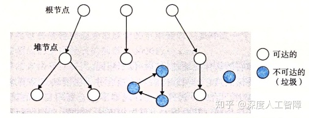
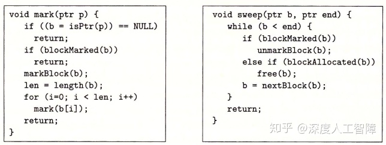
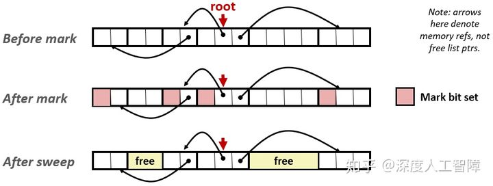
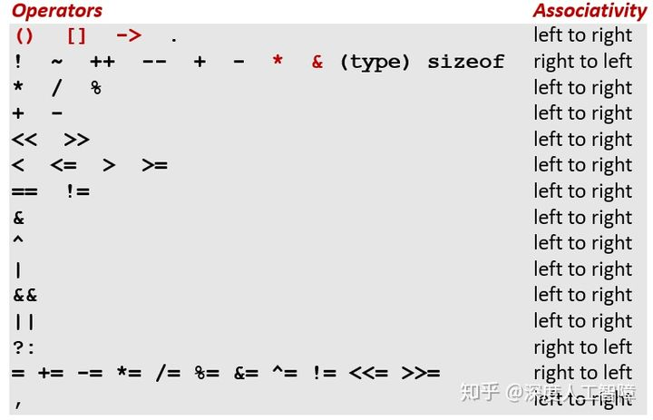
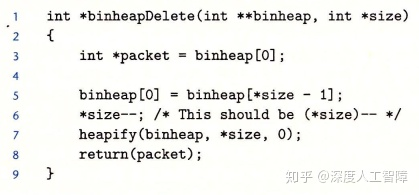

**视频地址：**

[【精校中英字幕】2015 CMU 15-213 CSAPP 深入理解计算机系统 课程视频_哔哩哔哩 (゜-゜)つロ 干杯~-bilibiliwww.bilibili.com/video/BV1iW411d7hd?p=20](https://link.zhihu.com/?target=https%3A//www.bilibili.com/video/BV1iW411d7hd%3Fp%3D20)

**课件地址：**

[http://www.cs.cmu.edu/afs/cs/academic/class/15213-f15/www/lectures/20-malloc-advanced.pdfwww.cs.cmu.edu/afs/cs/academic/class/15213-f15/www/lectures/20-malloc-advanced.pdf](https://link.zhihu.com/?target=http%3A//www.cs.cmu.edu/afs/cs/academic/class/15213-f15/www/lectures/20-malloc-advanced.pdf)

本章对应于书中的9.10~9.11。

------

在上一章中介绍了显示分配器要求应用程序显示地调用`free`函数来释放已分配块，比如以下代码中在`garbage`函数中调用了`malloc`函数来分配块，但是函数返回时并没进行释放，使得`p`指向的分配块始终保持已分配的状态，则分配器就无权对该分配块进行操作，由于`p`保存在函数`garbage`的栈帧中，当`garbage`返回时也丢失了`p`，所以这个已分配块就变成了垃圾，无法被使用，直到程序终止。

```c
void garbage(){
  int *p = (int *)malloc(128);
  return;
} 
```

而在隐式分配器中，分配器会释放程序不再使用的已分配块，自动对其调用`free`函数进行释放。则应用程序只需要显示分配自己需要的块，而回收过程由分配器自动完成。

本章主要介绍Mark&Sweep算法，它建立在malloc包的基础上，使得C和C++就有垃圾收集的能力。

## 1 垃圾收集器

### 1.1 基础知识

垃圾收集器将内存视为一个有向**可达图（Reachability Graph）**，其中具有两种节点：

- **根节点（Root Node）：**对应于不在堆中但包含指向堆中的指针，可以是寄存器、栈中变量或全局变量等等。
- **堆节点（Heap Node）：**对应于堆中的一个已分配的块。

有向边$p\rightarrow q$ 表示p中的某个位置指向q中的某个位置，说明p需要q的存在。我们可以从根节点触发找到所有可达的节点，则剩下的不可达的节点就是垃圾，因为不存在使用这些不可达节点的入口，应用程序无法再次访问这些不可达的已分配块。垃圾收集器就是在维护这样一个有向可达图，并释放不可达节点。



对于像ML和Java语言，其对指针创建和使用有严格的要求，由此来构建十分精确的可达图，所以能回收所有垃圾。而对于像C和C++这样的语言，垃圾收集器无法维护十分精确的可达图，只能正确地标记所有可达节点，而有一些不可达节点会被错误地标记为可达的，所以会遗留部分垃圾，这种垃圾收集器称为**保守的垃圾收集器（Conservative Garbage Collector）**。

在C中使用垃圾收集器可以有两种方法：

- **按需的：**将其集成到`malloc`函数中。当引用调用`malloc`函数来分配块时，如果无法找到合适的空闲块，就会调用垃圾收集器来识别出所有垃圾，并调用`free`函数来进行释放。
- **自动的：** 可以将垃圾收集器作为一个和应用并行的独立线程，不断更新可达图和回收垃圾。

### 1.2 Mark&Sweep垃圾收集器

Mark&Sweep垃圾收集器由两个阶段组成：

- **标记（Mark）阶段：**标记出根节点的所有科大的和已分配的后继。为此，需要在块的头部和脚部的低3位中用一位来表示其是否可达的。
- **清除（Sweep）阶段：**释放所有未标记的已分配块。

这两个阶段的伪代码如下所示



标记阶段为每个根节点都调用一次`mark`函数，首先会判断输入`p`是否为指针，如果是则返回`p`指向的堆节点`b`，然后判断`b`是否被标记，如果没有，则对其进行标记，并返回`b`中不包含头部的以字为单位的长度，这样就能依次遍历`b`中每个字是否指向其他堆节点，再递归地进行标记。这是对图进行DFS。

清除阶段会调用一次`sweep`函数，它会在所有堆节点上反复循环，如果堆节点`b`是已标记的，则消除它的标记，如果是未标记的已分配堆节点，则将其释放，然后指向`b`的后继节点。



### 1.3 C程序的保守Mark&Sweep

C程序想要使用Mark&Sweep垃圾收集器，在实现`isPtr`函数时**具有两个困难：**

- 进入`isPtr`函数时，首先需要判断输入的`p`是否为指针，只有`p`为指针，才判断`p`是否指向某个已分配块的有效载荷。但是在C语言不会用类型信息来标记内存位置，比如`int`或`float`这些标量就可能被伪装成指针，比如`p`对应的是一个`int`类型数据，但是C误以为是指针，而将该数据作为指针又正好指向某个不可达的已分配块中，则分配器会误以为该分配块时可达的，造成无法对该垃圾进行回收。这也是C程序的Mark&Sweep垃圾收集器必须是保守的原因。
- 当判断`p`为指针时，如何确定它所在块的头部。这里可以将已分配的块组织成平衡二叉树的形式，如下所示，保证左子树所有的块都在较小的地址处，右子树所有的块都在较大的地址处。此时输入一个指针`p`，从该树的根节点开始，根据块头部的块大小字段来判断指针是否指向该块，如果不是，根据地址大小可跳转到左子树或右子树进行查找。


## 2 C程序中常见的与内存有关的错误

先介绍C程序中怎么判断指针的内容：首先在变量名左右根据下方操作符的优先级确定先定义那个操作符，然后依次判断就可以得到变量的定义。

C操作符的优先级和结合方向

- `int *p`：p is a pointer to int
- `int *p[13]`：p is an array[13] of pointer to int
- `int *(p[13])`：p is an array[13] of pointer to int
- `int **p`：p is a pointer to a pointer to an int
- `int (*p)[13]`：p is a pointer to an array[13] of int
- `int *f()`：f is a function returning a pointer to int
- `int (*f)()`：f is a pointer to a function returning int
- `int (*(*f())[13])()`：f is a function returning ptr to an array[13] of pointers to functions returning int
- `int (*(*x[3])())[5]`：x is an array[3] of pointers to functions returning pointers to array[5] of ints

接下来将介绍一些常见的与内存有关的错误来结束对虚拟内存的讨论。

### 2.1 间接引用坏指针

我们知道，对于每个进程，内核维护了一个`vm_area_struct`数据结构，来将虚拟内存划分成不同的段，这也造成虚拟内存可能是不连续的，如果我们尝试对不处于任何段的虚拟内存进行引用时，内核就会发出段异常终止程序。其次，不同段限制了不同页的读写权限，如果我们尝试对只读虚拟页进行写操作时，内核就会发出保护异常终止程序。

所以对地址的引用和读写要满足要求。比如我们错误地使用了以下代码

```c
scanf("%d", val);
```

此时就会尝试对`val`作为虚拟地址，对其进行写操作，如果`val`的值作为虚拟地址不处于任何段，或处于只读段，则会报错。

### 2.2 读未初始化的内存

我们定义的未初始化的全局变量处于`.bss`段中，该段会与匿名文件进行关联，使得未初始化的全局变量都为0。但是使用`malloc`分配堆内存时，只是简单的修改了`brk`指针，并不会对已分配的块进行任何初始化，所以要对动态内存分配得到的堆内存进行初始化。

### 2.3 假设指针和他们指向的对象是相同大小的


以上代码尝分配一个n*m大小的二维数组，但是第5行中应该使用`sizeof(int*)`，但是这里却使用`sizeof(int)`，只有在`int *`和`int`大小相同的系统中才会执行正确，如果在大小不同的系统中就会执行错误。

执行`malloc`函数后，其会分配一个指定大小的块，并设置好块的头部和脚部。当我们在第7行和第8行进行初始化时对`A`进行初始化时，由于`int`比`int *`小，使得会覆盖已分配块的脚部，一开始没有什么问题，但是在后面执行`free`进行释放时，如果尝试合并空闲块，就会由于脚部被覆盖而出现未知的错误。

### 2.4 造成错位错误


以上代码在第7行中的`i<=n`应该为`i<n`，这里会覆盖`A[n]`的内容，这个是其他堆块的内容。

### 2.5 引用指针而不是指针指向的对象

当操作符优先级和结合性考虑错误时，可能会错误地操作指针，而不是指针指向的对象。



第6行中，由于`*`和`--`的优先级相同，所以会从右往左执行，此时就会先对`size`指针减1。