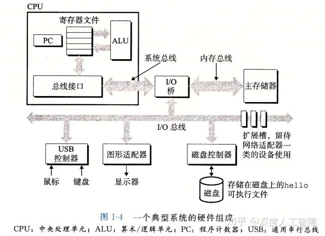
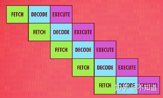

本节主要针对视频课程中没有涉及的书本第一章——计算机系统漫游。


## 1. 程序是如何存储和执行的

在这一节中，将介绍程序是如何保存在计算机中，并且如何转换成计算机可识别、可执行的信息，然后介绍计算机硬件中是如何一步步执行程序的。

所以首先简单介绍计算机的硬件组成，以此作为基础后，一步步介绍程序是如何存储并执行的。

### 1.1 计算机硬件简介

一个典型的计算机硬件组成如下图所示，可以将其分成三部分：CPU、RAM以及I/O。我们将简单介绍其中的若干个比较重要的组成部分：



**1. 总线（Bus）**

总线是贯穿各个计算机硬件的桥梁，它携带信息并负责在各个部件之间进行传递。总线通常被设计成传送特定长度的字节块，称为**字（Word）**，这是一个基本的系统参数，不同系统中各不相同。

总线主要包含数据总线、地址总线和控制总线。顾名思义，数据总线通常是用来传输数据的，比如从主存RAM中传输数据到CPU中，就是使用数据总线进行传输的。地址总线主要用来传输地址，比如要从RAM的地址1000处获取数据，这个1000就是通过地址总线进行传输的。控制总线主要传输控制和时序信息的，比如读写、中断等等。

**2. I/O设备**

I/O设备是系统和外部世界的联系通道。每个I/O设备都通过一个控制器或适配器与I/O总线相连，负责I/O设备和I/O总线间的信息传递。

**控制器和适配器的区别：**控制器是I/O设备或主板的芯片组，适配器是插在主板卡槽的卡。

**3. 主存（RAM）**

是一个临时存储设备。当程序运行时，主要保存程序以及程序处理的数据。基本单位是**字节（Byte）**，从逻辑上看，对每个字节都指定了唯一的地址，这个地址从0开始。

**4. 处理器**

是用来解释或执行存储在主存中的引擎。一个CPU由若干部分组成：

**寄存器：**通常为8位寄存器，用来保存一个字节的数据。CPU中有若干寄存器，每个寄存器都有唯一的地址，用来保存CPU中临时运算结果。其中有两个寄存器比较特殊：

**指令地址寄存器：**用来保存当前指令在内存中的地址，每次执行完一条指令后，会对该寄存器的值进行修改，指向下一条指令的地址。

**指令寄存器：**用来保存当前从主存中获取的，需要执行的指令。

**ALU：**算术逻辑单元，主要用来处理CPU中的数学和逻辑运算。它包含两个二进制输入，以及一个操作码输入，用来决定对两个输入进行的算数逻辑操作。然后会输出对应的运算结果，以及具有各种标志位，比如结果是否为0、结果是否为负数等等。

**控制单元：**是一系列门控电路，通过门控电路来判断指令寄存器中保存的指令内容，然后调整控制主存和寄存器的读写数据和地址，以及使用ALU进行运算。我的理解就是一系列门控电路，然后根据你程序的指令来调控CPU中的各种资源。

**CPU中执行指令的过程：**首先根据指令地址寄存器从内存中获取对应地址的数据，然后将其保存在指令寄存器中，然后控制单元会对指令内容进行判断，并调用寄存器、ALU等执行指令内容，然后更新指令地址寄存器，使其指向下一个要执行的指令地址。

**可参考：**

[深度人工智障：[读书笔记\]《计算机科学速成课》—5 算术逻辑单元-ALU](https://zhuanlan.zhihu.com/p/103505660)

[深度人工智障：[读书笔记\]《计算机科学速成课》—6 寄存器和内存](https://zhuanlan.zhihu.com/p/103505753)

[深度人工智障：[读书笔记\]《计算机科学速成课》—7 中央处理器CPU](https://zhuanlan.zhihu.com/p/103505881)

### 1.2 程序存储和执行

我们以最简单的C程序为例

```c
#include <stdio.h>
int main(){
    printf("hello world\n");
    return 0;
}
```

这段代码需要保存在一个文件中，称为源文件，这是这段程序生命周期的开始。但是计算机只知道0和1的二进制数，并不知道你写的这些文本到底是什么。所以大部分的现代计算机系统都会使用ASCII标准来表示这些文本，简单来说就是给每个字符都指定一个唯一的单字节大小的编号，然后将文本中的字符都根据ASCII标准替换成对应的编号后，就转换成了字节序列，所以该源文件是以字节序列的形式保存在文件中的。

> 系统中的所有信息都是由一串比特表示的，区分不同数据对象的唯一方法就是上下文。

我们为了人们能够读懂程序时做什么的，所以使用了高级的C语言写了这段程序，但是对于计算机来说太过于复杂了，它只能执行指令集中包含的指令。所以为了能够在系统中运行这段程序，我们需要先将每句C语句都转换成一系列的低级机器语言指令，然后这些指令按照可执行目标程序的格式打包好后，以二进制磁盘文件形式保存起来，该文件称为目标文件。这种从源文件转换到目标文件的过程由编译器驱动的。该过程主要分为4个阶段：


**1. 预处理阶段**

预处理器将源文件中以`#`开头的命令修改为原始的C程序。比如将`#include <stdio.h>`替换成头文件`stdio.h`中的内容。

**2. 编译阶段**

编译器将C语言的`hello.i`翻译成汇编语言的`hello.s`。 这样做的好处在于，通过为不同语言不同系统上配置不同的编译器，能够提供通用的汇编语言，这样对于相同的语言，就能兼容不同的操作系统，而对于同一个系统上，通过安装不同语言的编译器，也能运行不同语言写的程序了。

而汇编语言相对C语言更加低级，它对机器码进行了修饰，为每一个操作码提供了更加简单、容易记的助记符，并且提供了很多机器码不具有的功能，比如自动解析JUMP指令地址等等。该语言的编写和底层硬件连接很密切，程序员仍需要思考使用什么寄存器和内存地址。

我们这里使用**指令集架构**来提供对实际处理器硬件的抽象，这样机器代码就好像运行在一个一次只执行一条指令的处理器上。

**可参考：**[深度人工智障：[读书笔记\]《计算机科学速成课》—11 编程语言发展史](https://zhuanlan.zhihu.com/p/103506075)

**3. 汇编阶段**

汇编器将汇编语言写的`hello.s`翻译成由机器语言指令构成的`hello.o`，并保存成二进制文件。

**4. 链接阶段**

我们写代码时通常会使用C标准库中提供的函数，但是我们代码中并没有这些函数的具体实现，所以就需要在链接阶段将该函数的具体实现合并到我们的`hello.o`。比如我们程序中使用了`printf`函数，而该函数存在于一个单独预编译好的目标文件`printf.o`中，所以我们只需要将该文件合并到我们的`hello.o`中，就能正确使用该函数了。

最终得到的`hello`文件就是可执行目标文件，可以被加载到内存中，由系统执行。


通过以上的编译过程，我们从由C语言的源文件`hello.c`编译得到了可执行目标文件`hello`，接下来我们就可以运行该目标文件了

1. shell读入我们输入的字符`./hello`后，将其逐一读入到CPU的寄存器中，然后再将其存放到主存中。
2. 输入回车后，shell执行一系列指令将hello目标文件中的代码和数据从磁盘复制到主存。
3. CPU开始执行hello的main程序中的机器指令，它将`hello, world\n`字符串中的字节从主存复制到CPU寄存器，再从CPU寄存器复制到显示设备。

通过以上过程，我们就完成了程序的保存和执行的完整过程。

**可参考：**[深度人工智障：[读书笔记\]《计算机科学速成课》—7 中央处理器CPU](https://zhuanlan.zhihu.com/p/103505881)

## 2. 高速缓存

执行代码时，会花费大量时间将代码和数据进行复制，如果使这些复制尽快完成就能进行系统加速。

首先根据**机械原理**可知，较大的存储设备比较小的存储设备运行得慢，而高速设备的造价远高于同类的低速设备。因为寄存器远小于主存，所以在寄存器上处理器读取数据的速度比主存快很多，并且这种差距还在持续增大。而根据**局部性原理**可知，程序具有访问局部区域内的数据和代码的趋势，所以在处理器和一个较大较慢的设备之间插入一个更小更快的存储设备，来暂时保存处理器近期可能会需要的数据，使得大部分的内存操作都能在高速缓存内完成，就能极大提高系统速度了，而这个设备称为**高速缓存存储器**。

在单处理器系统中，一般含有二级缓存，最小的**L1高速缓存**速度几乎和访问存储器相当，大一些的**L2高速缓存**通过特殊总线连接到处理器，虽然比L1高速缓存慢，但是还是比直接访问主存来的快。在多核处理器中，还有一个**L3高速缓存**，用来共享多个核之间的数据。

一般利用了高速缓存的程序会比没有使用高速缓存的程序的性能提高一个数量级。

## 3. 存储器层次结构

高速缓存的思想其实不仅仅能应用于CPU中，其实对其进行扩展，就能将计算机系统中的存储设备都组织成一个存储器层次结构，如下图所示


存储器层次结构的**主要思想**是将上一层的存储器作为下一层存储器的高速缓存。程序员可以利用对整个存储器层次结构的理解来提高程序性能。

## 4. 操作系统对硬件的抽象

操作系统的出现避免了程序员直接去操作硬件（主存、处理器、I/O设备），它可以看成是应用程序和硬件之间的一层软件，给程序员提供硬件的抽象，比如将正在运行的程序抽象为进程；将程序操作的主存抽象为虚拟内存；将各种I/O设备抽象为文件的形式，让程序员能够直接通过这层软件很好地调用硬件，避免了过多的硬件细节。接下来将简单介绍这三层抽象。

### 4.1 进程

计算机执行程序时，需要将程序对应的指令保存在内存中，并且使用CPU和I/O设备，但是单核计算机一个时刻只能处理一个程序。但是从我们的视角来看，计算机像在同时处理好多程序，比如你可以在shell中运行`hello`，此时就运行了shell程序和`hello`程序。

为了方便对运行程序时所需的硬件进行操作，操作系统对正在运行的程序提供了一种抽象——**进程**。**提供了一种错觉：**一个系统上可以同时运行多个进程，而每个进程好像在独占地使用硬件。这样程序员就无需考虑程序之间切换所需操作的硬件，这些由操作系统的内核进行管理。

> **内核：**操作系统常驻内存的部分，不是一个独立的进程，而是管理全部进程所用代码和数据结构的集合。

操作系统通过交错执行若干个程序的指令，不断地在进程间进行切换来提供这种错觉，这个称为**并发运行**。

首先，当进程A要切换到进程B时，进程A通过系统调用，将控制权递给操作系统，然后操作系统会保存进程A所需的所有状态信息，称为上下文，比如寄存器以及内存内容，然后创建进程B及其上下文，然后将控制权递给进程B。当进程B终止后，操作系统就会恢复进程A的上下文，并将控制权还给进程A，这样进程A就能从断点处继续执行。这个过程都是由操作系统的内容进行控制的。

现代系统中，一个进程中可以并发多个线程，每条线程并行执行不同的任务，线程是操作系统能够进行运算调动的最小单位，是进程中的实际运作单位。每个线程运行在进程的上下文中，并共享相同的代码和全局数据。**优点：**多线程之间比多进程之间更容易共享数据，并且效率更高。

**解析：**这里一个进程中可以并发多个线程，指的是一个进程一次只能运行一个线程，但是一个进程可以同时含有多个线程，每个线程可以执行不同的任务，进程让线程之间快速切换来达到并发线程。

> **注意：**并发运行中每次还是只能运行一个单位，但是通过快速切换来达到同时运行多个单位的错觉。

### 4.2 虚拟内存

计算机会将多个程序的指令和数据保存在内存中，当某个程序的数据增时，可能不会保存在内存的连续地址中，这就使得代码需要对这些在内存中非连续存储的数据进行读取，会造成很大的困难。

为了解决这个问题，操作系统对内存和I/O设备进行抽象——**虚拟内存**。**它提供了一种错觉：**程序运行在从0开始的连续虚拟内存空间中，而操作系统负责将程序的虚拟内存地址投影到对应的真实物理内存中。这样使得程序员能直接对连续的空间地址进行操作，而无需考虑非连续的物理内存地址。**主要方法：**把进程虚拟内存的内容保存在磁盘中，然后将主存当做磁盘的高速缓存。

操作系统将进程的虚拟内存划分为多个区域，每个区域都有自己的功能，接下来从最低的地址开始介绍：

- **程序代码和数据：**对所有进程来说，代码都是从同一固定地址开始，然后是C全局变量。这部分在进程一开始运行时就被指定大小了。
- **堆：**当调用类似C中的`malloc`和`free`标准库函数时，堆会在进程运行时动态扩展和伸缩。
- **共享库：**用来存放像C标准库和数学库这样公共库的代码和数据的区域。
- **栈：**位于用户虚拟内存顶部，编译器用来实现函数调用，当调用函数时，栈就增长，当返回一个函数时，栈就缩小。
- **内核虚拟内存：**地址空间顶部的区域为内核保留，不运行程序读写这个区域，或直接调用内核代码定义的函数。


### 4.3 文件

操作系统将所有I/O设备看成是文件，而文件是字节序列，这样系统中的所有输入输出可以调用系统函数来读写文件实现，简化了对各种各样的I/O设备的操作。

## 5. 网络

从一个单独的系统来看，网络可以看成一个I/O设备，当系统从主存复制一串字节到**网络适配器**时，计算机就会自动将其发送到另一台机器。在后续的课程会详细介绍。

## 6. 并发和并行

**并发（Concurrency）**指一个同时具有多个活动的系统。**并行（Paralleism）**指的是用并发来时一个系统运行得更快。并行可以在计算机系统的多个抽象层次上运用。

### 6.1 线程级并发

在单处理器系统中，通过进程之间的并发可以设计出多个程序执行的系统；通过线程之间的并发，可以在一个进程中执行多个控制流。

多处理器系统主要分成超线程和多核处理器。

随着CPU的发展，引入了超标量、乱序运行、大量的寄存器及寄存器重命名、多指令解码器、预测运行等特性，这些特性的原理是让CPU拥有大量资源，可是在现实中这些资源经常闲置，为了有效利用这些资源，可以多增加某些硬件，比如有多个指令地址寄存器和寄存器，而其他硬件部分只有一部分，这就空出了可以额外执行另一个线程的硬件了，超线程技术就可以让一个核同时运行两个线程了。

(上一段不太确定，如有错误请指出，谢谢)

而多核处理器就是将多个CPU集成到一个集成电路中，然后使用一个L3高速缓存来在多个核之间共享数据。

这两个多处理器系统技术的出现，能够减少执行多个程序时模拟并发的需求，并且能够使应用程序运行的更快。

### 6.2 指令级并行

一个指令的执行过程通常包含：取指令阶段、解码阶段和执行指令阶段。最初的指令执行过程是每个指令完整经过一整个过程后，才运行下一条指令，但是其实每个阶段使用的都是处理器中不同的硬件部分，这就使得我们可以流水线式地运行多个指令，这就达到了差不多一个时钟周期运行一条指令的地步。

CPU顺序处理指令

CPU并行处理指令

即使有流水线设计，在指令执行阶段，处理器还有些区域还是可能会空闲，比如执行一个“从内存取值”指令期间，ALU就会空闲，所以一次性处理多条指令（取值+解码）会更好，如果多条指令要ALU的不同部分，就多条同时执行。我们也可以更进一步，多加几个相同的电路来执行出现频率很高的指令，比如很多CPU有四个、八个甚至更多完全相同的ALU，可以同时执行多个数学运算。这就使得一个机器周期可以运行多个指令。

超标量处理器

### 6.3 单指令、多数据并行

很多现代处理器拥有特殊的硬件，允许一条指令产生多个可以并行执行的操作，这种方式称为单指令、多数据，即**SIMD并行**。

## 7. Amdahl定律

Amdahl定律对提升系统某一部分性能所带来的的效果进行量化。它的**主要思想**是**：**当我们对系统某部分加速时，其对系统整体性能的影响取决于该部分的**重要性**和**加速程度**。
假设某应用程序原始执行时间`T_old`，某部分所需执行时间与该时间的比例为`alpha`，该部分提升比例为k，则新的**总执行时间**为：
$$
T_{new}=(1-\alpha ) T_{old}+\alpha T_{old}/k=T_{old}[(1-\alpha)+\alpha /k]
$$
**加速比**为：
$$
S=\frac 1{(1-\alpha) +\alpha/k}
$$

当k趋向于无穷时，可以计算出该部分加速到极限时所能得到的加速比为：
$$
S=\frac 1{1-\alpha}
$$
该定律提供的一个**主要观点**是**：**要想显著加速整个系统，必须提升全系统中相当大的部分的速度。


------

接下来第一、第二节课程对应于书本中2.1-2.3的内容，所以会将这个作为整体进行整理。