**视频地址：**

[【精校中英字幕】2015 CMU 15-213 CSAPP 深入理解计算机系统 课程视频_哔哩哔哩 (゜-゜)つロ 干杯~-bilibiliwww.bilibili.com/video/av31289365?p=2](https://link.zhihu.com/?target=https%3A//www.bilibili.com/video/av31289365%3Fp%3D2)

[【精校中英字幕】2015 CMU 15-213 CSAPP 深入理解计算机系统 课程视频_哔哩哔哩 (゜-゜)つロ 干杯~-bilibiliwww.bilibili.com/video/av31289365?p=3](https://link.zhihu.com/?target=https%3A//www.bilibili.com/video/av31289365%3Fp%3D3)

**课件地址：**

[http://www.cs.cmu.edu/afs/cs/academic/class/15213-f15/www/lectures/02-03-bits-ints.pdfwww.cs.cmu.edu/afs/cs/academic/class/15213-f15/www/lectures/02-03-bits-ints.pdf](https://link.zhihu.com/?target=http%3A//www.cs.cmu.edu/afs/cs/academic/class/15213-f15/www/lectures/02-03-bits-ints.pdf)

对应于书本的2.1~2.3。

**如有错误请指出，谢谢。**

------

**小点：**

- 模运算相当于忽略某些位的值，比如计算`x mod 8`，则只保留x低三位的值。
- 比较有符号数和无符号数之间的大小，先将其转化为二进制编码，再根据特定编码计算比较。
- 所有性质都可以直接通过二进制以及对应的编码去解释，首先考虑二进制的值是什么。
- 补码和无符号数对应的位向量，在计算结果上都是相同的，大部分计算机中使用相同的机器指令进行计算，所以可以先将补码转换为无符号数进行推导，再转为补码会更容易。
- 加法逆元的求法就是通过溢出实现的，比如求x的加法逆元，直接计算~x+1，就能保证有效位里都是0。
- 尽量不使用无符号数。

------

现代计算机存储和处理的信息是以二值信号表示的，是基于二进制进行编码的，**好处在于：**1. 比如我们可以将低电压表示0，将高电压表示1，如果电路中存在噪音或不完善的地方，只要不超过你设定的阈值，你就会得到一个清晰的信号；2. 对于信息存储而言，存储一位信息或一个数字值比存储一个模拟值更容易。

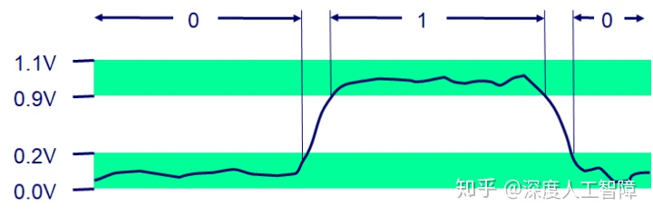

当我们将若干个二进制数组合在一起，再加上某种解释，就能给这些二进制数赋予特定的含义，这个“解释”就是编码。比如对于文档中的字符和符号，我们可以使用标准的字符码将二进制数与字符和符号对应起来；对于数字表示，我们可以使用无符号编码来表示大于或等于零的数字，可以使用补码来表示有符号整数，可以使用浮点数编码来表示数字的科学计数法。

> 由于浮点数和整型数使用不同的编码规则，所以即使他们存储相同的数字，可能二进制序列也不相同。

计算机的表示法是用有限的位来表示无穷的数字，而整数和浮点数对数字处理方式的不同，导致了它们具有不同的**性质：**整数能够编码一个相对较小的精确数值范围，而浮点数能够编码一个较大的近似数值范围。这就使得整数会发生溢出问题，但是整数的计算机运算能满足真正整数运算的性质，比如结合律和交换律，而浮点数虽然能够保证两个整数相乘一定是正的，但是浮点运算是不可结合的。

接下来的篇章，首先会介绍不同信息是如何存储的，以及一些基础运算方法，然后会介绍整数的表示以及整数的运算。至于浮点数的表示和运算会放到下一篇文章进行介绍。

## 1. 信息的表示和处理

### 1.1 信息的存储

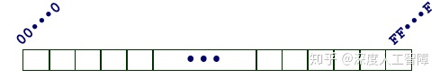

我们知道，计算机将8个bit当做一个块，称为**字节（Byte）**，作为可寻址的最小内存单位。而操作系统给每个进程提供了虚拟内存的抽象，让进程都能访问从相同地址开始的、连续的虚拟内存空间，每个内存单位都有唯一的编码进行标识，这个编码称为**地址（Address）**，而所有地址的集合就构成了虚拟内存空间。

那每个虚拟内存空间最大能有多大呢？这主要取决于计算机的一个参数——**字长（Word Size）**，我们可以将若干个字节当做一个块，称为**字（Word）**，而这里的字节的数目就是字长。字长指明了指针数据的**标称大小（Nominal Size）**，而指针指向虚拟内存空间，它的位数就决定了它能索引多大的空间，由此也就规定了虚拟内存空间的最大大小。所以虚拟空间的最大大小由字长决定。

> 字长定义了操作系统通常处理多大的值和算数运算，并且指针和地址大小也是字长确定的。

现在大部分机器是32位字长或者64位字长的，而程序可以通过不同的编译指令将其编译成32位程序或者64位程序（程序的字长是由编译决定的），其中32位机器可以运行32位程序，但是不能运行64位程序，而64位机器可以运行32位程序和64位程序。并且32位程序和64位程序对C数据类型的典型大小也有影响

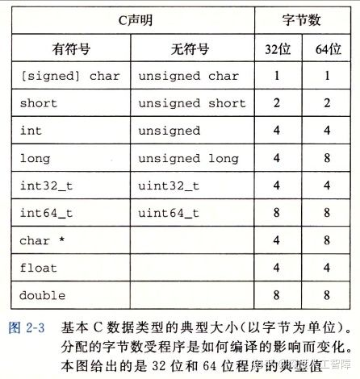

为了避免由于依赖典型大小和不同编译器设置带来的兼容性问题，ISO C99引入了数据大小固定，不随编译器和机器设置而变化的数据类型，比如`int32_t`就是4字节的`int`类型，`int64_t`就是8字节的`int`类型。

> 注意：不同字长的机器中，指针的大小也就不同，并且不同机器/操作系统配置使用不同的存储分配规则，会使得指针的长度和内容差很多。

内存是一系列字节，我们可以根据字长将其划分成不同的**字（Word）**，每个字的地址是该字中最低位的地址。**主要思想**是，我们可以把任意多的字节组合起来称之为一个字。

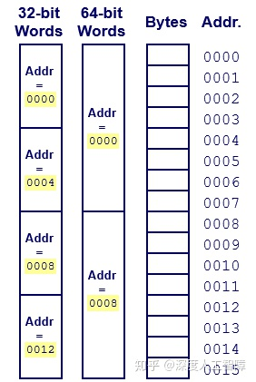

当你某个数据对象跨越了多个字节，则在虚拟内存空间中，这个多字节对象是存在连续的地址中，并且该对象的地址是所使用字节中最小的地址。可以根据该对象的类型来确定字节数目。而多个字节的排列方法分为两种：**小端法（Little Endian）**和**大端法（Big Endian）**。小端法就是最低有效字节在较小的内存地址中，而大端法就是最低有效字节在较大的内存地址中。不同的机器也支持不同的排列方法，有的机器支持双端法，也就是可以把它配置成作为大端或者小端的机器运行。一单选择了特定操作系统，那字节顺序也就固定下来了。

一般而言，机器所使用的的字节顺序是不可见的，但是在有些情况下需要注意字节顺序带来的影响：

1. 在两个不同类型的机器之间通过网络传输数据时，如果这两个机器使用了不同的字节顺序，就会造成问题。所以网络应用程序的代码编写必须遵守已建立的关于字节顺序的规则， 确保发送方机器将它的内部表示转换成网络标准，而接收方机器将网络标准转换为它自己的内部表示。
2. 当我们通过反汇编器得到可执行程序的指令序列时，字节顺序也很重要。

当我们**保存字符串**时，会使用某个标准编码将字符串中的所有字符都转换为对应的编码，比如ASCII字符码、Unicode编码，并且还会在字符串末尾加上全零的二进制数作为字符串结尾。**注意：**在使用ASCII作为字符码的任何系统上，都将得到相同的结果，与字节顺序和字大小规则无关。

当我们**保存代码**时，如上一节介绍的，编译器首先会将源文件编译成字节表示的机器代码，是由不同的机器指令构成的，需要**注意**的是，不同机器类型使用不同的且不兼容的机器指令和指令编码方式，所以同一段代码在不同机器中编译的结果是不同的且不兼容的。

### 1.2 C中的基本运算

### 1.2.1 位级运算

C中的整型数据类型是使用二进制数进行编码的，二进制数可以对应为布尔代数的位向量，所以它可以支持按位的布尔运算，比如`|`表示OR、`&`表示AND、`~`表示NOT、`^`表示XOR。

位向量的一个重要应用就是表示**有限集合**，所以一个字节可以表示8种情况，比如`[01101001]`表示集合`{0,3,5,6}`，这样布尔运算的`|`和分别对应于集合的并和交，而`~`对应于集合的补、`^`对应于集合的对称差。

其次，位级运算的一个常见用法就是实现**掩码运算**。这里的掩码就是一个位模式，表示从一个字中选出的为的集合。比如提取最低有效字节`x&0xFF`，保留除了最低有效字节以外的字节`x&~0xFF`。

> 布尔代数的`&`对`|`具有分配率，而`|`对`&`也具有分配率。元素与自身异或会得到0。0异或任意元素保持不变。与全F取异或是取反。

### 1.2.2 逻辑运算

C提供了一组逻辑运算符`||`、`&&`和`!`分别对应于命题逻辑中的`OR`、`AND`和`NOT`运算。要注意逻辑运算和位级运算的区别，在逻辑运算中，只要是非零的数据就表示为`TRUE`，全零的数据就表示为`FALSE`，所以计算时候先将其转换为`TRUE`和`FALSE`，然后计算出来的结果只会是`0x00`或`0x01`，分别对应`FALSE`和`TRUE`。

逻辑运算中有一个特点：**提早终止（Early Termination）**。当计算逻辑与和逻辑或时，如果只通过左侧的式子就已经能得到最终的结果，就不会再计算右侧的式子了。比如

```c
int i=0;
int ans1=i&&(++i);
//因为i=0，所以计算逻辑与时能够直接得到结果是FALSE，就无需计算右侧的++i了。所以ans=0，i=0
int ans2=i||(++i);
//由于i=0计算逻辑或时无法直接得到结果，所以还需要计算右侧的式子，此时i=1，所以ans=1，i=1
```

### 1.2.3 移位运算

C语言表示的二进制编码，可以对其进行移位操作。x向左移k位，表示为`x<<k`，此时会丢弃最高的k位，并在右侧补充k个零。x向右移k位，表示为`x>>k`，由于整型编码的问题，会将右移操作分为逻辑右移和算数右移，逻辑右移就是丢弃最低的k位，并在左侧补充k个零，而算数右移中，因为有符号数使用最高位来表示数字的正负性，为了保证数字的正负性不变，就丢弃最低的k位，并在左侧补充最高有效位的值，本文后续会有介绍。

C语言没有对何时使用逻辑右移和算数右移进行规定，但是一般编译器/及其组合都对有符号数使用算数右移， 而对于无符号数，就使用逻辑右移。

**注意：**当k的值大于数据类型的位数w时，有些机器和JAVA会通过计算`k mod w`来确定位移量，所以对于8位的数左移8位，该数不变。但是C语言没有限制，所以要自己保证 ![[公式]](https://www.zhihu.com/equation?tex=0%5Cleq+k%3Cw) 。

## 2. 整数的表示

### 2.1 整型数据类型

C语言提供了多种由不同字节数目构成的、具有不同范围的整型数据类型，并且每种整型数据类型都有**有符号（signed）**和**无符号（unsigned）**两个版本，常量默认是有符号版本，可以加上后缀`u`或者`U`来将其指定为无符号版本。C语言标准定义了每种数据类型必须能够表示的**最小的取值范围**，如下图所示

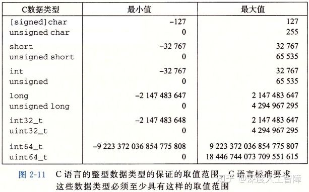

可以发现除了固定大小的数据类型`int32_t`和`int64_t`的取值范围是不对称的以外，其他的有符号数据类型的取值范围都是对称的。

目前32位程序和64位程序上C语言整型数据类型的典型取值范围如下

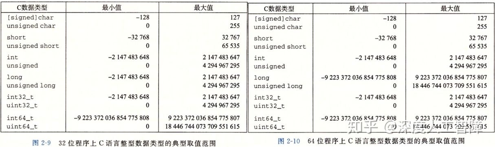

可以发现，有符号数的取值范围是不对称的，负数的范围比正数范围大1。

给定一串二进制编码来表示整数，具体如何解释这些二进制主要取决于它的编码方式，对相同的二进制采用不同的编码方式得到的整数结果是不同的，接下来介绍编码无符号数和有符号数的方法。

### 2.2 无符号数的编码

假设一个整型数类型为w位，我们可以将它的位向量写成x，或者写成 ![[公式]](https://www.zhihu.com/equation?tex=%5Bx_%7Bw-1%7D%2Cx_%7Bw-2%7D%2C...%2Cx_0%5D)。我们可以直接将x看成是一个二进制表示的，就获得了x的无符号表示。定义一个函数 ![[公式]](https://www.zhihu.com/equation?tex=B2U_w)（Binary to Unsigned)表示将w位的二进制转化为无符号数，我们可以得到该函数的表达式为
$$
B2U_w=\sum_{i=0}^{w-1} x_i 2^i
$$


相当于就是将二进制数转化为十进制数。

- **最小值：**位向量为 $[0,0,\dots,0]$ ，也就是0。
- **最大值：**位向量为$[1,1,\dots,1]$，表示为 $UMax_w=\sum_{i=0}^{w-1}2^i=2^w-1$

C中有一些内置函数返回的是无符号数，比如`sizeof`，如果将其与有符号数进行计算时要格外小心。

### 2.3 有符号数的编码

有符号数有很多不同的编码方式，比如**补码（two's complement）**、**反码（one's complement）**和**原码（sign-magnitude）**。其中最常见的是补码编码，C语言标准没有要求要用何种形式的编码来表示有符号整数，但是几乎所有机器都会使用补码编码。

我们定义一个函数$B2T_w$（Binary to Two's complement)表示将w位的二进制转化为补码编码的有符号数，我们定义该函数的表达式为
$$
B2T_w=-x_{w-1}2^{w-1}+\sum_{i=0}^{w-2}x_i w^i
$$
补码将最高有效位$x_{w-1}$当做**符号位（Sign Bit）**，并且赋予了权重$-2^{w-1}$。

- **最小值：**位向量为$[1,0,\dots,0]$，表示为$TMin_w=-2^{w-1}$
- **最大值：**位向量为$[0,1,\dots,1]$，表示为$TMax_w=\sum_{i=0}^{w-2}2^i=2^{w-1}-1$
- **-1：**位向量为$[1,1,\dots,1]$，刚好和$UMax_w$的编码方式相同。

我们可以观察到**两个性质：**

1. 补码编码的范围是不对称的，$|TMax_w|+1=|TMin_w|$，这是因为通过设置符号位，将一半的位模式表示为负数，将另一半的位模式表示为非负数，而0是非负数，所以负数就比正数多1个。所以**测试时要特别小心**$TMin_w$。
2. $UMax_w=2*TMax_w+1$。**证明：**$UMax_w$的位模式为$[1,1,\dots,1]$，$TMax_w$的位模式为$[0,1,1,\dots,1]$，通过将$TMax_w$左移一位并加1，就能得到$UMax_w$的位模式，并且左移一位对应于乘2。

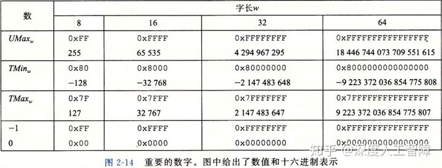

上图提供了一些比较重要的数字及其编码，C库中的文件`<limits.h>`定义了一组常量，来限定编译器运行的这台机器的不同整型数据类型的取值范围，比如它定义了常量`INT_MAX`、`INT_MIN`和`UINT_MAX`，就分别对应上面推导的最大值和最小值。

对于反码编码，我们可以定义一个函数$B2O_w$（Binary to One's complement)，我们定义它的表达式为
$$
B2O_w=-x_{w-1}(2^{w-1}-1)+\sum_{i=0}^{w-2}x_i 2^i
$$
对于原码编码，我们可以定义一个函数$B2S_w$（Binary to Sign magnitude)，我们定义它的表达式为
$$
B2S_w=(-1)^{x_{w-1}}·\sum_{i=0}^{w-2}x_i 2^i
$$
它们有个奇怪的**特点：**对于数字0有两种不同的编码方式。

### 2.4 有符号数和无符号数之间的转换（同样字长的类型之间）

C语言可以在各种不同的数字类型之间做强制类型转换，它的具体实现要从位级角度来看，它保持位值不变，只是改变了解释这些位的方式。比如对于一个位模式 $[x_{w-1},x_{w-2},\dots,x_0]$，通过采用有符号的编码和补码达到在有符号数和无符号数之间的类型转换，对于位模式中的值并不会改变。而有符号数编码和补码之间的区别只有$2^{w-1}$符号的变化。

### 2.4.1 补码转换为无符号数

对于大于0的补码，符号位并没有使用，所以它能得到有无符号数相同的值；对于小于0的补码，它的符号位为1，使得它的值相对无符号数小$2*2^{w-1}=2^w$，所以将小于0的补码值加上$2^w$就能得到对应的无符号数。我们定义一个函数$T2U_w(x)$，表示将补码x转换为无符号数，其函数形式为

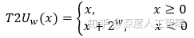

这就使得小于0的有符号数转换为补码时，发生了跳转，一下变得很大。

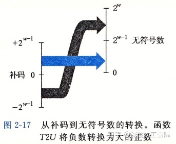

### **2.4.2 无符号数转换为补码**

对于小于$TMax_w$的无符号数，它还能保证最高有效位为0，这和补码表示正数时相同，所以可以直接将小于$TMax_w$的无符号数转换为补码；而对于大于$TMax_w$的无符号数，它的最高有效位为1，使得它的值相对补码大$2*2^{w-1}=2^w$，所以要将其减去$2^w$就得到补了。我们定义一个函数$U2T_w(u)$将无符号数转化为补码，其函数形式为

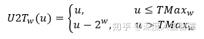

这就使得大于$TMax_w$的无符号数转化为补码时会发生跳转，一下变得很小。

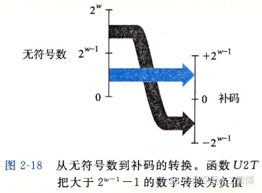

在C语言中，当一个有符号数和一个无符号数进行计算时，会**隐式地将有符号数转化为无符号数**。当进行逻辑判断时，可能会出现问题

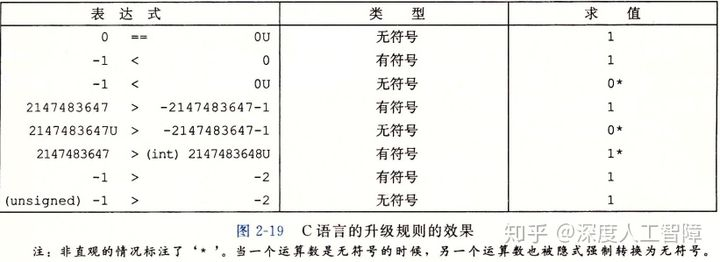

比如`-1<0U`，首先有`0U`是无符号类型，所以会先将`-1`转化为无符号类型，就需要加上$2^w$，就使得值变得很大，所以结果为0。

**比较的最好方法是将其转换成二进制编码，然后根据特定编码进行计算。**比如`2147483547`，它是补码的最大值，二进制编码为$[0,1,1,\dots,1]$，而`-2147483547-1`是补码的最小值，二进制编码为$[1,0,0,\dots,0]$，当将这两个二进制编码转化成无符号数时，肯定第二个值更大。其他依次类推。

由于有符号数到无符号数的隐式转换，可能会导致错误或漏洞，因此建议**绝不使用无符号数**。但是如果我们想把字看成是位的集合，而没有实际意义，则无符号数非常有用。

### 2.5 不同字长的类型转换

在不同字长的整数之间进行类型转换，要保持在数据类型范围内的数值是不变的。以下有两种情况：从较短字长的数据类型转换到较长字长的数据类型，比如short到int，就需要进行扩展位；从较长字长的数据类型转换到较短字长的数据类型，比如int到short，就需要截断位。

### 2.5.1 扩展位

我们想要在不改变值的情况下进行扩展。

对于无符号数，根据无符号数编码的定义，我们可以直接在位向量的前端扩展0，这个称为**零扩展（Zero Extension）**。

**证明：**定义宽度为w的位向量$\overline u=[u_{w-1},u_{w-2},\dots,u_0]$和宽度为$w'$的位向量$\overline {u'}=[0,\dots,0,u_{w-1},\dots,u_0]$，其中$w'>w$，根据无符号编码的定义，可知
$$
B2U_{w'}(\overline {u'})=\sum_{i=0}^{w'-1} u_i 2^i= \sum_{i=0}^{w-1}u_i 2^i=B2U_w(\overline u)
$$
对于补码，我们直接在在位向量的前端扩展最高有效位的值，这个称为**符号扩展（Sign Extension）**。

**证明：**定义宽度为w的位向量$\overline x=[x_{w-1},w_{w-2},\dots,x_0]$和宽度为w'的位向量$\overline {x'}=[x_{w-1},\dots,x_{w-1},x_{w-2},\dots,x_0]$，其中$w'>w$，我们要证明$B2T_w(\overline x)=B2T_{w'}(\overline {x'})$。我们可以先证明当$w'=w+1$时，即扩展一位时的情况，如果成立，则通过若干次扩展，就能得到宽度为$w'$的补码。
$$
\begin{split}
B2T_{w+1}([x_{w-1},x_{w-1},x_{w-2},\dots,x_0])&=-x_{w-1} 2^w+\sum_{i=0}^{w-1}x_i 2^i \\
&=-x_{w-1}2^w+x_{w-1}2^{w-1}+\sum_{i=0}^{w-2}x_i2^i \\
&=-x_{w-1}2^{w-1}+\sum_{i=0}^{w-2}x_i2^i \\
&== B2T_w([x_{w-1},x_{w-2},\dots,x_0])
\end{split}
$$
当扩展位以及有符号数和无符号数之间的顺序变化时，会影响最终计算出来的结果：

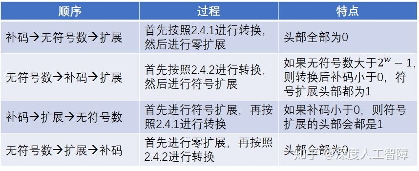

**需要注意：**如果先进行扩展，则位数w发生变化后，无符号数转化为补码的阈值$TMax_w$以及变化的量$2^w$会发生变化。

C语言标准要求先进行扩展位，再进行有符号和无符号转换。

### 2.5.2 截断位

对于无符号数，定义宽度为w的位向量$\overline u=[u_{w-1},u_{w-2},\dots,u_0]$和宽度为$w'$的位向量$\overline {u'}=[u_{w'-1},u_{w'-2},\dots,u_0]$，其中$w'<w$，将比$w'$高的位直接丢弃，这会改变数的值，也是**溢出**的一种形式。两者值的关系为$B2U_{w'}\overline {u'}=B2U_w \overline u \% 2^{w'}$。

**证明：**
$$
B2U_w(\overline u)\% 2^{w'}=[\sum_{i=0}^{w-1}u_i2^i]\%2^{w'}=\sum_{i=0}^{w'-1}u_i2^i=B2U_{w'}(\overline {u'})
$$
**对$2^{w'}$ 取模就相当于丢弃$w'$之前的位。**

对于补码，可以先将二进制数转换成无符号数，通过上面的公式进行截断后，再转换成补码，即$B2T_{w'}(\overline {u'})=U2T_{w'}(B2U_w(\overline x)\%2^{w'})$。

截断位时，数值通常会发生变化，并且正数可能变成负数，负数可能变成正数。

## 3. 整数运算

计算机中计算都是通过二进制数来计算的，所以无论是无符号数还是有符号数，计算得到的位模式是相同的（这也保证了他们使用相同的算法、指令进行运算）。但是由于有限位以及编码方式（无符号数、补码）的限制，可能会导致计算机计算的结果和真实结果之间存在差异，也就发生了**溢出**。

> **溢出：**完整的计算结果不能放到数据类型的字长限制中。

接下来会探讨不同编码不同运算的计算结果。

### 3.1 无符号数加法

w位的无符号数的取值范围为$[0,2^w)$，其中最大值对应的位向量为$[1,1,...,1]$，当计算结果大于等于$2^w$时，就需要w+1位来表示，此时直接去掉w+1位的结果，就是计算机最终计算的结果（就是相加后，直接去掉超过的位数）。而直接去掉w+1之后的位，相当于是计算结果对$2^w$取模，所以该方法称为**模数加法**。模数加法是**可交换可结合的**。

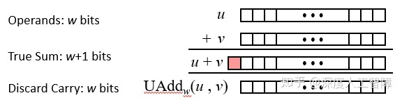

定义运算符$+^u_w$表示w位的无符号数加法运算符，我们可以得到无符号数加法和真实加法之间的函数关系$x+^u_w y=(x+y)\%2^w$。当计算结果超过$2^w$时发生溢出，并且溢出结果会发生反转，产生比较小的值。

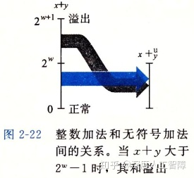

- **判断溢出方法：**当$x+y<y$或$x+y<x$时就发生溢出了。

**证明：**当发生溢出时，计算结果为$x+y=(x+y)\%2^w=x+y-2^w$，因为x和y的最大值都小于$2^w$，所以该计算结果一定小于x或y。

- **加法逆元：**利用溢出效应，每个元素都有一个加法逆元，当与自己的加法逆元相加时，就得到0。**注意：**无符号数的加法逆元和数学上的相反数数值不同。

在计算机运算中，要想两个非零数相加为0，就需要利用溢出来实现。计算x的加法逆元x'时，只要保证$x+^u_wx'=[1,0,0,...,0]$，其中位向量有w+1位，发生了溢出，就会将最高有效位截断，使得结果变为0。而该位向量的真实计算结果为$2^w$，所以元素x的加法逆元为$2^w-x$。用函数表示加法逆元为

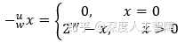

### 3.2 补码加法

使用补码的一个**优势在于**：补码加法可以使用和无符号数加法相同的硬件，相同的算法，就得到到有符号数的加法。所以大多数计算机用相同的机器指令来执行补码和无符号数加法。

定义$+^t_w$为w位的补码加法符号，定义两个数之间的补码加法为$x+^t_wy=U2T_w(T2U_w(x)+^u_wT2U_w(y))$。我们接下来证明这种相同的位向量可以得到正确的结果。

**证明：**
$$
x+^t_wy=U2T_w((x_{w-1}2^w+x+y_{w-1}2^w+y)mod\ 2^w) =U2T_w((x+y)mod\ 2^w)
$$

- 当$0\le x+y \lt2^{w-1}$时，原式化为$U2T_w(x+y)=x+y$。所以当补码位于非负数取值范围内，可得到正确计算结果。
- 当$-2^{w-1}\le x+y \lt 0$时，$(x+y)mod\ 2^w=x+y+2^w$，此时$2^{w-1}\le x+y+2^w\lt 2^w$，所以$U2T_w(x+y+2^w)=x+y+2^w-2^w=x+y$。所以当补码位于负数取值范围内，可得到正确计算结果。
- 当$-2^w\le x+y \lt-2^{w-1}$时，$(x+y)mod\ 2^w=x+y+2^w$，此时$0\le x+y+2^w\lt 2^{w-1}$，所以$U2T_w(x+y+2^w)=x+y+2^w$。此时出现了**负溢出，会跳转到较大正值**。
- 当$2^{w-1}\le x+y \lt 2^w$时，原式化为$U2T_w(x+y)=x+y-2^w$。此时出现**正溢出，会跳转到较小负值**。

综上所述，补码加法中，使用和无符号数相同的位向量，可以保证在补码取值范围内计算正确，而和超过最大值称为正溢出，超过最小值称为负溢出。

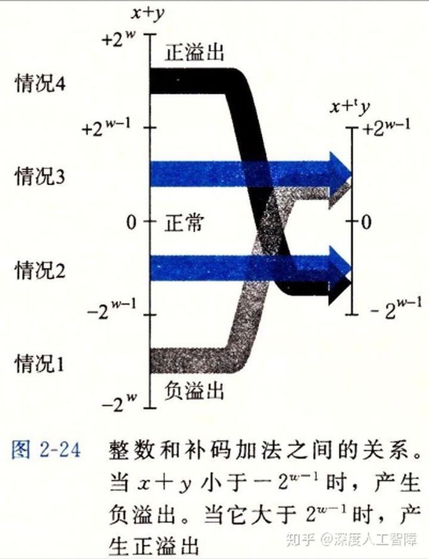

- **判断溢出方法：**当x>0, y>0，计算结果小于等于0时，发生了正溢出；当x<0, y<0，计算结果大于等于0时，发生了负溢出。
- **加法逆元：**也是利用溢出的原理来计算补码的加法逆元。**注意：**部分补码的加法逆元和数学上的相反数是相同的。

根据补码的取值范围$[-2^{w-1},2^{w-1})$，我们可以分成两种情况讨论：

1. 当$x=TMin_w$时，对应的位向量为$[1,0,0,...,0]_w$两个$TMin_w$相加后，位向量为$[1,0,0,...,0]_{w+1}$，发生了溢出，所以会将最高有效位截断，就得到了结果0。所以$TMin_w$的加法逆元就是它本身。（与相反数不同)
2. 当$x>TMin_w$时，可以对位向量取反再加1就求出了对应的加法逆元。这部分的加法逆元与相反数值相同。

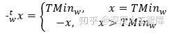

### 3.3 无符号乘法

对于两个w位的无符号数相乘，会得到2w位的数，计算机会截断得到低w位作为计算结果。我们定义$*^u_w$表示w位的无符号数乘法符号，对于$0\le x,y\le UMax_w$，最终计算的值为：
$$
x*^u_wy=(x*y)mod\ 2^w
$$
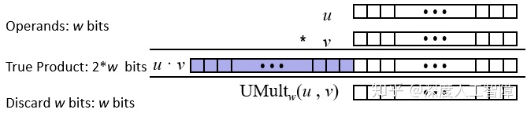

### 3.4 补码乘法

对于两个w位的补码相乘，也是得到2w位的数，同样截断低w位作为结果，在计算时使用对 ![[公式]](https://www.zhihu.com/equation?tex=2%5Ew)取余进行截断，但是取余后会得到无符号数（计算结果为正)，此时就要将无符号数转化为对应的补码。我们定义$*^t_w$表示w位的补码乘法符号，对于$TMin_w\le x,y \le TMax_w$，最终计算的值为：
$$
x*^t_wy=U2T_w((x*y)mod\ 2^w)
$$
可以发现，当两个比较大的正数相乘时，由于$U2T_w$函数，所以会得到负的结果，发生了溢出。

我们可以证明$x*^t_wy$和$x*^u_wy$的位向量是相同的。

**问题：**对于长度为w的两个位向量$\overline x$和$\overline y$，使用补码编码对应的值为x和y，使用无符号编码对应的值为x'和y'，我们想要证明$T2B_w(x*^t_wy)=U2B(x'*^u_wy')$。

**证明：**

首先，$x'=x_{w-1}2^w+x$和$y'=y_{w-1}2^w+y$，则

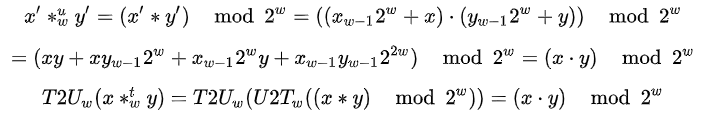

所以，$T2U_w(x*^t_wy)=x'*^u_wy$, 所以$U2B_w(T2U(x*^t_wy))=T2B_w(x*^t_wy)=U2B_w(x'*^u_wy')$ 

所以使用这种方式计算可以保证补码乘法和无符号乘法计算出来的位向量相同。

## 4. 计算机实现乘除法

计算机中支持各种整数运算，比如加法、减法、位级运算和移位。而大多数机器中，整数乘法指令和整数除法指令都很慢，通常需要几十个时钟周期，所以计算机通常会用移位和加减法的组合来代替乘除法。

### 4.1 计算机实现乘法

首先我们讨论乘上2幂的特殊情况，然后将其扩展到乘上任意数。

### 4.1.1 乘上2幂

对于w位的无符号数$[x_{w},x_{w-1},...,x_0]$，如果我们左移k位，可得到的值为
$$
\begin{split}
([x_w, x_{w-1},...,x_0]<<k)mod\ 2^w&=[x_w,x_{w-1},...,x_0,0,0,...,0]mod\ 2^w \\
&=(\sum_{i=0}^{w-1}x_i2^{i+k})mod\ 2^w \\
&=((\sum_{i=0}^{w-1}x_i2^i)\cdot 2^k)mod\ 2^w = (x\cdot 2^k)mod\ 2^w=x*^u_w 2^k
\end{split}
$$
所以如果在w位表示范围内，左移k位相当于乘上了$2^k$，如果超过了表示范围，就会发生溢出。

而补码计算结果的位向量和无符号数计算结果的位向量相同，所以对于补码x左移k位，得到的结果是$x*^t_w2^k$。

由此，乘上2幂，只要左移幂次就行。

### 4.1.2 乘上任意数

对于任意整数K，我们可以先对计算关于2幂次的展开，比如$14=2^3+2^2+2^1$，则$x*14=x*2^3+x*2^2+x*2^1=(x<<3)+(x<<2)+(x<<1)$ 。由此就将一个乘法运算转化为了3个移位操作和2个加法操作。更进一步我们可以得到$14=2^4-2^1$，所以$x*14=(x<<4)-(x<<1)$，转化为了2个移位操作和1个减法操作。

综上所述，想要乘上K，我们可以得到它的位向量，然后根据位向量进行移位并相加，就能得到乘法运算结果。

大多数编译器只有在需要少量移位、加法和减法时才用这种优化，不然就直接使用一个乘法操作了。

### 4.2 计算机实现除法

通乘法相同，我们可以通过右移操作来除以2的幂。对于无符号数，我们使用逻辑右移来除以2的幂，而对于补码，我们要用算术右移来保持符号不变。

在除法运算中，比较麻烦的是出现除不尽的情况，此时就需要舍入，我们希望计算结果都是向0舍入的。

**无符号数：**我们定义x的位模式为$[x_{w-1},x_{w-2},...,x_0]$，x'的位模式为$[x_{w-1},x_{w-2},...,x_k]$，x''的位模式为$[x_{k-1},x_{k-2},...,x_0]$，所以$x=(x'<<k)+x''=x'*2^k+x''$，所以$x>>k=x/2^k=(x'*2^k+x'')/2^k=x'+x''/2^k$，因为x''的取值范围为$[0,2^k)$，所以$0\le x''/2^k \lt 1$，所以对x右移k位得到的x'是向0取整的结果。

**补码：**我们定义补码x的位模式为$[x_{w-1},x_{w-2},...,x_0]$，高八位补码x'的位模式为$[x_{w-1},x_{w-2},...,x_k]$，无符号数x''的位模式为$[x_{k-1},...,x_0]$，同理$x=x'*2^k+x''$。如果对x进行算术右移k位，得到$[x_{w-1},...,x_{w-1},x_{w-2},...,x_k]$，通过2.5.1小节的结论可知，它等价于x'。所以对x进行算数右移k位，得到结果为x'，因为$0\le x''/2^k \lt 1$，所以当补码大于0时，也是向0舍入，满足预期。但是**当补码小于0时，结果是远离0进行取整的，不符合预期**。

所以对于补码的算术右移，我们需要先加上一个偏移量，使其满足向0舍入的预期。

**偏移量：**

首先需要一个公式$\lceil x/y\rceil=\lfloor(x+y-1)/y \rfloor$

**证明：**令$x=qy+r$，且$0\le r\lt y$则$\lfloor(x+y-1)/y \rfloor=\lfloor(qy+r+y-1)/y\rfloor=q+\lfloor (r+y-1)\rfloor/y$。当r=0时，结果为q，当r>0时，结果为q+1。

我们可以直接将y替换成$2^k$，则偏移量为$2^k-1=(1<<k)-1$，所以对于补码小于0时，我们可以加上该偏移量保证其向0取整。

所以C中使用算数右移的表达式为：

```c
(x<0 ? x+(1<<k)-1 : x) >> k
```

保证补码在正数和负数下都是向0取整的。

可惜除法无法像乘法那样对任意数进行扩展。

------

如果使用无符号数，可能会出现一些比较诡异的异常。

**例子1：**

```text
for(unsigned i=n-1;i>=0;i--){
    //loop
}
```

当运行到i=0时，对应的位模式为全零，这时候再减一，得到的是全一，对应到无符号编码得到的就是$UMax_w$，所以i不会小于0，所以循环不会停止，或者出现索引错误。

**例子2：**

```text
#define DELTA sizeof(int)
int i;
for (i = CNT; i-DELTA >= 0; i-= DELTA)
```

这里因为sizeof函数返回的是size_t类型的数，它是unsigned long的，所以还是会出现上面的问题。

比较好的代码模式是：

```text
unsigned i;
for (i = cnt-2; i < cnt; i--)
  a[i] += a[i+1];
```

当出现溢出时，刚好可以停止。更好的是使用`size_t`，因为`unsigned`是32位的，而`size_t`定义为字长，是64位的。

这里如果cnt是有符号数，并且小于0时，i就会会变成很大的正值。

**PPT中的作业：**

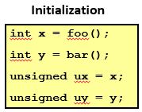

- `x<0`推出`((x*2)<0)`：如果x是$TMin_w$，则左移一位会变成0，所以错误。
- `ux>=0`： 因为它是无符号数，所以正确。
- `x&7==7`推出`(x<<30)<0`：可以将第一个7看成是模向量，所以通过与运算可以知道x低3位为`111`，左移30位后，因为int为32位，所以会溢出一位，得到最高两位为1，其余为0，所以结果小于0。 所以正确。
- `ux>-1`： 因为`ux`是无符号数，而`-1`是有符号数，所以`-1`首先会转换成无符号数，也就变得特别大，所以这个错误。
- `x>y`推出`-x<-y`：如果y为$TMin_w$，则其相反数还是$TMin_w$，只要x不是$TMin_w$就不成立，所以错误。
- `x*x>=0`：根据计算公式，知道还有一个$U2T_w$函数，如果值过大发生溢出后，就小于0了。所以错误。
- `x>0 && y>0`推出`x+y>0`： 如果发生正溢出就不符合，所以错误。
- `x>=0`推出`-x<=0`：正确。
- `x<=0`推出`-x>=0`：如果x为$TMin_w$，则其相反数还是$TMin_w$，还是小于0。所以错误。
- `(x|-x)>>31==-1`： 如果x为0就是错误的。
- `ux>>3==ux/8`：正确。
- `x>>3==x/8`：如果x小于0，它是朝着远离0舍入的，与`x/8`朝着0舍入不同。错误。
- `x&(x-1)!=0`：当x的位向量中只有一个为1，则结果为0。错误。

**思路：**

1. 溢出时会发生值的跳变。
2. 对于有符号数，考虑$TMin_w$的相反数还是自己本身；小于零的移位操作是远离0进行舍入的。
3. 如果无符号数和有符号数同时出现，会自动将有符号数转化为无符号数，考虑此时是否发生值的跳变。