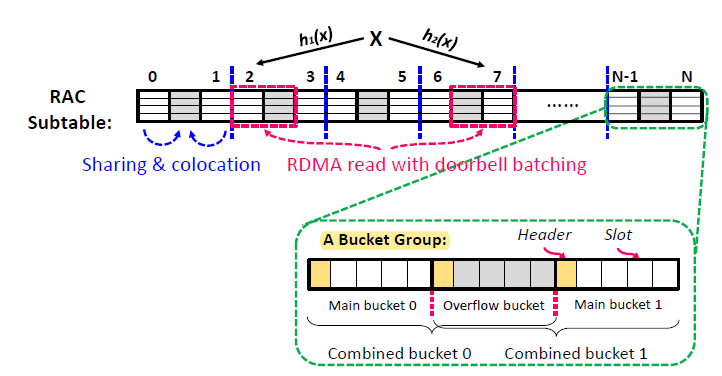
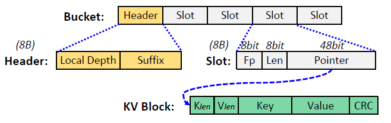
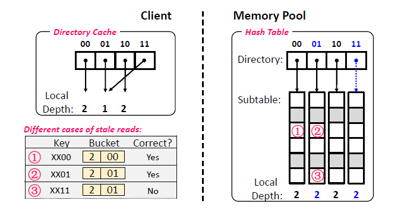

### RDMA

RDMA技术就是不用传统TCP/IP协议的技术，做到这一点就是靠使用特殊的RDMA enabled NIC网卡，简称**RNIC**。有了这种网卡，就会给应用程序提供一个专有的Verbs Interface，相当于用户程序调用这些API接口就可以绕开传统网络协议，使得网卡和用户内存空间的数据直接打交道，就节省了网络传输时数据还必须通过各种网络协议进行封装、解析的时间开销。

RDMA发送的RDMA信息包含虚拟地址、内存钥匙、数据，目标NIC确认内存钥匙，直接将数据写入应用缓存中。

RDMA中发送的一条消息被称为**WQE**(work queue element)，其中一个**WQ**(work queue)又被称为**Channel**，分为两个单向通道**QP**(Queue pair)，pair的意思就是包含发送端**SQ**(send queue)和接受端**RQ**(receive queue)。（其实WQ就是SQ或者RQ的别称，在发送方WQ就是SQ，在接收方WQ就是RQ）

RDMA中每一次操作被称为**WR**(work request)。

RDMA中还有一个**CQ**(complete queue)，用于通知WQ上某个WQE已经完成，这个CQ只会在send/receive操作中有用，在write/read这种单边操作中不会被用到。

> 下面的RDMA写得不严谨，看个大概意思就行

RDMA单边操作流程——write/read（以A write B为例）：

1. AB建立起Channel（连接）；
2. B把**待存储的内存**buffer注册到网卡中，产生key，随后B将这个房间的"房间号"vaddr和"房卡"key发送给A，并且B会在自己WQ中注册一个WR用于接收A返回的状态（不会产生WQE）；
3. A收到"B的房间号"和"房卡"后，就将自己的"A的房间号"一起封装成一个**write请求**再返回给B，意思是"请把数据从A的房间发送到B的房间，这是B房间的房卡"，于是这样就开始**从A写数据到B**；
4. 当发送完毕后，会向B的WR发送状态信息；

RDMA单边操作流程——read（以A read B为例）：

1. AB建立起Channel（连接）；
2. B把**装有数据的内存**buffer注册到网卡中，产生key，随后B将这个房间的"房间号"vaddr和"房卡"key发送给A，并且B会在自己WQ中注册一个WR用于接收A返回的状态（不会产生WQE）；
3. A收到"B的房间号"和"房卡"后，就将自己的"A的房间号"一起封装成一个**read请求**再返回给B，意思是"请把数据从B的房间发送到A的房间，这是B房间的房卡"，于是这样就开始**从B写数据到A**；
4. 当发送完毕后，会向B的WR发送状态信息；

RDMA双边操作流程——send/receive(以A send B为例)：

1. AB建立起连接
2. AB分别在自己的WQ中注册WQE，A的WQE中buffer指向要发送的数据内存地址，B的WQE中的buffer指向要存储数据的内存；

3. A的RNIC异步调度轮到A的WQE，解析到这是一个SEND消息，从Buffer中直接向B发出数据。数据流到达B的RNIC后，B的WQE被消耗，并把数据直接存储到WQE指向的存储位置。

4.  AB通信完成后，A的CQ中会产生一个完成消息CQE表示发送完成。与此同时，B的CQ中也会产生一个完成消息表示接收完成。每个WQ中WQE的处理完成都会产生一个CQE。

### 论文

传统的hash技术计算量大。hash技术常被用在分布式系统中用来快速地查找数据。

这篇论文提出了一种用在**分布内存系统**中一种高效的indexing技术。文中称之为RACE hashing技术。

RACE技术使用RDMA单边操作进行远程index计算，不占用memory pool的计算资源。

RACE技术使用一种无锁并发控制机制，来使得多用户可以同时操控memory pool的index。

RACE技术使用一种可扩展的远程resizing技术来resize hash table，这种技术可以减少额外RDMA访问，并且使得hash table在resizing的同时用户仍然可以进行访问。

RACE技术在YCSB hybrid测试集中表现优异。

RACE技术用到了RDMA中的READ, WRITE, ATOMIC verbs.

RDMA ATOMIC接口中包含了一些原子操作，例如RDMA CAS（compare and swap）和 RDMA FAA（fetch and add）

Memory disaggregation技术就是把一群主机的计算硬件资源和内存分离，硬件有硬件池，内存有内存池，增大了资源使用率和容错率。

计算池（Compute blades）中跑应用程序，只需要很少点内存作为本地cache，程序需要的其它内存空间就在内存池里。

相反，内存池中存储应用程序的数据，只额外需要很少的计算资源负责进行管理工作即可。（冯诺依曼机的思想：**存算分离**）

计算池中的程序想要内存，靠的就是RDMA远程内存服务。

内存解耦系统中，计算池就是Client端，内存池就是Server端。

内存解耦系统中，hash一直是性能的瓶颈，基于RDMA的hash技术被称为RDMA-search-friendly(**RSF**)，例如FaRM Hopscotch Hashing（跳房子哈希）、Pilaf cuckoo hashing（布谷鸟散列）、DrTM cluster hashing等技术。

传统的RSF技术，在执行数据搜索的操作时使用RDMA READ操作，从而不需要远程主机的CPU资源。但是传统RSF技术在执行数据的写入insert、删除del、更新update（**IDU** requests）时仍然需要远程主机的CPU资源（即内存池的CPU资源），这就导致无法用在现在的内存解耦系统中。

如果将传统的RSF技术中的IDU操作全改为使用RDMA WRITE和ATOMIC中的函数进行模拟的话，也会导致性能大幅度下降，因为网络延迟（networt round-trips）和并发访问冲突。

现有内存解耦系统中RSF的问题：

1. 发生哈希碰撞时会导致很多 read write操作（目的是为了给新数据make room），而每个操作都需要耗一个network round-trip的时间
2. 使用锁机制避免并发访问冲突。在内存解耦系统中获取lock需要RDMA ATOMIC中的函数，但是每次都要毫秒级别的延迟，特别是当大量发生数据移动时（每次移动前都要获取数据对应的锁）锁占用的延迟时间就更明显。
3. 当哈希表中的key都被占满时，就需要扩大哈希表，传统的RSF中的index扩大需要move全部的key-value items到新的哈希表。而如果采用可扩展的哈希表技术就可以减少move次数，并且如何让哈希表在扩大时用户依然能够并发访问也是个问题。

**总结**：

RACE技术就是一个专门为内存解耦系统设计的index技术，哈希表分为两层（ **RAC subtable structure**），第一层是directory，第二层是subtable。其中subtable中所有操作都是可以用one-sided RDMA verbs进行的且是O(N)的时间复杂度在最坏的情况。作者说IDU requests不会产生额外的movement。

RACE结构中整个index都是存在memory pool中，compute pool中的客户端缓存directory。

RACE结构中第一层directory是被每个客户端都缓存在本地中，当这个缓存过期时，即客户使用过期的directory进行访问时RACE技术依旧可以保证返回正确的结果，并且这个技术可以让客户在哈希表正在更新的时候也可以访问。

RACE采用无锁并发算法，去掉了传统RSF中因为锁而造成的大量性能损失。

两种hash table resize的策略：

**full-table resizing**，这个就是当hash表满了后，另外新建一个更大的hash表，并将旧表中的key-value item全部搬运到新hash表中即可。

**extendible resizing**，这个就是两层结构``directory - subtable``，例如8位key值，一开始只用1位值进行搜索，即``0``和``1``，当``1``表满了后就进行分裂，分裂成``01``和``11``，此时原来的``0``表被``00``和``10``共同指向。

**extendible resizing中的GD和LD**：GD是global depth，即当前hash表用key值的后GD位作为key，LD是local depth，即某个子项实际用key值的后LD位作为key。例如上面的例子，当hash表实际扩展到2位后，这时的GD=2，但是``0``仍然被``00``和``10``共同指向，因此``0``表的LD=1.

extendible resizing的问题：1. 比其它hash表多一次access次数，即多一次访问directory的次数，因此RACE技术选择将directory缓存在计算池中的；2. 在进行resizing时如何保障其它用户的访问。

**解决问题一**：现有RSF结构的IDU操作非常消耗性能

解决方法：创新的Subtable结构（**注意**：directory上面就是记录一个key值应该去找哪个combined bucket，因此subtable就可以看做是combined bucket）

1. 组相联：每个bucket其实有多个slots，即1个bucket可以存多个key-value items，类似组相联。
2. 两个hash函数：来一个请求就同时调用h1和h2两个函数进行计算key值，并且通过优化技术doorbell batching进行并行优化，使得可以在一个RTT时间内就获取到两个计算出的key值对应的combined bucket。（而非像之前的Cluster Hash那样由于hash冲突导致多个bucket都是list链表相连，因此必须等待上一个bucket获取到了才能获取下一个，这样就获取两个bucket就必须两个RTT时间）
3. Oveflow区域：在subtable中，1个bucket group由3个bucket组成，然后只有头和尾2个bucket是会参与hash的（main bucket），中间的1个bucket作为头尾两个bucket的overflow存储区域（overflow bucket）。且1个main bukcet和其对应的overflow bucket合起来被称为combined bucket。

subtable这种结构带来的好处：

1. IDU-friendly：==论文中说，IDU操作只会涉及到两个combined bucket，而不像布谷鸟哈希、跳房子哈希、Cluster哈希那样，涉及到驱逐旧item或者link新bucket的操作。==（暂时没看懂）
2. Search-friendly：这种结构使得在 一个RDMA READ操作 / 一个RTT时间 内就可以获取到对应的两个combined bucket。
3. 高利用率：测试中表明subtable（7路组相联的情况）的load factor为0.9。

**解决问题二**：传统index采用Lock解决并发冲突，并不适合内存耦合系统，每次锁操作都是ms级

解决方法：一种无锁的并发控制算法，除了失败的插入操作，其它操作都可以做到不需要锁。失败的插入操作会导致hash表的resize，这时才会去获取一个resizing lock。（防止重复resize）

1. bucket结构如下图：

Header被用于下面将要介绍的hash表resize算法中。

Slot就代表1个key-value item。一个Slot的大小8B，刚好是RDMA ATOMIC可操作内存的最大长度。

8bit的FP（fingerprint）就是由key值进一步hash得到。论文中说8bit长度足够让 ``fp相同`` 这种事情的概率足够小。

8bit的Len是一个KV block的长度，以64B为单位，因此一个KV block的最大长度就是2^8 * 64B=16KB。满足绝大情况的使用。如果有超过16KB的key-value item，则会让超出的部分另外组成一个block并link到这第一个block上。

**注意**：所谓无锁算法，其实就是用了RDMA ATOMIC中的CAS（compare and swap）和FAA实现的。

2. Lock-free Insertion:

要插入新的key-value item，首先会去读取key对应的两个combined block，同时会将KV block在内存池中创建好；之后再去这两个combined bucket中找到一个空的slot（如果找不到空的slot就会触发下面将要介绍的 hash表resize），如果找到了空slot，再调用**RDMA CAS**往这个slot填写数据。

从论文中的意思来看，一对combined bucket中不能有两个key完全相同的key-value item；且发生key相同的情况只可能在并发的时候（可能是因为key值与时间有关，因此只有时间非常接近的时候key会发生相同的情况）

这里的解决方案是：插入完后Client会再花一个RTT的时间去再读一次两个combined bucket，通过检查FP来检测是否有两个key相同的item。如果有key相同，则会只保留编号较小的bucket中编号较小的那个slot为valid，另外一个就被remove。

3. Lock-free deletion

先调用search操作找到target key，然后就是调用RDMA CAS将对应slot清0即可。当slot被清空后，其对应的KV block的清空既可以由Client清空，也可以交给RNIC网卡自动执行这一操作。

4. Lock-free update

先调用search操作找到target key，同时将新的KV block在内存池中创建好；然后调用RDMA CAS将对应的slot中的point修改为指向新的KV block。最后旧的KV block可以在后台由Client清空。

5. Lock-free search

先读取到两个combined buckets，然后根据fingerprint找到slot，然后读取KV block，接着对比key值是否完全相同，key值完全相同了才能读取KV block中的value。

search函数返回key-value中的value。

一致性的保证：

假如一个用户正在读取一个数据，已经拿到point但是还未读取KV block（读取数据并不是ATOMIC的，且本机制中没有锁），因此如果这时KV block被删除则会因为KV block中的数据全0（包括klen、vlen、key）此时就能通过这些值的mismatched而发现。

更极端的，假设另一个用户往这个区域写了一个klen、vlen、key都完全相同，但是value不同的数据，则在用户写入并未完成时，数据是broken的，因此最后的CRC校验会不通过。即：**读写一致性靠klen、vlen、key、CRC这些共同保证**。

其他情况，例如RDMA CAS操作有时候会失败，原因是此时另一个用户对相同的slot率先调用RDMA CAS。因此这种情况的解决办法就是RACE系统会重新search一遍slot，然后再重新执行相应操作。

**解决问题三**：1.如何在resize中减少item被move的次数，同时在directory过期（hash表resize）后用户依然能访问到正确的数据。2.hash表resizing时如何让其他用户继续访问。

**解决问题三-1**：

hash表更新之前的解决方法：

1. 触发resize的那个client会给其它所有client发送相应的广播信息通知他们cache的directory过期了，并且直到收到所有其它client发回的ack后，此client才会真正开始更新hash表。

2. hash表更新后，关闭和所有的client的连接，这样所有client都会重新连接服务器，因此他们会重新获取cache，也就是最新的directory。

对此，作者提出了全新的方法SRCD（stale-read client directory）。

SRCD就是靠之前bucket中的LD和Suffix进行判断。假设旧的directory如上面左边的图，新的directory如右边图。用户根据旧的directory来获取bucket，根据获取到的bucket分为三种情况：

1. LD和Suffix都正确，则代表此时hash表并未变化，因此可以获取到正确的key-value item；
2. LD不正确，Suffix正确，比如用户根据key xx01获取bucket，旧dirctory显示LD为1，结果得到的bucket中显示LD为2，但是Suffix依然正确，此时依然能够得到正确的key-value item；
3. LD不正确，Suffix不正确，比如用户根据key 0x11获取bucket，结果得到LD=2，Suffix=01的bucket，则代表此时这个bucket中的数据key的后2位全是01，因此想获得的数据不在这里。此时RACE系统才会向内存池请求最新的directory并重新进行search的操作；

**解决问题三-2**：其实也是靠RDMA ATOMIC解决resize和request并发的问题

首先规定directory在memory pool的位置不能改变，这样当客户端访问失败时知道新的table还是在那里。且memory pool在一开始就为directory预留了足够的连续物理内存，分为used和unused，每个Client缓存的只是used的部分。

resize的过程就是：

1. 锁住directory的resize权限，即**其他用户**依然可以IDU操作，但是insert操作如果失败则会被阻塞住（因为失败的insert就是一开始触发resize的操作）。
2. 拓建subtable（初始化subtable中的新bucket的header部分，并在directory新部分中写入指向新bucket的指针）。

3. 进行item的move操作：先将旧的bucket的header进行修改；再将所有要移动的item写入到新的bucket中；再将这些item从旧的bucket中删除。

在这过程中：

1. 如果有其他客户端进行search，如果发现LD和suffix都不对，则会更新directory并重新search。

2. 如果有其他客户端进行insert，

   如果insert成功，insert操作完毕后会进行再次读取bucket，检查bucket中是否有重复key的item，这一步骤同时会检查bucket的LD和Suffix，如果都不匹配则会将新插入的item删除并插入到新的bucket中。

   如果insert失败，则会触发新的resize，因此会被阻塞住直到前一个resize完成。

3. 如果有其他客户端进行delete/update，

   如果LD和Suffix都不匹配，则等待至resize结束再进行操作。

   如果Suffix匹配了，则有可能是因为resize还没来得及更改这个bucket的header所造成的假象，此时会尝试进行delete/update操作：

   1. 如果执行成功，则之后resize进行move item的最后步骤（删除旧item）这一步会失败，因此进行resize的客户端会负责将move item的第二步骤在新bucket的item删除。
   2. 如果执行失败，则代表resize已经将item移到了新bucket中，此时客户端会在新的directory中重新尝试进行delete/update操作。

看到4.1