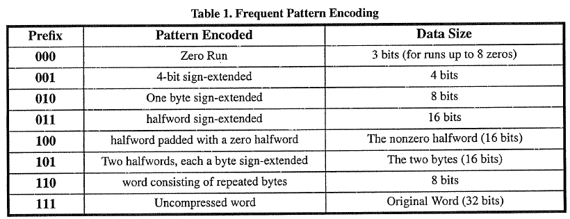
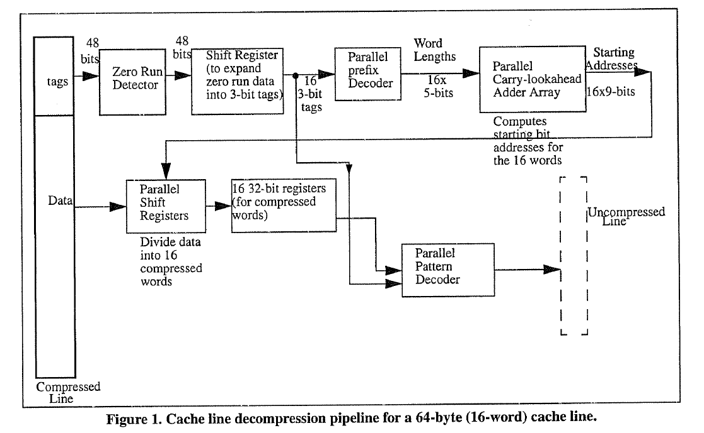
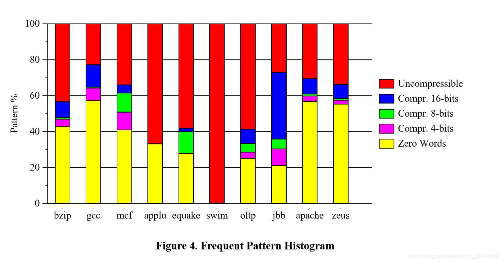

## Abstract

之前的压缩算法主要是dictionary-based，这类算法会根据要压缩的数据首先建立一个字典然后再根据字典里的每个entry来对数据进行encode。这种算法对压缩大数据block很有效，但是对于Cache line进行压缩则需要对每个Cache line建立字典(per-line)，这就会造成大量的时间开销。对于Cache line这种小数据，significance-based压缩算法才是合适的。

文中提出的FPC就是significance-based，可以针对每个cache line进行word-by-word的压缩。文中是针对L2 cache的压缩，L1 cache并没有压缩。FPC可以提供和其它那些更复杂的压缩算法相当的压缩比，同时cache 命中的延迟比它们更低。

## Introduction

之前的**cache**或**内存**压缩算法都是**硬件**实现的dictionary-based算法(例如LZ77算法)，这种字典压缩算法一般是为每个block维持个字典，然后再对block中的每个word(或byte)进行编码压缩，对于那些没有在字典中的数据，则会在其前面加前缀(以表明后面跟着的是raw data，类似转义符那种)。

- BRCL算法(Block-Referential Compression with Lookahead)用在IBM MXT的内存压缩中，BRCL靠其page足够大以获取高的压缩比。因此BRCL算法不适合用在cache line中。

- X-Match算法允许压缩更多数据同时使用一个更小的字典，因为它允许数据**部分匹配**字典中的entry。

- FVC算法(Frequent-Value Cache)是一种针对Cache压缩的算法，其针对整个cache只使用一个字典。然而FVC算法的字典很大，因此其解压延迟很高。

Significance-based算法一般是基于观察一些数据只有几位是significant的，因此可以只存储这些significant位上的数据，例如8-bit的数据通过符号扩展(SE)成为32-bit，则前24-bit都是可以被压缩的。同样地，Significance-based的算法不需要建立字典，因此压缩和解压缩的时间非常快。但是Significance-based的算法的缺点就是对于比较大的数据其压缩效果就不太好，compressibility较差。

本文的FPC算法就是word-by-word进行压缩(即每4字节进行压缩)，检测每个4字节数据看能否以更简短的形式去表达4字节数据，在压缩后的数据前有3-bit的标志位代表这是哪种模式的4字节数据。

## Frequent Pattern Compression

FPC对cache line按照32位的字进行压缩，例如64B的cache line由16个word组成。

每个压缩后的32bit就由"3bit前缀 + data size"组成。

作者的设计中，每个cache line被压缩后的数据将存储为1到8个segments(每个segment为8字节)，也就是说一个64字节的cache line最小可以变为8字节。如果cache line被压缩后的大小不是8字节的整数倍，则多的部分将被0填充。

## Compression and Decompression

整体架构上L1 Cache为了速度快并不压缩，L2 cache才压缩。

### Compression

压缩发生在data writen back from L1 to L2。

Cache line compression可以用流水线进行，分为3个stage：

1. 检测pattern
2. 检测zero run的全0字节数 (由于data size为3，因此最多可表示8个全0字节)
3. 将该compressed word进行拼装 (同一个cache line的各个word被gather起来)

可以在L1和L2之间夹一个victim cache用于临时存放both compressed and uncompressed data用于缓解compression latency。

### Decompression

解压发生在L1 hit miss，需要读取L2的数据到L1中去。

Decompression的延迟对性能影响非常大，因为大部分测试程序的working set都比L1 Cache大，而解压耗时将会直接增加L2 cache hit latency。

Decompression比compression更慢，因为是必须线性地处理cache line里的每个word(处理完上一个word才知道下一个word的起始3-bit在哪)。

文中decompression被分为5个state的流水线(每个stage耗时为12 FO4 gate delays)：

从上图可以看到cache line的各个compressed word的前3bit的prefix都被集中存放起来，因此有tags区域的16x3=48bit。

这些3bit的prefix送到**parallel prefix decoder**中去计算每个compressed word的data段的长度（因为data size最长为16，因此作者用5bit存放长度值，因此图中写了16x5bit）。

然后再在**parallel carry-lookahead adder array**中去计算每个compressed word的data段的起始位置。

在**parallel shift registers**中将data段按照计算出的各个长度值进行切分并分别装填到16个32位寄存器中去。

最后在**paralle pattern decoder**中进行解压操作还原为最初的cache line。

下图是各个测试程序中各种pattern的word所占比例：

