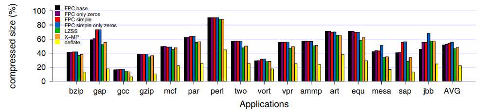
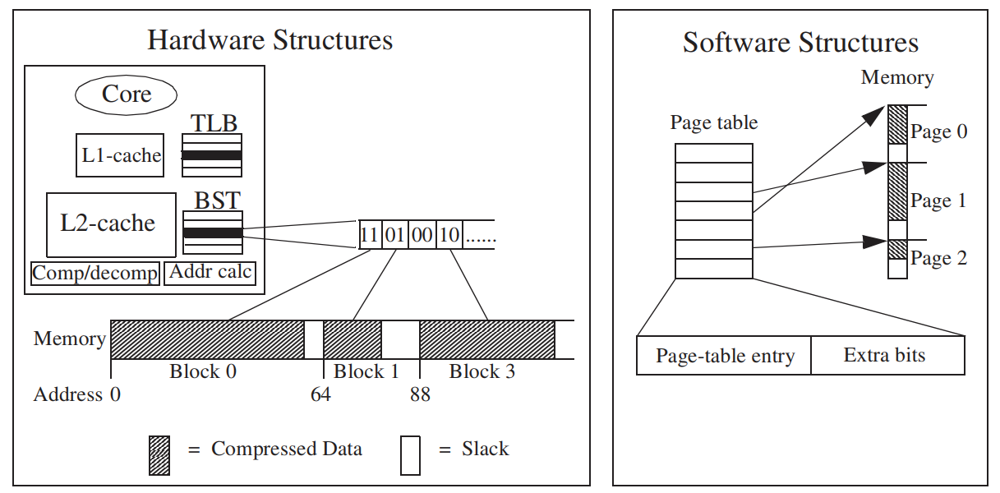

## Compressibility of main memory

### Compressibility with zero-aware algorithms

从之前的结果来看，全1的数据(即符号扩展后的负数)仍不是很多，因此FPC中很多的pattern仍然不太常见。

作者另外测试了三套简单版FPC，并和已有的算法(架构) X-MatchPro、LZSS进行比较，都是对64字节大小的block进行压缩，得到其在不同测试程序上的表现如下图：

最右边的deflate是采用了一种将LZ77和static Huffman coding结合的技术对整个image进行压缩后的结果，目的是得到一个压缩的下确界。（其它算法都是对64字节进行压缩后的结果）

> 后面假设还是使用的是原版的FPC压缩算法。

## Proposed memory compression

> 前面都是小打小闹，现在才正文开始

压缩发生在从disk到memory，从cache到memory这两个过程；

解压发生在从memroy到disk，从memory到cache这两个过程；

假设64B的block被压缩后的长度是固定的，有$t_0,t_1,...,t_n$，其中t0是全0的数据压缩后的大小，tn是未压缩的数据大小。

### An example system

> 以下内容的顺序并不和论文中的相同，是读了两遍后对作者设计的这个架构从底向上的总结

页大小8KB，子页(sub page)大小1KB，块(block)大小64B。

每个64B的block被压缩后的长度为固定的4种，$t_0,t_1,t_2,t_3$。因此需要用$log_24=2$位来记录每个块的大小型号。比如"00"就代表全0的block，"11"就代表uncompressed block。

同样地，子页的大小也为固定的4种，页的大小也为固定的4种。具体是怎么定子页和页的不同型号大小论文中没说，但知道页的大小还是按照$p$字节对齐的，例如512字节。

memory manager发生如下变化：

memory manager不再维持一个空闲内存池，而是为4种不同型号的内存片各自维持一个空闲内存池。（即由1个由空闲page组成的内存池，变为了，4个由不同型号大小空闲内存组成的内存池）

page table发生如下变化：

1. PTE中的页地址增长，因为内存中压缩后的页，其物理地址不再是按照页大小对齐的，于是就不能只存个页号了。（如果页的固定大小都是512字节对齐的，则还是可以少存9位的offset）
2. 每个PTE中多了274位用来存储size vector。

所谓274位的size vector就是：

1页中的块个数 = 8KB/64B = 128个

1页中的子页个数 = 8KB/1KB = 8个

因为每页、每子页、每块都得用2位记录型号，因此一共就是$(128+8+1)*2=274$位。

Cache中多了个BST结构：

BST中的entry数量和TLB中的entry数量相同，即TLB中存储的是最近访问的page的"vaddr - paddr"这种记录，在64位系统中一个TLB entry大概是16字节长。而BST中就是存储最近访问的page的size vector，即一个BST entry长34.25字节(274位)。（相当于BST就是TLB的拓展硬件结构，一起来给memory中的page table作cache用的）

BST中entry是在TLB miss发生时被TLB-miss handler负责装进BST中的，因此能保证BST和TLB的协调一致。

Overflow与Underflow：

1. Underflow

针对每个型号$t_k$都有个$h_k$(hysteresis)，假设当前size vector中记录的该block大小为$t_k$。则当该block的数据被应用程序修改后，新的数据压缩后的长度小于$t_k-h_k$时，就需要调整该block在实际内存中的空间了，具体操作是调小型号k到合适的型号，然后再在该block所在的sub page中进行move操作（不会影响其它sub page中的block，因此其它sub page中的数据仍然可被CPU访问，但访问当前sub page其它block的进程就会被阻塞(stall)了），就是把这个sub page中位于该block后面的block往前挪。并更新相应TLB、BST中的数据。

同样地，如果一个sub page小到一定程度后也需要重新调整型号，并且在一个page中移动后面各个sub page。

> 一些细节：
>
> 当TLB、BST中某个entry被驱逐到内存中时，才会更新内存中的page table。
>
> move操作是由DMA-engine负责进行，不需要CPU来进行。
>
> 因为需要调整型号的block一般都是 only happen on a write-back which is expected to happen when the block has not been used for a while，所以可以认为同一个sub page中后面的block也很久没被使用到，因此"move操作阻塞相同sub page中其他block的访问"不会造成太大的性能影响。

2. Overflow

Overflow和Underflow的过程差不多。Overflow没有$h_k$这种阈值，只要超过了$t_k$就需要重新调整。

当发生L1 Cache Miss时：

此时系统将会在L2 Cache中查找对应内存的缓存，与此同时，系统开始计算该内存在memory中的物理地址（为L2 Cache也Miss的情况作准备）。具体计算就是：

1. 在BST中或者BST未命中则去访问memory中的page table，找到对应page的size vector。
2. 计算要访问的block其前面所有的sub page的大小以及同sub page中前面所有的block的大小，将其求和即可得到该block相对于page首地址的偏移量offset。

作者说这里不是只采用加法，而是先统计出前面sub page各个型号的数量，再统计出其所在的sub page中前面block各个型号的数量，最后再乘以各个型号大小即可求得总长度，这样的延迟就和L2 Cache Miss的延迟相当。因此当L2 Cache Miss发生时，block在memory中的地址也刚好计算好，这样就不会对系统的性能造成影响。

