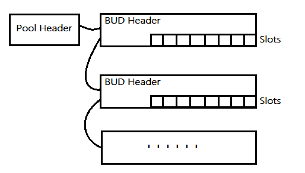
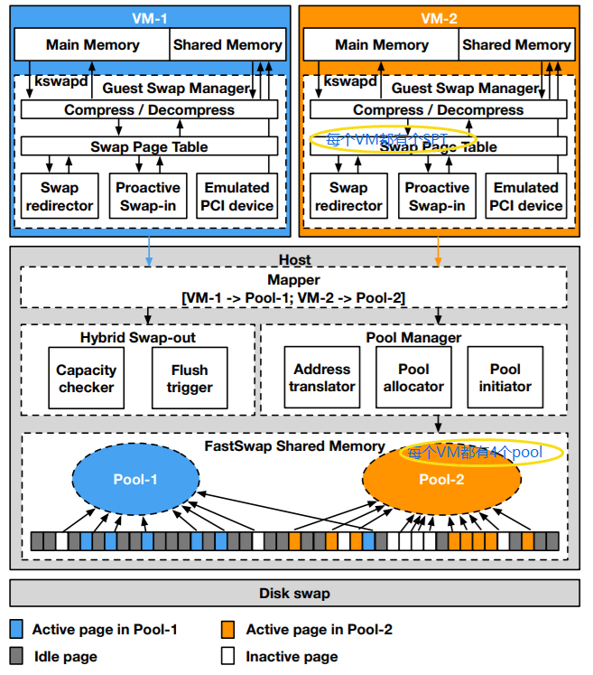
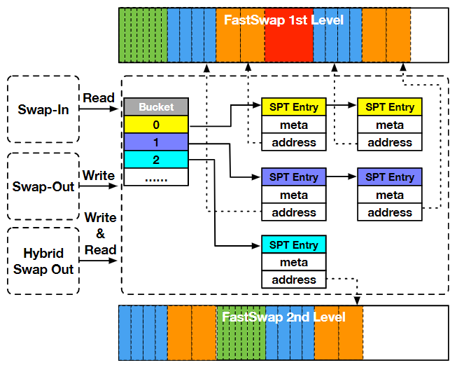
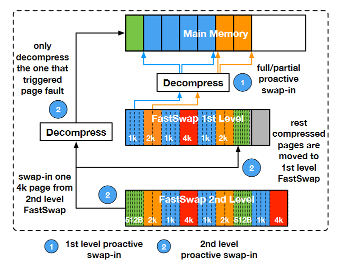

## 0 Abstract

许多大数据应用都需要大量内存，如果工作集大于了分配的物理内存则性能就会明显下降。现有的解决方案侧重于估算工作集的大小，以便准确分配内存，但缺乏效率和透明度。

FastSwap的三大特点：一是将用户的swap换出的内存页存在服务器的共享内存区域，一定程度上实现了单服务器的内存共享；二是设计了一种高效索引结构，使得用户可以高效地查找交换页；三是提供了两级交换策略，即当共享内存区域不足时再根据LRU机制选择其中的页换出到磁盘中去。

FastSwap开发在KVM操作系统中，针对VM虚拟机的。**有源码**。

## 1 Introduction

现有相关研究方案：“吹气球”方法来动态增加/减少一个VM的内存，缺点是这一操作(memory consolidation)太慢了，所需的延迟较高；提前预估工作集大小的方法不太可靠，特别是对于那些动态变化的工作负载来说。

- FastSwap在主机及其VM之间创建基于共享内存的交换区域，提供了一种高效、透明的内存共享机制。

- FastSwap中存储的是内存页的压缩页，根据压缩后的大小分为四类：512B、1KB、2KB、4KB。

- FastSwap采用高效索引结构提供快速查找对应内存页的服务。

- FastSwap采用两级swap-out策略(Hybrid Swap-out)。

  FastSwap采用两级swap-in策略(Two Level Proactive Swap-in)。

## 2 Design Overview

- Dynamic Shared Memory Management.

  就是把共享内存分层chunks，每个chunk动态分配给各个VM。

- Hybrid Swap-out.(后面细讲)

- Two Level Proactive Swap-in.(后面细讲)

- Multi-granularity Compression of Shared Memory.

  就是说压缩后的页分为四种大小，为每种大小的页设置一个Pool进行管理就算Multi-granularity。

**基于Ramdisk的内存swap**：就是将共享内存区域模拟成一个disk。缺点：内存页交换到这个ramdisk时需要走之前的那套disk IO的流程，因此用户-内核态上下文转换和用户-内核空间复制数据需要消耗大量的性能。

**基于Shared Memory的内存swap**：就是将共享内存直接映射到每个VM中的一段虚拟内存空间，被用作VM swap area。在系统启动时，共享内存中最开始的一部分page会被用来存储pools数据结构，每个VM都有自己的pools，负责管理各个VM换出的内存页的 “**the page offset in the VM swap area** and **the address in the corresponding shared memory pool**” 的映射关系。

## 3 Memory Swap Page Compression

在原型设计中，为每个VM设置有4个fastswap_pool，每个pool负责管理一种固定大小的压缩内存页的 “**虚拟地址到共享内存地址**” 映射关系。

每个pool实际就是个由各个共享内存page串起来的**单链表**，头结点是Pool Header(占一个page)，其余结点是BUD Header。Pool Header负责管理每个Pool，BUD Header管理自己的那一页。Pool Header中有两个指针，一个指向full page(每个slot都被占用)组成的list，一个指向free page(有free slot的page)组成的list。

例如一个物理页4KB，而某个池子负责管理512B大小的压缩页，则这个池子中每个BUD Header上面就有8个Slot，代表可以存8个512B大小的压缩页。每当BUD Header更新时就会移动到池子List的最前面，因此整个池子List呈现LRU结构。Slot中应该只是个指针，也就是BUD Header自身所在的位置并不是在那个page上。

- FastSwap Store操作

``swap_writepage()``，首先将内存页压缩，根据压缩后的大小选择最适合的Pool存放这个压缩页，具体操作就是去Pool Header中的free list中取得一个free slot的地址，然后将压缩写入到该slot中即可。并且会在压缩内存索引表中创建该压缩页的SPT_Entry。

- FastSwap Load操作

``swap_readpage()``。PTE中含有Swap Entry，可以用Swap Entry在**压缩内存索引表Swap Page Table(SPT)**中查找SPT Entry(SPTE)。在SPT Entry中就有压缩页的实际物理地址，然后就可以读取出压缩页进行解压就行，读取出压缩页后其所在的BUD Header会被放到Pool链表(LRU机制)的最前面（貌似不会清空Slot）。

- 压缩内存索引表

压缩内存索引表与Pool不是同一个东西，Pool是管理内存的，压缩内存索引表是用来快速查找压缩页所在物理地址的。

> Pool：每个VM有4个pool管理共享内存中的4种大小的压缩页。（就是**用来管理剩余空闲内存**的，按需分配）
>
> 压缩内存索引表SPT（其中的每个entry叫SPT）：是一种用**VM中的物理内存地址**来查询**已经swap-out的page**其所在的host物理地址的结构，**也是每个VM一个**（不信可见论文figure3）。每个SPT上还记录有该page的PTE所在的位置（如果是共享内存页，则一个SPT还对应多个PTE，这种情况下多个PTE的地址是存储在PTE store（下面介绍了PTE store是啥）中，SPT上只记录这多个地址数组的起始地址）。

压缩内存索引表采用Hash表结构，采用链接法处理哈希碰撞。

## 4 Hybrid Swap-out

就是说在共享内存不足时，将least recent swap-out pages换到第二级swap设备中去(LRU机制)。具体实现就是当共享内存为80%满时就将此时共享内存中的所有压缩页全flush（通过batch IO）到第二级swap设备中。

## 5 Two Level Proactive Batch Swap-in

就是说当用户要访问一个swapped-out page时，如果这个压缩页在第二级swap设备(disk)中，则Fastswap会将该压缩页所在的物理页上其它压缩页(swapped-out pages)也换回到共享内存区域(不解压)。而这个用户要访问的内存页则解压并传输回VM内存中。当然以上会涉及更改相关压缩页的SPT_Entry。

每个SPT_Entry都存储了压缩内存页对应的**PTE的地址**。当一些操作要更新PTE时（比如某个Swapped-out page重新回到了VM内存），就可以根据SPT_Entry直接找到PTE，而不用去查Page Table。具体当SPT对应多个PTE时，则4字节关于PTE的数据，第1字节是代表有多少个PTE对应这个内存页，后面3字节则是指向PTE store中first PTE的index。

> PTE store是在共享内存区域中预留出来记录每个压缩页的PTE地址的区域。
>
> 一个内存页是shared page的话就会有多个PTE。