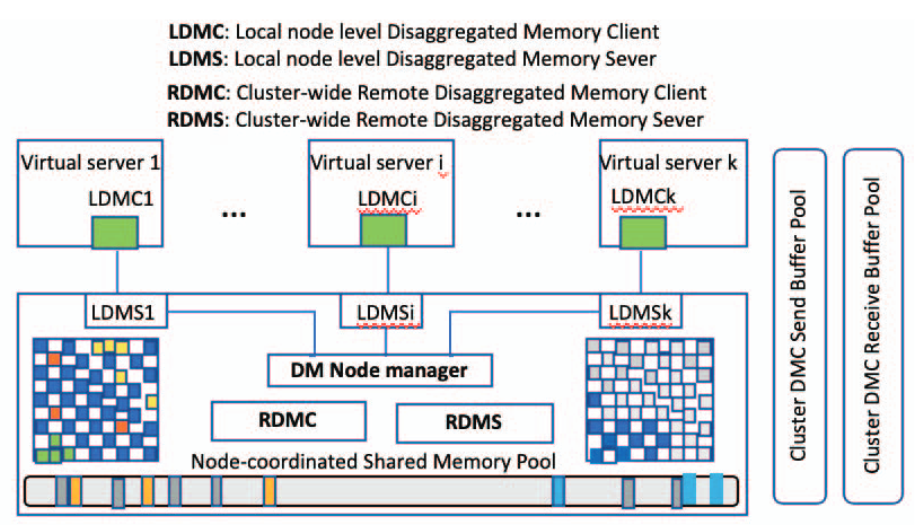

## 0 Abstract

New Research Challenges：

1. virtual server memory and node  level  memory  co-design 

2. local  memory  and  remote  memory  co-design.

## 1 Introduction

### Memory usage imbalance: opportunity and challenge.

1. 云系统通常为异构的工作负载服务。
2. 很多用户程序都是异构的data access pattern。
3. VM都是根据最坏情况来配置内存资源的。精确预估工作集大小是很困难的。

据报告，集群内存利用率严重失衡，在70%的运行时间内平均有30%的空闲内存，在分配的80%内存中，平均只有50%被使用。

传统架构下的云系统会出现大量的空闲内存，但是这些空闲内存也会随着时间波动，因此这也给内存解耦系统的设计带来挑战。

### Impact  of  memory  utilization  on  server  performance.

工作负载的工作集如果大于了实际内存，则会出现明显的性能下降。

## 2 Related Work

关于大型内存工作负载的研究主要分为三类：

1. 估计工作集大小，
2. 研究内存驻留数据库和KV缓存，
3. 增加有效内存容量。

### A. Estimation for Peak Usage Memory Allocation

这方向主要有两个困难：

1. 峰值内存使用受到太多因素影响，变化(variation)很大。
2. 用户进程经常超额、满额申请他们需要的内存，导致内存分配问题更加严重。

### B. Memory-resident databases and caching

内存驻留技术(Memory-resident)也是为了减少磁盘IO次数，也被视为处理器的辅助存储或者辅助缓存。

> 几种允许网卡直接向终端用户应用程序发送数据(绕过OS)的技术：
>
> 1. Intel DPDK
> 2. Open vSwitch
> 3. VMware的vNetwork
>
> 
>
> Accelio、NBDX是和RDMA差不多性质的，是有关远程访问(RPC)的技术。

### C. Increasing effective memory capacity

主要就是靠内存共享来增加有效内存。

由于RDMA传输数据比磁盘IO更快，于是最近产生一些利用RDMA技术的工作，例如利用远程内存来进行：KV缓存，页swap，RDD缓存等。

大部分工作仍缺少透明性(they  lack  of  desired  transparency  at  OS,  network  stack,  or application level)。

> InfiniSwap是利用RDMA技术的，VM和远程内存资源池之间的内存共享（remote memory sharing）。
>
> FastSwap没有用到RDMA技术，是相同主机上的VM之间的内存共享（host memory sharing）。

> Amazon处理一次网页请求，就要在内部巨量数据不同区域进行上百次的内部请求，因此每层磁盘IO延迟都会累积起来（导致最后的延迟非常高）。
>
> 因为每GB DRAM价格是非线性增长，且预估工作负载的工作集大小很困难，因此单纯地购买巨型内存是不现实的。

## 3 Memory Disaggregation: Characterization

### Node-level  v.s.  Cluster-level  Memory  Disaggregation.

Node-level的内存解耦就是指同一个服务器上不同虚拟机之间的内存共享。

Cluster-level的内存解耦就是指同一个集群中（多服务器）不同虚拟机之间的内存共享。

同一host上不同的虚拟机和不同host上的虚拟机，虚拟机中运行的应用来看都是独立的VM服务器，因此Node-level或者Cluster-level都可以被看做是利用远程内存。不同点是Node-level的远程内存速度是DRAM speed，而Cluster-level的远程内存是network IO speed（e. g. RDMA networks）。

### Full v.s. Partial Memory Disaggregation.

从技术上来说，完全内存解耦（完全不需要本地内存）还不现实，因为本地内存访问速度仍然比远程内存（网络IO）速度快得多。

## 4 Disaggregated Memory System

### System Design Objectives(目标)

就是说内存解耦系统要对应用、guest OS、middleware透明，即内存解耦系统中的VM可以直接运行未经修改的应用、guest OS、middleware。

### General System Architecture

假设N个VM，运行在有n个主机(node)的集群中。（N>n）

每个VM既是内存分享的提供者（LDMS），也是内存分享的需求者（LDMC）。每个主机(node)既是远程内存的提供者（RDMS），也是远程内存的需求者（RDMC）。

每个主机同意将自己的部分内存注册到RDMA网络中，这部分内存主要用作send buffer pool和receive buffer pool。

每个VM同意将自己所获得的物理内存的一部分拿出来共享，这部分内存可以被集群中其它VM使用。

当VM内存不足（遭遇大量page fault）时，LDMC会向LDMS发送请求，LDMS会首先检查自己的shared memory pool中有无足够内存，如果不够LDMS会向DM node manager请求更多共享内存（看本地其它LDMS中有无剩余共享内存），如果本地内存不足，则DM node manager会向RDMC交流，让RDMC与其它服务器请求远程内存共享。

在LDMS中为自己的VM维持一个disaggregated memory map，就是远程内存页索引表。

例如node A中有VM使用了node B的远程内存。VM写入这片内存时，会将数据写入到send buffer pool中，随后node A通过RDMA WRITE将数据写入到node B的receive buffer pool。VM读取这片内存时，会将一个data entry ID发送给自己的LDMS，LDMS在自己的disaggregated memory map中查找，发现这片数据在node B中，于是node A通过RDMA READ将数据读取到自己的receive buffer pool。

### Scalability Design Choices

The scalability challenge：就是说集群过大，导致每个VM需要维持的disaggregated memory map就会很大。

解决方案就是分组，将整个集群中的主机分组，每个组内进行内存共享。并且可以进一步发展成分层分组的树状组织，每个组可以通过选举算法选择出leader，这个leader再去和其它组进行交流。

### Supporting Fault Tolerance

- Local node or virtual server failure.

当VM或者本地host出故障时，内存解耦系统应该提供与不支持内存解耦系统的表现相同（相同的故障语义）

- Network connection, remote node or virtual server failure.

首先说使用去中心化的方式管理网络故障比较好。

将一份数据存储三份replica的方式可以提供可靠性。

将每次读写操作可以当做一次事务，由LDMS中维护的disaggregated memory map记录事务的结果来，保证数据一致性。

### Memory Balancing and Eviction Management

当node A执行一次远程write操作时，A中的DM node manager需要选择三个remote node来执行此操作。首先A的node manager会去和所在group(或者就是整个cluster)的leader获取可供选择的node名单。这里可以应用一些选择算法，例如random、round robin、weighted RR, power of two choices。

### Disaggregated Memory Registration and Eviction

每个主机host上的shared memory由每个VM分配的部分内存组成。并且需要提前分配一块内存区域(memory slabs)注册成memory region预留给RDMA。

Remote idle memory是被监控的，当其低到一定阈值时，会将其中存储的远程内存页驱逐到其它的远程主机上（以保证本主机的remote idle memory够用），并更新相关VM的disaggregated memory map。

一些Management算法：

1. 如果**集群中**需求远程内存的请求频繁，说明本地内存不足以服务本地VM，因此建议从RDMA的receive buffer pool中回收一些内存来给本地VM使用。
2. 如果**某个VM**需求远程内存的请求频繁，建议从本地shared memory 或者 RDMA的send buffer pool中回收一些内存给该VM（balloon more DRAM memory）。

### Connection and Consistency Management

- Connection Management

对于每个连接建立两种通道，一种RDMA通道用于维护网络连接和数据传输，一种“the  disaggregated  memory  system  channel ”用于和远程主机agent进行通信的通道。

- Consistency

对于每个VM维护一个disaggregated memory map。这个map既可以在本地内存也可以在远程内存（3个replica），还可以在二级存储设备（磁盘）中。

使用RDMA中的RC QP可以保证message的可靠性。

### Optimizations

几种优化措施。

- Memory Page Compression

  例如FastSwap

- Window based batch access to disaggregated memory.

> Similarly, we implement our disaggregated memory system  for  in-memory  swapping  in  FastSwap  [34-35].  By providing batching in both swapping out and swapping in, we show the performance  improvement of our disaggregated memory system compared with no batching optimization.

