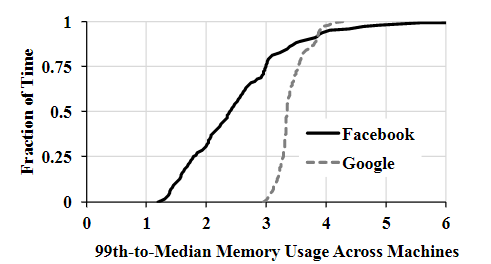

## 0 Abstract

InfiniSwap是一个远程内存分页系统。使用One-sided RDMA operations。

InfiniSwap提升大幅度性能，并且只增加了可忽略的CPU消耗，其它方案例如NBDX则需要大量CPU资源。

InfiniSwap对VM中的OS或APP透明。

## 1 Introduction

有两种方案解决“应用工作集大于实际分配的物理内存性能会大幅度下降”的问题，一是精确分配工作集大小的内存，二是增大每台虚拟机的内存。

精确分配工作集大小的内存很困难，因为一般应用程序会超额估计它们所需的内存。

增大每台虚拟机的内存就是指RDMA网络实现的内存解耦架构使这种解决方案成为可能。

InfiniSwap不是第一个远程内存分页系统，但是InfiniSwap不造成太多CPU资源消耗，且InfiniSwap的拓展性也更好。

InfiniSwap主要由分布在每台主机上的：a block device used as swap space 和 负责管理远程内存的daemon process组成。

InfiniSwap Block Device同步地写远程内存，异步地写disk。

InfiniSwap将一个VM的内存分为固定大小的块(slab)，并且将这些块存放在各个主机的远程内存中。

InfiniSwap采用“The power of two choices”的方式来搜索有足够空闲远程内存的主机。

InfiniSwap的所有操作通过RDMA实现。

InfiniSwap daemon会预分配各种大小的slabs，以此减少分配内存的性能消耗。并且该守护进程还会监控并主动驱逐部分slabs以尽量减少对本地应用程序的性能影响。也是采用“The power of two choices”的方式来选择并进行slabs的批量驱逐(batch eviction)，无需任何中心控制(central coordination)。

InfiniSwap比起NBDX速度要快，且不需要那么高的远程CPU资源消耗。

InfiniSwap可以从部分远程页被驱逐或者故障中恢复，且速度仍然比从disk恢复要快。

**InfiniSwap不能为CPU密集型工作负载（例如Spark和VoltDB）提供透明地内存解耦服务**。但是仍有一定作用，例如当工作集大于内存时，使用InfiniSwap的VoltDB性能呈线性下降，而不是成超线性下降。

## 2 Motivation

### 2.1 Background

- Paging

paging-in，就是访问不存在的虚拟页，产生page-fault然后系统分配新内存页。

paging-out，就是将已有的内存页写入到swap space中。

本文的InfiniSwap就是根据传统block device接口构建的一个block device。

- Application Deployment Model

InfiniSwap假设服务器(datacenters)使用容器(container)来为每个用户服务。

- Network Model

InfiniSwap对RDMA并没有特别要求，InfiniBand或者RoCE的都可以。虽然InfiniSwap在小型集群中测试的，但是最近的研究结果表明RDMA部署在大型集群中是可以的，因此InfiniSwap也可以。

### 2.2 Potential Benefits

1. Paging会对应用性能造成超线性的损伤。

2. Paging造成的延迟时间也是非线性分布的，例如中位延迟时间为恶化5.7倍，而末尾的延迟时间则恶化了71.5倍。

这些现象表明研究一种内存解耦系统能够带来的性能优化是巨大的。

### 2.3 Characteristics of Memory Imbalance

为了进一步研究内存不均衡现象，作者分析了两个商业集群：Fackbook的集群，Google的集群。通过研究内存不均衡现象来指导InfiniSwap系统的设计。

- Presence of Imbalance

上图中横坐标是“集群中，分布在99%位置的主机的memory usage 除以 分布在50%位置的memory usage”，纵坐标是百分比。

上图说明，每个商业集群的内存不均衡现象很频繁。

- Temporal Variabilities

设$U_t(m)$为主机m在时间t时的内存利用率，给定时间T，如果$U_t(m)$和在时间[t, t+T)内$U_t(m)$的平均值之差保持在$U_t(m)$的10%以内，就说主机m在时间t的内存使用是稳定的。

分析Fackbook和Google集群的工作负载，发现主机在短时间内存保持内存利用率的几率非常大，即内存利用率是在短时间内是稳定的。

## 3 InfiniSwap Overview

InfiniSwap是分布式控制（decentralized）的内存解耦架构。使用RDMA。

### 3.1 Problem Statement

InfiniSwap的目标是使用户程序能够使用整个集群的内存，且不需要任何OS或应用层面上面的特殊修改。

### 3.2 Architectural Overview

InfiniSwap主要由两个东西（分布在每一台主机上）组成：

1. InfiniSwap Block Device
2. InfiniSwap Daemon

InfiniSwap Block Device对于各自的主机来说，就是个有Swap区的普通Block Device。Block Device中的Swap区分成各个固定大小（SlabSize）的Slab。一台主机InfiniSwap Block Device中的不同Slab可能在不同远程主机的内存中。而一个Slab的不同page只会在一台远程主机上。

对于InfiniSwap Daemon来说，一个Slab就是一片物理内存chunk，被映射并且被一个InfiniSwap Block Device用作远程内存。

对于Slab换出，如果该Slab有被映射到一个远程主机的内存中，则InfiniSwap会同步地将这个Slab通过RDMA WRITE写到远程内存中，同时会**异步地**将这个Slab写到本地disk中。如果该Slab没有被映射到一个远程主机的内存，则InfiniSwap只会将这个Slab**同步地**写入到本地disk中。

对于Slab换入，如果该Slab在远程内存中，则会使用RDMA READ读取。

InfiniSwap Daemon是运行在用户态的进程，负责和其它InfiniSwap Block Device进行沟通。具体就是响应那些来自InfiniSwap Block Device的Slab映射请求，就是为它们分配新的Slab。当本地内存不足时，Daemon也会驱逐出一些Slab，来避免对本地正在运行的Application造成影响。与控制相关的消息传输使用的是RDMA SEND/RECV操作。

> 作者在Linux 3.13.0中将InfiniSwap实现成了一个Module，并且在一个有32台主机的RDMA集群中试验。

- Scalability

InfiniSwap使用了“The power of two choices”的算法来进行选择（选择远程主机上的Block Device进行Slab映射、选择要驱逐的Slab），这种算法是分布式算法，具有很好地拓展性。

- Fault-tolerance

如果远程主机宕机，则还有本地disk磁盘备份。如果本地disk也宕机，则会和之前的其它系统一样提供相同的故障。（保证故障语义相同）

## 4 Efficient Memory Disaggregation Via InfiniSwap Block Device

> 这部分讲的操作全是block device的。

### 4.1 Slab Management

$$
A_t(s)=\alpha B_t(s)+(1-\alpha)A_{t-1}(s),\ (\alpha=0.2\ by\ default)
$$

其中s是slab，$A_t(s)$是指Slab在时刻t时的状态，$B_t(s)$是指Slab在时刻t发生paging in/out操作的次数。

当$A_t(s)$超过设定阈值时（例如每秒产生了超过20次paging操作），InfiniSwap就会在下次page-out操作时将该page所在的Slab写入到remote memory中。

InfiniSwap中所有的page有个bitmap。每一位代表一个page，为1就代表在remote memory，为0则代表不在。当远程主机故障或者某个Slab被驱逐的时候，其对应的page在bitmap中的位都要清0。

> 当$A_t(s)$低于一定阈值时，也可以主动地从远程内存中撤离，当然作者并未实现这一机制。

### 4.2 Remote Slab Placement

> 当Slab的$A_t(s)$超过设定阈值，则该Slab变为HotSlab，InfiniSwap随后会将Slab映射到某个主机的远程内存中。

Slab Placement算法的目标：

1. 尽量将不同slabs分散到不同的远程主机中；
2. 尽量考虑到远程主机的当前内存利用率，即空闲内存多的主机优先place；
3. 这个算法必须是分布式算法，不需要中央协调；

采用均衡随机算法仍然会导致分配不均衡，因此作者使用了“power of two choices”算法。该算法的流程就是，

1. block device将集群中所有主机分为两类，$M_{old}$代表已经有过该block device的slab的主机，$M_{new}$则代表从未有过该block device的slab的主机。
2. 随后block device会分别与这两类中的随机一台主机进行沟通，选择内存利用率较低的一台主机作为这次place操作的目标主机。

### 4.3 IO Pipelines

> VMM就像使用其它block device那样使用InfiniSwap Block Device。

InfiniSwap使用了Multi-queue block IO queuing机制。

在每个CPU中内置一个块软件暂存队列（software staging queue，详见[Linux块层设计](https://www.cnblogs.com/Linux-tech/p/12961279.html)）来暂存所有的block(page) request。Request Router会访问Slab mapping、Page bitmap来决定所要换入的page是去disk中还是是去远程内存(RDMA)中读取。

就是说每个CPU有个队列，同时在系统中也有相同数量的RDMA请求队列，虽然这两种队列数量相同，但并不是一对一映射关系，也就是说当CPU的块请求需要用到RDMA时是会根据其address进行哈希分配到随机的一个RDMA队列中进行后续处理。这就是，Multi-queue模型。

- Page Write

如果page对应的slab有被映射到远方，则该写入请求会被复制，一个请求放入到RDMA请求队列，一个请求放入到磁盘请求队列中，并且将page复制到RDMA entry对应的buffer中，该buffer同时也被磁盘请求所使用。一旦RDMA WRITE请求完成，则原来的page就可以立马被释放掉，但是buffer中的entry及其buffer必须等磁盘请求完成才可释放。当然，如果所有的RDMA请求队列都满了则该进程被阻塞直到有空闲entry。

如果page没有被映射到远方，则该请求只是放入到磁盘请求队列中，同时该进程会被阻塞住直到磁盘写入请求完成。

- Page Read

如果page is mapped并且page bitmap is set，则RDMA READ请求会被放入到RDMA工作队列中，否则直接从disk中读取。

- Multi-page Request

VMM经常会将多个page请求打包起来进行批处理，一次只发出一个批处理页面请求，当前InfiniSwap实现的最大批量大小为128KB（即32个4KB页面）。

问题的挑战性在于这些页可能是跨越Slab边界的，即涉及到多个Slab，而不同Slab就可能有些Slab被映射到，而有些Slab没被映射到。在这种情况下InfiniSwap仍然是会分别处理每页，等都从不同的source中取到数据后这次multi-page请求才算完成。

### 4.4 Handling Slab Evictions

当主机A要驱逐一个来自主机B的Slab时，由主机A上的daemon给主机B的block device发EVICT消息。主机B的block device收到消息后就会将Slab标记为unmaped并且在page bitmap上将相应page的位清0。

然后主机A会等待当前所有和被驱逐Slab有关的RDMA操作结束，一旦都结束后InfiniSwap才会认为这次Evict操作完成。

需要注意的是，如果这个被驱逐的Slab是HotSlab（$A_t(s)$超过了阈值），则主机B的InfiniSwap会立即为该Slab进行remap。

### 4.5 Handling Remote Failures

InfiniSwap使用RDMA中的RC QP来进行信息传输。

当远方主机的daemon联系不上时，则就和Slab被驱逐的流程类似，标记Slab为unmaped并且在bitmap中清0。

处理故障的关键是对于正在进行的操作的处理，例如假设进行完了RDMA WRITE操作，并且正在进行本地disk的写入操作，如果此时远程主机宕机，则本地block device会将相应页标记为unmaped，而此时如果立马有一个read操作，则就会去读取本地disk中的数据。**但这样做并不会有问题**，因为对于同一Slab的磁盘操作总会分配到同一个磁盘请求队列，因此会是先写后读，因此上述现象不会造成任何不一致问题。

## 5 Transparent Remote Memory Reclamation via InfiniSwap Daemon

> 这部分讲的操作全是daemon的。daemon通俗地说就是管理本机内存的“包租婆“。

### 5.1 Memory Management

$$
U_{current} = \beta U_{measured}+(1-\beta)U_{old},\ (\beta=0.2\ by\ default)
$$

$U_{measured}$是当前内存的总利用率，$U_{current}$则只是一个表示状态的变量。

当前作者的实现中，只简单的要求daemon维持一个**HeadRoom**大小的空闲内存，例如主机内存有64GB则HeadRoom大小为8GB。当空闲内存大于HeadRoom时，daemon会主动提前分配一些Slabs，并且将它们标记为unmaped，这样当下次收到某个block device的allocate请求时速度就会很快。

### 5.2 Decentralized Slab Eviction

> Given S mapped slabs, how to release the E least-active ones to leave more than HeadRoom free memory?

当空闲内存小于HeadRoom时，daemon就要开始驱逐一些Slab。首先会驱逐unmaped slab，其次则会按照以下算法驱逐E个slab。

两种极端做法：

1. 通知每个集群中的每个block device驱逐E个slab。
2. 随机选择E个slab驱逐。

InfiniSwap这里再次使用了“the power of two choices”，第一次choice：随机选择出(E+E')个Slab；第二次choice：从这(E+E')个Slab中选择$A_t(s)$最小的E个Slab进行驱逐。

> “the power of two choices”的大概思想就是，两次选择（第一次是随机选择，第二次则是认真选择）往往比只一次随机选择的结果要好。
>
> 例如每次要从集群中选择某种负载最小的主机，则可以先随机选择出两个主机A和B，然后再从这两个主机中选择负载较小的主机。

当要驱逐一个Slab时，daemon会给其所属的block device发消息，等收到block device传回的DONE消息后，daemon才会释放掉这个slab。

## 6 Implementation

> We have implemented INFINISWAP as a loadable kernel module for Linux 3.13.0 and beyond in about 3500 lines of C code. Our block device implementation is based on **nbdX**, a network block device over Accelio framework, developed by Mellanox[2]. We also rely on **stackbd** [21] to redirect page I/O requests to the disk to handle possible remote failures and evictions. INFINISWAP daemons are implemented and run as user-space programs

InfiniSwap的block device借鉴了NBDX；

InfiniSwap使用stackbd来将page IO请求导向disk；

- Control Messages

InfiniSwap中自定义了8种消息，例如DONE、EVICT之类。

- Connection Management

InfiniSwap使用RC QP的RDMA，使用RDMA WRITE/READ来传输数据，使用RDMA SEND/RECV来传输控制消息。

block device和各个有关系的daemon有一个RDMA连接，daemon和各个有关联的block device有一个RDMA连接。总之，每个block device——daemon关系都有一个RDMA连接（既用来传输数据也用来传输控制消息）。
