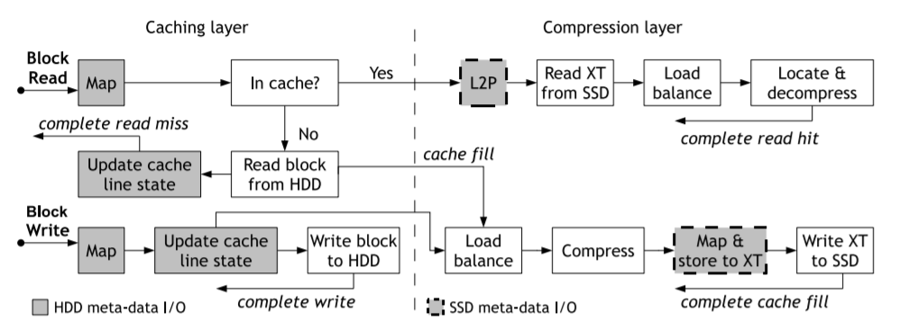
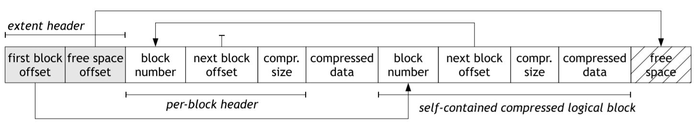

## Abstract

把SSD当作一种cache，使用数据压缩只是为了increase the capacity of SSD-based caches. 本文提出的FlaZ是一种在**block层的服务**，对现有的文件系统都是透明的。

**FlaZ允许variable-size blocks，提供了logical到physical block的映射，负责这些physical block的alloc和clean。**

FlaZ利用了多核CPU来减小数据压缩的开销。

FlaZ实现在linux kernel中，采用了TPC-H, PostMark, SPECsfs进行测试。结果显示对SSD的利用效率提升了99%, 25%, 11%（对应前面每个workload）。

## 1 Introduction

作者在写这篇文章时，大部分系统架构中SSD仍然是和HDD混用的（因为HDD虽然慢，但是容量大且便宜）。因此就可以把SSD用作HDD的cache。

传统数据压缩大多应用在文件系统层，这会有几个缺点：数据压缩只应用到特定的文件系统中；文件系统不知道(not aware)底层存储设备；文件系统要管理压缩后的文件会增加文件系统的复杂度；（因此将数据压缩应用在block层就会更好）

在FlaZ中，SSD被用作是HDD的cache，其中的block都是压缩后的，但是上层文件系统来看仍然是uncompressed的。FlaZ不在DRAM中作进一步缓存。

FlaZ由两层组成：compression层（负责提供transparent compression），cache层（负责将SSD用作IO cache，本文中的cache采用直接映射、write-through的方式）。FlaZ的cache层会遇到以下挑战：

- variable block size：固定大小的block压缩后的大小各不相同，需要一种方式来管理。
- logical to physical block mapping：压缩后的block可能是多个block在一个physical block上，因此需要一种low overhead、scalable的映射机制。
- increased number of I/Os：使用数据压缩后，数据写入过程中可能会增加一个read-before-write，写入操作通常需要先读取另一个块，在该块中放置新的压缩数据。
- device aging：随着使用时间的增加，数据碎片的现象会非常严重，会导致后来alloc新的physical block越来越困难，也影响应用的locality。

当然数据压缩本身也会带来大量的性能开销，本文将利用多核CPU来尽量减小数据压缩的耗时。（作者提到未来可以用accelerator对数据压缩进行加速...）

采用数据压缩的SSD cache不适合大量小写入的workload。

## 2 System Design

Logical Blocks（LBs）在HDD中是uncompressed，在SSD中是compressed，SSD作为HDD的cache。

### 2.1 SSD Caching

因为SSD比DRAM容量大且是持久性存储（can avoid warm-up overhead），同时为了减小管理cache line所需的元数据大小，因此采用直接映射。

为了避免SSD fail时可能造成的data loss，采用write-through策略。

将SSD cache中的metadata存储在HDD的开头，这样做是为了避免metadata write干扰SSD的性能和磨损均衡。同时采用DRAM缓存这些metadata，避免过多地去访问HDD中的metadata。（FlaZ中SSD每GB所需的metadata的大小为2.5MB）

### 2.2 Compression in the I/O path

数据压缩的方式：compress input into an output buffer, possibly in a piece-wise manner.（以分段的方式，可能跟我们现在的分段流水线方式相似）

采用的是LZW算法，具体采用的是Linux上的两种实现zlib和lzo。

#### 2.2.1 Mapping logical blocks to extents

压缩后的block就像上图中存储在physical存储介质中，存在一个extent的结构中，一个extent的大小是数个block size。extent中以链表的形式组织其中的logical block。

logical blocks translation table存储在每个compressed block device中，用logical block number可以获知其在哪个extent中，再依据链表进行索引。

extent中的free space是连续的，在所有logical block的最后面。

新写入的logical block是插入到list的头部（头插法）。保证了locality。

如果一个block不能被压缩成更小的size，则以uncompressed的形式存储。

#### 2.2.2 Block allocation and immutable physical blocks

physical blocks都是不可修改的，对一个logical blocks进行的修改都是以追加写的形式写入新的extent中（就是日志型结构）。这样过了一段时间，底层extent中就会有很多obsolete的数据，**FlaZ采用一个cleaner进程来当free space不足时进行清理过期数据**。

#### 2.2.3 Extent Buffering

为了减轻"读-修改-写"方案带来的额外IO对性能的影响，FlaZ在DRAM中使用了一个buffer来缓存几个extents在内存中。（相当于用了个缓存buffer，就不需要"读-修改-写"了）

这个buffer采用**hash table with collision list and LRU eviction policy**，key是extent id。同时buffer还将各个extent根据他们的free space组成多个buckets，每个bucket采用LIFO队列管理其中的extents（类似栈），每个extent待在bucket中直到free space被填充到一定程度（"reasonably full"）。**The extent size、number of buckets、the total size of the extents buffered这三个都是可调节的参数**。

如果一个extent待在buffer中太久的话，则数据访问的locality会受到影响（我的理解，LIFO队列中，先到的extent最后才出去，待太久了则之前的数据都obsolete了）。如果一个extent待在buffer中太过短暂，则会造成internal fragmentation的问题（我的理解，一个extent还没被填满就立即被驱逐回去，还有很多free space）。对此，**FlaZ中设置了一个"aging timeout"来避免一个extent待在buffer中过久**。

#### 2.2.4 Extent cleaning

FlaZ中将SSD中各个extents组织成两个pool，一个pool中的extent是empty的，另一个则是not empty。每当剩下的empty的extent数量不足时，便会启动cleaner进程，扫描SSD，将非空的extents中的所有live的block组成新的extent（从而将那些过期block的位置腾出来）。将清理出来的extent插入到empty pool中。FlaZ会记录last scanned extent，下次激活cleaner时便会从这个extent开始。

cleaner采用贪心的政策来决定每个live block该搬去到哪个新extent中，"first-fit, decreasing-size"。（可能就是根据block size找到从小到大最早的一个能装下的extent）但是这样可能会将原本相邻的live block给relocate到不同的extent中，从而破坏locality，为此，**作者限制了每次cleaner扫描的extents数量**。

为了尽量保持原本logical blocks的相邻关系，**FlaZ会将相邻extents中的logical block给搬到相同的新extent上**，同时为了尽量减轻logical block在SSD上位置大幅度改变，**这个新extent会优先选择当前正在清理的extent**。（TMD，这个和上面说的一段有点冲突）

作者评估了一下cleaner同时工作对处理Application请求的性能影响，然后**其余实验都是在cleaner关闭的条件下测试的**。

#### 2.2.5 I/O concurrency

FlaZ采用函数回调的方式（异步）来增大compression和IO的并行性，避免因为一些内核调用而阻塞。

当一个compressed block要写入到extent时，会先将这个block map到这个extent且分配空间（map操作包含了分配空间的操作），然后再将压缩后的数据copy到extent内部。这个map的操作是atomic的，且所有操作是基于DRAM中的extent进行的。并发的、对同一个extent的map操作会被serialized。但是copy时是并发的。

对于工作调度，FlaZ为每个thread设置了一个read work queue和write work queue。当大型read或者write quest时，就将其中包含的各个logical block分配给各个thread，每个thread负责一个logical block的工作，以此多核地并发进行工作，减小压缩/解压开销。

## 5 Discussion

### 5.1 Metadata memory footprint

FlaZ中DRAM中需要为SSD每GB存储的metadata的大小为2.31MB，因此DRAM中需要占用的内存大小只和SSD有关，而和HDD无关。

### 5.2 SSD cache persistence

FlaZ中在执行完一次write操作后不会立即更新相应的metadata，而是异步，当故障发生时，FlaZ会冷启动，**即假设SSD cache中没有任何有效数据，所有的数据的最新值都是从HDD中进行获取**。

### 

## 6 Related Work

### 6.2 Use of Compression to Improve IO Performance

数据压缩减小了数据库中某种scan任务的时间（很显然因为size缩小了）。

**[7, 18, 37, 45]**都是关于内存压缩的文章。

### 6.4 Other Capacity and I/O Optimization Techniques

**数据去重**是另一种减小文件大小的方式，但是数据去重由于其高开销目前只是用于archival storage systems。

### 6.5 Understanding and Improving SSDs

FlaZ可以用于任何类型的flash-based的设备作为压缩缓存。