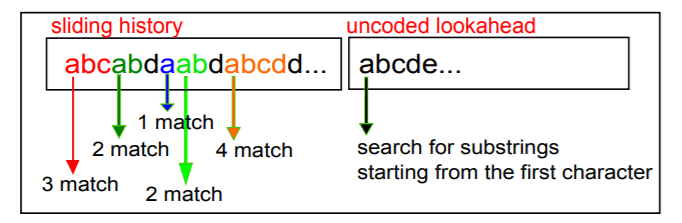

- 会议：ICPADS2012 CCF-C

 ## Abstract

本文将串行的数据压缩算法LZSS进行并行化改造并移植到了GPGPU上进行硬件加速。和串行的CPU上的LZSS算法相比速度提升了34倍，和并行的CPU上的LZSS算法相比速度提升了2.21倍。（**就是用GPU对LZSS进行硬件加速**）

## 1 Introduction

使用GPU的几个原因：

1. GPU是异步调用，可以和CPU并行工作。
2. DMA使得大量数据在CPU memory和GPU memory（显存）之间的传输变得很快。
3. 多个GPGPU之间，GPGPU和IO设备之间的IO通道提供了将IO通信卸载到协处理器进一步提高系统性能的可能性。
4. supercomputing架构中的CPU-GPU混合架构使得GPGPU更加常见，（GPU越来越普遍）

数据压缩算法并不是天生就并行的，而GPGPU却又是通过大量数据并行来获得高性能，因此必须对数据压缩算法进行一定程度的改造。

现代GPU包含许多新的硬件特性，例如vectorized read、non-traditional memory hierarchy等。

选取LZSS算法的原因：

1. LZSS是LZ77一种variation，只需要一遍扫描，这使得stream processing得以实现（流水线）。

本文contribution：

1. 将LZSS算法进行**并行化改造**以**用GPU进行加速**。（port to GPU）
2. 使得GPU-based LZSS算法**可以在压缩速率和压缩比之间自主调节**。

本文基于CULZSS，就是CUDA版的LZSS，然后再加以小小的改进。

## 3 Background

### 3.1 LZSS algorithm

LZSS（其实其它的LZ算法都差不多）主要分为两个阶段，searching和encoding。

searching就是一个history buffer和一个lookahead buffer，给lookahead中的string在history buffer中找最长匹配。

encoding就是将searching找到的信息编成码，如果编码后的数据长度不比之前的小，则不会编码而就存原始数据。

**CULZSS算法**就是将原始数据切分成chunks，分配给CUDA中的线程块（block，一个block内有多个thread，每个thread读取lookahead buffer中的一个character在history中进行搜寻）进行压缩，然后合并的时候还要再来消除一些冗余信息。（这些其实都是对压缩算法自身进行魔改，对于我可能没啥用）

### 3.2 Related GPU architecture

- thread：一个CUDA并行程序会被以许多个thread来执行。
- block：数个thread会被群组成一个block，同一个block中的thread可以同步也可以通过shared memory进行通信。
- grid：多个block会再构成grid。
- warp：一个block中可以同时执行一条指令的多个线程组成warp。

#### 3.2.1 GPU memory hierarchy

GPU内的memory有5种，global, constant, texture, shared memory, registers. （从左到右容量减小，速度增加）

constant和texture都是只读的。

shared memory是block内各个线程共享的。

registers是thread-private的。

#### 3.2.2 GPU thread scheduling

在CUDA中线程们都是以warp为单位进行调度和执行的，一个warp一般是32个线程组成的。**SIMT架构**中要求warp中线程必须都是能够同时进行的，且要执行同一种指令（each thread in a warp execute the same instruction at a given time）。

CUDA开发环境中还有一个CUDA profiler，可以得到系统资源使用效率等反馈信息。

Warp Divergence是指warp中的多个线程在执行同一个分支语句时，例如if语句时，不同线程的跳转结果不同。

## 4 Optimizing GPU Performance

### 4.1 Algorithmic improvements

就是将两个嵌套的while循环优化成了一个while循环，使得无论怎么样，每次while都只会执行一条指令，这样即使出现divergence也不会等待太久。

### 4.2 Architecture-oriented optimization

1. Memory Choice

   使用了texture memory，虽然其比global memory小很多，但是能通过pipeline利用起来。

2. Data Structure Choice

   就是说压缩速率和压缩比是两种不可兼得的属性，作者设计的架构中提供给用户可自定义的选项，即用户可以自定义history buffer的长度（三种长度512、256、128字节），长度越长压缩比越高，但是压缩速度越慢。

   另一方面来说，如果想要增加压缩速率的话，单独地减小history buffer长度是不够的，因为为了保证基本的压缩效果，至少要128字节长度的history buffer。且如果要让匹配有基本的价值，至少为2字节长度，即单字节的char匹配了不划算（因为编码生成的数据还是有点冗余的metadata）。因此为了让匹配有价值且提升速度，作者提出了两字节两字节地search。例如abcd就分为了ab和cd来进行match，但是这样又可能丢失一些longest match的可能性，例如有可能最长匹配从中间的bc开始。作者又提出可以将开始集合变成{ab, bc, cd}来进行搜寻。这种改造既可以在lookahead buffer中也可以在history buffer中进行。

## 5 Pipelined Parallel LZSS

### 5.1 Computation Overlap

就是说CULZSS中一部分工作还是需要CPU完成，一般来说流程是data先被GPU处理后再被CPU处理。作者的改进就是将data切分成更小的chunk，然后**不同的chunk间的GPU处理和CPU处理变成两段流水线进行流水**（和现在的设计一模一样）。

### 5.2 The GPU Processing Pipeline

就是说，为了更好地利用CPU中的多核，作者一开始打算将chunk进一步均分，然后在CPU中开多个线程，每个线程负责自己的那一部分数据进行CPU部分的工作（data-parallel）。然而这样做的效果并不好，因为多个线程都要去GPU那里获得数据，就需要一种同步机制来serialize，造成性能损失。

后来作者采用的方法就是将CPU部分按照task来切分（task-parallel），即将CPU部分的工作再细分成三阶段，再在这三个阶段利用多线程进行流水线。

当然最后因为CPU还是有很多剩余的核，作者又让其中一个阶段工作进行data-parallel的多线程并行处理，相当于采用了task-parallel和data-parallel的结合。（没啥太大创新的work，流水就完事了）

