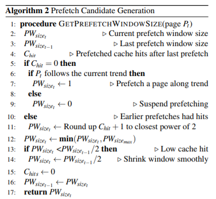

> Paper: ATC20' The Best Paper

## Abstract

> 这篇文章就是提出了一种适用于disaggregated memory的prefetch内存页的算法。算法总结就是统计最近几次访问内存页地址的变化量Δ，选出其中的majority作为prefetch时参考的stride，并且用一种类似TCP中发送窗口大小变化那样动态的变化每次prefetch的page数量。

现有的DM系统（例如InfiniSwap、LegoOS等）中访问远端内存时，还是在用之前的那种（designed for slow disks）data-path（访问流程），这种流程冗余且耗时，导致时延很长，而且prefetch的算法也落伍。

本文提出的Leap算法，是一种**可根据每个进程的page访问历史动态调整**、**基于majority**的prefetching算法。

## 1 Introduction

RDMA提供了快速访问远端内存的能力，现有的RDMA架构要么需要对其上的APP进行些许修改，要么就是通过VFS（remote file access）或者VMM（memory paging）的API接口来让APP不需要进行修改。

尽量将hot-page存储在本地内存，将cold-page存储在远端内存可以提高性能。现有的state-of-art的DM系统，访问4KB的远端page至少要40us的延迟，而一般内存密集型应用所能容忍的最高延迟只有1us。而RDMA write传输4KB的数据一般要4.3us，再加上内核中老旧的data-path，导致至少要40us。

现有prefetching算法的缺陷：

1. 只能prefetch连续的disk page；
2. 不能区分不同process的page access；
3. 在page访问模式突然改变时，不能很好地适应；

本文提出的Leap算法可以：

1. 不需要strict pattern detection，而是采用Boyer-Moore的majority算法预测个approximation，因此对page access模式的突发变化具有鲁棒性。
2. 不检测全部内存page access，只检测远端内存的access，减小性能开销。
3. Leap算法可以自动计算每次需要prefetch的page数量。
4. 当prefetch的页面被命中后，会被立即标记为evicted，等待被一个后台进程给释放掉，避免给内存造成过大压力。否则因为LRU机制这些已经命中的prefetched page要等很久才被释放掉。

5. 不经过传统的data-path，传统的data-path中因为是写入disk，因此会有preparing a request、queuing、batching之类的机制，导致时延增加。

 

## 2 Background and Motivation

### 2.3 Prefetching in Linux

现有Linux是根据最后两次page access来进行prefetch的，如果是连续的page则prefetch一段连续的page，否则就停止prefetch。这种方法就命中率低，浪费page cache。

## 3 Remote Memory Prefetching

### 3.2 Majority Trend-Based Prefetching

Leap主要包含两个算法：detecting trends和determining what to prefetch。

### 3.2.1 Trend Detection

Majority是指w个中至少出现$\lfloor w/2 \rfloor+1$次的元素。Leap中查找page address delta的majority（page地址的变化幅度的majority）的范围会先从$H_{size}/N_{split}$开始，如果没有majority就将范围翻倍，最大的范围就是$H_{size}$。注意范围翻倍后，其实前半部分的内容就不需要重复scan了，因此整个算法的时间复杂度是$O(H_{size})$的，因为$H_{size}$一般不大，因此整个算法时间复杂度就是个常数。

### 3.2.2 Prefetch Candidate Generation

每次pretch多少个page的算法如下：

注意prefetch size不会剧烈变化，因此保证了Leap在面对突变时具有一定的平滑效果（鲁棒性）。同时prefetch也会随着cache命中效果动态调整，保证了在极端环境下不会过度浪费cache。

## 4 System Design

Leap基于Linux kernel v4.4.125实现。Leap由三大模块组成：page access tracker，majority-based prefetching algorithm，eager cache eviction mechanism。

### 4.1 Page Access Tracker

Page access tracker区分不同的进程来进行trend检测。不监控内存中的page访问记录，只记录远程内存的访问记录（原文：records the access sequence of the pages after I/O requests or page faults），虽然会损失一定的准确率但是能大幅度节省CPU和Mem开销。

Page Access Tracker为每个进程维持一个$H_{size}$的环形队列用来存储远端page访问记录，且记录的是delta值而非地址本身。

### 4.3 Eager Cache Eviction

当prefetch的page命中后就会被标记为eviction candidate，后台会有一个进程专门回收这些candidate。

如果prefetched page被反复地访问，则Leap就会取消这些page被标记，使得他们不那么快地被释放掉。

