- 会议：EuroSys2016 CCF-B

## Abstract

为了改善KV cache的命中率，要么1.增大DRAM容量，2.改善替换算法。本文就是利用数据压缩来变相增大DRAM的容量。

本文设计的KV cache系统，将cache分为两个区，一个区用来存储hot数据，另一个区域则将cold数据进行压缩后存储，可以变相地增大``memcached``系统的内存2倍，减少命中缺失率46%。

> ``memcached``就是一个用内存mem为disk作缓存的KV系统，里面的数据以KV键值对形式存储，为cluster服务。``GET(key)，SET(key, value)，DEL(key)``

## 1 Introduction

现有的针对``memcached``进行优化的有利用RDMA绕开kernel network stack的，有将network processing任务offload到FPGA或GPU上进行硬件加速的。

KV cache的latency和throughput固然重要，但是其命中率也很重要。根据一份报告中显示，在Facebook的memcached workload中每天因为命中缺失导致的访问底层数据库次数就有120million次。（**本论文的idea来源**，减少一点点命中缺失就能带来很明显地性能改善）

不增加DRAM容量，则只剩下两种方式来改善命中率：

1. 改善替换算法，结果还是LRU好用且cost小。

2. 数据压缩算法，然而这就要求``SET``时压缩，``GET``时解压缩。一般来说压缩/解压所需的计算耗时是memcached不可以接受到。

然而根据后面的数据分析，KV cache的访问模式是很不均衡的，只有一小部分数据经常被访问到。（**本文算法的idea来源**）

zExpander将DRAM分为两个区域，N-zone和Z-zone，N就是不压缩，Z就是压缩，Z-zone一般所占的DRAM容量大于N-zone。

zExpander遇到的挑战（**对于我的毕设也有借鉴价值**）：

1. KV workload中KV一般较小，单独压缩它们不能节省太大空间（所以尽量将多个KV组合一起来压缩）
2. 当KV很小、很多时，用来组织这些items的元数据就会很大，消耗内存（因此需要一个紧凑的数据组织来降低成本）
3. N-zone和Z-zone之间的区域比例需要动态调整，使得N-zone可以命中大部分访问，并且Z-zone可以节省大量空间。

## 2 Motivation of Increasing Effective Cache Size and Using Batched Data Compression

> 本节中使用在Facebook的``memcached``系统中收集的工作负载和代表性访问模式的合成工作负载。

### 2.1 Long-tail distribution and Impact of Larger Cache Size

使用的数据集：

- three Facebook’s memcached traces. (USR, APP, and ETC) 

- also use Yahoo’s YCSB benchmark suite [18] to generate a trace to access KV items.（YCSB）默认YCSB workload中各项KV访问频率符合Zipfian分布，偏度参数为0.99。

结果各个key被访问的次数百分比CDF图就如下，15%的key占了80%的access，称这些hot数据占的cache为**base cache**：

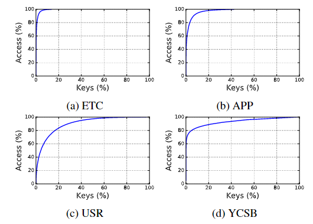

但仅仅有一个比base cache稍大的cache还是不够的，因为剩下那部分冷数据的access还是会造成大量的性能开销（前面的分析显示一点点miss也会最终造成大量的数据库访问）

然后作者分析了在四种cache替换算法下，逐渐增大cache size对命中率的影响，**结果表明无论你是用的哪种替换算法，增大cache容量都是很有效滴**。

### 2.2 Batched Data Compression

商业workload分析显示日常APP产生的KV数据大小都是很小的，例如Twitter's workloads（2009年到2010年的tweets数据）平均size只有**92B**，另一个数据集Twitter的地名数据集places，用Google的Protocol Buffer对这些结构化数据进行序列化，得到的平均value size只有**100.9B**。（**真的太小了**）

下图是individual（单独压缩每条KV记录），以及组合成各个大小的数据再压缩后的压缩比数据，用的算法是**LZ4**：

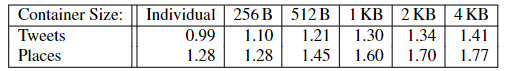

因此zExpander需要将小数据进行batch后再压缩。

## 3 Design of zExpander

``GET``请求首先被N-zone服务，不命中才会被Z-zone处理。

``SET``请求总是被N-zone服务，当KV从cache中驱逐时被Z-zone处理。

``DELETE``请求会同时被N-zone和Z-zone服务。

### 3.1 Data Organization of the Z-zone

KV items存储在``blocks``结构里，各个blocks构成了一个二叉前缀树，只有叶子节点存储items，当一个block满了就会分裂，里面的items根据自己的``hash(key)``分散到分裂的两个子blocks里，原先的这个节点的block内存就被释放掉。

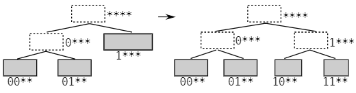

注意这个二叉前缀树并不是直接用key来寻路，而是采用了**MurmurHash**对key进行hash后再在树上寻路的，这样节点key分布不均衡导致二叉树不均衡的问题就能被改善。

为了节省总是从root节点一直到叶子节点的遍历时间，首先将树虚拟成一个完全二叉树，树中的block通过一个two-level结构的指针访问，如下图：

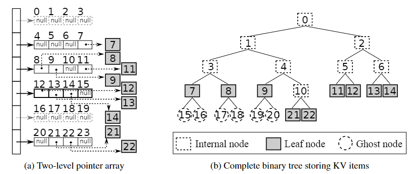

**系统中会记录当前最底层最右边的叶子节点的编号，例如上图就是22**，在树的第5层，这样就知道系统当前用到的最长的前缀是4位，这个时候比如想找block 8中的数据（但是不知道8是否已经分裂），系统会先从17或18开始找起，结果发现17或18的节点的指针为NULL，因此再去找节点8，发现指针不为NULL，因此系统这时知道block 8暂未分裂。

### 3.2 Data Access and Replacement in the Z-zone

KV默认以2KB大小组合进行压缩。假如一条KV记录100B的话，一个block大约20条KV items。为了加快在block内找到KV item的耗时，KV items在block内部是按照hash(key)的顺序排列的，并且每个block存了一个小index，记录了最多8个KV items在block内的offset，且这个8个KV items是均匀分布在block中。**因此在一个block内找到对应的KV items很快**（先在小index中找到KV items的所在区间，然后再顺序查找）。

为了避免不必要的解压操作，每个block存有一个布隆过滤器``content filter``（16B长），用来记录每个block中存有哪些KV item，这样就可以知道要查找的KV是否存在这个block中，存在才会去解压。

作者说分配和回收block用的是``malloc()``和``free()``，且block算是比较大（2KB），因此速度还算快。

如果Z-zone满了则要驱逐KV items到磁盘了，这里作者又是为每个block存有一个布隆过滤器``access filter``（16B长），用来记录近期哪些KV item被访问过。zExpander将所有block还用了一个环形链表串起来，当空间不足时，就会在这个链表循环寻找可以被驱逐出去的item。每到一个block，就会随机选择没有被``access filter``记录的**KV items中的一半**驱逐出去。（如果都有记录则会跳过，去链表下一个block，在**去往下一个block时会将当前的``access filter``清0**）

### 3.3 Limiting Accesses in the Z-zone

> 就是说要尽量控制好，少去访问Z-zone。

#### 3.3.1 Adaptive Cache Space Allocation

zExpander定期检查N-zone命中率的情况，如果低于90%，则扩大N-zone 3%内存的空间，相反如果命中率过高了也可以缩小3%内存。

#### 3.3.2 Minimizing Write Operations at Z-zone

就是说尽量减少在N-zone和Z-zone之间频繁搬运一个KV item。有两种场景下KV item movement是不必要的。

1. ``GET``请求在N-zone中没命中，只在Z-zone中命中了。是否该把这个KV item就立马搬到N-zone呢？

   zExpander会定期向N-zone调用``SET``请求插入一个``marker``记录，然后记录这个``marker``从N-zone驱逐出来的所需的时间``locality benchmark``。zExpander会为每个block记录两条最近访问的记录的``hash(key)-time``记录，如果此次这个``GET``的记录距离上次访问的时间小于``locality benchmark``则会被搬到N-zone，否则仍然留在Z-zone。

2. ``SET``请求在N-zone中完成，通过检查hash(key)和对应block的``content filter``，发现Z-zone中有这个KV item的旧版本，是否该立马被remove？

   仍然是用到``locality benchmark``，会等待这个``locality benchmark``，如果在这时间之内，N-zone中的这个``KV item``被驱逐到Z-zone，则只需要write不需要remove操作了。否则，这个KV item会被后台的Z-zone 替换算法率先删除掉。（Z-zone替换算法先删除掉这些过期KV items，然后再去前面说的环形block链表中随机驱逐一些数据来回收空间）

## 4 Evaluation

三个实验前的问题：

1. zExpander是否可以减少misses，以很小的性能代价情况下？
2. 如果在``memcached``管理N-zone的情况下，性能代价很小，那么换成其他高速KV cache（例如RDMA KV cache）来管理N-zone是否依然性能代价小？
3. 在数据访问模式突然改变的情况下，zExpander是否依然能很好地减小miss呢？

### 4.1 Implementation of Two zExpander Prototypes

> 实现了一个**基于memcached**的，以及一个**基于high-performance KV cache**的。

因为``memcached``不支持动态改变大小，所以最后决定人为设置每次分配给N-zone的大小进行试验。``memcached``已知的缺点就是受networking限制，且里面使用的hash table以及LRU list会带来大量的处理器cache miss。因此最后决定使用RDMA（`` network processing is removed by issuing requests at the user level of the server where the prototype KV cache runs. ``）来抹去networking限制，且使用Cuckoo hasing和CLOCK-based替换算法来改造``memcached``使得不要影响Z-zone的开销测量。（就变成了**high-performance KV cache**，所以这两个其实本质上都是基于memcached的）

### 4.2 Experiment Setup

replay 4个traces（3个来自Facebook's memcached traces，1个用YCSB生成的trace）来模拟真实情况。在测试时会先replay 1/5的traces来warm up cache然后才会开始测量数据。因为只是测试命中率，所以不需要关心request的并发性，因此只用一个线程去依次处理这些请求。

> 以下实验结果中**Memcached**是指只用了``memcached``的，**M-zExpander**是指基于``memcached``的zExpander，**H-zExpander**是指基于``high-performance KV cache``的zExpander，**H-Cache**是指只用``high-performance KV cache``。

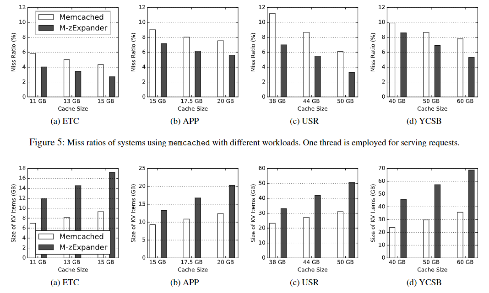

第一个实验就是测试了使用zExpander会减少多少miss，以及会多缓存多少的数据。横坐标是内存的大小。

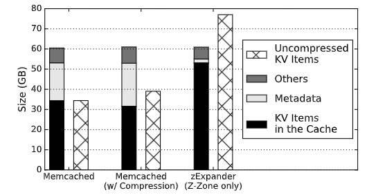

第二个实验就是说看一下在三种情况下内存的使用情况：

1. 只用memcached的话，可以看到很大一部分内存用来存KV items的metadata了，剩下的那部分others作者说是因为内存碎片占用了。
2. 中间两个bar是只用memcached，但是都用compressed KV items的情况，可以看到即使是压缩了，因为要存很多metadata，结果依然不好。
3. 最右边就是只用zExpander中的Z-zone情况下的内存情况，可以看到这下就很好了。

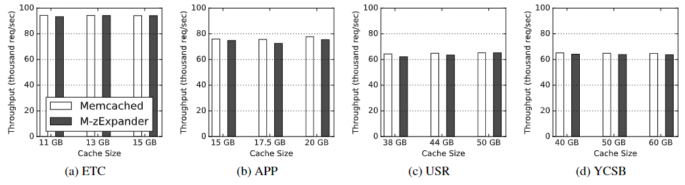

第三个实验就是说第一个实验中各个条件下的吞吐量数据（只用一个线程），可以看到用了压缩的还是会稍微下降点吞吐量。作者解释是因为``memcached``还是太过于受限制于``networking``。

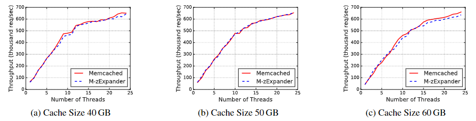

第四个实验就是只用YCSB的trace，但是是线程数量从1个逐渐变为最多24个，其吞吐量的变化。可以看到仍然和只用``memcached``的差不多，作者还是说因为受``networking``的限制。

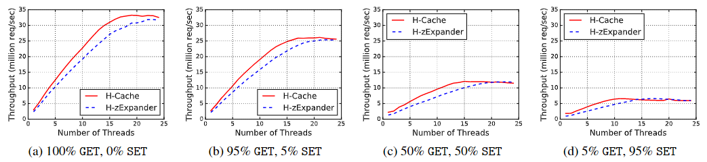

第五个实验就是作者改用改进后的``memcached``来进行测试，结果吞吐量还是不如H-Cache，但是作者在这里就很聪明，它就说在线程增多后，用了zExpander的还是好些（原文用的是catch up with），因为线程越多锁争用就越严重，而zExpander因为Z-zone的开销，所以锁争用没那么严重，因此吞吐量就赶了上来。**然后吞吐量没有增加还在那沾沾自喜...说几乎没有性能损失，我寻思你这个架构不应该是让性能更优化吗，否则有什么用呢**？

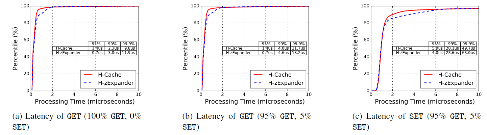

第六个实验就是测了下在24线程、只用YCSB trace条件下request的latency分布情况，结果还是大部分情况下不用zExpander的情况下更好。**结果作者在这里说，在更高的percent的部分用了zExpander的更好，因为blabla（又是一顿分析），我寻思你这架构超90%的request都更慢有什么用？**

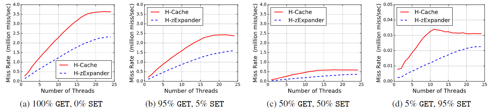

第七个实验分析了miss rate，很显然用了zExpander的好些，然并卵。

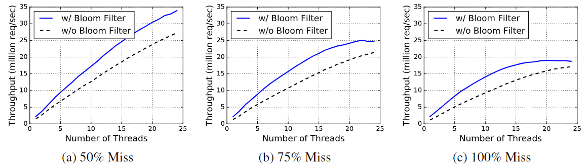

第八个实验分析了是否使用``content filter``来避免无效decompress的影响，**作者又扯了一些废话来充字数（学着点）**：

1. 在thread只有5的情况下，发现miss rate越高，用filter带来的性能提升越明显；
2. 在thread很高的时候，miss rate与filter带来的性能提升却越来越不相关，分析原因是锁争用造成性能损失越来越明显，占主要因素；
3. 发现miss rate越高throughput仍然是越低；（**又分析了一顿原因，废话**）

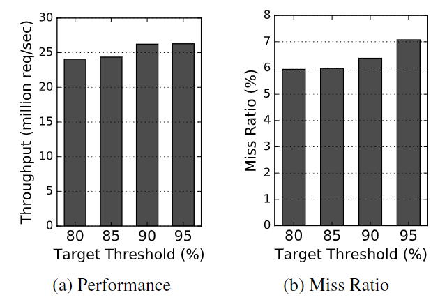

第九个实验分析了threshold和吞吐量、延迟的关系，threshold就是被N-zone服务的requests的百分比，很显然N-zone服务的越多，性能越好。

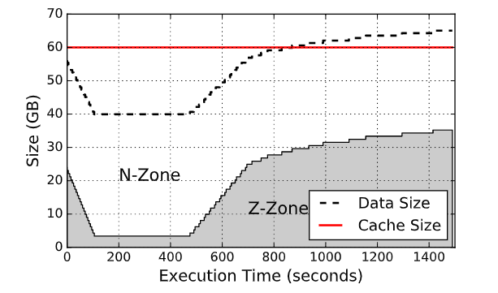

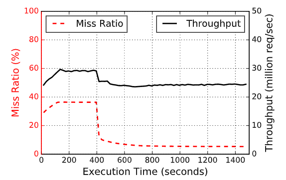

最后一个实验就是说，一开始访问的key都是均匀分布的，于是zExpander选择N-zone很大，这时吞吐量高，但是miss rate也很高。然后访问的key变成Zipfian分布，key分布非常不均匀，于是zExpander开始给Z-zone分配较多内存，最后miss rate降得很低，同时性能只下降了一点点。

## 6 总结

这篇文章的zExpander主要贡献可能就是发现了Facebook的KV workload的不均衡的访问pattern。这个架构的优点呢就是降低miss rate，同时具有通用性，就是N-zone里面可以随便更换其它的KV cache。**缺点很明显，降低性能**。同时这篇文章做了**大量实验**，可能这也是它能中CCF-B的原因吧。