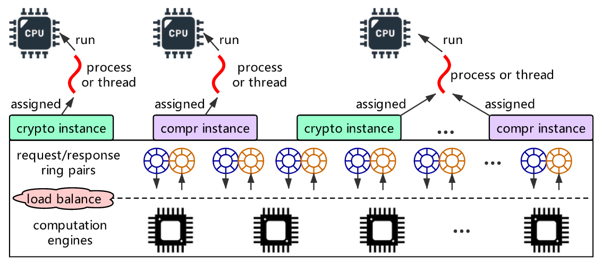
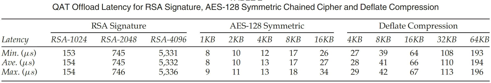
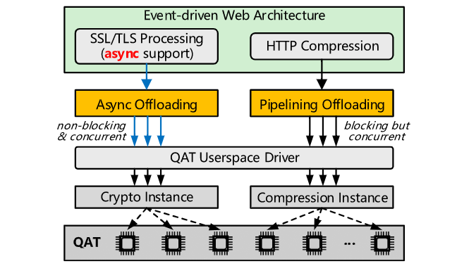
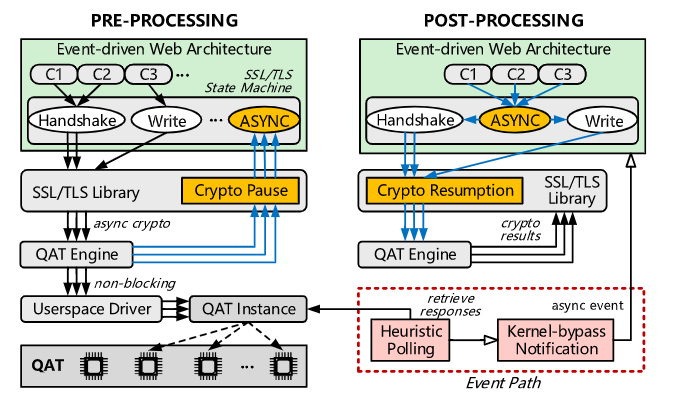

> 会议：TPDS2020

## Abstract

Web server经常需要进行SSL加密、数据压缩等计算任务，这些任务就可以交给硬件来加速。

QWEB实现了一种异步offload模式（for SSL/TLS），以及一种pipelining模式（for HTTP compression）。

## 1 Introduction

之前的研究硬件加速的论文，主要关注加速器编程上，没关注**IO优化**。作者发现直接地将计算任务offload到硬件上，会造成许多IO blocking（同步模式），因此会造成CPU和加速器利用率都较低的情况（没有很好地并行起来）。

QWEB虽然是基于QAT的，但其中的idea也可以用于其它加速器上。（**具有通用性**）

QWEB的特点：

1. 允许一个进程同时offload多个任务到加速器上（使得IO blocking的代价得到均分）；

2. 提高QAT加速器内多个并行的计算引擎的利用率；

   一种异步offload模式（for SSL/TLS），以及一种pipelining模式（for HTTP compression）；

**SSL/TLS 异步卸载模式**：SSL/TLS 异步卸载模式重新设计了 SSL/TLS 软件堆栈，以在所有层启用对加密操作的异步调用，完全消除offload blocking。有了异步模式后，一个进程就可以同时卸载来自不同的SSL/TLS连接的多个加密操作到加速器。此外，该模式采用（i）启发式轮询方案来获取QAT的response，（ii）kernel-bypass的方案来notification。

**压缩流水线卸载模式**：将累积的内容拆分为多个管道以进行并发卸载压缩（和我毕设目前的想法类似），每个offload请求仍然是synchronous的。之所以不采用asynchronous是因为这样避免了对WEB架构的大幅度修改，并且之后的实验显示这种模式和asynchronous的性能差距很小。

QWEB目前基于Nginx实现，作为动态模块，可以在configuration文件中进行配置使用。

QWEB实验分为，（i）只SSL/TLS卸载，（ii）只Compression卸载，（iii）两者都卸载 - combined。

## 2 Background and Motivation

硬件节省企业开销（TCO）。现代Web2.0服务器很多页面都是动态组成的，这就要求数据压缩也是动态执行。Web服务器架构分为thread-based和event-based，thread-based就是Apache这种，每来一个新连接就新建一个thread，event-based就是Nginx这种，用一个thread就可以处理成百上千的连接。Event-based的web服务器，采用异步模式和socket交流，就是利用epoll等之类的多路IO复用技术监视多个socket，在主循环中等待socket的event到达然后再依次处理event。

QAT的架构如下图：

一个CPU中的进程（或线程）可以获得一个对应功能的instance（每个功能的instance最多一个，不同功能的instance可以各分配一个）。当前一个QAT设备最多支持128个instances。如果系统中有多个QAT设备（Endpoint），则一个进程可以获取相同功能的多个instances。

**并发性**：就是说只要底层的计算引擎有空闲，就可以不必等前一个请求完成就提交下一个请求。

**OpenSSL QAT Engine**：就是说QAT将其加密服务整合到了OpenSSL中，即QAT Engine，使得用户程序通过OpenSSL API就可以透明地将加密操作offload到QAT上进行（seamless）。

如果直接将传统event-based web架构中的加密、压缩操作换成QAT IO操作，则效果不会很好，因为传统的加密、压缩操作都是software进行，因此会blocking等待完成，但是换成QAT后这就会降低QAT和CPU的并行程度。意思就是换成QAT了还是要blocking等待（**只不过因为用了硬件，这个blocking的时间被缩短了**），且一个进程最多只能同时发起一个请求（必须等待前面的请求依次完成），因为整个web架构就是这么写的（没有考虑异步地加密和压缩），必须等加密、压缩完成后再进行下一步。（下图是QAT执行各种操作的耗时）

## 3 QWEB Design

> Its design is also applicable to other types of accelerators.

### 3.1 Overview

QWEB主要就是Async Offloading和Pipelining Offloading两个模块组成。

### 3.2 SSL/TLS Asynchronous Offload Mode

#### 3.2.1 Pre-Processing and Post-Processing

SSL异步卸载模块如上图，分为Pre-Processing and Post-Processing两个部分。

**Pre-Processing**：就是说一个Nginx进程管理着许多个连接（C1, C2, C3...），每当有一个加密请求时，就将其发送给QAT，并将这个offload job暂停（每个加密请求的处理流程称为一个job）。然后Nginx进程此时就可以去服务其它连接了。

**Post-Processing**：就是QWEB采用一种启发式轮询（Heuristic Polling）来不断查询加密请求完成的response，一旦有请求完成了就会将其对应的offload job恢复并继续下一步。

#### 3.2.2 Heuristic Polling

之所以采用轮询而非中断的方式获取response，是因为在userspace采用轮询方式的开销更小。且QAT Driver中自带了一种轮询方式，可以很方便地开一个thread来轮询一个QAT instance。然而这种方式有以下缺点：

1. 会经常发生thread context switch，在轮询thread和应用程序（例如Nginx）主线程之间的切换；
2. 轮询的间隔时间难以确定，太短太长都不行；

因此QWEB采用一种启发式轮询机制，具体算法没讲，只讲了大概效果：

> 启发式轮询机制是结合在Nginx这个应用层开发的，这样就可以（1）避免反复的线程切换，（2）可以利用应用层的知识来决定每次轮询间隔时间。
>
> 已经submitted但是还未获取response的请求称为inflight。当infight数量达到一个**阈值**时就会触发一次轮询。
>
> 因为非对称加密比对称加密更加耗时，因此有非对称加密请求时阈值就会调高；当不是高峰期时，阈值就会降低；以及还有个特殊机制，当inflight数量等于active connection数量时会立即进行一次轮询。

#### 3.2.3 Kernel-Bypass Notification

对于获取response之后的消息通知机制（通知上层应用程序，例如Nginx进程），可以直接复用Nginx中的epoll，也就是让epoll除了监控socket的event之外，还监控底层的QAT request的完成event。但是这样会导致频繁的kernel-user mode切换，非常耗时，因此作者为QAT request的完成另外设计了一种Kernel-Bypass Notification机制。

大概意思就是在Nginx进程中设置一个异步队列，每当一个response被发现时，就会将response附加的async handler加入到这个队列的末尾。Nginx进程的主循环的末尾会检查这个队列并取出其中的handler并执行。

### 3.3 Compression Pipelining Offload Mode

之所以为Compression采用并发流水线式卸载，而非异步卸载，是因为：

1. 因为stream feature，HTTP content可以积累起来，一次性通过多个并发offload job处理；
2. Compression的耗时比加密算法耗时低，不必非要异步；
3. 作者的实验显示异步和同步的性能差距不大；
4. 异步的需要对WEB架构进行大改，像SSL/TLS卸载那样；

The core idea of this pipelining offload mode is to continuously send multiple chunks of data as multiple requests to QAT and then waits for their completion. 

就是将网页请求的数据缓存起来，一旦达到末尾或者超过一定阈值（256KB），就将已经缓存的数据切分成多段（64KB）然后依次发送给QAT，然后才会等待所有已发送的任务完成。这样blocking的时间就会被多个并行的任务均分，且同时利用多个QAT engine，使得blocking的影响减小。

## 4 Implementation Details

### 4.2 Compression Pipelining Offloading

一次HTTP响应就是一个stream，对应一个QAT session（也是一个QAT instance）。在Nginx进程将第一个数据压缩请求发送给QAT时，会创建QAT instance、session等数据。（同一个Nginx进程后续其他的请求都不需要再创建instance，但是session应该是每个HTTP请求一个）

在初始化工作都完成后，Nginx就会开始多次调用``qzCompressStream``函数向QAT发送数据，QWEB中的pipelining offload library会将数据缓存起来，一旦缓存的数据长度超过``qatzip_stream_size``（或者收到``final``标志）就会按照``qatzip_chunk_size``将缓存的数据切分成多个chunk然后发送给QAT加速器。所有chunk的请求都发送完后，就开始轮询response，等所有chunk的response都得到后，``qzCompressStream``函数才返回。（如果缓存的数据长度没超过阈值，而且也没设置``final``标志，则``qzCompressStream``函数**会立即返回**）

## 5 Evaluation

只用了两台机器，QAT版本是DH8970。Nginx可以工作在多种模式下，作者选择HTTPS web server模式进行测试。

数据压缩格式是gzip，gzip的compression level是1。QWEB实验分为（i）只SSL/TLS卸载，（ii）只Compression卸载，（iii）两者都卸载 - combined

DH8970有3个endpoints（相当于3个DH8950），每个endpoint配置成32个crpto instances和32个compression instances。实验中每个Nginx进程配置3个crpto instances（and | or）3个compression instances（因为有3个endpoints）。

## 总结

这篇文章重点关注的就是offload IO优化，毕设中可以借鉴其中的**异步、多线程并行化**同步的思想。其实就是现在的**ZLIB - RDMA流水线**的思想。

