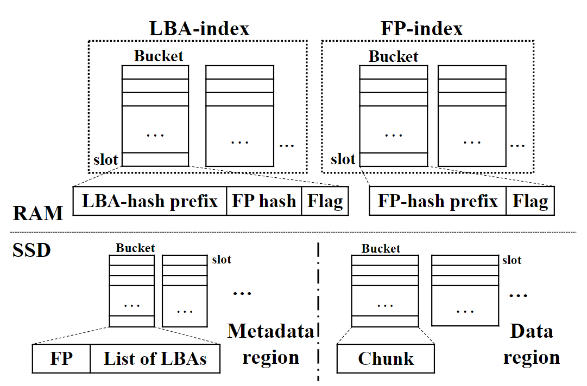
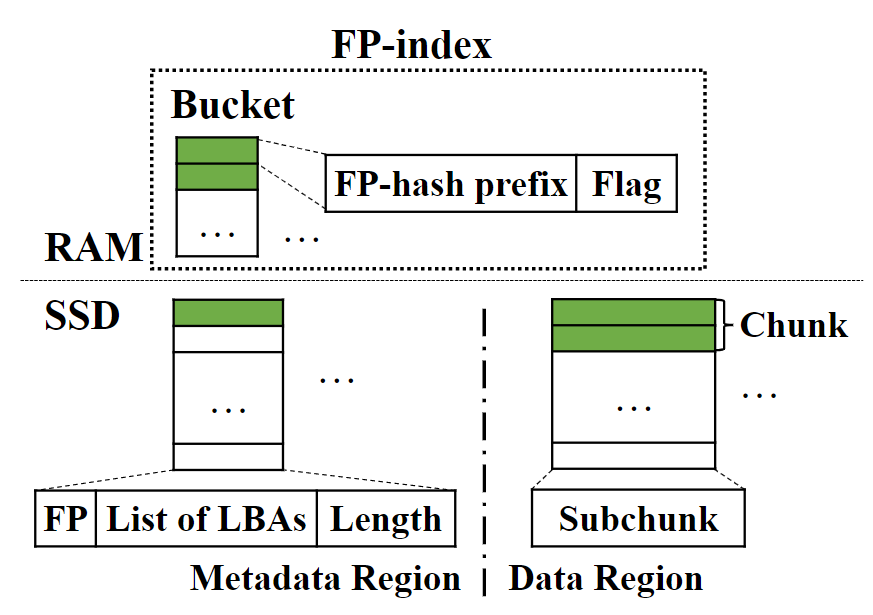
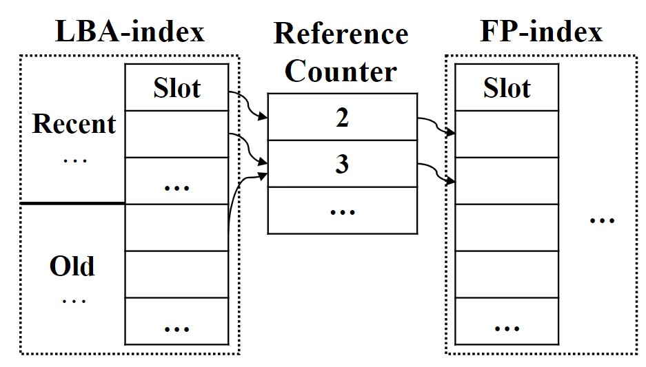

## Abstract

本文提出的AustereCache的主要贡献就是减少了数据去重和数据压缩所需的**metadata structure size**。

## 1 Introduction

- 本文的背景：

SSD作为HDD的cache，希望SSD能cache尽量多的内容，且减少每次write的size以尽量减少SSD的磨损。

在数据写入到SSD时采用数据去重和数据压缩。**数据去重是chunk-level的去重，数据压缩是在chunk内部的去重**。

最近有关数据压缩或数据去重的研究都是集中在如何管理variable size和设计新的替换算法上。

应用数据去重和数据压缩后，内存需要存储**三种metadata size**：1. 从logical address到physical address的mapping；2. 数据去重所需的为每个chunk维护的hash值（fingerprint）；3. 数据压缩所需的compressed size。

## 2 Background

### 2.1 Deduplication and Compression

- Deduplication

数据去重利用加密hash算法（例如SHA-1）对chunk计算出hash值。chunk可以是固定size也可以不是，固定大小的chunk好处是计算快，缺点就是去重效果会受影响。（本文工作只讨论固定size的chunk）

- Compression

compression通常是被运用到deduplication之后。compressed size是不定的。

### 2.2 Flash Caching

> LBA：要读取的chunk在磁盘HDD中的地址；
>
> CA：要读取的chunk被压缩后在cache中的地址；
>
> FP：chunk的hash值（fingerprint）

运用了数据去重和数据压缩的cache主要有两个index结构：1.LBA-index，从LBA到FP的mapping；2.FP-index，从FP到CA的mapping；

也有个dirty list，存储最近几次的 ``LBA - CA`` 记录。

### 2.3 Memory Amplification

就是数据去重和数据压缩会造成metadata结构体size变大。且也会给CPU带来不小的开销。

## 3 AustereCache Design

### 3.1 Bucketization

> 上图分为四个部分：LBA-index、FP-index、Metadata region、Data region

FP-index，Metadata region、Data region这三个区域的bucket数量、slot数量都相同。因此一个chunk对应的元数据在这个三个index中的地址也相同。

为了减小memory开销，在RAM中的index采用的分别是hash后的LBA和FP。bucket编号是对应key值的后缀suffix，而slot里则存有前缀prefix，因此可以先到bucket，然后再找到对应slot。

注意，不同的FP可以有相同的FP-hash，因此在FP-index里找到一个slot后，到metadata region中时还要再比较一下FP是否相同。

> 除了hash bucket这种结构，作者还考虑了B+树、LSM树等结构体来在memory中组织各个hash key，但是结果会导致每次多访问一次SSD，以及与之后的data compression不好配合的问题。

### 3.2 Fixed-Size Compressed Data Management

数据压缩就是将FP-index、Metadata Region、Data Region这三个区域的每个slot对应的改为了固定size的subchunk，论文中subchunk为8KB。一个compressed chunk对应多个连续的subchunk，例如32KB的chunk压缩后为15KB，则会对应2个subchunk，不足8KB的会添0补齐。

### 3.3 Bucket-Based Cache Replacement

LBA-index区域按照访问时间LRU进行排序，FP-index区域按照Reference Count进行排序。

LBA-index区域分为Recent和Old两种，Recent里每个entry可贡献2个count，而Old区域里的每个LBA entry只贡献1个count。

> 为每个FP-index entry都维持一个count太耗memory，作者采用了Count-Min Sketch算法，大致意思就是用更少的内存为每个FP-index维持了一个count，只不过这个count会有可接受范围内的误差。