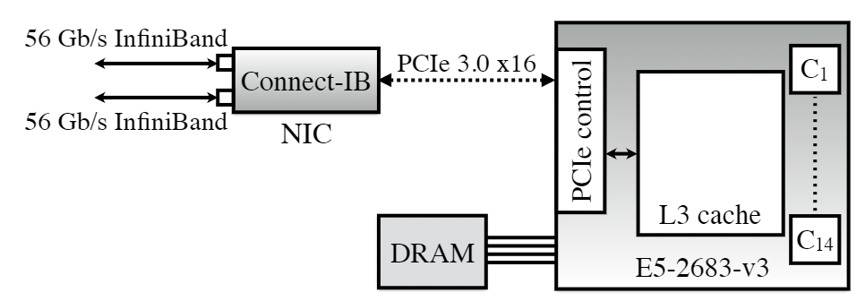
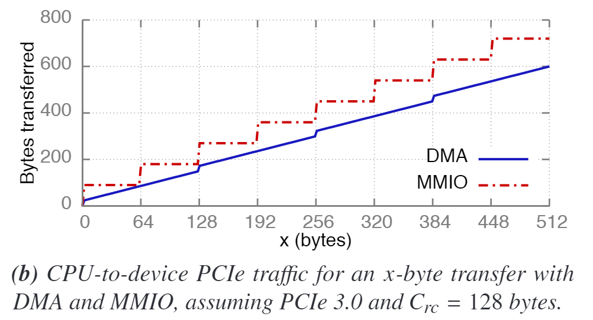
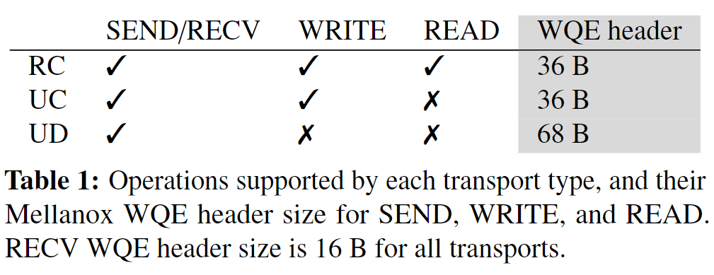
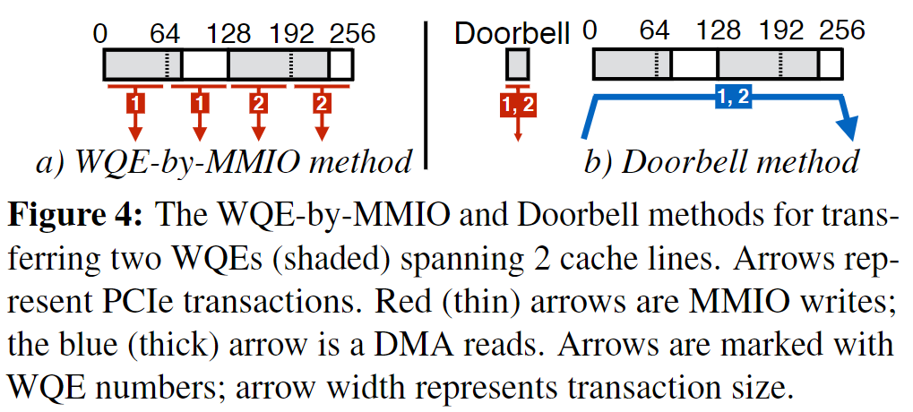
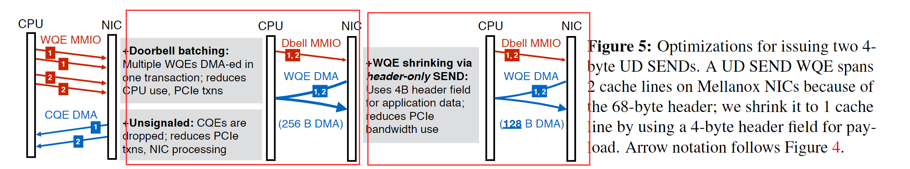
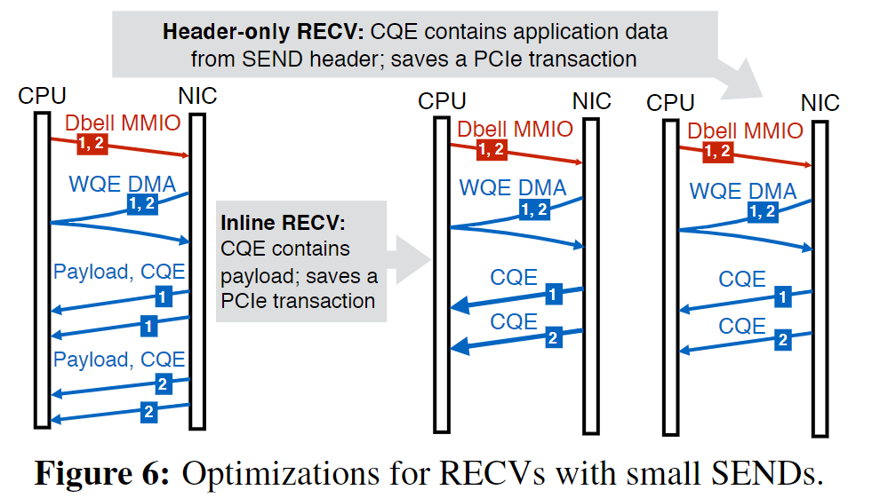
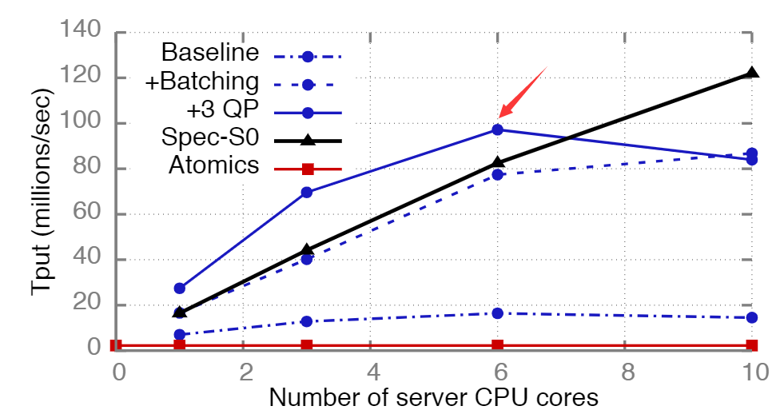
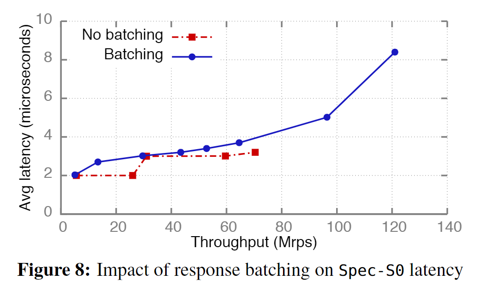
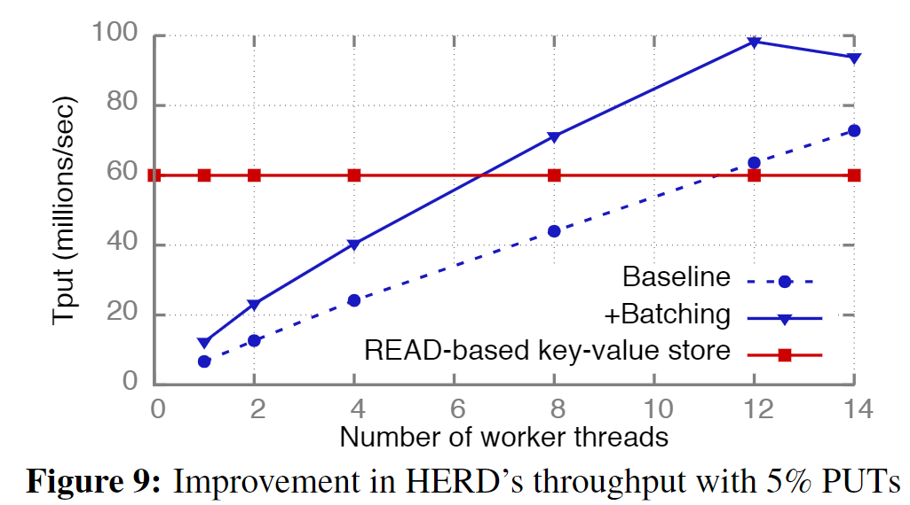
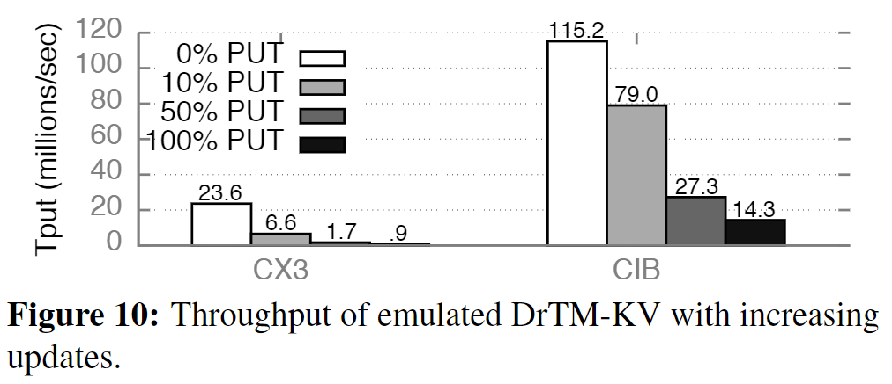

## Abstract

本文就是教你怎么写个高性能的RDMA-based系统。

## 1 Introduction

底层PCIe的事务机制，NIC体系结构的实现等底层因素都会左右RDMA系统的性能。上层应用的微小改动也会影响RDMA系统的性能。

本文贡献：

1. 提出了几点guidelines，用了一堆开源工具验证了这些guidelines对系统吞吐量的影响；

2. 将这些guidelines部署到了一些microbenchmarks和real systems中，测试其性能提升率；
3. 发现现如今RDMA网卡的 atomic operations都很慢，使得用RDMA ATOMIC的系统本身很慢；
4. 贡献了``rdma_bench``可供RDMA设计者测试自己系统的性能；

## 2 Background

### 2.1 PCI Express

RDMA NIC网卡通过PCIe同CPU的PCIe controllor相连，**PCIe会读取CPU中的L3 Cache来服务RNIC的请求**。

PCIe的带宽 = **通道数 * 每通道的带宽** （通道：lane）

PCIe transaction layer packets有三种：read request，write request，read completion。PCIe的packet都会在其开头添加相应header，这些header也会带来非常大的开销。例如PCIe3.0的header为26B或22B，而一些应用一般的数据大小也就这么大（例如memcached、RPC等应用）。

上图是PCIe采用DMA和MMIO两种方式传输x字节的数据实际要传输的字节数，MMIO由于"write combining"会生成cache line-sized传输请求，因此总是比DMA要花更多的带宽传输相同字节数的数据。

> 作者说了DMA传输的数据size不需要和cache-line size对齐，且DMA传输的size在取回时通过PCIe是用的是completion header，每个completion header最多管128B的数据，因此上图中DMA传输的数据每增大128B会突然增加一点，就是增加了一个completion header的size。
>
> 但是在下面作者分析Doorbell时DMA传输又是按照128B对齐的，可能是因为现在网卡的设计原因吧，就是说DMA可以支持不同大小，但是网卡在使用DMA时还是按照了128B对齐。包括作者在后面的Appendix.A中计算DMA实际传输的字节数时也是按照128B对齐进行计算的。
>
> 噢我明白了因为WQE是预先分配好的，这个是cache-line对齐的，因此DMA传输时RDMA这个应用传输的数据就是cache-line对齐的了。

作者的研究基于PCIe中的counter来分析各种性能，例如DMA reads counter（``PCIeRdCur``）和DMA writes counter（``PCIeItoM``）。

### 2.2 RDMA

作者描述RDMA的性能：NICs with 100 Gbps of per-port bandwidth and ∼2μs round-trip latency are commercially available.

#### 2.2.1 RDMA verbs and transports

> 就是在介绍RDMA技术

这里说了一下RDMA底层实现例如Infiniband协议，在链路层有拥塞控制、错误重传的机制，因此RDMA中一些"不可靠的"datagram的传输（例如UD类型的QP）实际上也很少丢弃数据包。

messageing verbs就是指SEND/RECV，memoryverbs就是指WRITE和READ。

### 2.2.2 RDMA WQEs

WQE 在预分配的连续内存区域中创建，每个 WQE 都单独进行高速缓存行对齐。（cache line aligned）

不同type的RDMA的WQE header大小不同，如果采用inlined data，则大小会更大，例如用RC类型的，inlined data为x字节，则总共为36+x字节。

#### 2.2.3 Terminology and default assumptions

将WRITE/READ/SEND认为是出站的动作（outbound），将RECV认为是入站的动作（inbound）。

**作者接下来所有的研究都是研究的inlined data**。As our study focuses on small messages, all WRITEs and SENDs are inlined by default。
$$
x':=\lceil x/64 \rceil * 64
$$
$P_{bw}$代表PCIe每通道的带宽（per-lane bandwidth）

$P_r$代表request header size of PCIe 3.0

$P_c$代表completion header size of PCIe 3.0

## 3 RDMA design guidelines

两个关于当前NIC的事实：

1. NIC都是基于PCIe连接的，和PCIe controller打交道；
2. NIC里面有多个并行的处理单元processing units，简称PU；

考虑转移 $N$ 个size为 $D$ 字节的WQE从CPU到NIC。

### 3.1 Reduce CPU-initiated MMIOs

就是说尽量减少用MMIO而是采用DMA传输。

CPU通知高速网卡（例如RDMA网卡）进行传输数据时（给网卡发送通知消息msg），有两种方式：

1. msg里包含了WQE，会用64字节对齐的write-combined MMIO；（不好）

   别名：WQE-by-MMIO、BlueFlame、PIO send。

2. msg包含WQE的指针，之后NIC自己使用DMA读取WQE；（好）

​		别名：Doorbell、Doorbell、SDMA。

#### 3.1.1 Doorbell batching

==就是如果要发送多个WQE给RDMA网卡，则可以采用Doorbell的方法，将多个WQE整合成一个doorbell==，节省需要传输的数据的大小，因为MMIO需要每次传输64字节就很蠢。

#### 3.1.2 WQE shrinking

==就是说如果你还是要强行用MMIO的方式传输WQE，尽量用方法将WQE的size减小==，例如从129字节降低1字节到128B，就会让MMIO次数从3降低为2。

> 注意上图中NIO发起DMA read会先到CPU再到自己，大概是因为DMA read请求是会到CPU上的PCIe controller然后由L3 cache服务的，相当于DMA传输时从DRAM到L3 Cache再到NIC。

### 3.2 Reduce NIC-initiated DMAs

尽量减少让NIC发起的DMA操作，3.1中讲的Doorbell实际上就是增加了一次NIC发起的DMA read。

作者说这里我们可以==通过unsignaled WQE来避免DMA write CQE到CQ==，还可以==用WQE inlined data来避免NIC发起额外的DMA read==。

RDMA RECV操作需要两次DMA read，分别将数据payload和完成消息completion写入到用户应用空间和driver里的空间。

#### 3.2.1 Inline RECV

==如果RECV要接受的消息大小小于64B，就将其Inline到CQE中==，由CPU待会儿将其拷贝到用户空间内存。所需要的DMA操作只有1次。

#### 3.2.2 Header-only RECV

==称消息大小为0的RECV为header-only==，这种只会生成CQE，并不会实际的接受数据，所需要的DMA操作只有1次。

### 3.3 Engage multiple NIC PUs

就是指如果每个CPU-core只用一个UD QP，就可能发挥不出NIC网卡里多个PU的威力。因此我们可以采用一个进程里多个QP的措施，称为multi-queue optimization。

### 3.4 Avoid contention among NIC PUs

就是说RDMA ATOMIC操作会导致不同的PU之间出现锁争用的问题（这个锁是在NIC网卡内部），如果出现很多PU抢一个address的lock，则性能会大幅度下降。

### 3.5 Avoid NIC cache misses

NIC里面也有cache，缓存了三种内容（cache miss会导致额外的PCIe Operation）：

1. Virtual Memory Address到Physical Memory Address的地址转换信息
2. QP state
3. WQE

这启发我们可以：

1. 用更大的页（2MB）
2. 用更少的QP
3. （作者在后面的第5.3.2部分有叙述）

关于NIC cache miss是如果被统计的，作者用到了PCIe counter，然后减去期望的PCIe count，剩下的就是因为Cache miss而生成的PCIe 操作。

# 实验部分

## 4 Improved system designs

### 4.1 Overview of HERD RPCs

作者使用了HERD这个RPC库作为client之间，以及client和server之间通讯的协议。

HERD clients在调用WRITE前会先RECV。server会对轮询检查相应的memory region，一旦发现有client写入数据，就会开始处理然后再调用SEND给client作为response（通过MMIO）。

采用两种优化措施：

1. **Batching**。就是说server端的worker并不会检测到一个client的请求后就立马返回个SEND，而是收集到N个SEND WQEs后再一起打包（Doorbell）发送出去。
2. **Multi-queue**。每个server端的worker就拥有不只一个UD QP，循环使用这些UD QP来将每个batched response消息发送出去。

> 作者说batching不会增加太多时延，因为作者设计了一些机制，不会死等。

### 4.2 Networked sequencers

server上面有个8字节的整数，作为计数器。该server中所有的worker thread共享这一个8字节的数据。任何client可以给任一个worker发送请求将counter加1。

在这里Batching启用后，则worker会在收集到N个SEND WQEs后直接将counter加N。并且在SEND的数据中分配给相应client对应的x ~ x + N -1之间的整数来代表分配给该client的序号。

> RDMA网卡的一个port是可以有多个QP的，通过qp_num来区分每个qp。

测试条件：每个core一个worker thread，每个thread中一开始是每个IB port一个QP，作者的网卡有两个port因此一个thread有2个QP，后面的``+3QP``则代表一个IB port 3个QP，因此一个thread有6个QP。下图是测试结果，测的是QPS。

#### 4.2.1 Sequencer-specific optimizations

就是说上面所采用的HERD RPC还是有点问题：

1. 因为client端在WRITE的时候还是用的connected QP，这就导致server端NIC需要维护每个connected QP的state，且限制了client数量极大的时候的scalability。

2. server worker thread每发送的UD SEND都是68B的头部，这就会导致DMA实际每次传输的是128字节（2 cache lines）

因此作者做了如下针对HERD RPC的调整：

1. client不再用WRITE，也改用SEND（不带任何数据的header-only SEND），服务器那端就需要多调用一个header-only RECV，只生成一次DMA操作，其实和之前的WRITE服务器端也会生成一次DMA操作传输到自己的DRAM中，因此速度无明显区别。

2. server的SEND，之前因为要传输68B+8B的sequencer的WQE header，因此导致变成128B的传输（WQE是cache-line size对齐的），变成64B就可以节省50%的DMA带宽（**这里没看懂是怎么把76B变成64B的**）

   > 好像是这样变成64B的，首先counter直接只传送低位的4B，这4B存在WQE header的imm_data field中，这样就缩成68B，为了进一步缩成64B，作者应该是直接把WQE header中的某个4B直接给丢弃了（可能是因为用默认值所以给省略了，论文里是说使用那些本打算留给APP data的field）

作者称这样改造后的HERD为``Spec-S0``。

#### 4.2.2 Latency

> 作者server用了10个CPU core才能达到throughput最大值。

可以看到用了batching的好处就是吞吐量最大值得到明显增加。

#### 4.2.3 Atomics-based sequencers

就是说用RDMA ATOMIC实现的sequencer因为锁争用的问题，吞吐量最低。

### 4.3 Key-value stores

> Our goal here is to demonstrate how our guidelines can be used to optimize or find flaws in RDMA system designs in general; we do not compare across different key-value systems. 

作者用HERD PRC实现了个HERD KV store，（没有绕开remote CPU）。

#### 4.3.1 Improving HERD’s performance

在KV store中应用batching，就是在收集到N个request后再去data storage中执行（这里用了prefetching的数据库技巧避免等待太久），然后再通过Doorbell的方式传回response给所有client。

作者的测试条件：1个服务器机器上有可变的worker数量，128个client process在8台机器，用800万条16B的key和32B的value的键值对填充了整个data storage，workload由95%GET和5%PUT的组成

结果如上图，只用SEND和RECV的HERD KV store在用了batching之后甚至很轻松就超过了READ-based KV store。

#### 4.3.2 Atomics-based key-value stores

READ-based KV例如DrTM-KV，里面用到了RDMA ATOMICS，是一种无需server CPU参与的KV store，但是ATOMICS在大量PUT的workload中由于并发控制性能十分低下。

> The server hosts 16 million items with 16-byte keys and 32-byte values.

结果上来看就是PUT操作占比越大的workload，DrTM-KV性能越差。
