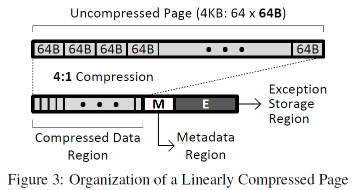
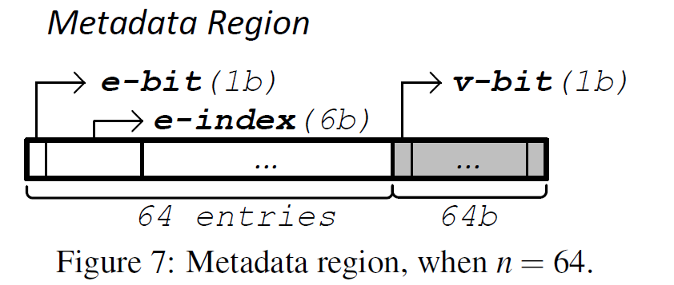

## 3 Linearly Compressed Pages

### 3.1 LCP: Basic Idea

LCP分为4种类型，512B，1KB，2KB，4KB。每种类型的LCP预先分配一些。用pool组织，比如LCP为768B，OS就从1KB的pool中拿出一个用来存储这个LCP。

在现代Cache中通常用physical addr来作为key区分每个cache line，为了避免cache line可能在两个地方出现，在LCP中采用了<physical page base address, cache line index within the page>来定位每个cache line。

LCP的优点之一就是可以应用任何数据压缩算法在其中。LCP是个generic framework。

每个LCP中每个cache line压缩后的cache line size（$C^*$）是不同的，在页表PTE中有``c-type``表明，例如为0就代表每个compressed cache line size为16B，为1就代表是24B，为2代表是32B等等。具体是在compress一个page时，在几个候选的$C^*$中选出让此LCP最小的那个$C^*$。

