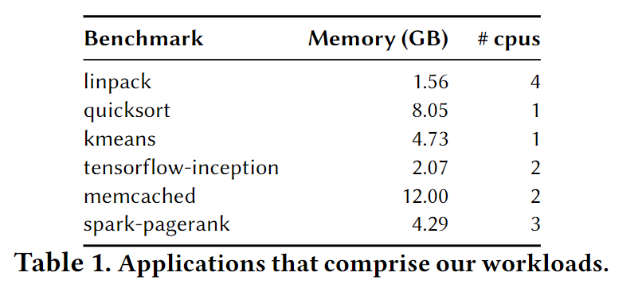

## Abstract

This paper first presents faster swapping mechanisms and a far memory-aware cluster scheduler that make it possible to support far memory at rack scale.

## 1 Introduction

However, for specificity and simplicity, we consider one particular model of memory disaggregation: using one or more “memory servers” to support all far memory, while all other servers in the cluster use their memory to support local jobs

之前的swap机制中有两大缺点：

1. page fault机制太过于耗时

   Fastswap直接和cgroups打交道；Fastswap prevents head-of-line blocking by steering page fetches on the critical path to a separate queue；Fastswap将memory reclaim交给一个单独的CPU负责；

   > Fastswap将remote page访问时间降低到5us，带宽是infiniswap的1.5~2.5倍

2. 如何分配本地内存和远程内存来让workload运行最快？

   Fastswap用了个far memory-aware cluster scheduler来在整个集群中测试本地内存和远程内存的不同分配效果。

作者将fastswap和cluster scheduler这两者的结合的架构统称为CFM。

## 2 Context

### 2.1 Memory Provisioning

就是说local memory想要扩展只能以粗粒度地，比如16GB内存笔记本要扩展成32GB，就得废弃掉原来的两张8GB内存，购买两张16GB内存，既费钱又浪费旧内存条。

而如果在远程内存池扩展内存则相当于非常丝滑（细粒度地）地提升整体性能，因为远程内存池是被多个compute node共享的。

### 2.2 Deployment Scenarios

一般来说，2张8GB内存比一张16GB内存便宜，所以在当今服务器企业中一般内存DIMM插槽都是被插满了的。

不考虑本地内存只部分扩展的情况，因为这些运营商一般升级内存容量都是一次性全部升级。

作者认为远程内存适合吞吐量要求大的工作负载，而非latency要求高的负载。

## 3 CFM Overview

> We focus on improving end-to-end makespan, or the time it takes to finish executing a list of jobs. 作者关注完成各项任务的总耗时。

### 3.1 Approach

想要利用Remote Memory，要么通过修改现有上层应用代码，要么靠swap机制来透明地使用。然而更改现有代码这一方式是不现实的，因为现有商业应用要求可以跑在各种异构的环境下，因此Fastswap选择swap机制。

### 3.2 Challenges and Contributions

CFM面临的两大挑战：

1. enabling far memory to be swapped in quickly
2. deciding how to schedule jobs across local and far memory

#### 3.2.1 Fast Swapping

之前的Infiniswap的三大缺点：

1. Head-of-line blocking

   在传统swap机制中每次page fault不只取一个page，而是取多个相邻的（Linux’s default
   prefetch window size of 8），而正要被APP使用的page可能出现在这个8个page中任何位置，因此就会导致延迟更高。（如果faulted page在第一个还好说）

2. interrupt-handling

   infiniswap中每个RDMA操作完成后用中断机制通知CPU，这会造成10us的额外延时。

3. Cgroup page reclaim

   现有cgroup机制中，如果cgroup发生page fault了且此时cgroup已经占满分配给它的内存了，则在此次page fault返回前还需reclaim（释放）一些页面之后才能继续，这会让此次page fault所需的延伸更高。

#### 3.2.2 Cluster Scheduling

> 略

## 4 Fastswap

作者修改了kernel中page fault handler、swap system、cgroup memory controller来改善page fault的高延迟（大约300行代码）。

### 4.1 RDMD Backend

#### 4.1.1 Frontswap

Fastswap基于的是Kernel中的Frontswap，Frontswap 设计用于以页面粒度进行交换，而不是支持一般的块 I/O 操作，并努力在交换操作完成时尽量减少对其他任务的上下文切换。（专门用来处理page fault的，比block device那套要简洁些）

#### 4.1.2 Queue pairs

为了减小head-of-line blocking的影响，每个CPU对于RDMA的队列有两条，一条用来处理比较紧急的page fault，采用poll模式获取completion；另一条用来处理prefetch的page，采用interrupt模式获取completion。

#### 4.1.3 Frontswap interface

就说原本Frontswap的函数都是同步的，作者将其改为了异步操作。

### 4.2 Page Fault Handler

Fastswap修改了page fault handler，有两点：

1. 修改使其能够分别对待faulted page和prefetched page；

   

   就是说让alloc page和page read两阶段流水流起来。

2. 修改使其能够先读faulted page。即使前一个fault的prefetch page还没取完。

### 4.3 Memory Reclaim

1. page reclaim（回收）分为立即回收和offloaded回收

2. offloaded回收就是异步回收，发生在cgroup使用的内存超过$MAX$时

3. 立即回收就是阻塞式回收，发生在cgroup使用的内存超过$MAX+\alpha$时，这个$\alpha$一般是8MB。

   意思就是先异步回收，当reclamer忙碌的时候，就采取阻塞式回收。

4. 回收就是将内存页evict到远端内存，采用poll的方式获取write操作的completion。

## 5 Far Memory-Aware Scheduler

用$mem_i$表示第i个任务所需的最大内存容量。

### 5.1 Job Degradation Profiles

不同类型的任务在本地内存比例改变时总执行时间的变化幅度不同，为每个任务创建了个$f_i(r_i)$函数，其中$r_i$是第i个任务的本地内存的比例，而函数输出就是估计任务的运算时间。作者就是用不同的比例去跑一个任务，根据这些不同的耗时来建立一个连续函数。

作者说这种方法不好，或许可以根据每种任务的page-fault频率来判断，但是作者说将这个任务留给future。

### 5.2 Far Memory Scheduling Policies

本论文不考虑工作抢占的问题，有个job queue，所有job按照到达的时间顺序进行安排，每次在所有的computer nodes中随机遍历直到找到第一个符合job要求的node就将其分配给这个node，否则留在queue中等待。

1. fit函数

用一个fit函数来判断某个node是否满足执行这个job的条件，首先检查是否满足足够的core数，然后检查本地内存+远程内存是否大于这个job的最大内存需求，如果都满足就认为node符合job的条件。

2. rebalance函数

就是一个动态平衡local memory使用的函数，当新job到来时缩小正在执行的job的本地内存以腾出空间给新job，当job完成时又将空闲的local memory重新分配给剩下的jobs。

作者提出了以下几种策略：

1. Uniform policy

就是指一台机器上的所有任务的local memory占比相同，例如75%，则所有任务都有25%的内存在远程内存。

这种策略简单但是效果肯定不好，因为每个任务的内存需求量，对本地内存的敏感程度不同。

2. Variable policy

这种政策就是，假设允许每个job因为远程内存而降低最多20%的速度，此时它所需的local memory为多少，有了这个最低限度的local memory比例后scheduler再去进行fit和rebalance。

3. **Memory-time policy**

> 作者说本次论文中不关注workload的延迟情况，假设所有的workload都是可以被推迟的

首先定义了针对a set of memory-constrained jobs设计了如下makespan的定义：
$$
makespan=\frac{memorytime}{local\_mem*utilization}
$$
其中memorytime就是每个job最大memory乘以它的执行时间的总和。如果不用remote memory则这个memorytime就是固定的。这个memorytime是指local的memorytime，也就是
$$
memorytime=\sum^N_{i=1}mem_i*r_i*f_i(r_i)
$$
其中$mem_i$乘以$r_i$的结果就是local memory的大小。第三种策略的目标就是在给定受限制的remote memory条件下合理安排每个workload的local ratio使得每个任务的memorytime最小。但是这个问题的难度是APX-Hard级别的，因此作者提出了一个近似的优化目标。

上图是几种memorytime的示意图，其中A就是local的memorytime，作者说第三者策略的优化目标就是使得
$$
maxmize\ \frac{A-B}{C}
$$
也就是让local memory time减少得最大且remote memory time增加得最小（避免过度占用远程内存），作者这个分布式、去中心化的策略就是**Memory-time policy**。根据任务的执行进度$p_i$来动态调整本地内存的占比$r_i$，如下图：

作者列出上述公式后，就说在给定$p_i$、$mem_i$、$f_i(r_i)$函数的条件下**用SciPy**求一个最优的$r_i$即可。

### 5.3 Scheduler Implementation

Fastswap其实三种策略都实现了一下分别测试。

## 6 Evaluation

### 6.1 Experimental Setup

1. Testbed rack

就是指用实际的14台机器进行测试，9台作为compute nodes，1台作为scheduler，4台作为memory servers。

2. Cluster simulator

就是指根据使用5.1 Job Degradation Profiles里的profile（用1对1的Fastswap进行测试得到的profile），进行数学建模，模拟进行测试。并且最后作者在6.3中测试了自己的simulator的准确性。

模拟测试中模拟了40台机器的场景。

#### 6.1.1 Evaluated Systems

NOFAR：只用local memory的cluster

NOFAR(+X%)：增大了X%local memory的cluster

Infiniswap：Infiniswap只进行1对1地测试，且禁用掉了写磁盘这一过程

DRAM：Fastswap使用DRAM作为backend的版本

FAR(+X%)：有着比NOFAR类型的多X%的total memory的Fastswap

> 在Fastswap中需要确保有足够的remote memory，因此每个机箱中至少会有一个memory server。在FAR(+0%)中就有一台服务器会是memory server，使得总的memory量和NOFAR相同。同时Fastswap也会有部分core专门用来当做reclaimer。

#### 6.1.2 Jobs and Workloads

上图是各种job，而一个workload则是由6000个jobs组成的。作者另外设计两个指标m2c和packability：

1. m2c差不多就是
   $$
   m2c(W,C)=\frac{该workload的mem需求与cpu需求的比例}{服务器集群所拥有的mem资源与cpu资源的比例}
   $$
   m2c就是个两个比例的比例，用来表示一个workload的需求有多么的不均衡。

2. packability和5.2中介绍的makespan有关
   $$
   packability=\frac{假设在一台和集群总资源相同的大机器上跑workload的makespan}{在NOFAR的集群中跑workload的makespan}
   $$
   packability越高，越逼近1，就说明这个workload受resource fragmentation的影响就越小。

   

### 6.2 Testbed Performance

每台机器32GB内存，在9台机器上跑NOFAR，在8台compute node+1台memory node上跑FAR，其中FAR(+11%)表示再增加32GB远程内存，FAR(+33%)是再增加96GB的远程内存。结果如下图

可以看到，对于整个workload的完成情况来说Fastswap还是有改善的，但是对于单个job来说，其完成就会受到一定程度的影响，如下图

### 6.3 Rack-scale Evaluation

> 使用写的模拟脚本来模拟40台机器的效果

#### 6.3.1 Simulation Validation

就是说用这个脚本来模拟9台机器效果时发现和实际跑的只相差9%到3%，因此可以认为是准确的。

#### 6.3.2 Benefits of Far Memory

> 未完待续

