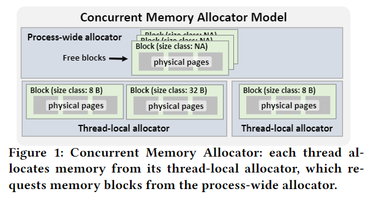
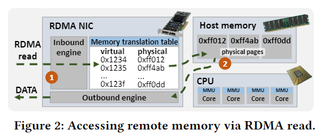
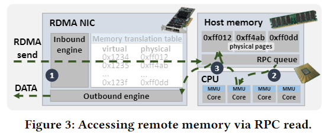
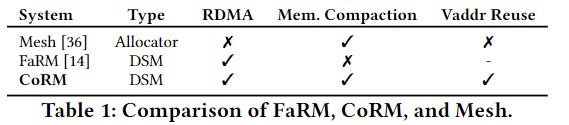
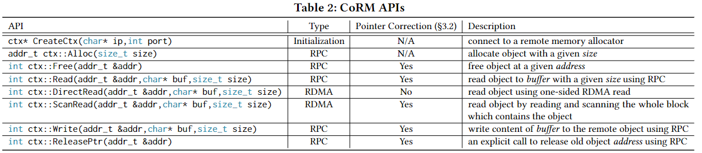
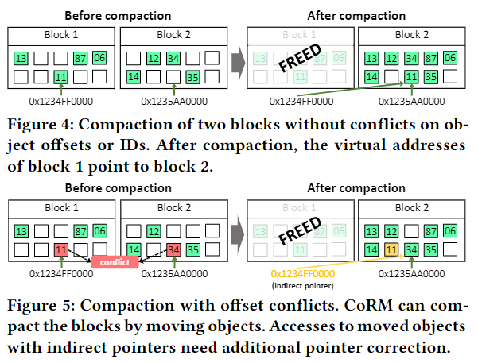
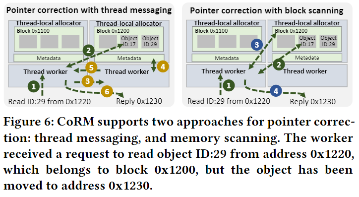
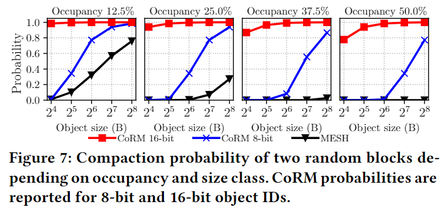

## Abstract

CoRM可以执行Memory Compation（Memory Defragmentation）同时不会干扰用户程序的正常RDMA使用。经过试验测试可以减少用户的active memory大小为原来的六分之一。

## 1 Introduction

一般的RDMA系统里object都是靠在内存服务器上的虚拟地址进行访问的（毕竟都是在用户态），为了执行将一个object转移到另一个地方这种动作（涉及修改object的地址），通常服务器不会直接告诉client某个object的虚拟地址，而是给一个句柄，靠句柄来访问object。这样做的坏处则是每次访问都先要经过句柄找到object才行，给RDMA系统带来极大的负面影响。

在分布式系统中内存fragmentation的问题更大（增大了69%不必要的内存浪费），给内存带来了极大的浪费问题。

## 2 Distributed Shared Memory Systems

> 感觉DSM和Disaggregation Memory差不多，文中把FaRM也认为是DSM

DSM就是一种将多处分散的物理内存组合成一个连续的内存空间给client使用的系统。在 DSM 中运行的应用程序可以随机访问其本地内存或远程节点的内存。为了实现这种抽象，DSM 提供了用于管理（即分配和释放）和访问（即读取和写入）内存的 API。如果内存访问以本地内存为目标，则内存访问被转换为加载/存储，否则，它们会导致通过网络发送到目标节点的请求。

### 2.1 Concurrent memory allocators

DSM中client应用既可以用本地内存也可以远程内存，一个DSM node（server端）必须支持很多client并行地管理它们的内存。

CMA就是DSM中管理并发内存分配的，CMA必须 1.scalability; 2.low memory fragmentation.

#### 2.1.1 Scalability

在之前的设计中，CMA一般分为process和thread，每个thread以Block为单位管理自己的内存，一个Block由多个page组成，每个Block所存储的object是特定大小的（分成了不同型号的block），当thread的内存不够时就会去向process allocator要更多内存，当process allocator不够时又会去向操作系统要更多内存。

> 这里就会在block size上引入trade-off，如果block size大，则可以减小访问上级CMA的频率，但是会增加memory fragmentation的问题严重性。

#### 2.1.2 Memory Fragmentation

内存碎片的问题主要由两个原因导致：1.突然的大流量分配；2.某种size的block的低利用率。

1. 突然的大流量分配（allocation spikes）

   突然的大流量分配会导致很多新的block分配，随后可能会free掉一些内存，但是只要block里有一个object还被占用，则这个block就不会真正地释放掉。

2. 某种size的block低利用率

   就是说block里只分配了一个object。自然会浪费剩下的block空间。

#### 2.1.3 Memory Compaction

Memory compaction要么引入一个index table来让服务器自由地移动object的位置（会带来极大的性能损失），要么像Mesh那样保留object的虚拟地址不变，但是在页表中修改它对应的物理地址。（但是这要求合并为一个block的object的在各自block的offset不冲突才可以）

### 2.2 RDMA-accelerated DSM systems

> 在本文中我们只考虑采用RC QP，因为只有它支持WRITE、READ

FaRM中干脆不支持Memory Compaction，以此避免Virtual Address改变。

RDMA READ操作的虚拟地址到物理地址的转变是由RNIC中的 Memory Translation Table (MTT) 进行的。

RPC READ（RDMA）操作，则是read quest被RNIC直接送到内存中的RPC queue里，然后被某个工作线程进行处理，因此虚拟地址到物理地址的转变是由CPU中的MMU进行的。

## 3 CoRM

> CoRM is designed to provide memory compaction to RDMA-accelerated DSM systems such as FaRM without compromising strict consistency, but requiring storing extra metadata in object headers.
>
> Since CoRM’s API mimics FaRM’s API and only adds a maintenance call for releasing unused virtual addresses (§3.3), we believe our compaction strategy can be integrated to FaRM without extra effort.

CoRM可以将block内部offset相同的object合并，只不过需要存储一些extra metadata（前面提到的Mesh在合并时要求offset不能相同）。CoRM还解决了虚拟地址耗尽的问题，通过两个额外的操作pointer correction、pointer release。

CoRM就可以看作是FaRM支持Memory Compaction的拓展，但是FaRM没开源，作者自己开发的模拟FaRM。

CoRM向上层应用提供的API如上图。

API中有两种READ，其中RDMA READ是保证了一致性的，即使在另有用户正在WRITE这片区域时也能保证READ成功，靠的是version number，每个cacheline有一个version number，如果读取到的block里面cacheline的version有些不同（不只一种version），则代表此时正有WRITE发生，因此会尝试重新READ。

### 3.1 Memory allocation and compaction

#### 3.1.1 Allocation algorithm

CoRM中也是按照two-level设计的CMA，对分配内存block进行管理。

分配block是在process allocator中进行，分配时首先调用``memfd_create``创建大小16MB的匿名文件，里面的每个block以``<fd, offset>``进行标识，每个block被allocator注册到RNIC中成为MR。

#### 3.1.2 Compaction algorithm

只有是相同size class的两个block可以进行合并（compact），想法就是将一个block中剩下的object移动到另一个block中即可。	

Compact的基本算法就是，每个object都被赋予了一个ID（是**随机**生成的），这个ID是在同一个block范围内独一无二的。当出现offset冲突，但ID不冲突时，仍然可以进行合并。合并后的那个object所在的virtual addr指向的就将是新的physical page，但是object在page里的offset已经发生改变，此时就需要进行**Pointer Correction**。

object的ID是包含在``alloc()``函数返回的128bit返回值中，这个128bit还包含raddr和rkey。

#### 3.1.3 Compaction policy

CoRM会记录每种size class的block的内存碎片比例，当比例高到一定程度或者当新的alloc空间不足时就会触发compaction。

#### 3.1.4 Compaction mechanism

进行合并的blocks可能来自不同的threads，当需要进行compaction的时候，其中一个worker thread被选中为compaction leader，它会向所有other threads请求某种size class的blocks的信息，收集到所有所需信息后便将内存碎片最大的两个block进行合并。

合并时还会将两个block的metadata进行合并，这个metadata就是``ID --> offset``的映射表（一个hash表）。

每个block最多被一个thread占有。

### 3.2 Pointer correction

在访问一个object时，总是认为这个object所在的raddr是对的。在read回来的数据中检查ID，如果ID对不上就说明这个object的offset发生了改变，此时在去metadata中查找正确的offset，再次读取，并且在client自身管理中更新这个object的raddr。

#### 3.2.1 RPC calls

用户如果使用RPC-based calls，则Pointer correction将会是透明的。

RPC call中的pointer correction有两种：

1. 左边的就是当负责此次RPC request的线程发现错误时，会去和那个block所属的worker thread进行沟通，让它去查找指定ID的object所在的offset，当RPC woker thread拿到新offset后则再次去获取object。
2. 右边的则是RPC worker thread发现错误后，会直接去scan整个block依次比对ID，找到所需object。

#### 3.2.2 RDMA calls

RDMA read（API DirectRead）是server端无感知的，则pointer correction应由client端负责。client应检测RDMA read返回的数据ID是否正确，如果不正确则应该采用RPC read或者RDMA ScanRead，ScanRead会读取整个block并且再scan找到正确的object。

#### 3.2.3 Consistency

在获取object，有可能数据正在被写入，可能正在进行compaction。

1. 如果正在被写入

   CoRM在每个object的header和每个cacheline的第一个字节里面存储了version number，每次写入都会使得这个version number增加。当获取的数据object header里的version和数据里的version不一致，都说明在读取时正在发生write。

2. 如果正在compaction

   CoRM在每个object的header存了个state，在进行compaction前worker会将每个object的header中的state改为locked，这样client在读取到的数据中发现state是locked则说明正在进行compaction。

当上面两种情况发生时，client read会等待一个backoff时间后重新进行。

#### 3.2.4 Fault Tolerance

CoRM没有实现Fault Tolerance。留给后面的人探索。例如CoRM可以实现fault-tolerant。

### 3.3 Pointer release

compaction只是节省了physical内存地址，虚拟内存地址仍然在不断被使用。

CoRM会在object header存储这个object最初所在的block的虚拟地址，这样就可以在一个vitual block中所有object都free掉时重用这段virtual address。

CoRM还提供了``ReleasePtr()``函数 an explicit call to release old object address using RPC。论文中的意思``ReleasePtr()``应该是释放掉object的virtual address但不释放physical address？

### 3.4 Probability of compaction

> 这一段就是用公式计算在不同object size，不同bit数来存ID，两个block不同内存碎片大小的情况下两个block可以compact的概率

### 3.5 Preserving RDMA access

当远端内存被compact后，其物理地址将会发生改变，此时就需要更新RNIC中的MTT映射表，同时为了不让这段区域的rkey改变，可以采用三种方法。在CoRM中采用了最后一种，依靠现代RDMA设备的ODP特性（on demand paging）。

> ODP is a technique that allows RNICs to implicitly request the latest address translation entries from the OS when pages are invalid in the MTT or if their mapping changed. 

当虚拟地址和物理地址关系改变后，调用``ibv_advise_mr()``函数。

## 4 Evaluation

> 采用ConnectX-3网卡进行测试的。前面中用到了ConnectX-5。
>
> 用到了rdma_cm。
>
> 默认block大小4KB，server机器中跑了8个worker thread。
