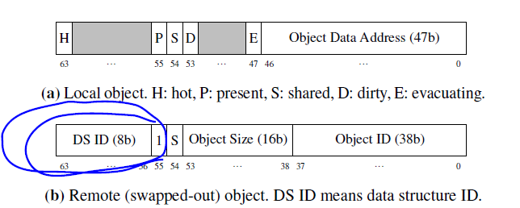
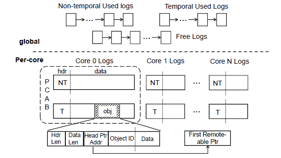

> RCU：https://blog.csdn.net/u012489250/article/details/93411656

## Abstract

AIFM就是去掉page swap机制的，工作在用户态的infiniswap、Fastswap。靠的是程序运行时runtime。

## 1 Introduction

靠OS的swap机制的remote memory都会受到OS kernel机制限制，性能很差。AIFM将swap机制集成到了app-level，当AIFM检测到memory pressure就自然会把一个指针变为remote指针。

DS ID就是哈希桶id，object id就是哈希表中的key。

本地memory以2MB的log进行管理（利用huge page），但是远程内存中并没有按log来，远程内存是独立的kv-store来存储的。在把本地object驱逐到远程时，是以object为单位进行驱逐。

log有三类，free、temporal、non-temporal，每个CPU有自己的log缓存区（PCAB），log缓冲区有两个log，一个temporal，一个non-temporal，temporal是给那些具有局部性的访问的object，non-temporal是指偶尔才访问一次的object。

在驱逐时，按照FIFO顺序，优先从non-temporal log队列中依次取出log进行清理，对于hot数据，会将其迁移到CPU本地的log缓冲区中新的log中，对于cold数据，才会将其驱逐到远程内存中。

