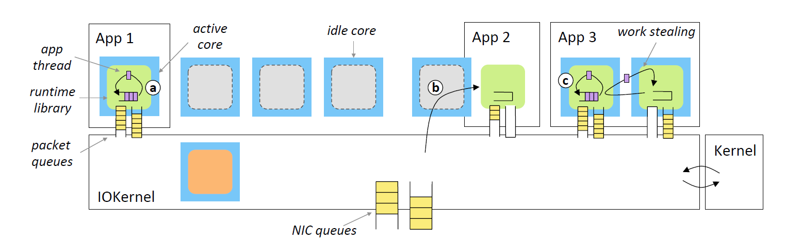

## 背景故事

对于Latency-sensitive的应用，许多论文的优化方法便是在用户态busy-polling NIC，以此实现kernel-bypass和低延迟，但是这样polling很显然会造成CPU的利用率低下。

为了降低数据中心的延迟和提高吞吐，各种kernel bypass协议栈方案被提出来，包括IX，ZygOS，但缺乏跨应用程序快速重新分配核的机制，因此必须配置足够的核来处理峰值负载。

## Shenango

Shenango分为两个部分IOKernel和APP的runtime（链接库）

#### Runtime

如上图，一个runtime就是服务一个应用程序进程。

1. runtime初始化时会建立多个kthread，之后当这个runtime每得到一个core就会派一个kthread去上面执行；

2. 一个kthread有自己的job queue和packet queue：

   - job queue负责调度APP的user thread；
   - packet queue是一片共享内存，IOKernel会将NIC中的packet转发到packet queue中；

3. runtime提供了很多kernel-bypass的system call供应用使用；

4. runtime中：

   - 不同core上的kthread之间的job可以stealing，即当一个core没活儿干就去偷其它core的活儿；

   - 不同core上的kthread之间的packet可以stealing，即当一个core把自己的packet ingress queue中的packets都处理完后，还可以去偷其它core中的packets进行处理；

     不过这样可能会导致packet出现乱序，作者说允许适当的packet乱序的好处就是明显提升性能，当需要顺序的时候shenango也提供了高效的方法使packet reordered；

#### IOKernel

IOKernel运行在一个专门的核上，分配核给不同的runtime和负责转发数据包。

**核的重新分配**

1. IOKernel每5us扫描runtime的job queue和packet queue，如果发现两次扫描中有同样的job或者packet，说明这个runtime缺core，就会给runtime增加分配的core数；

2. IOKernel分配core时，会考虑局部性等综合信息（有个决策算法）为runtime选择最合适的新core；

**数据包的转发**

1. Shenango利用**DPDK库**获取NIC的packet；

2. 每个runtime一个<ip addr, mac addr>，IOKernel根据这个将packet转发给对的runtime；

   - 在runtime内部使用RSS hash将packet分配到一个core的ingress packet queue上；

   > RSS hash应该就是个区分一个应用多个CPU的packet的；——让一个CPU的接受的packet不会突然发送给另一个CPU，尽量保证逻辑上的连续性
   >
   > RSS hash例如可以用{src: 1.1.1.1, dst: 2.2.2.2, srcport: 123, dstport: 456}计算出hash值；

