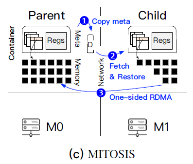
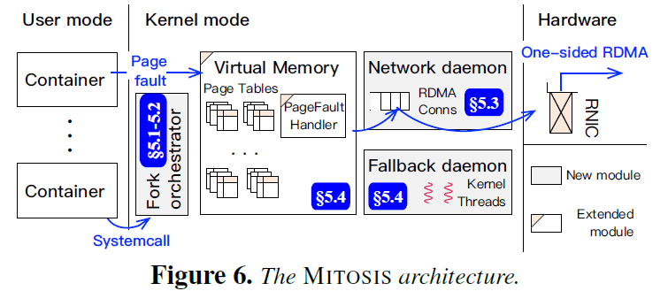

# No Provisioned Concurrency: Fast RDMA-codesigned Remote Fork for Serverless Computing

## 0 Brief

将kernel和RDMA进行结合，设计了一套原语MITOSIS，使得远程容器启动时间和本地容器性能差不多，也允许新启动的容器参数和fork复制的那个容器相同（参数初始化）。

## 1 Introduction

---

以前为了应对workload中某个function的使用高峰期（spike），采用的策略都是提前准备好（cache）一些容器，而这会造成资源的浪费，且cache再多也可能应对不了高峰期的海量用户访问。

> 作者分析工作负载Azure Function中某个函数在高峰期的调用频率突变33000x

同时在serverless computing中，不同function有时在不同的node中，具有依赖关系的多个函数在执行时须将数据从一个node传输到另一个node，这些数据传输包含的序列化、反序列化、内存复制等开销。（之前的工作尽量将具有依赖关系的function安排在同一个容器或者机器上）

现有的SOTA采用checkpoint & restore的方式来进行remote fork，然而这种方式因为checkpointing的开销以及将checkpoint文件通过分布式文件系统进行传输的开销，使得性能比coldstart还慢（即使采用了RDMA）。

---

MITOSIS提供了一种与RDMA深度结合的remote fork函数，能够将容器快速复制到多个机器上，以应对高峰期，同时fork出来的容器还可以和被fork的容器状态一致，减小了部分数据传输的开销。

作者的核心思想就是类似COW的方法，当fork一个容器时将其内存mapping到parent容器，触发COW的时候就RDMA READ和RDMA WRITE了。

---

NEW CHALLENGES

1. fast & scalable的RDMA连接
2. 对parent container的memory访问控制（parent的某块内存的物理地址发生变化，child该怎么办）
3. parent container的生命周期管理（在fork时必须等child fork完毕，parent才可结束）

作者的解决方案：

1. 利用RDMA DCT
2. 设计一种新的connection-based memory access control
3. co-designing container lifecycle with serverless computing（由coordinator决定parent生命）

> MITOSIS是一个采用Rust写成的linux module，可以在0.86秒内在5台机器上启动10000个容器

## 4 The MITOSIS Operating System Primitive

1. 将container的元数据（例如页表）浓缩成一个condensed descriptor
2. 将condensed descriptor通过RDMA传输给child
3. child开始运行，运行时产生page fault来进行RDMA READ读取所需page

---

- fork orchestrator负责进行remote fork
- network daemon负责管理RDMA DCT连接
- fallback daemon负责处理罕见的内存访问失效

## 5 Design and Implementation

### 5.1 Fork orchestrator

将fork从原本的一个函数拆分成两个，

1. **fork_prepare**

   fork_prepare就是生成parent的descriptor。

2. **fork_resume**

   child首先会调用RPC获取到parent的descriptor的RDMA地址，随后child调用RDMA READ进行获取descriptor。

   接着再**containerization**建立容器，再**switch**将CPU寄存器状态、页表信息切换成parent的状态。

   > 其中containerization比较耗时，作者采用了另一篇论文SOCK中的lean container的技术节省性能。

### 5.2 Network daemon

为了支持one-sized rdma且避免RC QP连接的超长时延，作者采用RDMA DCT连接，即一个DC QP可以先后和不同的child的DC QP进行one-sized操作（不需要进行连接），child只需要知道parent的DC QP的key即可。child的DC QP在进行one-sided操作时会在RDMA请求末尾附带有parent的DC QP的key值，网卡会先进行连接再执行RDMA操作。

当child向parent通过RPC获取descriptor的时候，parent会将自己的DC QP的key值附加到descriptor消息的末尾一同返回给child。

> 作者采用了kernel-space FaSST RPC作为内核态里RPC；

> RDMA DCT在传输小数据时由于频繁的切换连接，会造成性能下降。但是在超过1KB的数据情况下DCT和RC的之间的性能差距便很小可以忽略；

### 5.3 RDMA-Aware virtual memory management

MITOSIS使用了PTE中的1 bit作为remote flag，当触发page fault时便会被MITOSIS进行处理。

要说明的是，触发page fault时的RDMA READ是直接用物理地址PA去获取的remote parent page，如果parent中这个page因为一些情况换了物理地址，则此次RDMA READ会直接失败。因为parent中各个虚拟地址VMA有一个DC target（DC target也就是server端的DC QP），如果一个VMA中的某个page换了PA，则parent会将这个PA所在的VMA的DC target直接删除，因此后续READ会失败。在RDMA READ失败后，就需要用VA来再次尝试获取page，这时候便会靠RPC来进行读取。每个node负责处理此RPC请求的便是**fallback daemon**。因为这种情况很罕见，所以需要fallback来读取的情况不会对性能造成太大影响。

### 5.4 Optimizations: prefetching and caching

> 估计这里才是性能提升最大的点

**prefetch**：MITOSIS每次read page时会顺便多read一个相邻的page；

**caching**：MITOSIS会将每个finished的container的页表和从远程读取的page都缓存几秒，如果有相同parent的child新产生，就直接reuse，以应对spike load。

**supporting multi-hops remote fork：**作者在PTE额外占用4bit来表示此page的owner是第几代ancestor，以支持multi-hops fork；