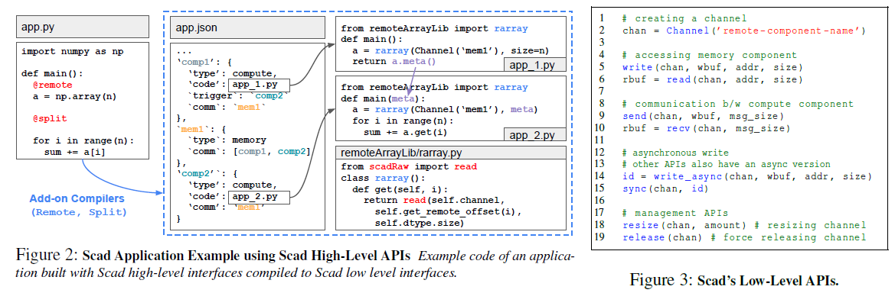

# Resource-Centric Serverless Computing

## Brief

现有的无服务计算（serverless computing）都是以function为单位执行（function-centric），几点limitations：每个function可以获得的resource有限；固定的cpu-memory比例；每个function在执行时都需要频繁地alloc和free一些resource。

作者提出了resource-centric的无服务计算系统Scad（Serverless Computing with Aggregation and Disaggregation）。在解决了多种resource-related问题的情况下还保持着原来的性能甚至优化了部分性能。Scad主要适合那些执行过程中resource变化很大的应用。

## 1 Introduction

现有无服务计算系统的几大问题：

1. CPU-memory比例固定，然而workloads的CPU-memory比例是随机的；
2. 创建function node时资源是按照peak usage进行分配的，导致资源浪费；且资源都是function开始执行时alloc，执行完毕后就free（粗粒度，有些数据本来可以提前free）；
3. function执行过程中产生的部分数据在function执行结束后就被摧毁，使得这种数据在不同function间共享很难。
4. function可以获得resource有限，使得用户必须重写应用程序将large data切分成smaller pieces。

Disaggregation
作者将应用分解成各个component（分为memory component和compute component），一个component就是<resource type, resource amount, span>，应用就是各个component组成的一个有向拓扑图。每个component都在resource type对应的pool中进行运行，以允许每种pool的资源灵活分配。这样按type进行diaggregate的好处：

1. 允许各种resource的独立扩展，例如CPU-memory比例不固定；
2. 可以通过多个component来捕捉用户应用对资源的使用情况，不必按照peak usage进行分配；
3. 一个应用可以分配超过单个node的资源；
4. 当多个应用想要共享数据时，通过RDMA可以提升性能；

Aggregation
然而将应用分解成多个component不可避免地会因为component之间的数据传输以及component的启动时间等给系统性能带来明显下降，为此作者第二个idea就是尽可能地将相关的component放在一个物理server中运行（run them together in a balanced pool），以避免网络通信、启动时间、scheduling burden等开销。

Challenges

1. 如何处理component在执行过程中必须进行的动态资源扩展和聚合，以实现目标性能和资源效益。
   分为virtual和physical component（类似虚拟-物理内存），然后动态调度。
2. 如何快速建立起RDMA连接。
   建立了一个基于RDMA的通信系统，该系统明智地利用了一个间接通道来建立连接。

## 3 Scad Abstractions

Scad支持用户使用Python编写程序。

### 3.1 Resource-Based View of Applications

一个component就是在相同的一段时间范围span内都活跃的某种resource。分为memory和compute两种类型，memory的在**memory pool**，而compute component如果使用的local memory较少就在**compute pool**否则在**balanced pool**。

component之间分为trigger关系和communicate两种关系，trigger就是compute调用其它compute（且将自己的output发送过去），communicate就是不同component之间数据交换。

> memory component是系统自动创建的（不是由trigger创建），当某个compute第一次访问时就会创建

### 3.2 Scad Programming Models

Scad的API分为high-level和low-level两种，用户使用high-level，由Scad将其编译为使用low-level的，以及还会编译出一个JSON文件用于描述各个component的关系。

> 当前Scad只支持@remote和@split两种annotation，以及只支持Numpy array和Pandas dataframe两种Library中的数据结构。

### 3.3 Component Materialization

前面编译生成的component都是virtual，Scad会在run-time将virtual component给实例化成physical component，virtual和physical之间的数量映射关系并不固定。一个virtual可以分解成多个sever中的多个physical；多个virtual也可以组合成一个physical；还可以动态地为一个virtual增加physical。