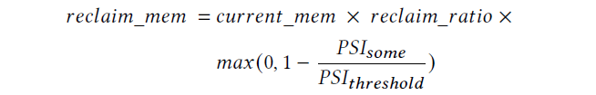

# TMO: Transparent Memory Offloading in Datacenters

> [https://mp.weixin.qq.com/s/o_crgy2FDJm24BNLtHFkow](https://mp.weixin.qq.com/s/o_crgy2FDJm24BNLtHFkow)

作者在内核中设计了一种能够自动将memory offload到次级内存中（例如compressed memory，remote memory，NVM等）的系统，能够根据应用对page access slow down的敏感程度以及次级内存的性能进行自适应调整。TMO不光将匿名页offload，还将文件页offload，并且在这两种内存页的swapin的频率进行均衡。该系统已经在Meta中运行了超一年，能够节省20-32%的内存。

TMO系统是在内核中借用swap机制实现的（顺带批评了google的software defined far memory，下文简称g-swap，认为其只针对compressed memory不够heterogeneous，并且认为g-swap中通过自适应地调整参数使应用的page-promotion rate在一定阈值之下的做法是不科学的，对于某些应用在一些更快的offload device的环境下更高的rate会让性能反而更好）。

一个应用的memory tax是指除了应用直接占用的内存之外，因为部署应用到datacenter中产生的额外内存开销。作者说将这部分memory offload对应用的性能影响较小，需要优先考虑offload这部分。

TMO分为PSI（内核态）和Senpai（用户态），PSI为Senpai提供应用的性能下降信息，Sempai负责通过设置cgroup的配置文件来进行memory offload。PSI是从Linux Kernel中的Memory Managment部分获取所需信息。

## 3.2 Defining Resource Pressure

之前的工作主要使用每个应用运行时触发的major fault数量作为衡量memory pressure的指标，但是在切换work set或者刚启动新应用时major fault也可能升高（而不是因为memory shortage），并且不同的offload device，同样的major fault频率对应用影响也不相同。

为每种资源设计了两个统计数值some和full
some：≥1个进程等待该resource的时间百分比（%）
full：所有进程都在等待该resource的时间百分比

TMO收集每个CPU中的各种resource的some和full time，并且将其切分整合成以例如container的单位。

过高的full代表着系统中出现了急需修复的问题，some则代表系统缺少某种资源的程度，TMO通过some指标来控制每种资源的分配。

## 3.3 Determining Memory Requirements of Containers

通过上述公式决定一个container该回收多少的内存，其中reclaim_ration和PSI_threshold是提前设置好的超参数。

TMO为cgroup设置新的memory control文件”memory.reclaim”，通过写这个文件就可以在不更改cgroup memory上限的情况下让kernel去回收指定数量的内存页。

在生产中，设置𝑟𝑒𝑐𝑙𝑎𝑖𝑚__𝑟𝑎𝑡𝑖𝑜= 0.0005和𝑃𝑆𝐼_𝑡ℎ𝑟𝑒𝑠ℎ𝑜𝑙𝑑= 0.1％，每六秒执行一次reclaim。作者说TMO对这两个超参数并不是特别敏感，并且将这两种参数自动调整的研究工作留给未来…

在生产中，PSI不光对memory access进行some和full的监控，同样还对IO device进行此类监控。

Senpai在用户态的好处是：首先，用户空间可以完全访问浮点单元，因此可以更有效地执行计算。 其次，用户空间组件的发布周期往往比内核快得多。

## 3.4 Kernel Optimizations for Memory Offloading

TMO采用的还是Linux Kernel中的active/inactive LRU list的算法选择页面进行回收，在生产中，由 Senpai 驱动的回收消耗了所有 CPU 周期的 0.05%，这个数字可以忽略不计。

在选择待回收页面时，Linux Kernel偏向于优先回收文件页而非内存页，为此TMO设计了refault-detect机制，具体说来就是当evict一个文件页时，就在一个shadow entry中记录此时的page fault count，等再读取回该文件页时就将此时page fault count减去shadow entry中记录的旧值，如果差值小于整个size of resident memory，就认为是一次refault（意思就是不该在之前evict此文件页）。

作者通过refault来进行一些优化，比如在统计memory的some和full指标时，就排除掉那些第一次访问文件页时产生的time，对文件页只统计refault的文件页的time。

通过refault，作者还在TMO中来平衡对文件页和匿名页的回收（之前算是偏向回收文件页），现在的机制变成了：只要没有refault产生就一直回收文件页，而一旦refault开始出现，就based on the refault rate and swap-in rate respectively来平衡文件页和匿名页的回收。

## 4.2 Performance Impact on Memory-Bound Applications

