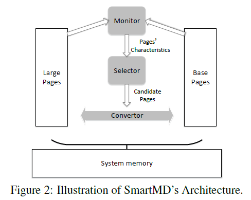
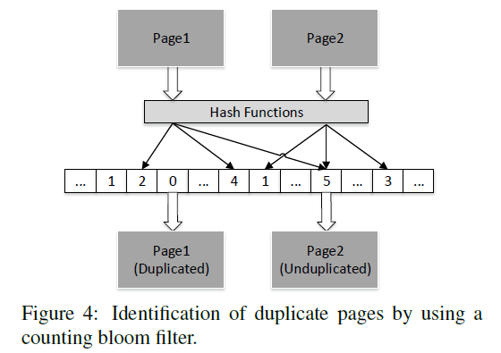
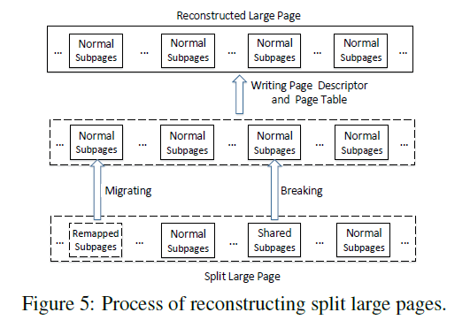

# SmartMD: A High Performance Deduplication Engine with Mixed Pages

2MB的大页面减少了TLB miss，但是会减小memory deduplication的几率。作者提出的SmartMD可以准确监控page的**访问频率**和**重复率**，并且自适应地决定page拆分或者重新组合成huge page。

核心idea就是将重复率高的cold large page进行拆分然后合并，当cold转为hot时又将这些split page合并成huge page。（核心难点就是如何准确识别page的重复率和冷热程度）

SmartMD主要分为Monitor、Selector、Convertor；

## Monitor

监视剩余free memory数量：OS中已有相关机制，直接复用。

监视page被访问的频率：利用PTE的access bit，周期性地scan，在每一次scan开始时将所有page的access bit清0，然后*check_interval*秒后再扫描，如果access bit为1就将该page的**访问频率**加1（有最大值N），否则减1。系统刚启动时将所有page的访问频率初始化为N/2。
如果page是huge page且被split，则此huge page任一sub page被访问到就将原来huge page的**访问频率**加1，否则减1。

监视huge page中duplicate sub page的比例：SmartMD使用counting bloom filter来识别duplicate page。counting bloom filter就是一个大的数组，每个元素是3-bit counter。首先会用三个不同hash函数计算出这个sub page在counting bloom filter中的三个index（下图中三个箭头），然后再用一个hash函数计算出sub page的signature：如果该signature未出现过，则会将counting bloom filter中的三个index对应的位置的counter加1；否则代表该signature出现过，SmartMD会检查三个index对应的位置的counter，如果都大于0则认为该sub page是duplicate的。
当sub page发生改变时（即signature发生改变），会将原来三个index位置的counter减1，然后再计算新的三个index，将相应counter加1。当sub page被释放时也会将对应的counter减1。

> SmartMD将counting bloom filter的长度设置成系统page数量的8倍，这样可以使duplicate识别错误率降低至3.06%

为了进一步提升扫描huge page的效率，SmartMD每次都只会从huge page中sampling 25%的sub page先进行检查，如果有任一sub page发生改动才会对整个huge page都进行扫描。否则则只会在这25%中的sub page计算duplicate page的比例作为整体比例的估计。

SmartMD会将识别成duplicate的page进行标记，KSM线程随后会优先在labeled pages中寻找完全相同的page进行合并。

## Selector

将所有page根据**访问频率**分为cold、warm、hot三种，

将所有huge page根据**duplicate比例**分为duplicate和non duplicate两种，这个比例SmartMD设置成1/8。

Selector只选择cold and duplicate状态的huge page作为split candidate；只选择hot状态的huge page作为reconstruction candidate。

## Convertor

Convertor负责splitting和reconstruction，splitting可以直接调用OS中的现有函数进行。

reconstruction分为3步：

1. 检查huge page对应的所有sub page，将任何duplicated page进行复制，然后将所有page移动（migrating）到一片连续的物理内存。
2. 创建新的page descriptor
3. 在页表中创建新的PTE，invalid所有旧的PTEs

减小migrating时间消耗的措施：

1. in-place gathering：如果huge page大部分sub page都还留在原地，则直接将其它page移动出去，并将少部分外地的sub page移动回来。
2. out-place gathering：alloc新的huge page，将所有sub page移动到这个新的huge page。

因为hot huge page都是具有时间局部性，所以huge page的sub pages要么大部分在原地，要么大部分都移动到其它地方。

避免SmartMD过度影响性能的措施：

在每轮周期性scan所有page的access bit开始时，检查系统memory使用率，如果memory使用率高，则将cold阈值增加1，以此增加被识别为cold的huge page数量，否则减1。（cold阈值就是指page被识别为cold的**访问频率**）