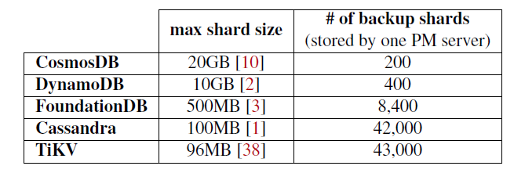
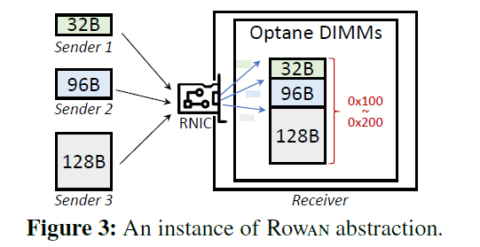
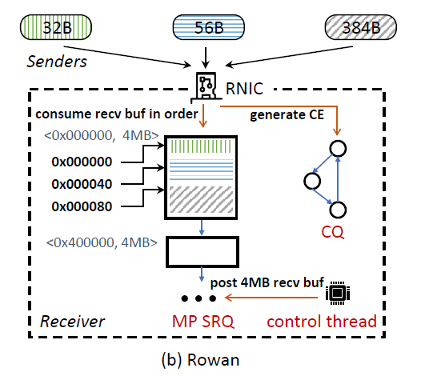
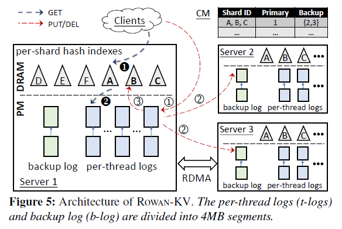

# ReplicatingPersistentMemoryKey-ValueStoresWithEfficientRDMA

## Abstract

将Persistent Memory（PM）和RDMA结合，实现高性能分布式replicated KV store。

现有的replication方法和PM KV并不适合。1)如果用RPC，则会在后端排队，使得latency延长；2)如果使用one-sided RDMA则因为很多的小写入，在PM中造成严重的写入放大（device-level write amplification，DLWA）；

本文提出的ROWAN就是一个能够在PM KVS高性能执行replication write的RDMA方法（RDMA Abstraction），它通过顺序地（sequentially）聚合来自不同server的写请求，通过一次one-sided RDMA write来同时实现**低写入放大**（DLWA）和**低延迟**。

本文build了ROWAN KV，a log-structured PM KVS using Rowan for replication。

## 1 Introduction

最近的工作已经有人用RDMA在DRAM中复制数据（WRITE-enabled replication），抹去了RPC请求排队时间，因此性能得到明显提升。

然而在PM中直接用RDMA却不行，因为DLWA写放大，每个replication write基本只有100B，例如**FaRM**中的写log，因为PM最小写入单位为Block，例如Optane DIMMs中为256B，

对RDMA的两点观察：

1. RDMA SEND在control path中是two-sided，但在data path上是one-sided；（？）
2. RNIC在receive buffer接受数据时是按buffer顺序的；

ROWAN按地址升序将PM buffer地址push到RNIC中；并且采用RDMA SRQ和MP RQ等技术来将不同connection的write merge起来并且varied-sized write。ROWAN在64B大小够达到54.5Mop/s，并且几乎没有写入放大。

ROWAN简单说来就是利用RDMA实现KVS中log的主从复制，每当遇到一个PUT请求，worker thread会首先将log记录到本地PM中，然后再通过one-sided ROWAN复制到其它remote PM中。遇到一个GET请求则查询内存中的index，获取到object的地址信息。

## 2 Background and Motivation

### 2.1 Persistent Memory (Intel’s Optane DIMM)

PM的写带宽2GBps (1/6 of DRAM)
PM的读带宽6GBps (1/3 of DRAM)

PM的写延迟和DRAM类似
PM的读延迟大约是DRAM的3x

计算机系统以64B为粒度对memory设备进行读写，然而PM支持的最小粒度为256B，为此PM内部一般设置有个XPBuffer来将物理地址连续的写入进行合并，以尽量避免写放大问题。实际上XPBuffer大小为16KB.

PM分为ADR mode和eADR mode，在ADR mode下，掉电时cache中的数据会丢失；在eADR mode下，掉电时cache中数据会flush到PM中。

### 2.2 Remote Direct Memory Access

为了确保RDMA每次写的数据能够在PM上持久化，需要：

1. 每次在WRITE后READ 1B（arbitrary address）来让RNIC和PCIe中的buffer flush掉（？）；
2. 需要关闭DDIO，DDIO是一种可以让RNIC直接将数据写到cache而非memory的技术，以此避免ADR模式下掉电丢失数据和eADR模式下cache每次64B写导致的写放大的问题；

### 2.3 High Fan-in Small Writes in KVSs

- Data Sharding

分布式数据存储系统一般将整个数据集分成不同的shards分散到不同的server中，每一条数据都会有很多replicas，分为一个primary和多个backups。

high fan-in writes就是因为write一个数据会先写primary然后再写backup，在整个集群中就表现成错综复杂的write请求。

shard size越小，每台PM服务器上shards数量越多，就会导致越明显的high fan-in writes。并且一些DB为了提高性能，每个thread会单独和remote建立起链接，这样就会导致the degree of fan-in从服务器数量级别提升到了thread数量级别，导致high fan-in writes现象更加严重。

- Numerous small-sized objects

商业KVS中数据长度大多数小于100B，远小于PM的256B的最小粒度；

### 2.4 DLWA from WRITE-enabled Replication

primary采用one-sided WRITE而非RPC来向backups发起replication write请求，可以明显提升性能；

在之前的系统中（例如FaRM），每个服务器会为每个remote thread在PM中维护一个log来记录操作过程，例如90台服务器，每台30个线程，则每个机器上就会维护89*30个logs，这些logs会导致大量的小写入，从而造成严重的PM写放大问题。（需不需要先写log再写memory？）

当远程连接数（remote streams）达到144以上时，64B写放大现象为2.48x，128B写放大现象为1.58x。

> To efficiently handle high fan-in small writes, we need a new RDMA abstraction (rather than WRITE) for PM KVSs. This abstraction should mitigate DLWA, while achieving benefits of one-sided verbs — low latency and high CPU efficiency.

## 3 Rowan Abstraction

### 3.1 Rowan Semantic

在一个instance中，有多个sender和一个receiver，receiver端的RNIC将并发的多个小写入按顺序合并成一个大的write stream，以此来让PM中的XPBuffer可以将写入按照256B大小进行。

- Comparison with batching

Batching也是一种减小写放大的方法，但是会延长latency，并且在短时间内很可能凑不到足够的小写入形成一个batch。而Rowan可以随时随地将写入lands到一个大的write stream中。

### 3.2 High-Performance Rowan

ROWAN不需要对RNIC进行修改，因此可以直接用在现有RNIC网卡上。

- Straightforward Solution

如果简单的实现的话，每次write可以分成两部分，先通过FETCH_AND_ADD这种RDMA ATOMIC获取到远程内存中的地址，再通过WRITE将数据进行写入，然而这样做会需要2个round-trip，进一步增加延迟，并且FETCH_AND_ADD的性能也很差，最大不过10Mops

- Our Solution

**ROWAN采用SEND和RECV来实现的**。基于以下两点观察：

1. RDMA SEND只是在control path上需要双方参与，即需要receiver提前把buffer通过RECV准备好，然而在后续接受SEND指令的data时都是由receiver RNIC自动处理；
2. 在RDMA RQ中，receive buffer是按顺序进行consume的；

- Basic Architecture

ROWAN采用RC QP；并且采用SRQ来将所有QP receive的数据统一存储到一个SRQ上；sender每次WRITE都会紧跟一个READ(1B)来使得数据persistent；

- Handling Variable-sized Writes

ROWAN以64B为大小对PM空间进行切分。ROWAN采用的是RDMA中最新的队列**MP RQ**，这种队列可以把多个send请求的数据放到同一个receiver buffer中，当这个buffer满了再从MP RQ中取出下一块buffer，MP RQ可以设置步长stride，每个请求的数据都将按照步长进行对齐。ROWAN的MP RQ每个buffer大小为4MB，步长为64B。ROWAN采用的其实MP RQ的SRQ版，即**MP SRQ**。

关于MP SRQ的两点：

1. 为什么选择64B作为步长？因为作者用的ConnectX-5支持的最小步长为64B，且最近的一篇研究指出PCIe上的small write最好按照PCIe data word对齐，即64B；
2. 如果SEND的数据超过了MTU，则RDMA SEND最后的结果可能会将这段数据拆分存储到不连续的物理空间，ROWAN认为这部分影响应该由上层应用自己考虑；

- Minimizing control-path tasks

ROWAN采用一个control thread负责所有的control-path tasks，其实tasks也就两个：

1. 时不时地往MP SRQ里加buffer
2. 把每个RECV生成的CE取走

对于1，因为buffer很大4MB，所以任务量很小；对于2，因为RECV的CE不能像WRITE那样采用unsignal，所以每个RECV都会生成个CE，作者最后的做法就是将CQ改成个环形队列，让不断生成的CE去覆盖CQ之前的格子，并且control thread干脆都不管CQ了，非常easy。

## 4 ROWAN KV Design

1. Low Latency，ROWAN KV使用one-sided ROWAN进行主从复制；
2. Low DLWA，写local log直接append data in its log，写remote log则多个sender的write会被merge在一起形成一个write stream，因此PM的write stream数量很少，能够在XPBuffer中高效地将物理相邻的write合并；

> ROWAN的log structured就是指用追加写的方式来更新数据，以此避免DLWA

### 4.1 Overview

将所有数据分成shards分散到多个server中，以shard为单位进行replication，1个primary和多个backups，client通过RPC的方式来使用ROWAN KV。

ROWAN对每个KV按照key值进行hash，根据hash值分配到不同的shard中，由一个configuration manager（CM）负责shards在多个server中的balance。（shard只是一个逻辑上的单位而已，物理上，同一个shard中的object可能分散在不连续的log segment中）

关于log，每个work thread对应一个t-log，每个server中有一个b-log（由control thread管理），每个shard有一个index负责记录这个shard中的KV在哪些log中。

当client发起PUT请求时，会向对应shard的primary所在的服务器发起RPC请求（**PUT、GET、DEL请求都是发给primary服务器**），然后由对应的worker thread生成一个log entry并append到t-log中，然后再向其它backup发起one-sided ROWAN请求，将这个log entry append到这些backup服务器的b-log中，当RNIC收到所有的ACK后，primary再才会更新对应shard的index，并将结果return给client。

## 4.2 Log Metadata

### 4.2.1 Segment Metadata

log由多个4MB的segment组成，ROWAN中有一个数据结构segment meta table记录每个segment的元数据。

segment分为以下几个状态：

1. Free
2. Using，已经分配给一个thread（workers or control），但还未满
3. Used，已经满了，但还未确认在多个backups之间持久化完成
4. Committed，Used的segment确认持久化完成

### 4.2.2 Log Entry Metadata

一条log entry包含操作类型（PUT、DEL）、以及target data（key）、以及以下三种metadata：

1. checksum，就是个校验码，怕数据损坏；
2. version，每个shard都维护一个version counter，每当产生一个log entry时counter就加加；
3. shard ID，该log entry属于哪个shard；
