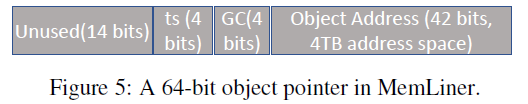
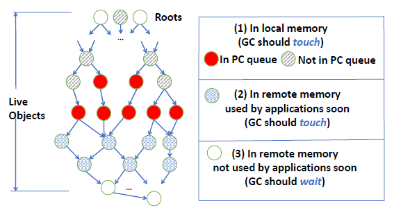

## 故事背景

就是说像java、Go、Python这种managed language，都会有GC后台线程来进行垃圾回收，垃圾回收主要分为两个步骤：

1. mark live objects：从stack或者global variable出发，标记所有能够访问到的object为live，所有不能访问到的object就是obsolete；
2. reclamation：将所有obsolete objects删除，将所有live objects搬迁到新的空间；

在remote memory的场景下，GC后台线程会导致底层的prefetch预取器命中率下降；同时GC还会将一些不必要的page swap到local memory中，进一步降低性能。也就是称为干扰（interfere）。

> 主要的设计只在第4章

## 4 MemLiner Design and Implementation

### 4.1 Application and GC Coordination

每个Application Thread一个PQ队列；

每个Tracing Thread一个TQ队列（TQ队列实际上就是正常GC时所用的一个用于BFS遍历的队列）；

每当Application Thread访问某个object，就将其push到自己线程的PQ队列中，之后Tracing Thread会轮询每个PQ队列，从中pop出object并进行标记live；

### 4.2 MemLiner Tracing Algorithm

MemLiner更改了JVM中指针结构，在Unused bits中用了4bit来代表当前epoch（15++则变为0）；

每当本地内存变换了N%的page，则epoch++；（具体应该就是触发了多少次swap就会epoch++吧）

每当application thread访问一个object时，便会在其指针中更新这个epoch（也就是timestamp字段）。例如``b.f = a``就会更新b的epoch，并且如果a也是指针，则还会更新a的epoch，虽然a还没被解引用，但因为a即将被解引用。

如上图，将所有object分为三类：

1. 在local的
2. 在remote，但是离local很近的；
3. 在remote，但是离local很远的；

在进行Tracing的时候：

1. 如果任一Application Thread的PQ不为空，则优先访问PQ中的object，并且还会递归访问离这个object 3跳之内的object。并且还会将最后第4跳的object push到application线程的TQ中。

2. 如果PQ为空，则还是和default的动作类似，根据自己TQ，继续进行BFS，但在BFS时，会比较object指针中的epoch编号和当前epoch，如果相差得大，则会推迟这个object的访问，将其重新push到TQ队尾，将其被推迟数++（MemLiner为TQ中每个object还记录了个被推迟的次数），如果被推迟次数大于了``MAX_DL``，则此object就会立马被访问了。

> 不用担心一个object被多次访问，因为标记一个object时会去bitmap查询，已经被标记了就不会再被标记。

MAX_DL会根据空闲内存多少来自动调整：

1. 空闲内存低于15%，则MAX_DL为0；
2. 在15%~50%，则MAX_DL为2；
3. 高于50%，则MAX_DL为4；