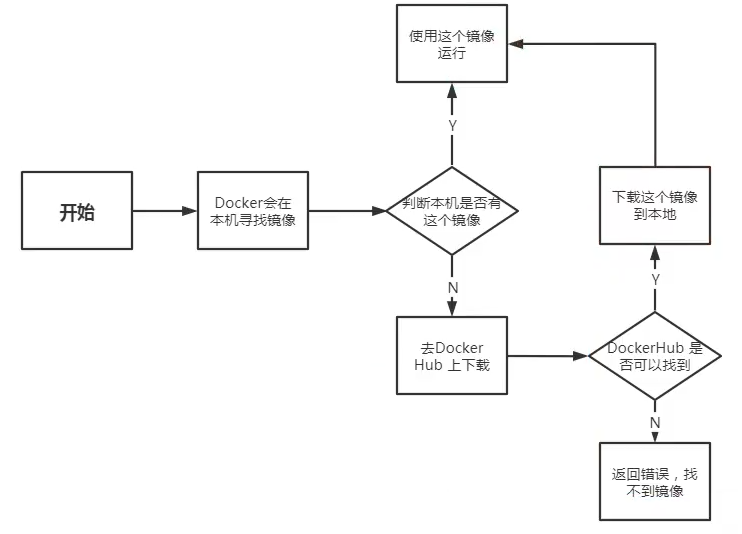
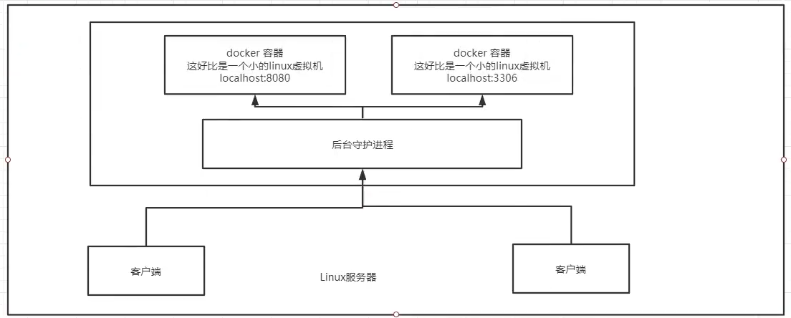

## 安装docker

文档地址：https://docs.docker.com/

注意：ce是社区版，ee是企业版（学生当然用社区版）


**启动hello-world**：

```shell
sudo docker run hello-world
```

**查看已有的docker镜像**：

```shell
docker images
```


## 阿里云镜像加速

就是去阿里云——弹性服务——容器镜像服务——镜像加速器一栏，跟着文档配置加速器之后就能使容器下载变得非常快。


## docker run 流程



## 底层原理

Docker是C-S结构，Client通过Socket与服务器中执行Docker服务的守护进程进行通信，Client发送命令，Sever就会进行。



