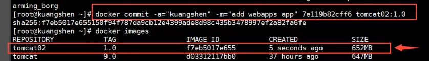

# Docker镜像讲解

## Docker镜像加载原理

> UnionFS（联合文件系统）

我们下载的时候看到的一层层就是这个！

UnionFS（联合文件系统）：UnionFS是一种分层、轻量级且高性能的文件系统，它支持对文件系统的修改作为一次提交来一层层的叠加，同时可以将不同目录挂载到同一个虚拟文件系统下。Union文件系统是Docker镜像的基础。镜像可以通过分层来进行继承，基于基础镜像，可以制作各种具体的应用镜像。

特性：一次同时加载多个文件系统，但从外面看起来，只能看到一个文件系统，联合加载会把各层文件系统叠加起来，这样最终的文件系统会包含所有底层的文件和目录。


> Docker镜像加载原理

**Docker的镜像实际上由一层一层的文件系统组成**，这种层级的文件系统UnionFS。

bootfs主要包含BootLoader和kernel，bootloader主要是引导加载kernel，Linux刚启动时会加载bootfs文件系统，在docker镜像的最底层是bootfs。这一层与我们典型的Linux/Unix系统是一样的，包含boot加载器和内核，当boot加载完成后整个内核就在内存中，此时内存的使用权已由bootfs转交给内核，此时系统也会卸载bootfs。

rootfs，在bootfs之上，包含的是典型Linux系统中的/dev, /proc, /bin, /etc等标准目录和文件，rootfs就是各种不同的操作系统发行版，例如Ubuntu，centos等。


> 为什么Docker中的CentOS只有200多M？

对于一个精简的OS，rootfs可以很小，只需要包含基本的命令，工具和程序库就可以了，因为底层直接用Host的Kernel，自己只需要提供rootfs即可，由此可见对于不同的Linux发行版，bootfs1基本是一致的，rootfs会有差别，因此不同的发行版可以公用bootfs。


## 分层的理解

> 分层的镜像

我们可以去下载一个镜像，注意观察下载的日志输出，可以看到是一层一层的在下载！

**思考**：为什么Docker镜像要采用这种分层的结构？

资源共享，例如有多个镜像都从相同的Base镜像构建而来，那么宿主机只需在磁盘上保留一份Base镜像，同时内存中也只需要加载一份Base镜像，这样就可以为所有的容器服务了，而且镜像的每一层都可以被共享。

查看镜像分层的方式可以通过``docker image inspect``命令。

**理解**：

所有的Docker镜像都起始于一个基础镜像层，当进行修改或增加新内容时，就会在当前镜像层之上，创建新的镜像层。

举一个简单的例子，例如基于Ubuntu Linux 16.04创建一个新的镜像，这就是新镜像的第一层；如果在该镜像中添加Python包，就会在基础镜像层之上创建第二个镜像层；如果继续添加一个安全补丁，就会创建第三个镜像层。


在额外添加镜像层的同时，镜像始终保持是当前所有镜像的组合。（也就是说从外面看镜像是把所有层里面的文件“压扁”了来看的，特别是如果不同层之间的文件有覆盖，则发生覆盖的文件会发生上面层文件会替代下层文件）


Docker通过**存储引擎**（新版本采用快照机制）的方式来实现镜像层堆栈，并保证多镜像层对外展示为统一的文件系统。

Linux上可用的存储引起有AUFS、Overlay2、Device Mapper、Btrfs以及ZFS。顾名思义，每种存储引擎都是基于Linux中对应的文件系统或者块设备技术，并且每种存储引擎都有其独有的性能特点。

Docker在Windows上仅支持Windowsfilter一种存储引擎，该引擎基于NTFS文件系统之上实现了分层和CoW。


> 特点

Docker镜像都是只读的，当容器启动时，一个新的可写层被加载到镜像的顶部。

这一层就是我们通常说的容器层，容器之下的都叫镜像层。


## 如何提交一个自己的镜像

```shell
docker commit 提交容器成为一个新的副本

#命令和git原理类似, 把一个正在运行的容器制作成镜像
docker commit -m="提交的描述信息" -a="作者名称" 容器id 目标镜像名:[TAG]
```

实战测试：

```shell
#启动一个默认的tomcat
#发现这个默认的tomcat是没有webapps应用, 这个是由于官方镜像默认是没有的
#自己从webapps.dist文件夹拷贝到webapps
#制作镜像
docker commit -a="kuangshen" -m="add webapps app" 7e119b82cff6 tomcat02:1.0
```



