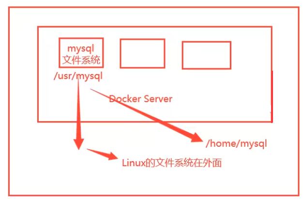
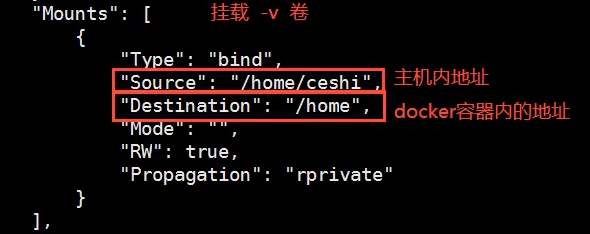
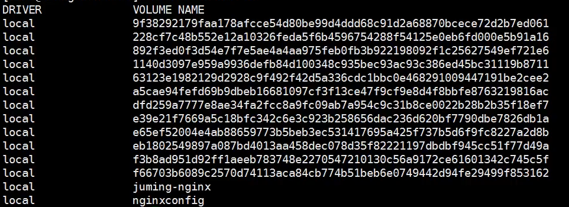
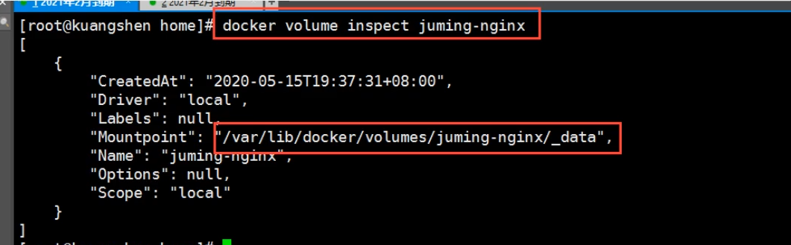
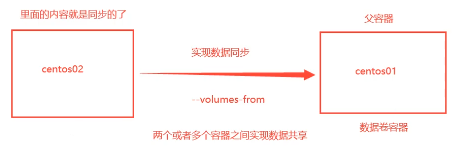

# 容器数据卷

## 什么是容器数据卷

如果数据都在容器中，那么删除容器则数据也会丢失！**需求：数据持久化**

容器之间可以有一个数据共享的技术，Docker容器中产生的数据，同步到本地。这就是卷技术，目录的挂载，将容器内的目录挂载到Host上面。



总结就是一句话，容器的持久化和同步操作。容器间也是可以数据共享的。


## 使用数据卷

> 方式一：直接使用命令来挂载 -v（类似端口映射-p）

```shell
docker run -it -v 主机目录:容器内目录 镜像名 镜像应用

#举例
docker run -it -v /home/test:/home centos /bin/bash
#查看下
docker inspect 容器id
```




## 实战：MySQL部署

一行docker run可以跟多个``-v``挂载参数。

思考：MySQL的数据持久化问题。

```shell
#获取镜像
docker pull mysql:5.7

#启动Mysql mysql默认端口3306 
--name是给容器取名 
-d后台运行 
-v数据卷挂载 
-e环境配置
docker run -d -p 3310:3306 -v /home/mysql/conf:/etc/mysql/conf.d -v /home/mysql/data:/var/lib/mysql -e MYSQL_ROOT_PASSWORD=123456 --name mysql01 mysql:5.7

#用sqlyog测试一下
```

即使删除这个容器，这两个挂载的数据卷依旧没丢失。


## 具名挂载和匿名挂载

**匿名挂载**就是在挂载时只写容器内路径，``-v 容器内路径``

```shell
#匿名挂载
-v 容器内路径
docker run -d -p --name nginx01 -v /ect/nginx nginx

#查看当前docker的所有数据卷
docker volume ls
```



docker volume ls的情况如上图，volume name是数据卷的名称（就是文件夹名称），是数字串的就是代表匿名挂载的卷。


**具名挂载**就是在挂载时写成``-v 卷名:容器内路径``。注意卷名不可是绝对路径（前面加了`/`就是绝对路径）

```shell
#具名挂载
docker run -d -P --name nginx02 -v juming-nginx:/etc/nginx nginx

#查看某个卷的情况
docker volume inspect 卷名
```



所有docker容器内的卷的数据，没有指定目录的情况下都存放在``/var/lib/docker/volumes/xxx/_data``中。


```shell
#总结
-v 容器内路径		      #匿名挂载
-v 卷名:容器内路径			 #具名挂载
-v 宿主机路径:容器内路径	   #指定路径挂载
```

拓展：

```shell
#-v 容器内路径:ro rw改变读写权限
#权限是限制容器的，ro是指容器不能改变其内容，只能通过Host改变
docker run -d -P --name nginx02 -v juming-nginx:/etc/nginx:ro nginx
docker run -d -P --name nginx02 -v juming-nginx:/etc/nginx:rw nginx
```


## 数据卷容器

多个容器同步数据。



```shell
#--volumes-from 容器名称
#只复制数据卷容器里的volume，不是所有文件都复制
```

如果数据卷容器里的卷没有挂载到Host，则所有容器删除完后那个文件夹才被删除。但如果数据卷容器的文件夹已挂载到Host，则即使所有容器都删完了对应的文件卷也不被删除。
