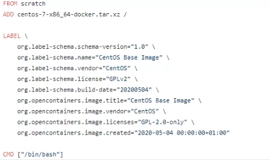
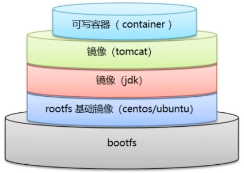
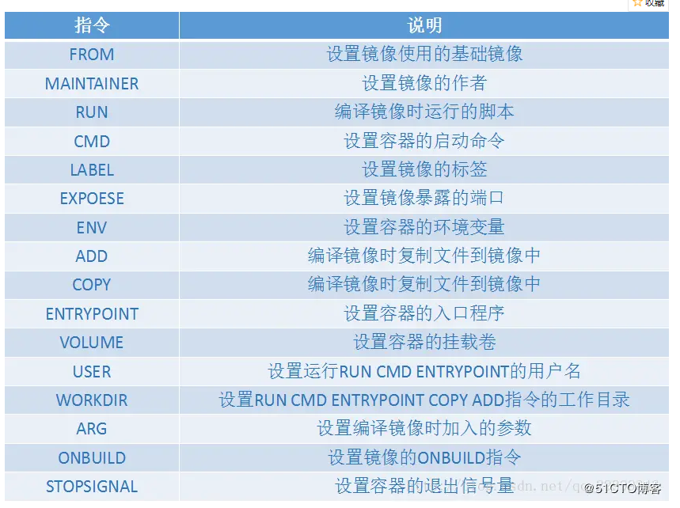
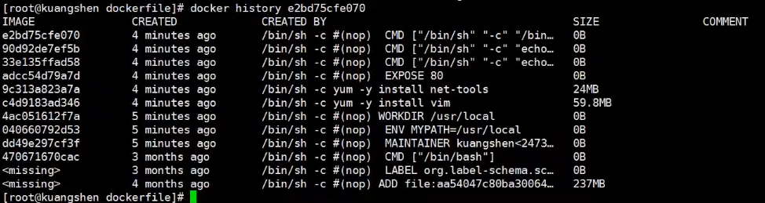

# DockerFile

## 初识DockerFile

Dockerfile就是用来构建docker镜像的构建文件！就是一段命令脚本。（类似Makefile？）

镜像是一层一层的，脚本也是一个一个的命令，每个命令就是一层。

```shell
#1.先写个脚本文件
vim dockerfile01
#以下是其中内容 格式：指令（大写） 参数
#每个命令就是镜像的一层
FROM centos

#这里是匿名挂载，在Host用docker inspect看这两个文件夹在Host的位置
VOLUME ["/volume01","/volume02"]	#这里的VOLUME就相当于"-v"，在镜像中创建好两个文件夹

CMD echo "----end----"
CMD /bin/bash

#2.启动脚本 t是target的意思
docker build -f /home/dockerfile1 -t centos01:1.0

#3.查看镜像
docker images

#4.启动镜像
docker run -it 镜像id /bin/bash

#5.查看文件夹
ls
```

## DockerFile介绍

其实DockerHub上的每个资源也是以DockerFile形式保存的。



官方镜像一般是原始的阉割版，很多功能都没有，我们通常需要搭建自己的镜像。


## DockerFile构建过程

基础知识：

1. 每个保留关键字（指令）都必须大写
2. 执行从上到下顺序进行
3. #表示注释
4. 每一个指令都会创建提交一个新的镜像层，并提交



dockerfile面向开发，以后要发布项目，做镜像，就需要编写dockerfile文件，这个文件十分简单。

DockerFile：构建文件，定义了一切步骤，源代码；

DockerImage：通过DockerFile构建生产的镜像，最终发布和运行的产品，原是jar、war；


## DockerFile的指令



```shell
FROM			#基础镜像，一切从这里开始构建
MAINTAINER		#镜像是谁写的，姓名+邮箱
RUN				#镜像构建时需要运行的命令
ADD				#例如给centos加tomcat、mysql之类的，ADD的是压缩文件，会自动解压
WORKDIR			#镜像的工作目录
VOLUME			#挂载的卷
EXPOSE			#暴露端口
CMD				#指定这个容器要运行的命令，只有最后一个会生效，可被替代（是指在输入docker run时可以输入/bin/bash来替换掉DockerFile中的CMD）
ENTRYPOINT		#指定这个容器要运行的命令，每个都会生效
OBBUILD			#当构建完毕这个镜像时会触发的指令
COPY			#和ADD相似，只不过不会自动解压
ENV				#构建的时候设置环境变量
```

RUN就是在docker build的时候执行的命令

CMD和ENTRYPOINT是docker run时执行的命令

## 实战测试

DockerHub中99%的镜像都是从scratch（草稿）构建而来，然后配置所需的软件和配置进行构建。

```shell
FROM centos
MAINTAINER hzs<hhhhhzs@qq.com>
ENV MYPATH /usr/local
WORKDIR $MYPATH	#设置启动容器时所处的位置
RUN yum -y install vim
RUN yum -y install net-tools
EXPOSE 80
CMD echo %MYPATH
CME echo "----end----"
CMD /bin/bash
```

查看image的变更历史：

```shell
#可以用这个指令看其他官方镜像的历史（构建过程）
docker history 镜像id
```




## CMD和ENTRYPOINT的区别

```shell
#以下是dockerfile内容
FROM centos
ENTRYPOINT ls -a

#以下是测试操作
docker build -f dockerfile的绝对路径 -t test01
docker run 镜像id -l	#如果是CMD会报错因为-l代替了原来的ls -a，而ENTRYPOINT则只会变为ls -al，不会报错
```

PS：一个项目的dockerfile文件命名一般是``Dockerfile``


## 实战测试：Tomcat

```shell
FROM centos
MAINTAINER hzs<hhhhhzs@qq.com>

COPY readme.txt /usr/local/readme.txt	#dockerfile的同一个文件夹中有readme.txt

ADD jdk-8u11-linux-x64.tar.gz /usr/local/
ADD apache-tomcat-9.0.22.tar.gz /usr/local/

RUN yum -y install vim

ENV MYPATH /usr/local
WORKDIR $MYPATH

ENV JAVA_HOME /usr/local/jdk1.8.0_11
ENV CLASSPATH $JAVA_HOME/lib/dt.jar:$JAVA_HOME/lib/tools.jar
ENV CATALINA_HOME /usr/local/apache-tomcat-9.0.22
ENV CATALINA_BASH /usr/local/apache-tomcat-9.0.22
ENV PATH $PATH:$JAVA_HOME/bin:$CATALINA_HOME/lib:$CATALINA_HOME/bin

EXPOSE 8080

CMD /usr/local/apache-tomcat-9.0.22/bin/starup.sh && tail -F /usr/local/apache-tomcat-9.0.22/bin/logs/catalina.out
```

