# Docker网络

## 理解Docker0

> 测试

lo：本地回环地址

eth0：阿里云内网地址

docker0：docker0地址

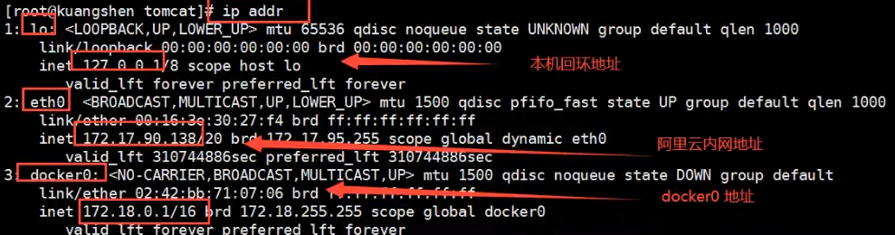

```shell
#问题：docker是如何处理网络访问的？
```


```shell
#先启动一个tomcat
docker run -d -P --name tomcat01 tomcat

#进入tomcat01查看其内部的网络信息
docker exec -it tomcat01 ip addr
```

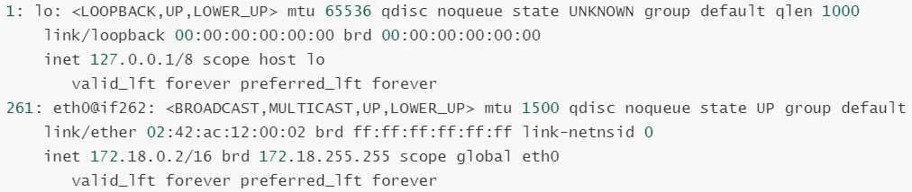

```shell
#思考：Host能否直接ping通容器内部？
#答案：可以ping通。
```


> 原理

1. 我们每启动一个docker容器，docker就会给docker容器分配一个ip，我们只要安装了docker，就会有一个网卡docker0。

桥接模式，使用的技术是evth-pair技术。

再次测试，发现多出一对网卡

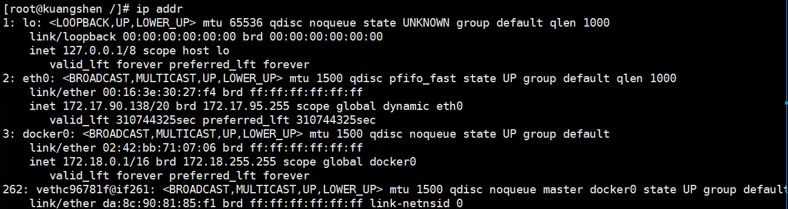

2. 如果再启动一个容器，会发现再多出一对网卡

```shll
docker run -d -P --name tomcat02 tomcat
ip addr
```

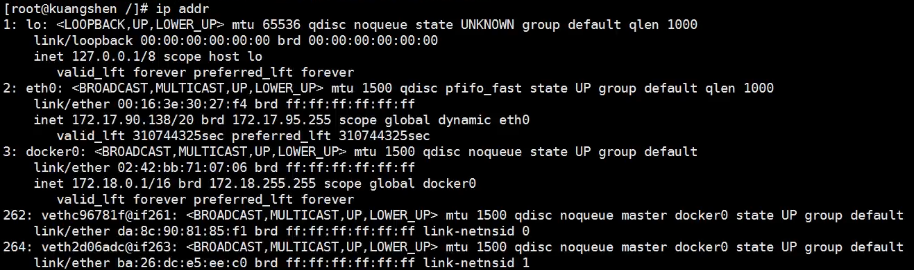

```shell
#进入tomcat02查看其内部的网络信息
docker exec -it tomcat02 ip addr
```

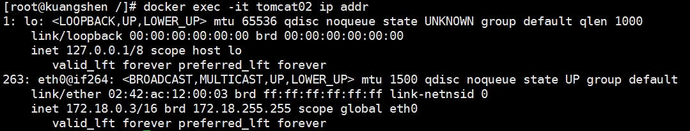

发现这个容器带来网卡都是一对一对的。

evth-pair技术就是一对的虚拟设备接口，总是成对出现，类似一个桥梁可以连接各种虚拟设备。

3. 测试tomcat01和tomcat02是否可以ping通。

```shell
docker exec -it tomcat02 ping 172.18.0.2

#结论：容器和容器之间是可以互相ping通的
```

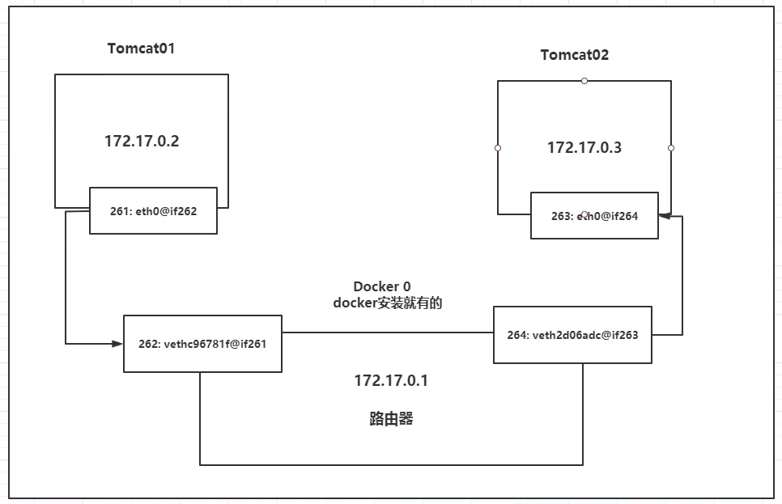

结论：tomcat01和tomcat02是公用的一个路由器，docker0。

所有的容器在不指定网络的情况下，都是docker0路由的，docker会给我们的容器分配一个默认的可用IP。


> 小结

Docker使用的是Linux的桥接，宿主机中是一个Docker容器的网桥docker0。

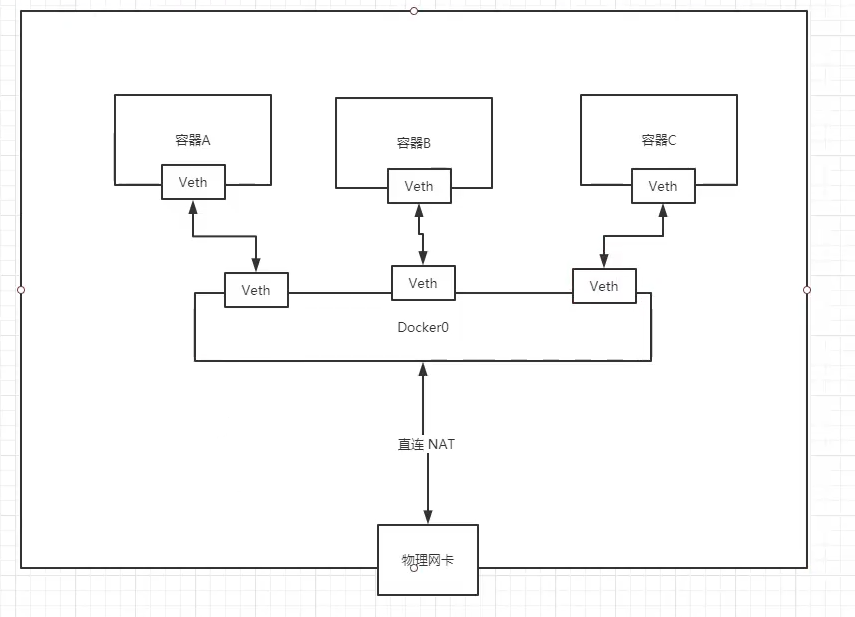

Docker中的所有网络接口都是虚拟的。虚拟的转发效率高（内网传递文件）

容器删除则网卡也会被删除。


> 思考：每次重启docker容器都会是新的ip地址，那么如何保证项目的代码不用更改呢？例如数据库容器的ip地址变动。
>
> 答案：--link技术

## --link

```shell
docker exec -it tomcat02 ping tomcat01	#直接ping是ping不通的

#如何解决？
#启动第三个tomcat连接tomcat02
docker run -d -P --name tomcat03 --link tomcat02 tomcat

docker exec -it tomcat03 ping tomcat02 	#此时就能够ping通了
docker exec -it tomcat02 ping tomcat03  #反向ping不通，因为没有配置
```

```shell
#使用docker network --help了解docker network命令

#使用docker network ls查看所有网络的情况
docker network ls
```

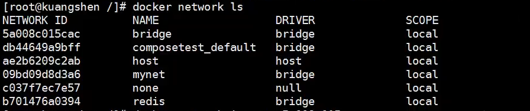

```shell
#NAME为bridge的网络就是docker0
#查看网络的详细信息
docker network inspect 5a008c015cac

#后来老师直接去tomcat03里查看其配置文件
docker exec -it tomcat03 cat /etc/hosts
```

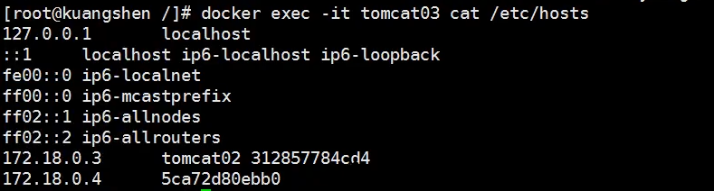

--link就是在hosts配置中加了一个映射

现在Docker已经不建议使用--link了。

docker0的问题：不支持容器名连接访问。


## 自定义网络

```shell
#首先还是再回顾下
docker network --help
docker network ls
```

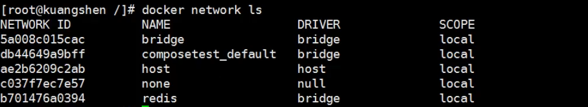

**网络模式**

bridge：桥接网络（默认，我们自己创建网络也是桥接模式）

none：不配置网络

host：和宿主机共享的网络

container：容器内网络连通（了解即可，局限很大，用得少）


**测试**

```shell
#--net bridge就是原来的默认参数，因此下面两行指令效果相同
docker run -d -P --name tomcat01 tomcat
docker run -d -P --name tomcat01 --net bridge tomcat

#查看如何创建网络
docker network create --help

#创建一个使用自家路由器的桥接模式的网络
docker network create --driver bridge --subnet 192.168.0.0/16 --gateway 192.168.0.1 mynet

#启动两个使用自定义网络的tomcat容器
docker run -d -P --name tomcat-net-01 --net mynet tomcat
docker run -d -P --name tomcat-net-02 --net mynet tomcat

#此时无论是01 ping 02还是02 ping 01都是可以ping通的，而且是直接ping的名字
docker exec -it tomcat-net-01 ping tomcat-net-02
```

我们自定义的网络，docker已经帮我们维护好了对应关系，推荐平时就使用自定义网络。

好处：不同集群使用不同的网络，保证集群是安全的。


## 网络连通

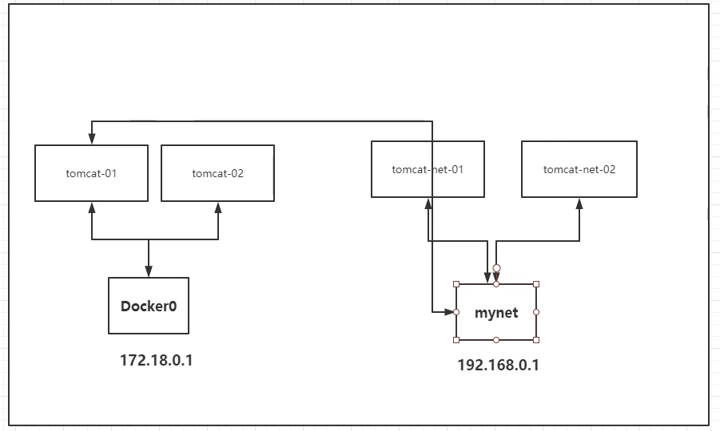

不同网络中的容器无法ping通。

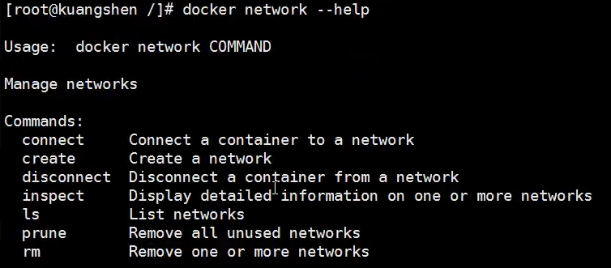

```shell
#将位于bridge(172.168.0.0)网络中的tomcat01连接到mynet(192.168.0.0)
#其实就是给这个容器加一个在mynet中的ip地址，一个主机多个ip地址很正常
docker network connect mynet tomcat01
```

