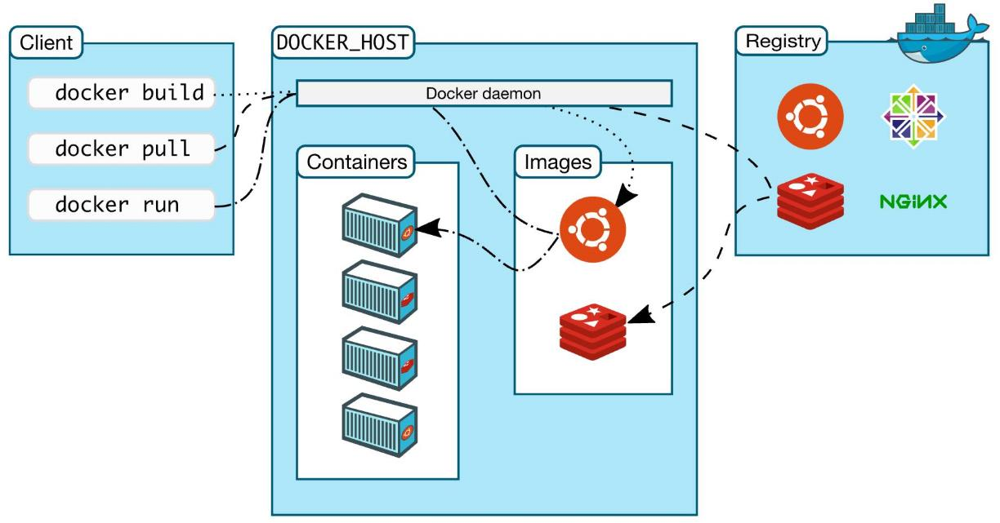

> 虚拟机是一种虚拟化技术；
>
> Docker是一种容器技术，也是虚拟化技术中的一种；
>
> Docker比虚拟机更**轻巧**，虚拟机是直接模拟的OS，而Docker不是；

# Docker的名词概念

**镜像（image）**：

docker镜像就好比是一个模板，可以通过这个模板来创建容器服务，tocat镜像-->run-->tomcat01容器（提供服务器），通过这个镜像可以创建多个容器（最终服务运行或者项目运行就是在容器中的）

**容器（container）**：

容器之间能互相隔离，每个容器能够独立运行一个或者一组应用。（连文件组织都是隔离的）

目前就可以把这个容器理解为一个简易的Linux系统。

**仓库（repository）**：

仓库就是存放镜像的地方，分为公有仓库和私有仓库。

docker官方的公共容器仓库网站是docker hub，国内的阿里云之类的也有对应的容器服务（差不多就是docker hub的国内镜像）。