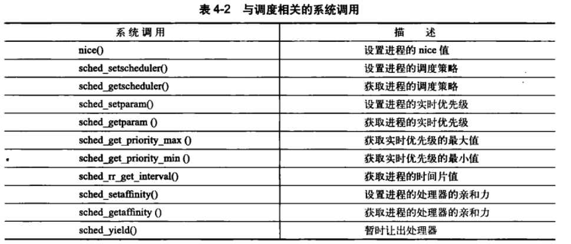

## 4.1 多任务

Linux采用的是抢占式多任务。

非抢占式多任务模式，除非进程自己主动停止运行，否则它会一直执行。

## 4.2 Linux的进程进度

Linux2.5采用“O(1)调度程序”。

Linux2.6采用RSDL调度算法（又称“完全公平调度算法CFS”）。

## 4.3 策略

### 4.3.1 IO消耗型和CPU消耗型

IO消耗型进程就是例如GUI用户图形界面程序，大多数时间都是在等IO中断。

CPU消耗型进程就是需要进行大量计算的程序。

### 4.3.2 进程优先级

优先级高的进程先运行，相同优先级的进程按轮转方式进行调度。

Linux采用了两种不同的优先级范围，一是nice值，nice值越低优先级越高，但是Linux系统中nice值代表时间片的比例。二是实时优先级0到99，越高代表优先级越高。

实时优先级和nice优先级处于互不相交的两个范畴。

### 4.3.3 时间片

Linux的CFS调度器并未直接分配时间片到进程，是将处理器的使用比例分给了进程。

Linux的CFS调度器其抢占时机取决于新的可运行程序消耗了多少处理器使用比，如果消耗的使用比比当前进程小，则新进程立刻投入运行，抢占当前进程。

### 4.3.4 调度策略的活动

就是举例两个进程时的例子，一个IO消耗型一个CPU消耗型，分配的处理器的使用比例均为50%。IO消耗型进程运行的时间很少，因此每次IO消耗型进程被唤醒时，CFS发现其消耗的使用比总是比较小的，因此总是会抢占的。

## 4.4 Linux调度算法

### 4.4.1 调度器类

Linux调度器以模块方式提供，可以多种调度器并存，每个负责调度自己范围的进程。

每个调度器有自己的优先级，每次会选择“有可执行进程的”“最高优先级的”调度器，去选择下面要执行的一个进程。

完全公平调度CFS是针对普通进程的调度器（or 调度类）。

### 4.4.2 传统Unix中的进程调度

传统方法将优先级直接和时间片数量直接映射（优先级越高，时间片数量越多），这就导致以下3个问题：

1. 高nice值的一般是后台任务，这类任务一般是CPU消耗型，然而分配到的时间片数量却很少。
2. 相对nice值的问题，nice值0和1，分到的时间片分别为100ms和95ms，nice值19和20，分到的时间片分别为10ms和5ms。
3. 会受到系统时钟频率（最小粒度影响），例如一台主机时钟周期10ms而另一台时钟周期1ms，这就会影响nice值到时间片映射关系（最小差值）。

### 4.4.3 公平调度CFS

CFS不分配时间片，只分配比例。且比例不依据nice值的绝对值，只看相对差值。最小运行的时间为1ms。例如2个进程，目标延迟为20ms，nice值为0和5，则两个进程分别获得15ms和5ms的处理器时间。如果2个进程，目标延迟为20ms，nice值为10和15，则两个进程仍然获得的是15ms和5ms。

## 4.5 Linux调度的实现

> CFS具体是如何实现的？四个组成部分

### 4.5.1 时间记账

task_struct中的sched_entity（调度器实体）负责记录当前进程已经运行的时间，这个变量是sched_entity中的vruntime（单位ns），这个vruntime是经过**加权计算**得到的。

系统定时器周期性调用``update_curr()``对进程已经运行的时间进行检测并更新。

### 4.5.2 进程选择

CFS管理的所有进程的vruntime值希望是完全一致。

CFS用红黑树管理其范畴的进程，键值是进程的vruntime。每次选择最左节点的进程为下一个进程，也就是vruntime最小的进程。在CFS的红黑树中节点被称为entity。

进程在被唤醒或者fork创建时加入红黑树。

进程在被阻塞或者exit终止时退出红黑树。

### 4.5.3 调度器入口

系统调用``schedule()``来获取下一个进程，而``schedule()``则是从最高优先级的调度类sched_class开始，依次检查每一个调度类，从最高优先级的调度类中，选择最高优先级的进程。每一个调度类（例如CFS）都实现了``pick_next_task()``函数供``schedule()``调用。

### 4.5.4 睡眠和唤醒

进程睡眠时，会将自己加入到等待队列。在唤醒时仍然需要检查是否满足唤醒条件，如果不满足则会又立马调用``schedule()``睡过去。

唤醒是调用``wake_up()``，该函数会唤醒指定的等待队列上的所有进程。``wake_up()``会将进程设置为TASK_RUNNING状态，将进程放入到CFS的红黑树中，设置``need_resched``标志。

## 4.6 抢占和上下文队列

``context_switch()``负责进程上下文的切换：1. ``switch_mm()``切换虚拟内存，2. ``switch_to()``切换体系结构相关的寄存器值。

内核用``need_resched``标志代表是否该调用``schedule()``函数，调用``wake_up()``函数时或者某个高优先级进程进入可执行状态时这个标志便会被设置。在一些节点（例如从内核态准备返回用户态时）内核会检查这个标志，如果被设置则会调用``schedule()``切换到下一个进程。

### 4.6.1 用户抢占

用户抢占就是指（从系统调用（内核态）、中断处理程序（用户态 or 内核态））返回用户空间时，检查``need_resched``标志，发生进程切换就是用户抢占。

### 4.6.2 内核抢占

**正在内核态的进程发生进程切换**就是内核抢占。

内核抢占需要原进程的锁占用数量为0。在进程的``thread_info``结构体中有变量``preempt_count``，每当获取锁就加1，释放锁就减1。

在一些**时机**，内核会检查``preempt_count``和``need_resched``两个变量，如果``preempt_count``为0且``need_resched``为1则会发生内核抢占。

内核抢占的**时机**：

1. 中断处理程序执行完，返回内核空间时；
2. 内核进程显式地调用``schedule()``时；（这种情况下不需要锁占用数量为0）
3. 内核进程阻塞时；（这种情况下不需要锁占用数量为0）

## 4.7 实时调度策略RT

**实时调度器**，有两种实时调度策略SCHED_FIFO和SCHED_RR。而普通非实时调度策略则是SCHED_NORMAL等级。CFS管理的都是SCHED_NORMAL等级的进程。

一旦一个SCHED_FIFO级进程处于可执行状态，就会一直执行，直到它自己收阻塞或显式地释放处理器。更高优先级的SCHED_FIFO或SCHED_RR进程可以抢占，同一优先级的多个SCHED_FIFO会轮流执行。

SCHED_RR是带有时间片的SCHED_FIFO，SCHED_RR级进程耗尽它的时间片后就暂停，此时低优先级的任务仍然不能抢占。

实时优先级范围为0到99（越低越优先，和nice值差不多），和SCHED_NORMAL进程的nice值共享一个取值空间，默认情况下nice值-20到19对应实时优先级为100到139。也就是SCHED_FIFO或RR总是比SCHED_NORMAL进程优先。

这两种实时算法都是静态优先级，内核不为实时进程计算动态优先级。

## 4.8 与调度相关的系统调用

### 4.8.1 

``task_struct``中rt_priority是实时优先级，static_prio是静态优先级（nice值），prio是动态优先级。（后面应该会细讲）

``nice()``函数会同时设置进程的static_prio和prio值。

### 4.8.2 处理器绑定

``task_struct``中cpus_allowed设置了进程可以在哪些CPU中运行，每一位代表一个CPU。

当一个进程变得不再适合在当前CPU上运行时，内核采用“移植线程”将任务推到合法处理器上。

### 4.8.3 放弃处理器

当调用``sched_yield()``后，进程便会主动放弃CPU处理器时间，随后该进程被放入到自己所属的优先级队列的末尾，并且也会放入到过期队列一段时间（保证该进程短时间内不会被再调用）。实时进程在调用此函数时不会被放入过期队列。

> 书中这里并没有讲什么是优先级队列和过期队列。

