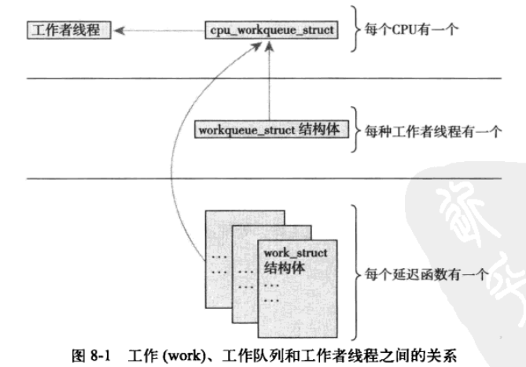
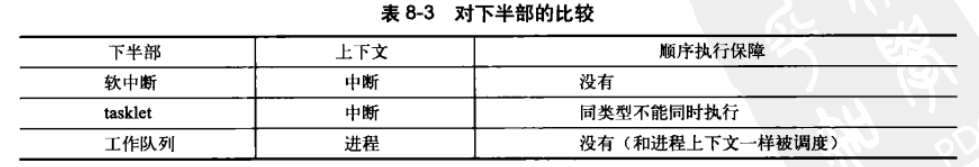

下半部：bottom half，BH

## 8.1 下半部

希望在中断处理程序（上半部）中的工作越少越好。

如果一个任务对时间非常敏感，则放到上半部。

如果一个任务和硬件相关，则放到上半部。

如果一个任务要保证不被其他中断打断，则放到上半部。


Linux2.6内核提供了三种不同形式的下半部实现机制：软中断、tasklets、工作队列。


## 8.2 软中断

Linux2.6内核中有32个软中断结构体组成的链表：

```c
struct softirq_action{
    void (*action)(struct softirq_action *);	//这样做是方便灵活添加成员变量，而不改变调用形式
}
static struct softirq_action softirq_vec[NR_SOFTIRQS];
```


在下述时机，软中断会被检查并执行，通过检查一个32位整型标识（每一位代表一个软中断）：

- 从一个硬件中断代码返回时；
- 在ksoftirqd内核线程中；
- 在那些显式检查和指向待处理的软中断代码中；

检查并执行软中断的函数是``do_softirq()``。


软中断有可能是并发（多处理器）的，因此对于共享数据要用严格的锁保护。


注册软中断：

```c
open_softirq(softirq_num, action);	//软中断号 处理函数
```

挂起软中断：（在下次检查中被执行）

```c
raise_softirq(softirq_num);	
raise_softirq(softirq_num);	//调用该函数时要先禁止中断，调用完在恢复中断
```


## 8.3 tasklet

tasklet本质上也是软中断，只不过同一个处理程序（tasklet）的多个实例不能在多个处理器上同时运行。

tasklet比软中断更常用。

tasklet其实就是使用HI_SOFTIRQ和TASKLET_SOFTIRQ两种软中断的一个库而已。（具体实现细节略）

### 8.3.2 软中断内核线程ksoftirqd

系统有时候会出现大量软中断（tasklet也是一种），特别一些软中断会重新触发自己以便再次得到执行机会。

第一种方案，只要还有被触发并等待处理的软中断，本次执行就要负责处理，重新触发的也是。缺点：用户空间的任务被忽略，明显卡顿。

第二种方案，任何重新触发的软中断都不会马上处理，被放到下一个软中断检测时机去执行。缺点：在比较空闲的系统中，立即处理软中断才是比较好的做法。

最终方案：采用第二种方案，但是当大量软中断出现时，内核会唤醒一组内核线程来处理这些负载，这些线程每个处理器一个，优先级最低（保证不会抢占用户任务，同时当系统空闲时又能快速处理大量软中断）。每个这种内核线程做的事就是一直循环检测是否有软中断，有就调用``do_softirq()``。

### 8.3.3 老的BH机制

BH是静态定义，处理函数必须在编译时就定义好（不能动态），且最多有32个。

BH不能适配多处理器，任何时刻不能有两个BH同时执行。


## 8.4 工作队列

工作队列就是将中断下半部工作交给一个内核线程去做（生产者-工作者队列），好处是能够使用**进程上下文**，允许重新**调度**和**睡眠**。（之前的都是中断上下文，不能睡眠和重新调度）

如果下半部工作不需要睡眠，就选择软中断或tasklet，否则使用工作队列。

应用可以创建自己的工作者线程，也可以使用缺省的工作者线程，Linux内核为每个处理器设置了一个缺省的工作者线程``events/n``。（一般情况下建议就用默认的工作者线程，因为内核线程太多的话会影响整体性能）



延迟函数（work）就是指一个下半部工作。

### 8.4.3 老的任务队列机制

任务队列就是工作队列的老版，现已被淘汰。


## 8.5 下半部机制的选择




## 8.6 在下半部之间加锁

如果使用软中断，因为两个相同的软中断可能在不同的处理器上同时执行，因此一定要注意加锁。

如果使用tasklet，则就不需要担心tasklet之间的同步。

如果进程上下文和一个下半部共享数据，则访问这些共享数据之前，需要禁止下半部的处理并得到锁的使用权。

如果中断上下文和一个下半部共享数据，则访问这些共享数据之前，需要禁止中断并得到锁的使用权。

任何在工作队列之间共享的数据也要注意加锁。


## 8.7 禁止下半部

在某些时刻需要禁止下半部的处理，这时安全的做法是先得到一个锁，再禁止下半部的处理。

Linux中通过task_struct中的preempt_count来进行，当禁止下半部处理时，会让其加上SOFTIRQ_OFFSET值。当要恢复下半部处理时，需要减少SOFRIRQ_OFFSET，如果preempt_count为0则可以恢复。（具体为什么用preempt_count没说）

