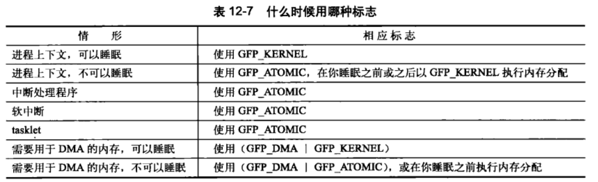

> 32位系统页大小一般为4KB，64位一般为8KB

## 12.1 页

> 这部分就是介绍物理页的结构体 ``struct page`` 中各个属性的意义


## 12.2 区

Linux必须要处理以下问题：

1. 一些硬件只能用某些特定的内存地址来执行DMA。
2. 一些体系结构内存的物理寻址范围比虚拟寻址范围大得多，这样就有一些内存地址不能永久映射到内核空间上。

Linux定义了如下几种区：

1. ZONE_DMA：这个区包含的页能用于DMA；
2. ZONE_DMA32：这个区包含的页能用于DMA，但只能被32位设备访问；
3. ZONE_NORMAL：这个区包含的页能正常映射；
4. ZONE_HIGHMEM：这个区包含的页是"高端内存"，只能动态映射；

以上各区**不会重叠**。每个区都维持一个**内存池**。当分配普通内存时，既可以从ZONE_DMA也可以从ZONE_NORMAL中分配（优先从ZONE_NORMAL分配），但是不能都分配，即分配的内存不能**跨区**。

部分体系结构中一些区是没有的，例如假如Intel x86-64中可以映射和处理64位内存空间，因此没有ZONE_HIGHEM区。

> 剩下部分就是介绍区的结构体 ``struct zone`` 中各个属性的意义。


## 12.3 获得页

``struct page * alloc_pages(gfp_t gfp_mask, unsigned int order)``

该函数分配(1<<order)个**连续**的物理页，返回指向第一个页的page结构体。

``void * page_address(struct page *page)``

该函数从page结构体得到该页所在的**逻辑地址**。（这个地址就是本进程中的内核空间中的虚拟地址）

``unsigned long __get_free_pages(gfp_t gfp_mask, unsigned int order)``

该函数就是上面两个函数的结合体，分配好连续物理页后返回页所在的逻辑地址。

> alloc_page和__get_free_page就是上述函数只分配1页的版本

### 12.3.1 获得全0的页

``unsigned long get_zeroed_page(unsigned int gfp_mask)``

该函数只分配一页全0的物理页的**逻辑地址**。

### 12.3.2 释放页

> 略


## 12.4 kmalloc()

``void * kmalloc(size_t size, gfp_t flags)``

kmalloc用来分配**以字节为单位**的一块**连续的**内核内存（不是以页为单位）。内存不足会**返回NULL**。

### 12.4.1 gfp_mask标志

三种flag：行为、区域、类型。

- 行为flag

> 只举部分例子，这些flag可以用位或组合起来

__GFP_WAIT：分配器可睡眠

__GFP_HIGH：分配器可以访问紧急事件缓冲池

__GFP_IO：分配器可以启动磁盘IO

__GFP_FS：分配器可以启动文件系统IO

- 区flag

> 表示内存应当从哪个区分配，默认从ZONE_NORMAL

__GFP_DMA：只在ZONE_DMA中分配

__GFP_DMA32：只在ZONE_DMA32中分配

__GFP_HIGHMEM：在ZONE_HIGHMEM(优先)**或ZONE_NORMAL**中分配。

> 不指定区flag的话则是在ZONE_NORMAL(优先)或ZONE_HIGHMEM中分配

__get_free_pages和kalloc不能指定ZONE_HIGHMEM，因为这两个函数需要返回内存的逻辑地址，而非page结构。而分配的高端内存可能还没有映射到内核的虚拟地址空间，因此也就根本没有逻辑地址。只有alloc_pages()才可分配高端内存。

- 类型flag

> 类型flag就是前面的行为flag和区flag的结合，这样就不需要程序员每次写一大堆位或
>
> 下面举部分例子

GFP_ATOMIC：__GFP_HIGH，该标志用在不能睡眠的地方

GFP_KERNEL：``__GFP_WAIT|__GFP_IO|__GFP_FS``，一种常见标志，一般用在进程上下文，为了获得内存，内核会尽力而为（但可能睡眠）。

GFP_DMA：__GFP_DMA



### 12.4.2 kfree()

> kfree(NULL)是安全的，其余略


## 12.5 vmalloc()

vmalloc分配不连续的物理内存，逻辑地址上连续。

大多数情况下，只有硬件设备需要得到物理地址连续的内存。

内核中还是经常用kmalloc主要是性能上的考虑，vmalloc需要将获得的页一个一个映射，导致比直接映射大得多的TLB抖动。

典型的vmalloc应用就是为了获得大块内存，例如当module被动态插入到内核中时，就把模块装载到vmalloc分配的内存上。

vmalloc可能睡眠。

vfree用来释放vmalloc的内存，也可能睡眠。


## 12.6 slab层

> https://blog.csdn.net/lukuen/article/details/6935068

### 12.6.1 slab层的设计

一个slab可以管理一页或者多个物理上连续的页。

一个kmem_cache管理多个slab，里面分为 满slab、部分满slab、空slab 三种链表。

一个kmem_cache负责管理一种固定大小的内存的分配。


``void * kmem_getpages(struct kem_cache *cachep, gfp_t flags)``该函数用来为kem_cache申请新的物理页。返回其逻辑地址，底层调用的是__get_free_pages。

``kmem_freepages()``用来释放kmem_cache的物理页。为了避免频繁分配和释放页，一般kmem_cache的空闲物理页只会在系统可用内存变得紧缺时，才会释放掉。

### 12.6.2 slab分配器的接口

``kmem_cache_create``用来创建新kmem_cache。可能睡眠。

``kmem_cache_destroy``用来销毁kmem_cache。可能睡眠。一般是在模块被卸载时会删除这个模块相关的kmem_cache(高速缓存)。


``void * kmem_cache_alloc(struct kmem_cache *cachep, gfp_t flags)``用来从kmem_cache中分配一个对象。flags的作用是：当kmem_cache全满时，flags被传给kmem_getpages用来申请新的物理页。

``void kmem_cahce_free(struct kmem_cache *cachep, void *objp)``用来归还对象。


## 12.7 在栈上的静态分配

内核栈小而且固定。跟体系结构有关，一般是只有两页大小。

### 12.7.1 单页内核栈

> 总结：单页内核栈会使得系统为每个进程提供一个中断栈。

一些中断处理程序使用它们所中断的进程的内核栈，这样单页内核栈就存储不下，此时系统就会将中断处理程序单独提供一个栈，就是每个进程的中断栈。

### 12.7.2 在栈上光明正大地工作

> 大致意思就是使用内核栈要省着点用。

内核没有在管理内核栈上做足工作，因此，当栈溢出时，多出的数据就会直接溢出来。


## 12.8 高端内存的映射

> 高端内存中的页不能永久地映射到内核地址空间上。因此alloc_pages()以__GFP_HIGHMEM标志获得的页不可能直接就有逻辑地址。

### 12.8.1 永久映射

``kmap(struct page *page)``如果是低端内存的页，则直接返回逻辑地址，否则会建立一个永久映射，再返回逻辑地址。

``kunmap(struct page* page)``取消映射。

### 12.8.2 临时映射

> 当必须创建一个映射而当前的上下文又不能睡眠时，内核提供了临时映射（原子映射）。

页表中有一组保留的映射，可以存放新创建的临时映射。临时映射可以用在不能睡眠的地方，例如中断处理程序。

``void *kmap_atomic(struct page *page, enum km_type type)``

``void kunmap_atomic(void *kvaddr, enum km_type type)``


## 12.9 每个CPU的分配

> 支持SMP（对称多处理器）的现代操作系统，支持使用每个CPU上的数据。（不太懂，大概意思就是为每个CPU设置有一些数据，需要根据cpu id进行访问）

```c
int cpu = get_cpu();
data_percpu[cpu]++;	//或其它操作
put_cpu();
```

调用get_cpu()时禁止了内核抢占，不用担心中途切换到其它CPU或相同CPU的其它进程上。


## 12.10 新的每个CPU接口

> 2.6内核为了方便创建和操作每个CPU数据，而引进了新的操作接口，称作percpu。
>
> 前面说的get_cpu()和put_cpu()访问每个CPU的数据的方法依然有效，但大型对称多处理器计算机要求对每个CPU数据操作更简单，功能更强大。

``DEFINE_PER_CPU(type, name)``为每个处理器创建一个类型为type，名字为name的变量实例。

``DECLARE_PER_CPU(type, name)``是声明变量。

``get_cpu_var(name)``获取这个变量。

``put_cpu_var(name)``暂时可以放下这个变量。


## 12.11 使用每个CPU数据的原因

> 略


## 12.12 分配函数的选择

> 就是总结一下前面的，略

