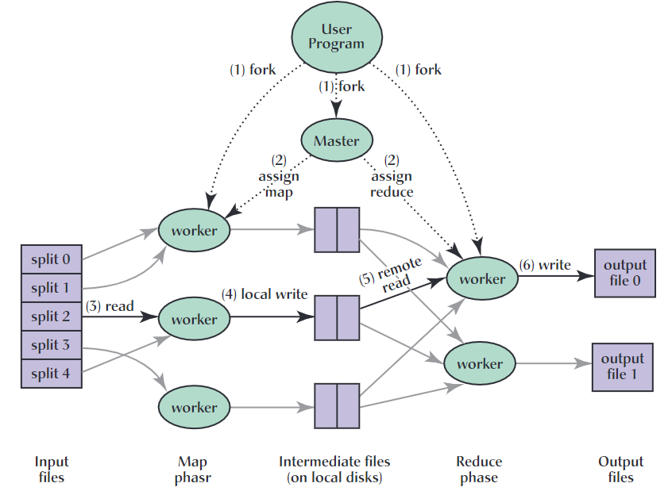

## 1 Introduction

对于大型数据的处理，例如一天之内搜索次数最多的几个query，需要一种能够并行化计算、分发处理以及处理故障的架构。


## 2 Programming Model

Computation的输入数据是KV数据（key/value pairs），输出也是KV数据。Computation由map和reduce两个函数组成。

Map函数接受KV数据作为输入，输出中间KV数据。key相同的KV数据会被交给同一个Reduce。

Reduce函数一般接受一个中间key值和一堆中间value值，然后进行某种整合计算，通常每次Reduce调用只产生零或一个输出值。中间KV数据可以通过迭代器传给Reduce函数，这允许Reduce处理大型数据。

### 2.1 Example

以“在大量文档中统计各个word出现次数”任务为例。用户**伪代码**如下：

```python
map(String key, String value):
    // key是文件名
    // value是文档内容
    for each word w in value:
        EmitIntermediate(w, "1");
        
reduce(String key, Iterator values):
    // key是word
    // values是a list of counts, 在本例中就是一堆数字1
    int result = 0;
    for each v in values:
        result += parseInt(v);
   	Emit(AsString(result));
```

MapRuduce是个C++ library，编译时链接起来就行。

### 2.2 Types

上面伪代码中的变量全是字符串，但实际上可以MapReduce中变量是可以带类型的，例如int值。

```shell
map		(k1, v1) 		-> list(k2, v2)
reduce	(k2, list(v2)) 	-> list(v2)
```

map函数接受输入的KV值，和最后reduce输出的KV值一般类型是不同的（from different domain）。

但map函数输出的KV值一般和最后reduce输出的KV值类型相同。例如都是(string, int)类型。

> 上面伪代码中的最后结果可以看作是(word, count)的KV值，因此是(string, int)类型的KV值


## 3 Implementation

MapReduce的实现不唯一。这里只介绍MapReduce在谷歌的大型商业服务器集群中的实现。每台主机双核x86CPU，带有4-8GB的内存。

单个机器通常具有1GB/S的带宽，但从整体集群上来看，平均每个机器的带宽小于该速度。

存储是直接使用的廉价IDE磁盘，采用GFS文件系统管理这些磁盘上的数据。

用户向scheduling system提交job，而job是由多个task组成，tasks由scheduler分发给集群中可用的主机。

### 3.1 Execution Overview

将输入数据分为M份，每份交给一个机器进行Map操作。

将中间数据分为R份，每份交给一个机器进行Reduce操作。通过partition函数将中间数据分为R份，而这个R值和partition函数都是由用户设定的，例如可以取partition函数为hash(key) mod R.



1. 将原始数据按照16-64MB大小切分成M份split。然后启动很多主机。
2. 其中一个比较重要的主机是Mater。Master找M+R个可用的主机，将其变为worker，并为其分发一个map task或者reduce task。
3. M个负责map task的worker会依次取得属于自己的那份split数据，然后调用用户传进来的map函数进行map操作，生成的中间KV数据暂存在内存中（buffered in memory）。
4. 这些暂存在内存中的KV数据，会逐渐地写入到本地磁盘中（写入磁盘时分成了R份）（每个worker有自己的local disk），随后worker会将自己那R份数据在本地磁盘中的位置回传给Master，Master之后会把这些位置传递给reduce workers。

5. R个reduce worker每个都会从Master那里收到关于中间KV值位置的信息，然后reduce worker会调用RPC调用去从每个map worker的local disk中读取属于自己的那份中间数据（前面map worker在写入local disk时已经分成了R份）。（当reduce worker读取完从所有map worker中的自己那份数据后）之后reduce worker对这些中间数据进行排序（如果数据无法全放在内存中，会调用外部排序算法）。
6. reduce worker使用迭代器处理已经排好序的中间KV数据，每遇到一个新的key值，将(key, list(value))数据传入到用户定义的reduce函数，并将此次reduce函数的输出添加到this reduce partition的output file的末尾。

7. 当所有map task和reduce task都完成后，MapReduce就算完成了。


### 3.2 Master Data Structures

> Master中的数据结构

Master为每个map task以及reduce task都有个数据结构，存储了这个task的state，以及这个task所属的worker machine。

注意，map worker完成后的中间数据位置信息是以**增量方式**发送到所有reduce worker的，也就是有一个map worker完成后，Master就会给各个reduce worker转发这份数据位置（位置and大小）信息。每个reduce worker收到一份数据位置信息就会去这个map worker的local disk中读取对应数据，等收集完每个map worker中的数据后reduce worker才会开始自己的工作。


### 3.3 Fault Tolerance

#### Handling Worker Failures

Master定期ping每个worker，如果超时没收到worker的响应，则认为该worker已经故障了。

故障worker上所有正在进行的task全部被reset为idle状态，因此会被重新调度。

故障worker已经完成的map task会被重新调度（因此local disk无法访问了），而故障worker已经完成的reduce task不需要重新调度，因为reduce产生的输出结果已经存储到一个global file system中。（注意，这里完成的task是指还未完成的job中的完成的部分task）

当一个map task被重新执行，Master会通知所有reduce worker。任何reduce worker如果还未从之前故障的map worker的local disk中读取数据，则之后会去新的map worker的local disk中读取。

#### Semantics in the Presence of Failures

即使出现故障，MapReduce计算出的结果也依然和无故障顺序执行这些任务的结果保持一致。

每个task的完成都是原子的，一个reduce task完成后生成一个output temporary file，一个map task完成后生成R个output temporary files。

当一个map task完成时会给Master发送R个temporary files文件的相关信息，如果Master发现这个map task之前已经被完成了，则会无视这次消息，否则会将这收到的R个文件的信息存储到一个数据结构中。

当一个reduce task完成时会将temporary file重命名为final output file，如果reduce task之前已经被完成了，则也没关系，因为重复的reduce task最后的final output file命名是相同的，因此重命名时会发现这个文件已经存在。而具体怎么处理则由底层文件系统保证，反正最后的final output file与只执行一次reduce task的结果相同就行。

Map和Reduce在大多数deterministic情况下和顺序执行它们的结果相同，如果not deterministic则会有可能不同，但仍然和一种顺序执行的结果相同，只不过在不同的worker中这个“顺序执行”的顺序可能不同而已。这种情况下会有**不一致**的问题出现。因此尽量让Map和Reduce tasks独立、不依赖其他task。

### 3.4 Locality

MapReduce假设输入数据（被GFS管理，因此每chunk就有三份replica在整个集群中）就来自于集群中部分主机上的local disk中。为了节约网络带宽，Master会安排map task给那些本来就存有replica的主机。如果这些map task失败了，Master也会尽量安排原来worker附近的主机（例如在同一个交换机周围）来重试task。

通过上述安排，MapReduce节省了很多网络带宽。

### 3.5 Task Granularity

在作者的实现中，M和R有实际的最大限制，主机做出task分配（scheduling）的复杂度为O(M+R)，而必须在内存中维持O(M*R)大小的state数据。

R的值一般取使得每份input data大小为16-64MB为好。而M一般取是R的因子。作者的实现中，一般取M=200,000，R=5000，而物理主机一般有2000台。

### 3.6 Backup Tasks

一个job很可能因为最后的那几个task完成得很慢而导致整个job的完成很慢。

出现这种“task掉队”问题的原因很多。例如，有可能几个worker的local disk是bad的，而从disk读取数据时这些错误又是可纠正的，因此导致读取速度特别慢，而在磁盘IO时这个worker的主机很可能调度去执行其它同样分配给这台主机的task了，导致原先这个task的完成时间进一步被延后。

因此MapReduce开发了Backup机制，这个机制就是当一个job快要完成时，Master会复制（backup）所有剩下的正在执行的task（一个task复制成多份）到不同主机中，一个task无论是在哪台主机上完成就认为这个task完成了。


## 4 Refinements

> 在MapReduce系统中的一些优化措施。

- 让用户可以自定义partitioning function，例如hash(key) mod R.
- 保证在每个reduce worker中，数据顺序是按照key的升序传给reduce函数的。
- （这个没太明白，得看代码或其他资料）用户可以自定义combiner函数，来对map task中产生的相同key值的KV数据进行合并，以减少网络中需要传输的数据大小，节省带宽。
- 支持用户自定义输入和输出数据类型。
- 提供debug模式（在一台主机上运行），帮助调试和小规模测试。

