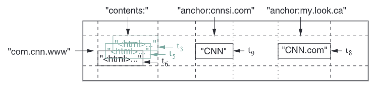

## 1 Introduction

BigTable是个存储巨量数据的存储系统。BigTable是个非常灵活的存储系统，既能用于高吞吐量要求的工作负载，也能用于低延迟要求的工作负载。

BigTable和传统数据库有点类似，同样采用了一些策略，但也不完全和关系型数据库相同。

BigTable允许用户配置数据的布局（layout）和格式（format），甚至可以设置数据是存储在内存还是磁盘中。

BigTable中数据由任意字符串的**行名**和**列名**进行索引，BigTable将数据都看作是String。

## 2 Data Model

一个BigTable Cluster由多个分布在不同主机上的进程组成。一个cluster中有多个table。每个table可以看作是3维稀疏矩阵（行名，列名，时间戳）：
$$
(row:string,\ column:string,\ time:int64)\ \rightarrow\ string
$$
每个（行名，列名，时间戳）就是个cell。以多行为单位进行load balancing。以多列为单位进行访问控制（因为一般列是各种属性，所以可以按照列进行访问控制）。时间戳就是标识内容的不同版本。下图就是一行数据（格子中是数据，例如"CNN"就代表3个char）：

对一个行的数据进行多次读或写操作是序列化的，也就是一行读或者一行写就是一次事务，而跨行事务是不被BigTable支持的。

BigTable按行名的字典序排列各行，行名相邻的多行组合成tablet，tablet就是load balancing的单位。也就是说行名相邻的数据往往存储也相邻，因此利用到了局部性原理。将URL反转再作为行名就是为了让相同domain的各个网站的数据存储在相邻位置。

多个列组成column family，family就是进行访问控制（Access Control）的单位。删除一个family，则family中包含各个列的数据也会被删除。如果一个column内有多行，则删除不会是原子性（因为没有跨行事务）。

每个列名的格式为``family:qualifier``，其中family一般是设定的可打印出来的名称，而qualifier则是任意字符串数据。

BigTable以family为单位对数据进行both disk and memory accounting（记账？统计？）

时间戳（Timestamps）就是个64位整型，可以由BigTable自动产生也可以由用户应用产生（但用户应用必须保证不会出现行名、列名、时间戳完全相同的cell）。时间戳可以用于GC机制，即可以规定只保留前n份最近的数据。在BigTable中数据是按照时间戳降序排列，保证最新的数据可以最快地访问。

## 3 API

> API略

BigTable支持执行用Sawzall写的脚本。

BigTable可用作MapReduce的Input source和Output target。

## 4 BUILDING BLOCKS

每个运行BigTable进程的主机可同时也在运行MapReduce、GFS等其他分布式应用。

BigTable依赖Google cluster management system进行工作调度、资源管理、检测主机状态、故障主机检测等工作。

BigTable使用GFS存储data文件、log文件。

BigTable的data文件以Google SSTable immutable-file格式存储。每个SSTable文件由64KB的block组成，在文件末尾有block index可用于查找block的位置。每open一个SSTable文件，将先将这个block index读取到内存中，之后查找block位置就可以只在内存中进行，找到了再去disk中读取block。

> Optionally, an SSTable can be completely mapped into memory, which allows us to perform lookups and scans without touching disk.

BigTable使用到了Chubby分布式锁服务。