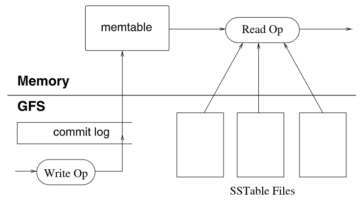

## 1 Introduction

BigTable是个存储巨量数据的存储系统。BigTable是个非常灵活的存储系统，既能用于高吞吐量要求的工作负载，也能用于低延迟要求的工作负载。

BigTable和传统数据库有点类似，同样采用了一些策略，但也不完全和关系型数据库相同。

BigTable允许用户配置数据的布局（layout）和格式（format），甚至可以设置数据是存储在内存还是磁盘中。

BigTable中数据由任意字符串的**行名**和**列名**进行索引，BigTable将数据都看作是String。

## 2 Data Model

一个BigTable Cluster由多个分布在不同主机上的进程组成。一个cluster中有多个table。每个table可以看作是3维稀疏矩阵（行名，列名，时间戳）：
$$
(row:string,\ column:string,\ time:int64)\ \rightarrow\ string
$$
每个（行名，列名，时间戳）就是个cell。以多行为单位进行load balancing。以多列为单位进行访问控制（因为一般列是各种属性，所以可以按照列进行访问控制）。时间戳就是标识内容的不同版本。下图就是一行数据（格子中是数据，例如"CNN"就代表3个char）：

对一个行的数据进行多次读或写操作是序列化的，也就是一行读或者一行写就是一次事务，而跨行事务是不被BigTable支持的。

BigTable按行名的字典序排列各行，行名相邻的多行组合成tablet，tablet就是load balancing的单位。也就是说行名相邻的数据往往存储也相邻，因此利用到了局部性原理。将URL反转再作为行名就是为了让相同domain的各个网站的数据存储在相邻位置。

多个列组成column family，family就是进行访问控制（Access Control）的单位。删除一个family，则family中包含各个列的数据也会被删除。如果一个column内有多行，则删除不会是原子性（因为没有跨行事务）。

每个列名的格式为``family:qualifier``，其中family一般是设定的可打印出来的名称，而qualifier则是任意字符串数据。

BigTable以family为单位对数据进行both disk and memory accounting（记账？统计？）

时间戳（Timestamps）就是个64位整型，可以由BigTable自动产生也可以由用户应用产生（但用户应用必须保证不会出现行名、列名、时间戳完全相同的cell）。时间戳可以用于GC机制，即可以规定只保留前n份最近的数据。在BigTable中数据是按照时间戳降序排列，保证最新的数据可以最快地访问。

## 3 API

> API略

BigTable支持执行用Sawzall写的脚本。

BigTable可用作MapReduce的Input source和Output target。

## 4 Bigtable的支撑技术

每个运行BigTable进程的主机可同时也在运行MapReduce、GFS等其他分布式应用。

BigTable依赖Google Cluster进行工作调度、资源管理、检测主机状态、故障主机检测等工作。

BigTable使用GFS存储data文件、log文件。

BigTable的data文件以Google SSTable immutable-file格式存储。每个SSTable文件由64KB的block组成，在文件末尾有block index可用于查找block的位置。每open一个SSTable文件，将先将这个block index读取到内存中，之后查找block位置就可以只在内存中进行，找到了再去disk中读取block。

> Optionally, an SSTable can be completely mapped into memory, which allows us to perform lookups and scans without touching disk.

BigTable使用到了Chubby分布式锁服务来存储一些元数据，例如整个Bigtable data的启动程序位置（bootstrap location），以及其中tablet服务器的位置以及他们是否active，以及Bigtable的模式（schemas）（详见第5部分 Implementation）。当Chubby服务不可用一定时间后Bigtable中的数据也将变得不可访问。

## 5 Implementation

一个Bigtable cluster主要由三大部分组成：

1. 每个client上有一个library
2. 一个master server
3. 许多个tablet server，这些tablet server可以随时动态加入/移出一个cluster。

Master server主要负责：分发tablets（多个row组成一个tablet）给不同的tablet servers，检测新的tablet server加入或者过期，实现tablets在不同tablet-server之间的负载均衡，GFS中Bigtable文件的垃圾回收，管理数据库schema的变化（add/del table 或者 add/del column family）。

Tablet sever主要负责：所管理的tablet（每台Tablet sever一般上面有几十个到一千个tablet）读和写，当tablet太大时进行分裂。

Client直接和相应的tablet sever进行数据请求，而不需要和master server交互来获取tablet的位置信息。（同许多分布式系统结构相同，例如GFS）

一个Bigtable cluster有许多个table，每个table初始化时只有一个tablet，当tablet数据量过大时就会进行分裂（一般一个tablet最大有1GB）。

虽然Bigtable支持灵活大小的数据存储，但是最好一行数据不要过大，因为tablet不支持从一个row数据的中间进行分裂，一般来说一行数据最大几百MB就差不多了。

### 5.1 Tablet Location

Bigtable将root tablet存放在Chubby中，root tablet永远不会split，其中存储的是metadata tablets的位置信息。每个metadata tablet存放的是用户tablets的位置信息。

每个metadata tablet默认最大为128MB，每一行数据1KB，每个用户tablet位置信息与一个key值一起存储，这个key值是由用户tablet的id以及它的最后一行数据编码而成。

Client library如果不知道一个tablet的位置，则会从上面三层树结构的底层开始逐渐往上（如果不知道就去查询上个tablet）进行查找，最坏情况下会访问到Chubby服务器。Client library会缓存它所知道的位置信息。初始化时用户缓存为空，因此访问一个tablet会触发三次RTT时间消耗。而如果是一个过期的缓存，则访问一个tablet可能会触发最多六次RTT（以下是个人猜测的流程）：

1. 访问旧的用户tablet server，发现用户tablet server位置错误；
2. 访问旧的metadata tablet server，发现metadata tablet server位置错误；
3. 访问root tablet server，发现root tablet server位置错误；
4. 访问Chubby，在最新的root tablet server处获取到metadata tablet server位置；
5. 访问metadata tablet server，获取到新的用户tablet server位置；
6. 访问用户tablet server。

为了节省client访问的次数，每次读取metadata tablet时，都会获取多个用户tablet的位置信息。

在metadata tablet中，用户Tablet的位置信息都是存储在内存中，因此获取用户tablet位置信息时不需要访问GFS。

在metadata tablet中还为每个用户tablet维护了一些其它次要信息，例如用户tablet的上次访问时间。

### 5.2 Tablet Assignment

每个tablet只会至多分配给一个tablet server，master维护有当前alive的tablet server名单，也维护有当前tablet分配映射关系，也知道哪些tablets暂未分配。

当有tablet是未分配状态，且有tablet服务器有空闲空间，则master会给该tablet server发送tablet load请求。该请求发出后，master就可认为该tablet分配完成了（因为load请求失败的条件只有该master故障了，且对方仍然没收到请求）。

Bigtable使用chubby来得知当前alive的tablet server名单，因为每个tablet server都会在chubby系统中某个特定目录下创建一个自己的文件并获取它的lock，如果它失去了它的锁就不能继续服务了。如果因为网络原因失去了它的锁，tablet server会尽快尝试重新获取它，以恢复正常。如果它的文件被master删除掉，则它就会知道自己已经被踢出cluster，因此会结束自己的进程。当一个tablet server被Google Cluster踢出集群时，会释放它的锁，然后master会尽快安排其中的tablets的重新assignment工作。

对于master来说，会定期地去那个目录中查看每个tablet server对应的文件的lock状态。如果这个server失去了它的锁，则master会尝试抢占该锁，如果master获取到了这个锁，则它就把该server对应的文件给删了，然后再把已分配给该server的tablets标记为unassigned状态（加入到一个set中）。

如果master自己和Chubby服务的session断开了（或过期了），则master会kill它自己，但tablets到tablet servers的映射不会因为master自杀这事改变。

当一个新的master被Google Cluster启动时，它会干以下几件事：

1. 在Chubby获取master lock，避免重复的master启动；
2. master扫描Chubby中特定目录中的每个文件，来得知当前live的tablet servers；
3. master和每个live的tablet server沟通，得知它们所存的有哪些tablets，并且让它们知道新的master是自己（避免它们执行旧mater发出的load请求）。
4. 如果root tablet找到了，则master扫描metadata table（多个tablet），看有哪些tablets还未分配，将其中未分配的tablet加入到unassigned tablets set中。

5. 如果root tablet没找到，则master将root tablet加入到unassigned set中。然后再执行第4步。

master可以track每个tablet的状态。Tablets发生变动情况大多数由master造成的，只有一种情况是由tablet server主动造成的，那就是tablet split。当发生tablet split时，tablet server会去metadata table中更新tablet的元数据（俗称commit），然后再通知master。如果通知失败了也没关系，master会在下次请求一个tablet server去load这个旧tablet时（assignment），tablet server会在metadata table中发现tablet和master的请求对不上（master的请求被拆开了），于是tablet server会在此时去通知master这个split情况。

### 5.3 Tablet Serving

> 下图是一个**tablet**的结构：

Bigtable中数据的持久化存储是存储在GFS中。GFS存储有**commit log**和**SSTable Files**，其中commit log就是write操作的日志记录（可用于redo以恢复文件），SSTable Files就是之前古老版本的文件（已经永久化的旧版本data）。内存中主要是**memtable**，存的是最近有修改的数据，以row为单位进行存储，采用的结构是sorted buffer，每一row采用copy-on-write策略来维护一致性（这里的cow暂时没懂）。

为了恢复一个tablet，tablet server会去metadata table中得到该tablet的元数据，主要目的是获取**SSTable文件的list**以及**commit log文件中的redo points**。有了这两个数据后，tablet server就会先去将所有SSTable文件的block index读取到内存，再在其基础上应用log中redo point之后记载的操作序列来恢复memtable部分。

#### 5.3.1 写操作：

1. 检测该write请求是否来自一个正常的client；
2. 检测该client是否有权限进行write操作。通过读取Chubby中一个特定文件（上面记载了有权限进行write的用户列表）来进行检测。
3. 将此次write请求记录到在GFS中的commit log文件。
4. 将此次write的数据写到内存中的memtable里。

#### 5.3.2 读操作

1. 也是检测client是否正常、是否有权限。
2. Tablet server结合GFS中的SSTable文件和内存中的memtable，生成并返回给client所需的数据。

> 注意这里我想说明的是，不同SSTable文件之间，以及SSTable文件和memtable的数据之间，可能含有同一个row的不同版本数据，其中的数据都是按照row为单位进行排序存储的，因此在生成一行数据时，实际上是从多个版本进行merge整合生成的。

### 5.4 Compaction

为了避免write请求导致内存中memtable无限制地增大，因此memtable每增大到一定阈值时就会被"冻结"：tablet会新建新的memtable，而用这个memtable生成一个新的SSTable文件，并在commit log文件设定新的redo point（因为这些数据被永久化了）。（因此每个SSTable文件其实就是过去的一个memtable）

当然随着时间增加，SSTable文件数量也会逐渐增多，为了减少生成read数据时所要读取的SSTable文件数量，tablet server会时不时地执行merging compaction操作，就是将"多个SSTable文件"或者"多个SSTable文件和memtable"合并成一个SSTable文件。

Tablet server会周期性地将所有SSTable文件合并成一个SSTable文件，目的是垃圾回收（回收那些已经被删除的row数据的空间）。这种操作称为"major compaction"，非major的compaction操作生成的SSTable文件中含有delete entry，也就是表示该位置上的旧数据已经被删除。而major compaction生成的数据中由于被删除的数据不存在了，因此也没有delete entry。

#### 5.4.1 GFS和Bigtable的局部性配合

一些主机既是Bigtable中的tablet server，也是GFS中的chunk server。GFS在存储Bigtable中的SSTable文件的replica时，就会存储一份数据在本地的chunk server中。这样当Bigtable需要这些数据时，会优先到本地GFS中获取，就会非常快速。

### 5.5 Schema Management

就是说Bigtable将数据库schema存储在Chubby中（称"schema文件"），所有tablet server想要知道当前存在哪些column family只需要查看Chubby中的schema文件即可。并且也可以通过订阅Chubby中schema文件的改动event来得知用户对column有修改。

## 6 Refinements优化

### 6.1 Locality Groups

就是说将一些经常一起读取的column families组成一个locality group。比如在web数据中，将一个网页的各个元数据组成一个locality group，将网页内容数据组成一个locality group。因为在一些应用中，可能有时候只需要读取各个页面的元数据而不需要里面的大段内容。在进行SSTable合并的过程中，可以根据Locality group来为每个group生成一个SSTable。

> 本质上就是将相关的column family进行隔离存储，以提升性能。

用户可以以locality group为单位进行一些优化配置，例如可以指定哪些locality group的SSTable文件常驻在内存中，以加快访问速度。比如在metadata table中，其中table-location这个group就是常驻在内存的，因此可以提升性能。

### 6.2 Compression

用户可以为locality group设置对其中的数据进行压缩存储，并且可以设定压缩算法。用户指定的格式会被应用到每个SSTable块（大小可以通过参数调节）虽然分开压缩每个块损失了一些空间，但好处在于无需解压缩整个文件就能读取SSTable的一小部分。许多客户端使用两遍自定义压缩方式。第一次使用Bentley and McIlroy’s scheme，它将压缩大窗口中的长公共字符串。第二次使用一个快速压缩算法，寻找16KB窗口大小数据中的重复部分。两次压缩都很快，压缩100-200MB/s，解压缩400-1000MB/s（当时的机器）。

在采用上述的两遍压缩算法时，把相似数据存储在相邻的行、把数据的不同version存储在相邻位置等设计能使得数据压缩比增大，例如对于google的web page data能达到10：1的比例。

### 6.3 Caching for Read Performance

有两层cache。Scan Cache是tablet server缓存从SSTable中每次查询得到的**KV键值对**。Block Cache则是较为底层，缓存每次从GFS中读取的**SSTable blocks**。

### 6.4 Bloom Filters

Client可以为locality group配置布隆过滤器，布隆过滤器的作用是可以查询一个SSTable是否存储有所需row/column的数据，从而减少不必要的SSTable文件读取次数。（每个SSTable文件只含有部分row/column键值）

### 6.5 Commit-Log Implementation

每个tablet server只有一个log file，即多个tablets共享一个log file。单一log file使得性能明显提升，但是也使故障恢复变得非常复杂。

#### 6.5.1 当tablet server故障时

当一个tablet server故障时，上面的tablets会被分发给不同的其它tablet server。为了恢复一个tablet，这些新tablet servers都要去从故障server中唯一的log file中找到每个tablet的redo point。

如果采用简单机制，例如每个新tablet server都去完整地读取一份旧log file，则会造成大量没必要的数据读取。解决方法就是，在恢复一开始的时候，对log file中的每个row数据的修改记录进行排序，按照<table, row name, log seq num>为key值进行排序，这样排好序后，同一tablet中的数据就是相邻连续的，每个新tablet server需要读取时，就只需要读其中一部分即可。

log file排序这一过程采用分布式进行，由master协调，先将log file按照64MB进行切分成segment，然后再在不同tablet server中对相应segment进行内排序，最后再外排序。

#### 6.5.2 写GFS commit文件的延迟

有时候写GFS文件会遭遇各种各样的原因导致写入很慢。为了尽量避免写commit log文件时出现延迟问题，每个tablet server中设置了两个log文件，对应两个写log线程，但同时只会有一个log线程负责工作。每当一个log线程写入性能降低时，就会切换到另一个线程，也就是写到另一个log文件中。

Bigtable中每个log记录都有log序列号（log sequence number），因此不用担心log杂乱无章的问题。

### 6.6 Speeding Up Tablet Recovery

就是说一个tablet server在停止serve一个tablet前，会把memtable中的updates全compact到GFS中。并且会进行两次，第二次是将在第一次compact时新到的update给再次compact到GFS中。相当于下次recover的时候就不需再去从commit log中redo updates了，只需读GFS文件。

### 6.7 Exploiting Immutability

> SSTable文件不可更改所带来的好处

1. 由于SSTable文件是不可以更改的，所有更改都是追加写的形式（将mutation加入到memtable）。这使得可以高并发地读取SSTable文件，不需任何同步控制。

   唯一需要用到同步控制的是memtable，Bigtable对memtable中每个row采取**写时复制**的策略，因此memtable中的文件依然可以看作是只读的，当有数据写入时，就会复制一份新数据，因此原先数据上在写操作之前的读取操作可以并发执行完（在写操作后的读取操作就得被阻塞？）。

2. 由于SSTable不可更改，因此对于删除数据来说，就转变为垃圾回收过期SSTable的问题。Bigtable中每个SSTable都在metadata table中对应的元数据中注册，过期后就被标记。

3. 由于SSTable不可更改，当tablet进行分裂时，分裂后的新tablets可以直接share原来的SSTable文件。

> Bigtable感觉就是在GFS之上的一个中间层（让GFS有数据库的感觉了）。
