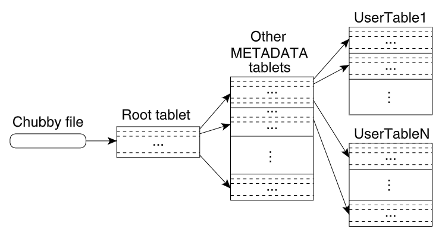

## 1 Introduction

BigTable是个存储巨量数据的存储系统。BigTable是个非常灵活的存储系统，既能用于高吞吐量要求的工作负载，也能用于低延迟要求的工作负载。

BigTable和传统数据库有点类似，同样采用了一些策略，但也不完全和关系型数据库相同。

BigTable允许用户配置数据的布局（layout）和格式（format），甚至可以设置数据是存储在内存还是磁盘中。

BigTable中数据由任意字符串的**行名**和**列名**进行索引，BigTable将数据都看作是String。

## 2 Data Model

一个BigTable Cluster由多个分布在不同主机上的进程组成。一个cluster中有多个table。每个table可以看作是3维稀疏矩阵（行名，列名，时间戳）：
$$
(row:string,\ column:string,\ time:int64)\ \rightarrow\ string
$$
每个（行名，列名，时间戳）就是个cell。以多行为单位进行load balancing。以多列为单位进行访问控制（因为一般列是各种属性，所以可以按照列进行访问控制）。时间戳就是标识内容的不同版本。下图就是一行数据（格子中是数据，例如"CNN"就代表3个char）：

对一个行的数据进行多次读或写操作是序列化的，也就是一行读或者一行写就是一次事务，而跨行事务是不被BigTable支持的。

BigTable按行名的字典序排列各行，行名相邻的多行组合成tablet，tablet就是load balancing的单位。也就是说行名相邻的数据往往存储也相邻，因此利用到了局部性原理。将URL反转再作为行名就是为了让相同domain的各个网站的数据存储在相邻位置。

多个列组成column family，family就是进行访问控制（Access Control）的单位。删除一个family，则family中包含各个列的数据也会被删除。如果一个column内有多行，则删除不会是原子性（因为没有跨行事务）。

每个列名的格式为``family:qualifier``，其中family一般是设定的可打印出来的名称，而qualifier则是任意字符串数据。

BigTable以family为单位对数据进行both disk and memory accounting（记账？统计？）

时间戳（Timestamps）就是个64位整型，可以由BigTable自动产生也可以由用户应用产生（但用户应用必须保证不会出现行名、列名、时间戳完全相同的cell）。时间戳可以用于GC机制，即可以规定只保留前n份最近的数据。在BigTable中数据是按照时间戳降序排列，保证最新的数据可以最快地访问。

## 3 API

> API略

BigTable支持执行用Sawzall写的脚本。

BigTable可用作MapReduce的Input source和Output target。

## 4 Bigtable的支撑技术

每个运行BigTable进程的主机可同时也在运行MapReduce、GFS等其他分布式应用。

BigTable依赖Google Cluster进行工作调度、资源管理、检测主机状态、故障主机检测等工作。

BigTable使用GFS存储data文件、log文件。

BigTable的data文件以Google SSTable immutable-file格式存储。每个SSTable文件由64KB的block组成，在文件末尾有block index可用于查找block的位置。每open一个SSTable文件，将先将这个block index读取到内存中，之后查找block位置就可以只在内存中进行，找到了再去disk中读取block。

> Optionally, an SSTable can be completely mapped into memory, which allows us to perform lookups and scans without touching disk.

BigTable使用到了Chubby分布式锁服务来存储一些元数据，例如整个Bigtable data的启动程序位置（bootstrap location），以及其中tablet服务器的位置以及他们是否active，以及Bigtable的模式（schemas）（详见第5部分 Implementation）。当Chubby服务不可用一定时间后Bigtable中的数据也将变得不可访问。

## 5 Implementation

一个Bigtable cluster主要由三大部分组成：

1. 每个client上有一个library
2. 一个master server
3. 许多个tablet server，这些tablet server可以随时动态加入/移出一个cluster。

Master server主要负责：分发tablets（多个row组成一个tablet）给不同的tablet servers，检测新的tablet server加入或者过期，实现tablets在不同tablet-server之间的负载均衡，GFS中Bigtable文件的垃圾回收，管理数据库schema的变化（add/del table 或者 add/del column family）。

Tablet sever主要负责：所管理的tablet（每台Tablet sever一般上面有几十个到一千个tablet）读和写，当tablet太大时进行分裂。

Client直接和相应的tablet sever进行数据请求，而不需要和master server交互来获取tablet的位置信息。（同许多分布式系统结构相同，例如GFS）

一个Bigtable cluster有许多个table，每个table初始化时只有一个tablet，当tablet数据量过大时就会进行分裂（一般一个tablet最大有1GB）。

虽然Bigtable支持灵活大小的数据存储，但是最好一行数据不要过大，因为tablet不支持从一个row数据的中间进行分裂，一般来说一行数据最大几百MB就差不多了。

### 5.1 Tablet Location

Bigtable将root tablet存放在Chubby中，root tablet永远不会split，其中存储的是metadata tablets的位置信息。每个metadata tablet存放的是用户tablets的位置信息。

每个metadata tablet默认最大为128MB，每一行数据1KB，每个用户tablet位置信息与一个key值一起存储，这个key值是由用户tablet的id以及它的最后一行数据编码而成。

Client library如果不知道一个tablet的位置，则会从上面三层树结构的底层开始逐渐往上（如果不知道就去查询上个tablet）进行查找，最坏情况下会访问到Chubby服务器。Client library会缓存它所知道的位置信息。初始化时用户缓存为空，因此访问一个tablet会触发三次RTT时间消耗。而如果是一个过期的缓存，则访问一个tablet可能会触发最多六次RTT（以下是个人猜测的流程）：

1. 访问旧的用户tablet server，发现用户tablet server位置错误；
2. 访问旧的metadata tablet server，发现metadata tablet server位置错误；
3. 访问root tablet server，发现root tablet server位置错误；
4. 访问Chubby，在最新的root tablet server处获取到metadata tablet server位置；
5. 访问metadata tablet server，获取到新的用户tablet server位置；
6. 访问用户tablet server。

为了节省client访问的次数，每次读取metadata tablet时，都会获取多个用户tablet的位置信息。

在metadata tablet中，用户Tablet的位置信息都是存储在内存中，因此获取用户tablet位置信息时不需要访问GFS。

在metadata tablet中还为每个用户tablet维护了一些其它次要信息，例如用户tablet的上次访问时间。

### 5.2 Tablet Assignment

每个tablet只会至多分配给一个tablet server，master维护有当前alive的tablet server名单，也维护有当前tablet分配映射关系，也知道哪些tablets暂未分配。

当有tablet是未分配状态，且有tablet服务器有空闲空间，则master会给该tablet server发送tablet load请求。该请求发出后，master就可认为该tablet分配完成了（因为load请求失败的条件只有该master故障了，且对方仍然没收到请求）。

Bigtable使用chubby来得知当前alive的tablet server名单，因为每个tablet server都会在chubby系统中某个特定目录下创建一个自己的文件并获取它的lock，如果它失去了它的锁就不能继续服务了。如果因为网络原因失去了它的锁，tablet server会尽快尝试重新获取它，以恢复正常。如果它的文件被master删除掉，则它就会知道自己已经被踢出cluster，因此会结束自己的进程。当一个tablet server被Google Cluster踢出集群时，会释放它的锁，然后master会尽快安排其中的tablets的重新assignment工作。

对于master来说，会定期地去那个目录中查看每个tablet server对应的文件的lock状态。如果这个server失去了它的锁，则master会尝试抢占该锁，如果master获取到了这个锁，则它就把该server对应的文件给删了，然后再把已分配给该server的tablets标记为unassigned状态（加入到一个set中）。

如果master自己和Chubby服务的session断开了（或过期了），则master会kill它自己，但tablets到tablet servers的映射不会因为master自杀这事改变。

当一个新的master被Google Cluster启动时，它会干以下几件事：

1. 在Chubby获取master lock，避免重复的master启动；
2. master扫描Chubby中特定目录中的每个文件，来得知当前live的tablet servers；
3. master和每个live的tablet server沟通，得知它们所存的有哪些tablets，并且让它们知道新的master是自己（避免它们执行旧mater发出的load请求）。
4. 如果root tablet找到了，则master扫描metadata table（多个tablet），看有哪些tablets还未分配，将其中未分配的tablet加入到unassigned tablets set中。

5. 如果root tablet没找到，则master将root tablet加入到unassigned set中。然后再执行第4步。

master可以track每个tablet的状态。Tablets发生变动情况大多数由master造成的，只有一种情况是由tablet server主动造成的，那就是tablet split。当发生tablet split时，tablet server会去metadata table中更新tablet的元数据（俗称commit），然后再通知master。如果通知失败了也没关系，master会在下次请求一个tablet server去load这个旧tablet时（assignment），tablet server会在metadata table中发现tablet和master的请求对不上（master的请求被拆开了），于是tablet server会在此时去通知master这个split情况。

### 5.3 Tablet Serving

