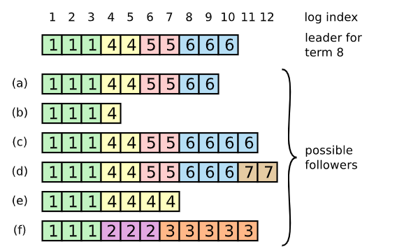
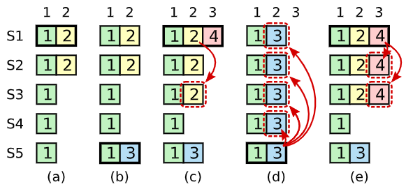
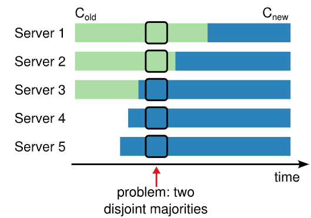

## 0 Abstract

Raft是一种维护replicated log的共识算法。

Raft比Paxos更容易理解，因为Raft将共识问题中的一些关键因素进行分离，例如leader选举、log复制、安全性等因此。

Raft还设计了一套新的管理cluster成员的机制，使用overlapping majority来保证安全。

## 1 Introduction

共识算法使得一群机器在少部分出现故障down掉的情况下仍然保持运行。过去这一领域由Paxos算法主宰。不幸地是，Paxos算法难以理解，且实际系统需要进行复杂的修改才能运用Paxos。

Raft算法改进了理解性，包含了**解耦**（将leader选举、log复制、安全性解耦开来）和**状态空间压缩**（减少了系统不确定性，使得服务器之间各种不一致的情况数量减少）。并且在43位学生中测试表明Raft比Paxos更容易理解。

Raft的特点：

- Strong leader： Raft中将更多的功能集中在Leader上（Leadership更strong），例如log entry只会从leader发送到其他server上。
- Leader election： Raft使用随机timer来选举leader（后面细讲）。
- Membership changes： Raft使用一种新的共识方法，使得cluster在配置更改期间能保持正常运行（后面细讲）。

## 2 Replicated state machines

> introduce the replicated state machine problem.

Replicated state machine（复制状态机）用于在多台服务器之间保证完全相同的状态，使分布式系统具有故障容错性（tolerance）。例如Chubby和ZooKeeper就是一种复制状态机。

复制状态机一般通过复制log来实现的，log在多台服务器之间保持一致，因此其中的操作顺序也一致，而状态机在经过这些操作后所达到的状态是确定的，因此每台状态机的最后状态也相同。

保持在多台主机上log一致就是共识算法的责任。每当主机收到一个client的请求后，就将其加入到自己的log中，并通过主机中的共识模块（Paxos），来使得最终每台主机上的log中操作顺序一致。

共识算法一般有以下特性：

- 在非拜占庭问题的条件下，保证安全性。**Paxos、Raft不是解决拜占庭问题的**。

- 可以容忍一部分主机fail，只要majority还在正常运行。
- 不依赖时间来保证一致性，消息延迟只能导致可用性问题，而非一致性。
- 在一般情况下，只要集群中majority主机响应了请求，就可以认为一个命令完成了。不需要等待少部分非常慢的主机的完成。

## 3 What's wrong with Paxos?

Paxos先定义了一个针对单个决定达成一致性的协议，可以称为**single-decree Paxos**。

然后再利用多个single-decree Paxos的实例，实现了**multi-Paxos**，可以对序列决定达成一致性，例如log文件。

Paxos两大缺点：

1. 难以理解（Paxos Made Simple讲的是single-decree Paxos）。

2. 难以实现。（由于Chubby之类的谷歌系统没开源，以及Lamport中关于Paxos很多细节也没有讲）

   因此难以运用到实际系统中，这主要是因为multi-Paxos由多个single-decree Paxos组成导致的（独立地选择每个entry，然后再合并为一个序列，会增加复杂性）。（**Raft可以看作是针对multi-Paxos的**）

   Paxos在其核心使用了P2P的方法来达成共识（majority），这在只做出一个决定时是有意义的，但是在做出一系列决定时，还不如先选出个leader，然后由leader决定后面一系列决定。（因此multi-Paxos不太行）

最后结果就是Paxos难以理解，每个说是基于Paxos算法实现的系统其实最后真正做出来的架构和Paxos又有些不同（Chubby的开发者都说：Paxos算法的描述与现实世界系统的需求之间存在着显著差距，最终系统基于的是未经证明正确性的协议）。因此Paxos难懂又难用。

## 4 Designing for understandability

就是说Raft在设计时充分考虑实用性、可理解性。主要靠：1.解耦（将复杂问题解耦成可以分开理解、解决的子问题），2.减少可能的状态数量（但有些地方，随机性也可以被用来更容易理解，例如Raft使用随机化来简化Leader选举算法）。

## 5 The Raft consensus algorithm

Raft会选举leader来对复制log进行管理。Leader会接受来自client的请求（也就是log entries），复制这些log entries到各个主机，并在合适的时候告诉各个主机"**可以进行log上面的操作了**"。Data只会从leader流向其它各个主机。如果Leader发生故障，会重新选举新leader。

Raft将共识问题解耦成一下三部分（稍后细讲）：

- Leader选举：当现有leader fail了，需要选举新leader；
- Log复制：leader从client获取log entries，随后复制到整个cluster的各个主机中；
- safety：
  - Election Safety：一个任期内（**term**）只会有一个leader被选举出；
  - Leader Append-Only：leader对log的操作只有append new entry；
  - **Log Matching**：if two logs contain an entry with the same **index** and **term**, then the logs are identical in all entries up（给定索引之前的） through the given index.
  - Leader Completeness：如果在一个term中一个entry被commit了，则在这之后所有更高term number的leader的log中便会有这个entry；
  - **State Machine Safety**：如果一个主机在第index步apply一个log entry，则其它所有主机在第index步也是apply的这个log entry；

### 5.1 Raft Basics

一个Raft Cluster也是通常还有5个主机（可容忍2个主机故障）。每个主机只会有三种状态：leader、follower、candidate。通常情况下只会是：一个leader和其余的follower（其它client联系follower也会被导向leader）。在选举leader时才有candidate状态。

Raft将时间切分成长短不一的terms，并以连续的整数对term进行编号。每个term都以选举新leader开始。有些时候选举结果是split vote（五五开），这时就会结束当前term，并很快开启新term（进行新的选举）。

每个主机中都存有一个term number，每当两台主机通信时会交换各自的term number；如果发现自己的term number比对方小，则会更新。如果是leader或者candidate发现自己的term number比对方小，则会立马变成follower状态。如果一个主机接受到的request（一般是从leader）中的term number比自己小，则它会拒绝这个request。

Raft中主机互相通信采用RPC，且只有两套RPC就够用。RequestVote RPC由candidate发起。Append Entries RPC由leader发起，这个RPC还具有心跳包的功能。其实还有第三套RPC（但不是必须的）用于在主机间传输snapshots快照。一个主机发起RPC后如果超时还未收到响应则会重新尝试。主机可以并行发起多个RPC。

### 5.2 Leader election

每台主机启动后都是follower，并且只要持续收到来自leader或者candidate的RPC就会继续保持follower状态。当它超过一定时间（election timeout）后没收到任何消息的话就会发起新的选举。

发起选举后，这台主机就增加自身term number，变成candidate状态，并且向集群中其它主机并发地发起RequestVote RPC调用。然后：

1. Candidate胜出的条件是收到majority主机的投票。每台主机在每个term中至多投出一票（先到先得）。一旦收到超半数的投票，自身状态变为leader，并且向其他所有用户发送一条heartbeat message（不带数据的AppendEntries RPC）来宣告自己的地位。
2. Candidate如果收到另一个主机宣告leader的消息（这个新leader的term大于等于自己的），则candidate就会退化成follower状态。如果自己的term更大，则会拒绝这个RPC，并保持自身的candidate状态。
3. Candidate如果等了很久都还未等到超半数的投票（由于发生了投票分裂的情况），则会增加自己的term number，重新发起新一轮选举。（这个等待时间是随机的，避免各台主机无限重新选举）即使超时了，这个candidate也会再随机等待一段时间才发起新一轮选举。（**两段随机时间**）

> 作者说他们一开始想为每台主机分配rank值，rank低的candidate看到rank高的candidate就自动放弃，但这样又会造成一轮新的问题（例如低rank在timeout后又发起选举可能过于频繁的问题）。

### 5.3 Log Replication

Leader被选举出后就可以立即为client提供服务。每次client发送的请求都被leader以一条log entry的形式append到log中，并且对集群中其它主机并发调用AppendEntries RPC。当**entry被安全append**后（下面细讲），leader在自己状态机中应用这次log entry并返回client执行结果。如果有follower故障或者延迟，则leader会无限尝试调用RPC直到所有follower都在log中append。

每个Log entry中存有当时的term number，同时每个log entry有个index来表明其在log中的位置。

Log entry中的command被执行就叫commited，log entry被复制到集群中超半数（majority）主机后就可以被commit（之前的未被commit的log entry也会被一同commit）。Leader会keep当前index的最大值。Follower在知道有个log entry被commit了之后，也会按照index顺序commit一遍。

Raft的safety第三点Log Matching（即log的一致性）主要是靠以下两点保证：

1. 如果两条log entry有相同的index和term，则其中的command也相同。

   证明：因为leader在给定term最多创建一条给定index的log entry，且log entry不会再改变它们的index。

2. 如果两条log entry有相同的index和term，则在这之前的logs全相同。

   证明：在AppendEntries RPC执行时会进行简单的一致性检查，leader会在消息中包含新entry紧邻的上一条entry的term和index发给follower，follower会在自己的log中查找这个entry，如果找得到才会接收新entry。（避免出现空洞的index）

就这样，多个follower和leader的log永远会保持一致，然而如果leader突然crash掉，则可能会出现新leader的log和各个follower的不一致的情况出现。Raft中对于这一方法的解决方案，就是强制要求follower的log文件被overwritten成和leader的一模一样。具体做法如下：

- leader中为每个follower维持有一个nextIndex来代表该follower下一个接收的entry的index。Leader刚上任时每个nextIndex就是自己的下一个index。例如下图就是11。

  > 注意写入到majority中才代表commit了，下图中(f)那样就是成为term2、3的leader结果一个也没commit就crash所导致的。

  
  
  当发现不一致时，AppendEntries RPC中的一致性检查会失败，然后leader会减小这个follower对应的nextIndex然后retry RPC，直到匹配成功。操作完成后，follower中那些不匹配的旧entry就会被删除。至此该follower中的log就和leader的保持一致了。Leader不会更改自己的log。

### 5.4 Safety

> 如果一个follower失联了一段时间而错过了旧leader所commit的一些log entry（导致该follower少执行了几个command），然后旧leader故障，好巧不巧地这个follower又被选为新leader，于是他就要求所有其他人的log同他的保持一致。这就导致不同的状态机所执行的command序列不同。

为了避免上述情况的出现，保证Safety的第四点**Leader Completeness**，将增加下述restriction，以此保证新选出的leader一定是执行完之前所有已经commit的log entry。

#### 5.4.1 Election restriction

为了保证选举出的leader是包含了所有已经commit的entry，只需要在选举的时候：要想一个follower给一个candidate投票，则candidate的log必须比这个follower的log更加up-to-date才行。所谓的up-to-date就是含有的最后一个log entry的term number更大，如果term相同，则index更大的那个log更up-to-date。这样选出来的leader就会包含有之前所有commit过的entry（否则不会被majority选中）。

#### 5.4.2 Committing entries from previous terms

> 之前的机制保证了一定程度上的safety，但还是有如下问题：
>
> 
>
> abcd中leader分别是S1、S5、S1、S5，问题就出现在(d)中，因为S5在(b)时接收到了term3的entry，因此根据上面的up-to-date规则来说，此时它就是最up-to-date的（因为term值是3），S5在(d)时幸运地成为了leader，结果就把本来已经写入到majority中的term2的entry给覆盖删除掉了。

Raft针对上述问题的解决方案就是：对于之前term的log entry，现任leader在传播它们时不会因为存入到majority中就认为commit完成了。只有当前term中的log entry写入到majority后，认为当前term的这个log entry的commit完成后，之前term的entry的commit才被认为完成。

例如上图：在(c)时刻时，leader不会认为来自term2的entry的commit完成了，而是只有等到(e)时刻时（term4的entry commit完成）才会认为term2的commit完成。

#### 5.4.3 Safety argument

作者在这里用假设矛盾法证明了Safety的第三点：**Leader Completeness**；具体证明过程（转自网络博客，这里看个重点黑体字弄懂就行）：

> 基于这个假设，一个事实是，开始选举的时候，U中就不包含T中的commit点，由于leaderT有commitT点，说明在任期T内，有大部分的follower都有commitT的点。这就说明，一定存在一个voter，它包含了commitT点，并且它投票给了leaderU如果leaderU和这个voter有相同的term，那么leaderU的日志长度一定大于等于这个voter（**否则会因为index小而被拒绝投票**），那么leaderU肯定包含了voter的所有信息（**这个是由Log Matching的属性决定的，它们包含有相同的term，因此相同index的日志条目肯定相同**),leaderU中肯定包含commit点，这与假设矛盾如果leaderU和这个voter的term不同，那么leaderU的日志index一定大于等于voter的index。也就是说，为leaderU添加最后一条entry的那个leader因该已经包含提交的日志（**这是因为leaderU的leader的term>leaderU的term>voter的term，而leaderU是的一个不符合条件的任期，所以leaderU的leader应该是符合条件的，肯定就包含了voter的commit点**），即包含commit点，根据Log Maching的原则，leaderU里面一定包含了这一点，这与假设矛盾因此，leader completeness是可以保证的。

用Safety的前面四点即可推导出第五点**State Machine Safety Property**。

### 5.5 Follower and candidate crashes

Follower或者candidate主机故障后，Leader会不断retry。Raft RPC是可以重复执行的，例如Append，在发现这个log entry已经存在后便会忽略掉此次操作（不操作只响应）。

### 5.6 Timing and availability

> Raft不能因为event发生得快或慢就出现异常（即不能依赖timing），但也要保证用户的请求能在一定限时内得到响应。

Raft在如下条件满足时，便可运行得比较流畅（其中<<代表的是远远小于）：
$$
broadcastTime<<electionTimeout<<MTBF
$$
broadcastTime是指leader给所有follower并行调用RPC并受到response的耗时；通常0.5ms~20ms；

electionTimeout就是前面说的follower会等待的时间（否则会发起新的选举）；通常10ms~500ms；

MTBF是平均每台主机故障的平均间隔时间；通常几个月；

## 6 Cluster Membership Changes

> 存在的问题：如何在不关机、安全地情况下将cluster从旧配置更新成新配置（configuration）。（不同主机的更新时间不同，不能同步地让所有主机更新成新配置）例如下图，想要将cluster中主机数量从3变为5，则在一些时刻就出现了两个majority，就可能两个leader。
>
> 
>
> 

raft为了解决这个问题，设计了 联合共识模式(joint consensus) ，这个模式大致的思想是：

- 首先leader节点向所有得follower节点发送联合共识日志( C-old,C-new)；
- 所有的follower节点收到联合共识日志( C-old,C-new)之后，立马提交并使用，不会等待leader的类似commit的指令；
- 这个联合共识日志( C-old,C-new) 是包含了旧配置和新配置的并集，假设在这个阶段有客户端的请求操作，leader会向所有的follower节点发送同步数据请求，在( C-old,C-new)阶段，不仅保证旧配置下的节点同步，也保证新配置下的节点同步都满足过半响应才会真正响应客户端；
- 当所有服务节点都升级扩缩容之后，leader会向所有follower节点发送(C-new)配置变更请求，告诉所有节点，可以切换到新的集群环境工作了；
- 然后所有follower节点收到请求后，仍然立马提交并使用，不会等待leader的类似commit的指令；
- 接下来就是正常的工作流程了。

这里就有三种问题了：

1. 新加入的服务器可能不含有之前的log entries，如果要等待commit完成，则需要等待这些新服务器上log追赶上现有的log长度，这就会导致commit完成的时间被拖延。

   解决方法：新加入的主机被认为是non-voting member，即在计算majority时不会count这些新加入的服务器。等到它们的log文件追赶上进度后才会被计数，才会开始进行configuration变换的过程（上述过程）。

2. 新的configuration中现有leader可能被踢出了cluster。例如5台主机缩减到3台，而踢出的2台中刚好有现在的leader。

   解决方案：leader会一直履行职责，直到C-new被commit。（在这期间Leader不会把自己算入majority中）

3. 被踢出的服务器可能会反复：election timeout —— 发起新election —— election timeout...

   因此这些踢出的服务器就很可能扰乱秩序（它们会自增term number，导致收到它们消息的leader退化成follower）

   解决方案：设置一个minimum election timeout时间，任何主机在上一次收到Leader的RPC消息后的minimum election timeout时间内，收到发起新选举的消息都会无视掉。

## 7 Log Compaction

> 不能放任Log文件无限制地增长。

Raft采用快照（snapshot）机制来减少log文件大小，就是将当前整个系统的状态给写入到快照文件中保存起来，然后就可以安全释放掉之前的所有log文件。（除此之外论文中还提到了log cleaning方法和LSM tree的方法）

Raft中各主机拍摄快照是独立地，也就是快照操作不需要多台主机同步进行。（自己管好自己就行）当快照生成完成后，就会删除所有snapshot包含的log entry以及之前的snapshot。

Leader会给那些落后很多的主机发送snapshot使它们快速追赶进度。对于接受到的snapshot，主机会删掉那些被它覆盖的entries。

> 作者一开始考虑只允许leader制作快照，然后给其follower发送快照的机制，但是这样会有很多问题（占网速、系统实现更复杂等等）。

快照机制还需要考虑两个问题：

1. 什么时候生成快照。

   可以设定阈值，当log文件超过这一大小就开始生成。

2. 如何在生成快照时不影响用户请求。

   可以采用写时复制机制，生成快照时，状态机进入COW状态，当有用户有新请求（需要更新状态机）时就复制当前状态机。（从而可以同时生成快照，同时服务用户请求）

## 8 Client Interaction

Client最初发送请求给集群中随机一台主机，如果该主机不是Leader，则会拒绝client的请求并回复最近leader的地址。

Client会在自己给Raft主机的command中包含一个序列号，每个Raft主机中都为每个client维持了一个最新操作序列号，避免重复执行一个用户的command（发现序列号已经出现过则立即return）。

Client读操作本来可以不需要log entry直接进行的，但是这会导致可能返回陈旧数据（处理请求的leader不知道它已经被新leader取代了）。为了解决这个问题，设计了以下两种机制：

1. Leader刚上任时必须知道自己的哪些entry已经被commit了。方法就是往log中增加一个新term的no-op entry，然后将这个no-op entry commit掉，这样就能保证之前term的那些entry即使没被commit现在也被commit了。

2. Leader必须知道自己是否已经被取代。方法就是同majority发心跳包（heartbeat message，就是一次空的AppendEntries RPC），如果发送成功就代表自己还是Leader。

