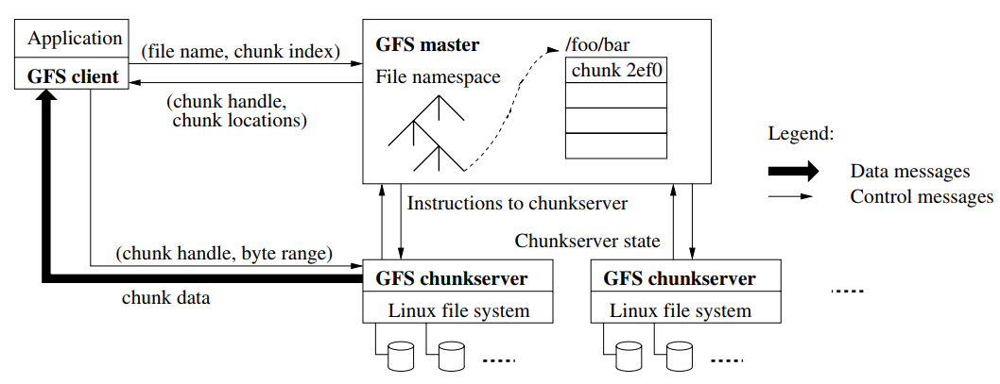
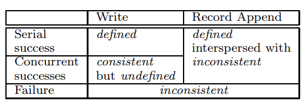
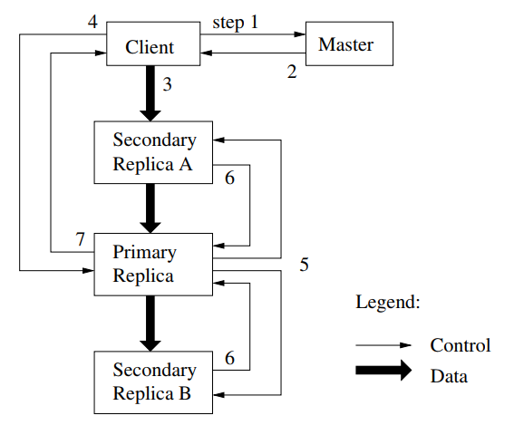

## Abstract

GFS是一个针对Google面临的工作负载和硬件环境设计的分布式文件系统，具有容错性、高并发等特点。

## Introduction

原则：

1. 分布式系统中大部分使用的都是普通的硬件，组件故障是常态而非偶然；（因此分布式系统必须容错性要高）

2. 文件都很大（GB/TB级）；（与其管理亿万个KB级小数据，不如一起管理大文件）

3. 大部分文件都是追加写而非覆盖写；文件随机写几乎不存在；数据一旦写入之后基本上只是顺序读；

4. 文件系统API简易，灵活性高；（放宽了一致性模型，简化了文件系统，不会给应用程序带来沉重的负担，比如有一个atomic追加写操作）

## Design overview

### Assumptions

> 对前面的"原则"进行更加细致的阐述

1. GFS由许多inexpensive硬件组成(often fail)，因此GFS会不断地监测各个设备，具有一定容错性，并能从一般的故障中恢复正常。
2. GFS支持存储适量的大型文件，考虑存储几百万个100MB以上的文件。GFS支持存储小型文件，但不针对存储小型文件进行特别的优化。

3. 目标程序的读主要是两种读取方式，顺序读取大量数据，随机读取小数据。
4. 目标程序的写主要是追加写大量数据，随机覆盖写小数据可以但不会被优化。
5. GFS针对文件访问的并发性，需要定义良好的操作函数，例如原子追加写操作，使得可以用最少的同步代价实现例如"生产者-消费者(producer-consumer)"关系、"多路合并(multi-way merge)"关系的并发。

6. GFS更看重数据的处理带宽，而非单次操作的延迟。即大多目标程序都更看重海量数据的处理，而很少对个人读写有严格的响应时间要求。

### Interface

GFS提供和其它文件系统类似的接口函数，例如create、delete、open、close，但并未完全按照POSIX标准实现。GFS中的文件也是目录的树状结构，根据路径名定位一个文件。

GFS提供了两个独特的函数，**snapshot**和**record append**，其中snapshot可以创建一个文件或者目录tree的复制；record append就是支持多用户并发追加写的原子函数。

### Architecture

GFS服务器集群(简称GFS集群)由一个master以及多个chunkserver组成，可以供多个客户端访问。每台都是普通的Linux主机running a user-level server process。一个client和一个server是可以在同一台主机的。

文件被切分成多个chunk，每个chunk有个独一无二的、不可修改的64位"身份证号"chunk handle。chunk在创建的时候由GFS master分配"身份证号"。每个chunk在chunk server以Linux普通文件的形式存储在本地磁盘，远程client想要进行读或写必须要提供chunk handle以及字节范围。默认情况下，每个chunk在不同的chunk server中存储三份复制品，当然用户可以自定义不同的文件空间(namespace)中的复制等级，例如更重要的文件就多复制几份来确保容错、容灾性。

GFS master中存储了文件系统的metadata，例如the namespaces、访问控制信息(access control)、文件到chunk的map映射、每个chunk的现在位置等。GFS master也负责回收孤儿chunk、移动chunk到另一个chunkserver中去等。GFS master周期性地和所有chunk server发送心跳包(heartbeat message)来给chunk server发送指令以及获取其state等。

GFS中所有元数据查询操作都是去找master server，所有数据相关操作都是直接找相应chunk server。GFS并未实现POSIX API，因此GFS也并未接入到Linux中的vnode层。

GFS client和chunkserver都不需要缓存文件，因为GFS client(目标程序)一般都是会与海量的数据进行操作，因此工作集太大无法缓存。而chunkserver不需要缓存文件是因为底层的Linux块缓存系统（buffer cache）已经对常访问的文件数据进行了缓存。

### Single Master

GFS中只有一个Master，简化了整个系统的实现，方便进行复杂的chunk存储及其复制的算法。为了避免Master成为GFS的性能瓶颈，规定client在查找chunk时只需要向master请求自己应该去找哪些chunkserver进行后续操作即可，client会将获取到的chunkserver名单缓存一定时间。(类似DNS服务)

读取数据的流程：

1. App向底层Client传入read请求，参数为filename以及byte range；
2. Client根据byte范围转换成该文件里的chunk index（就是byte offset除以chunk size），并发送给master参数filename和chunk index；
3. Master收到文件名和chunk index后就去文件目录中查找文件及其对应的chunk的"身份证号"，并向client返回chunk handle和chunk locations(chunk所在的chunkservers)。
4. Client随后在每个chunk对应的chunkservers中选择一个最近的，向chunkserver发送chunk handle和byte range(这个range是指数据在chunk中的range)。
5. chunkserver最后向client返回相应的data。

> client会缓存"<filename, chunk index> - <chunk handle, chunk locations>"这种键值对(直到键值对过期或文件被重新open)，在之后获取同一chunk中其它数据时便不再需要向Master发送消息了。
>且client一般会请求连续多个chunk，Master可一次性返回多个chunk的相关信息，而这并不造成extra cost。
> 综上，client和master的消息次数被大大减少，以此来避免master成为整个系统的性能瓶颈。

### Chunk Size

chunk大小为64MB，每个chunk replica以普通文件的形式存储在chunkserver的本地磁盘中，较大的chunk size有如下好处：

1. 减少client和master的通信次数。因为chunk够大，因此后续的几次操作就很可能在同一个chunk上，因此client就只需要再去向chunkserver发送消息即可。
2. 减少了网络的负担，因为client后续很多操作很可能都是在同一chunk，所以可以将client和某个chunkserver的TCP连接额外维持一段时间，以节省建立TCP连接的开销。
3. 减小了Master中metadata的空间。

然而较大的chunk size也有如下缺点：

1. 文件的chunk数量较少，导致如果多个用户访问同一个文件的话将访问的是同样的那几个chunkserver，也就是chunkserver访问容易聚集（例如一个小的可执行文件只有一个chunk，结果被上万个机器同时执行，就会导致那3个存有这chunk的server负载过大）。

   但是在实际中这不会导致严重的问题，因为实际应用大多都是顺序访问每个chunk。并且也可以通过提高复制的份数来缓解这个问题。

   

### Metadata

Master的内存中存有三种元数据：1.file and chunk namespaces，2.文件到chunk的映射，3.每个chunk的位置。

运行时，三种元数据都在master server内存中，并且前2种元数据还会通过日志log(operation log)保存到disk(本地磁盘以及复制备份到远程磁盘)中进行持久化存储。而每个chunk的位置则是由Master每次启动并加入到集群时向每个chunkserver询问得到的。

#### In-Memory Data Structures

metadata存储在Master的内存中，每个chunk的metadata不超过64B，而每个文件的在file namespace中存储的文件名因为采用了prefix compression所以也不超过64B，因此Master内存足够存储大量的原信息。（不够的话加内存空间即可，方便且可靠）

#### Chunk Locations

Master不在自己的disk上存储chunk位置，每次靠询问每个chunserver来维持一份最新的chunk locations，以此来解决诸多master和chunkserver之间关于同步、容错的问题。

#### Operation Log

Master磁盘中的Operation Log就是整个GFS系统中时间线，上面记录了metadata的发生的change以及它们发生的时间（logical time）。

Operation Log将存储在本地磁盘and多个远端磁盘中，每次用户操作都必须等operation log在本地和远端disk中都更新完成后才会得到响应。Master会把几个log操作打包在一起批量处理，以此减小更新磁盘和复制备份对系统性能的影响。

Master靠load checkpoint和replay log文件进行恢复。每当现有的log文件超过一定大小后，master便会开始生成checkpoint，这个checkpoint相当于把当前时刻整个memory中的状态进行快照保存起来，随后开始记录新的log文件(旧log文件可以被删除了)。以此来避免log文件无限增长、系统恢复时间过长等问题。（checkpoint也是本地和远程disk中都保存）

如果在checkpoint生成过程中发生故障也没关系，因为还有旧的checkpoint和旧的log。恢复时会选择最新的、完好的checkpoint以及之后的log来进行恢复。

> checkpoint文件以compact B-tree like的格式进行组织，使用checkpoint时只需要把checkpoint映射到内存中便可用来查询namespaces了，因此recovery过程非常快。

### Consistency Model

#### Guarantees by GFS

- File namespace的一致性

File namespace的修改全在Master中完成，通过namespace locking确保原子性和正确性，通过前面介绍的operation log来定义操作的先后顺序。

- 文件数据的一致性

文件中一段区域是consistent，当且仅当所有用户看这段区域的数据都相同。

文件中一段区域是defined，当且仅当在mutation后，这段区域是consistent且写入成功。

文件中一段区域是undefined，当且仅当mutation后，这段区域是consistent的，但是"没按照剧本来"。这一般是由于并发的写冲突导致，即多个用户同时写的区域发生了重叠。

文件中一段区域是inconsistent（当然也是undefined），当且仅当failed mutation发生时。

> write是用户给出offset，append是GFS自己选择offset并将这个offset返回给用户。
>
> 在append时，数据的offset不一定是紧密接着上一个数据，GFS可能会在中间插入一些padding或者duplicated data，当然这些区域都被认为是inconsistent。

顺序地、成功地写入操作将会是defined，每次写入时，GFS会在每个chunk的复制品中进行相同顺序的写入操作。如果一个chunkserver因为故障而没能更新它里面的chunk，则这个chunk的version number将会不对(被GFS检测出来)，这个chunk随即就会变为过期的，不再参与整个GFS系统，只能等待GC来将其释放掉。

client通过旧的cache直接访问之前故障了的chunkserver，仍然可能会读取到过时的data。但是这种情况被许多条件限制，例如cache有timeout和reopen更新机制，同时由于大部分数据都是append-only，因此过时的数据一般只是缺少最新append的数据而已。此时reader重新read并contact Master就能成功获取到最新的数据。

Master会周期性同每个chunkserver进行handshake并且进行checksuming验证它们上的数据。一旦发现有数据故障，则其上的所有数据都会从现在仍有效的复制品中进行新的备份。一般Master周期性检查的周期是几分钟，只有在这期间一个chunk的所有备份都故障了，那么此时才是不可逆转的故障，这种情况下client就会给APP报错，提示数据丢失。

#### Implications for Applications(给APP开发者的启示)

GFS应用程序通过一些技术来适应GFS宽松的一致性模型：append不overwrite，checkpointing，写 self-validating record 和 self-identifying。

在google，只append，不overwrite。

经常性的操作是：1.写完了一个文件后重命名它，2.周期性地进行checkpointing，这个checkpoint可以是APP层面来进行，APP来记录当前成功写了哪些数据，reader只能读取到最后一个checkpoint的数据。

客户端读时偶尔需要处理padding和重复record的情况。如下所述：客户端写record的时候，可以在record中包含额外的信息如checksum，读的时候通过这个checksum来丢弃padding和record fragment ，如果不能容忍重复record，可以在record中保存一个unique id来过滤重复的record。

## System Interactions

> 背景：使Client与Master的交互尽量少

### Leases and Mutation Order

chunk lease (the primary) 就是指chunk的复制品中的头，是由Master选出来的，这个chunk lease会为其所有复制品定义一个更新顺序。当要更新一个chunk时，先更新chunk lease，然后再根据这个chunk lease规定的顺序去更新其它复制品。

chunk lease的有效期为60s，master可以给chunkserver发送extension信息来延长chunk lease的有效期。无论是extension一个已有的lease还是grant一个新的lease，这些信息都是附加在心跳包的末尾，不会单独地发送。

write的流程如下（之前的图貌似只是read的流程）：

1. Client向Master询问自己要写的chunk的lease(primary)在哪个chunk server上。（如果此时没有lease则Master会当场选择一个当lease）

2. Master向Client回复chunk lease所在位置。Client会把这个chunk lease也缓存起来。

3. Client向chunkservers中最近的一个server发送自己要写的数据。

   这种Control Flow和Data Flow分离的方法改善了性能。

   每个chunkserver有个LRU cache来缓存这些暂不能立马使用的数据。

4. Client向chunk lease提交自己的write申请。chunk lease对不同client发送过来的请求进行排序，并运用到自己chunk的更新。

5. chunk lease向其他同组的chunkserver(secondary replica)发送write请求，使得其他的chunkserver上的这些请求的先后顺序和chunk lease的相同。

6. 每个Secondary Replica更新完成后便会向Primary回复。

7. Primary收到所有其他Secondary的回复后才会向Client回复操作完毕。

   如果在这期间有哪一步发生了错误，就认为Client的请求发生了失败，相应修改区域的状态被认为是inconsistent，Client此时会重试几次write，如果重试几次都失败了才会给应用返回Error。

如果要写入的数据太大，横跨了多个chunk，则数据会被切分，但是还是按照上面的流程进行write。这期间可能别的Client会同时写入其中部分区域。因此最后的结果中有可能包含来自其他Client的数据。此时这区域的状态就是**consistent but undefined**。

### Data Flow

Data Flow与Control Flow分离以便充分利用网络带宽。

通过在chunkserver间链状传输数据而非树状，也是为了充分利用网络带宽。

机器间的distance是用ip地址来衡量的，client优先把数据给最近的chunkserver。(链状，且貌似必须是replica chunkserver)

并且机器间数据传输采用pipeline，例如有R个replicas串成链，B字节的数据，则整个transfer所需时间为$B/T+RL$，其中T是传输速度，L是两主机间的传播延迟。

### Atomic Record Appends

一次Apend的数据最多为四分之一的chunk size，如果数据更大则需要进行切分了。

Append的流程和write的流程差不多。除了一点点区别：如果primary(chunk lease)发现当前chunk不足以装下新的record时，则会将chunk剩余空间用0填充（让其它replica也这么做），之后primary会给client返回error，client便会重试一下append，这样就会将record存储到下一个chunk。

如果任何一个replica append失败，则client会重新append。这样就可能导致部分replica中写好了record而有些replica中没有。重新append时便会在下一个offset处进行存储。GFS不保证每个chunk中每个record是唯一的，只保证当append操作成功时，在所有replica的相同offset处会有这个新的record。这段区域是consistent且defined，而中间区域（全0或duplicate）则是inconsistent。

> 此时就明白为什么说append返回的offset不一定是紧邻上次append的位置，中间会有全0或者duplicate record。

### Snapshot

Snapshot用来快速创建file或者directory tree。

使用Copy on write来进行snapshot。

收到snapshot请求后，master会收回相关文件的lease，因此后续所有请求都会被要求同Master进行交互(需要Master允许后才能继续)，这就给Master一个创建新文件的机会。Master随后首先将snapshot操作记录到log中，之后再在memory中复制文件的metadata，新的文件仍暂时使用旧的chunk，但这些chunk的引用数会加1。

当这些replica chunk在snapshot之后收到新的write请求后，Master会通知每个replica所在的chunkserver复制并创建一个新的chunk（就在同一个chunkserver中进行，本地复制以节省流量），于是该write请求就在这些新的chunk中去进行。（之后就和正常的write请求流程相同）

## Master Operation

### Namespace Management and Locking

很多Master操作都需较长时间，例如snapshot要先收回涉及到的文件的lease，因此GFS允许多个Master操作并发，使用lock来进行必要的互斥。

GFS中的目录没有特定的数据结构记录一个目录下有哪些文件。GFS也不支持软硬链接。GFS中namespace就相当于是"绝对路径 - 文件metadata"的一个映射map。其中key值绝对路径是采用了prefix压缩技术，使得整个映射关系可以保存在memory中。在namespace中的每个node(文件node或者目录node)有一个read-write lock。

每个Master操作都会获取一系列锁，例如路径"/d1/d2/.../dn"，就会取得"/d1", "/d1/d2", "/d1/d2/d3", ..., "/d1/d2/.../dn-1"的read lock。而会取得"/d1/d2/.../dn"的read或write lock。

例子：

> 假设 /home/user is being snapshotted to /save/user.
>
> 假设/home/user/foo is being created.
>
> 首先snapshot操作，会取得/home和/save的read锁，取得/home/user和/save/user的write锁。
>
> 这样create操作，会取得/home的read锁，然后想获取/home/user的read锁（这个操作会被卡住）

说明：

> 同一文件可以并发获取多个read锁（读操作之间不会冲突）。
>
> snapshot操作会获取之前两个文件的write锁，是因为这两个文件相当于都发生了mutation（底层chunk的引用数加1），因此原来的数据也要write锁。
>
> create操作因为不会去对/home/user产生mutation（GFS中目录并无数据结构记录每个direntry），因此只需要read锁。

GFS中目录不需要记录direntry的好处：可以允许同一目录下多个文件同时发生更改。

如何避免死锁：所有锁按照目录树结构从上到下获取，同一level的node的锁则按照字典序排列获取。

### Replica Placement

机箱(rack)的读写带宽可能小于机箱内所有主机的读写带宽之和。

为了避免磁盘disk故障，Master必须将chunk尽量分散在不同的chunkserver中。

为了避免机箱rack故障，Master同时还必须将chunk尽量分散在不同的rack中，即使这样会导致各replica之间的数据传输不如机箱内通信快（a tradeoff）。

### Creation, Re-replication, Rebalancing

chunk replica被创造时一般是三种情况：1.chunk刚创建，2.re-replication（有replica丢失），3.rebalancing

- Creation

当新数据创建时，Master会考虑三个因素来选择为新chunk安置地方。

1. 当前disk使用率低的chunkserver优先；
2. 当前disk的"最近写入次数"最小的chunkserver优先（避免traffic集中在几个server）；
3. disk尽量分散在不同的机箱的优先；

- Re-replication

re-replication的处理顺序也有优先级。Master会选择优先级最高的缺失replica来进行clone操作。

1. 丢失的replica数量越多越优先被重新制造；
2. replica属于live files的优先（有些replica属于recently deleted file）；
3. 导致client进程被阻塞的replica优先；

为了避免内部clone操作过于占用性能导致影响GFS处理新的client的请求，Master会限制整个集群、每个chunkserver中同时能够进行的clone操作数量，并且每个chunkserver也会自我限制每个clone操作所能使用的带宽。

### Garbage Collection

#### Mechanism

当文件刚被删除，Master会将其改名为a hidden name that includes the deletion timestamp。并且会让这个文件保留3天（这个时间可修改）。在这3天内，这个文件仍然可以被读取，并且可以通过改回名字来取消删除。等过了3天后，当Master周期性扫描到这个文件时，就会从file namespace中删除此文件名，并且将这个文件的metadata删除。

从file namespace删除了一个文件后，此文件相关的所有chunk就会变成孤儿chunk，Master会周期性地扫描chunk namespace，当其发现孤儿chunk后，就会从内存中删除这个chunk的metadata。之后Chunkserver会在与Master定期发送的心跳包中告知Master自己所拥有的chunk，而Master就会回复给chunkserver孤儿chunk的名单，随后chunkserver就可将孤儿chunk删除掉。

> Master会周期性地扫描file namespace和chunk namespace，也会周期性和每个chunkserver通过心跳包沟通。

#### Discussion

chunk replicas都是普通的Linux文件，chunkserver中特定的目录中。

> 以及说了很多上述机制的优点blabla

GFS允许通过显式删除"已被标记为删除的文件"来快速删除chunkserver中相应的chunk，以此来加速空闲空间的回收。

GFS允许为不同file namespace中的文件制定不同的replication和reclamation政策，例如可以规定一个目录里面的文件只存储一份数据，并且删除是立即删除（不需等待3天）。

### Stale Replica Detection

当chunkserver因为某种原因未能成功更新某个chunk时，这个chunk就变为过期的stale。Master为每个chunk维持一个chunk version，来辨别chunk是否过期。

Master每次为一组replica赋予新的lease时就会增加其version号。当Master周期性地通过心跳包同一个chunkserver交流时（或者一个chunkserver重启并向Master汇报时），就可以得知该chunkserver中的所有chunk的version号。

如果version号低于自己维护的version，则是过期chunk。如果version号高于自己维护的version，则Master任务是自己之前赋予lease时失败了，因此把这个较高的version存到自己memory中。（总之Master就是取较高值就行）

Master会在Garbage Collection中删除过期chunk，并且Master也会在给client或者chunkserver凡是关于chunk的消息时附加对应的version号，使得无论是client还是chunkserver在执行相关操作时都会先确认自己是否操作的是最新的chunk。

##  Fault Tolerance and Diagnosis

> 组件故障是一种normal而非exception。

### High Availability

> 两个基本策略：Fast recovery 和 Replication

- Fast Recovery

Master和Chunkserver在因故障而关闭后都会在几秒钟内自动重启并尝试恢复状态。

- Chunk Replication

> 就是说一份数据复制成三份保存的好处。

- Master Replication

Master的state存储在checkpoint和log中，而这些数据则既存储在本地disk也存储在multiple remote machines。Master的数据会发生修改当前仅当当前修改操作已经记录到了本地及远端disk的log中。

当Master故障时，会立即尝试本地重启Master。若本地机器损坏，则上层监控器（GFS之上的管理器）会立即在新主机上启动Master并根据checkpoint和log恢复状态。客户端根据名称地址而非ip地址来与Master通信，因此Master异地启动后只需修改本地DNS中的域名数据即可。

- Shadow Master

Shadow Master就是(Primary) Master的只读版本，Shadow Master通过读取growing operation log并将其中记载的操作按顺序在自己的memory中执行来保持同Primary Master的同步。Shadow Master中的数据同Primary Master只有一两秒的延迟。

Client只可以通过Shadow Master读数据，且必须Client不介意读取的是延后一两秒的数据的情况下才可以，否则只能去读取Primary Master。

同样地，Shadow Master启动时也是跟各个Chunkserver发送信息来获取它们最新存储的chunk名单，同样也周期性地发送心跳包等。

### Data Integrity

> A chunk is broken up into 64 KB blocks. Each has a corresponding 32 bit checksum.

就是说chunk被分为了以64KB为大小的block，chunkserver为每个block在内存中存有相应metadata。每个block都有32bit的checksum，在内存中以及本地磁盘的log中。

读取数据时chunkserver便会检查所读取数据的checksum，有错就会向requestor以及master汇报。requestor会转而读取其它replica，master会指挥补充新的replica并命令此chunkserver删除错误chunk。

Append数据时chunkserver会在内存和log中都存储checksum。

Write数据时chunkserver会先读取数据并检验checksum，检验通过再修改chunk并生成新的checksum。

chunkserver在子进程中也会周期性地扫描并检验所有chunk，一旦发现有错误chunk便会向Master汇报。

### Diagnostic Tools

GFS中的服务器（both Master and Chunkserver）都会生成diagnostic log，这些log可以被随便删除，只是记录了一些关键事件和RPC requsts and replies。

> GFS中用到了RPC

通过获取多个服务器的diagnostic log，我们可以把这些RPC请求和响应按时间排列起来进行debug、analysis等。diagnostic log也可以用作分析性能。

