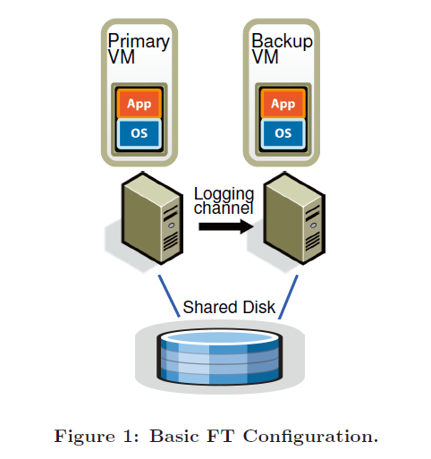
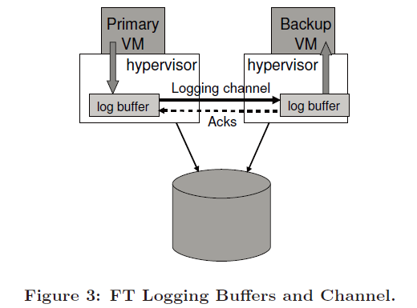

## Abstract

本文主要是介绍了VMware vSphere 4.0是如何实现VM的fault tolerance的，大概就是让每一台VM有**一台**backup VM与其同步执行，每当VM出故障就立马无缝切换到backup VM上，让client感觉不到这一过程，且性能最多下降10%，且这机制对带宽的要求只要20Mbit/s。

## 1 Introduction

想让两台VM保持完全相同的状态，一种简单的方法便是随时随地复制primary VM的所有状态到backup VM上，包括CPU、memory、IO devices。比如primary VM对某个区域的memory全部赋值为1，那么这区域的memory就被传输到backup VM上，而不是让backup VM去执行这个"赋值为1"的动作，因此这种方法的带宽消耗极大。

另一种方法便是将VM看作是状态机（deterministic state machine），只要让两台VM的初始状态相同，并且执行相同的动作序列，那么它们的状态就会相同，然而VM不可避免地会执行一些不确定的操作（undeterministic），此时就需要传输一些额外的信息来确保两台VM仍然状态相同，这种方法对带宽要求很低，本文采用的便是第二种方法。

> 想让两台物理机保持完全相同的状态是很难的，因为物理机必定要和外在真实环境打交道。而VM完全运行在一个虚拟的环境，受hypervisor的控制，因此我们可以很方便地实现两台VM的状态一致。

本文实现的机制全称为VMware vSphere Fault Tolerance，下文简称FT。本文用于实现两台VM同步的操作叫做deterministic reply，并在其基础上增加了部分额外的消息协议来确保不确定操作的执行同步等。

> VMware vSphere Fault Tolerance暂时只支持单核的VM，多核的VM由于不确定的操作太多了，暂时还没实现。
>
> VMware vSphere Fault Tolerance只针对fail-stop failures，不针对其它类型的故障。

## 2 Basic FT Design

两台VM的虚拟disk是在一个shared storage上的，也就是一台VM其实可以read和write另一台VM的disk数据。只有primary VM是在网络上可见的，所有外部数据发送给primary VM。primary VM通过一个叫做logging channel的通道与backup VM通讯，应该就是个TCP连接之类的。只有primary VM的输出会发送给client，backup VM的输出会自动被丢弃。

FT会通过周期性的心跳包、以及logging channel中的部分周期性的事件消息（比如primary VM上的时钟中断）来检测primary VM是否发生了故障。

### 2.1 Deterministic Replay Implementation

FT采用的deterministic replay技术会将primary VM所有的输入、所有的不确定性记录到一个log entry，确保让不确定性过程都变成确定性，然后通过log通道发送给backup VM。backup VM随后会依次读取log entry并重复其中的动作来保持和primary VM同步。

对于一些不确定性的event，比如时钟中断或来自外部的IO中断，这些中断所出现的实际指令位置也会被记录到log entry，确保backup VM会在完全相同的指令位置产生这些中断。

### 2.2 FT Protocol

FT协议之**Output Requirement**：

- 就是说primary VM故障后，backup VM成为新的primary，此后它的输出必须和前任primary的输出完全一致。

FT协议之**Output Rule**：

- 就是说primary VM在向外界输出一次数据时，会等到backup VM确认收到所有和此次输出操作相关的log entry后，primary VM才会进行输出。

FT在实现Output Rule时并不会真正地让primary VM等待时停止，而是让delay数据输出的completion，primary VM会继续执行后面的动作。（从primary VM的视角来看，就好像网络带宽或者disk速度很慢，但是因为数据输出基本都是异步执行，所以primary VM还会继续执行后面动作）

如果primary在等待输出完成期间发生故障，后继primary无法确认之前的消息是否发送出去了（除非FT采用2PC协议，但是性能会进一步下降），对此作者的解释是TCP中自动会对重复的包丢掉，因此本文中不考虑这部分设计。

同时网络中的一些input packet也可能因为故障而丢失，但packet丢失可能是各种各样的原因，因此作者也说本文不考虑这部分设计。

### 2.3 Detecting and Responding to Failure

FT检测primary failure的方法：

1. 定期的UDP心跳包；
2. 如果log channel长时间没有数据，则也判定为failure；（因为primary正常的话会定期产生时钟中断的消息给backup）

FT避免"脑裂"问题的方法：

每个VM在成为primary时都会到shared storage中用test-and-set操作给某个数据进行赋值，如果操作成功则代表自己可以成为primary，否则代表其它VM已经成为primary。如果VM访问不了shared storage，那么这台VM会一直等待，因为VM需要shared storage才能正常工作。

每当一台primary故障，backup变为新的primary后，它会立即启动新的backup，以保持redundancy。

## 3 Practical Implementation

### 3.1 Starting and Restarting FT VMs

FT通过FT VMotion来将正在运行的VM克隆到另一台服务器，然后让原来的VM进入logging mode变成primary，让新建的VM进入replay mode变成backup。整个过程只需要打扰primary最多1秒钟。

### 3.2 Managing the Logging Channel

在primary VM和backup VM上hypervisor都设置了log buffer，当primary的log buffer满了则primary就必须停下来等待。为了减小这种情况发生的可能性，FT对primary采用了自适应的速度调节机制，当backup VM的速度降低时，hypervisor便会渐渐减小分配给primary的CPU时间片，以让primary的速度和backup的速度相匹配，以此尽量避免log buffer被填满。当backup速度提升后，相应地primary速度也会被提升。

### 3.3 Operation on FT VMs

control operation也是primary会生成log entry发送给backup，比如关机、开机。

但是一些特殊的操作比如VMotion（将一台VM移动到另一个服务器上）则是primary和backup都可以独立执行，primary进行VMotion只需要等待所有IO都完成后就可以进行；但backup进行VMotion时primary可能一直有新的IO请求发生，为此backup在进行VMotion时会通过log通道向primary请求静默IO一段时间，这样backup也能等待所有IO完成。

> 3.4和3.5都是在讲实现中disk IO和network IO的一些细节，略