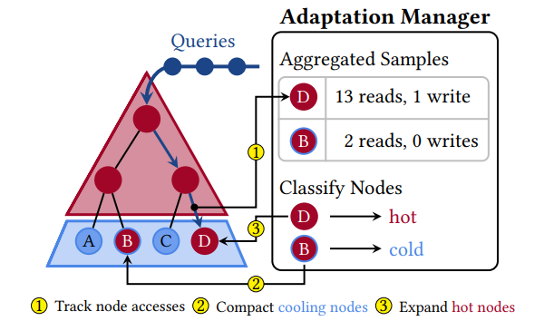
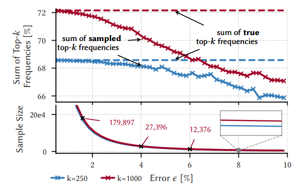
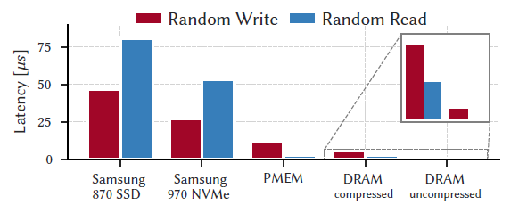
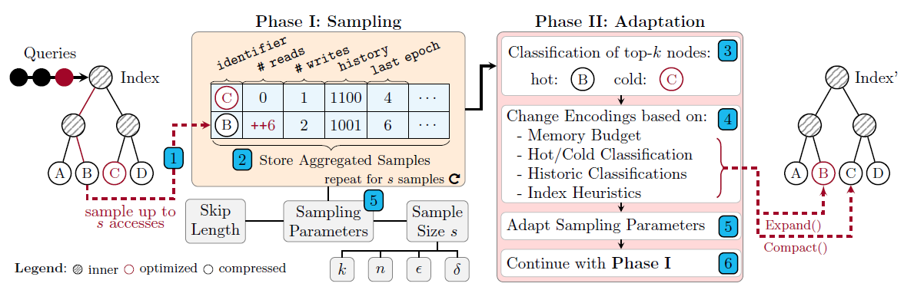
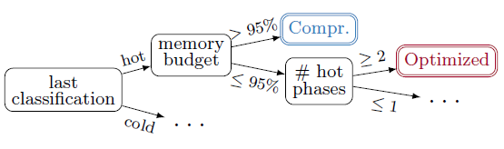

## Abstract

数据库等系统中，索引（index）通常会占很大一部分内存。如果能够压缩索引大小，让数据库把更多的内存用来缓存数据则可以在一定程度上提升数据库系统的整体性能。然而压缩后的索引的性能会下降，因此作者就考虑采用一种**基于数据冷热程度设计的动态索引结构**，让热数据的索引以性能最优的形式存储，而让冷数据的索引则以压缩的形式存储，以此来同时实现"**让索引占用的内存减少**"同时"**性能不会明显下降**"的目的。

## 1 Introduction

为了提供高性能服务，越来越多的系统运行时会将大量数据缓存在内存。DBMS也会在内存中存储例如B-trees、tries、hash tables的索引来提供高性能服务，特别是OLTP DBMS会为每个表维持多个索引，这就导致索引占用的内存越来越大，甚至在一些情境下超过服务器内存总体的50%。

过去几十年来已经有许多压缩各种常见数据结构的方法被人们提出，比如我们可以用数据内存地址的偏移量来替代指针变量以节省内存。这些数据结构压缩后虽然占用的空间减小，大部分情况下它们的使用性能会明显下降。

"兰姆猜想（the RUM conjecture）"指出，数据结构难以同时"**read性能高**"、"**update性能高**"、"**space占用小**"。但是对于不均匀的工作负载来说，这三点是可能同时达到的，比如让经常被访问到的数据就以性能最优的形式存储，而偶尔才被访问到的数据就以压缩的形式存储。

本文设计的框架大致分为以下两个阶段（phase）：

1. 采样并记录、统计信息；
2. 基于采样得到的统计信息，对采样后的数据进行冷热数据分类，然后根据分类结果以及其它信息（比如当前系统空闲内存的大小），采用启发式的规则决定各个索引node的存储形式（compressed or optimized）；

本文的框架将"**采样**"、"**数据冷热分类**"的逻辑与"**具体索引数据结构相关**"的逻辑进行解耦，使得本文的"采样"、"数据冷热分类"的逻辑可以很方便地与任何具体类型的索引进行结合。

## 2 Preliminaries

作者将冷热数据分类问题看作是top-k问题，即在一段时间内访问频率最高的k条数据被认为是hot的。在实际中通常采用采样的方式来估计top-k，采样的数量决定了采样后估计的top-k的准确度，即数据冷热分类的准确度，通常来说采样的数量越多准确度越高但是耗时也越长。

### 2.1 $$\epsilon$$-approximation of top-k

> 作者通过以下公式决定每次采样的大小

设$$I$$是一个集合；

设$$D$$是一个多重集，其中的出现的元素都来自$$I$$；

设$$m_{X}$$是一种函数$$I\rightarrow N_0$$，代表$$I$$中一个元素在某个多重集$$X$$中出现的次数；

设$$f_X$$是一种函数$$I \rightarrow [0,1]$$，代表$$I$$中一个元素在某个多重集$$X$$中的相对频率，即：
$$
f_X(y)=m_X(y)/\sum_{x\in I}m_X(x)
$$
设$$f_X^{k}$$为多重集$$X$$中第k大的相对频率

则$$D$$中top-k元素组成的集合为如下：
$$
TOPK(D,I,k)=\{ (x, f_D(x))\ |\ x\in I \and f_D(x) \ge f_D^k \}
$$

设$$S$$是$$D$$的一个采样（一个子集）；

设$$W$$是根据采样$$S$$生成的$$TOPK'$$，是对真实数据集$$D$$的$$TOPK$$的一个误差在$$\epsilon$$以内的估计，即$$W$$也有$$k$$个元素，每个元素是$$(x,f)$$，其中$$x\in I$$，$$f$$是在$$S$$中的相对频率，则有以下性质：

1. $$\forall(x, f)\in W:f_D(x) \ge f_D^k(x)-\epsilon $$

2. $$\forall (x,f)\notin W: f_D(x)<f_D^k(x)+\epsilon$$
3. $$\forall (x,f)\in W:|f-f_D(x)|\le \epsilon$$
   （这里原论文有误，应该是与真实数据集中的频率的绝对值小于$$\epsilon$$） 

为了保证能够从抽样$$S$$中每次都得到具有上述性质的$$W$$，**则抽样大小$$|S|$$必须为如下**（全文最重要的一个公式）``公式一``：
$$
|S|=\frac{2}{\epsilon^2}ln\frac{2n+k(n-k)}{\delta},with\ n=|I|
$$

1. 上述公式中的$$\epsilon$$表示采样集$$S$$中通过top-k算法得到的集合与真实数据集$$D$$中通过top-k算法得到的结果误差在$$\epsilon$$以内；

2. 上述公式中的$$\delta$$表示第1点"误差在$$\epsilon$$以内"这件事成立的概率为$$1-\delta$$；

上图展示的是不同误差$$\epsilon$$下所需的采样大小（sample size），以及不同误差$$\epsilon$$下采样集中top-k集合中元素相对频率之和与真实数据集中top-k元素频率之和的差距，可见：

1. $$\epsilon$$越小，所需采样的数量越多，特别是当$$\epsilon$$逼近0时，呈指数上升；
2. $$\epsilon$$越小，采样集$$S$$中的top-k元素的相对频率确实更精准；

作者在实际工程中设置的$$\epsilon = 0.05$$，$$\delta = 0.05$$，$$k$$则是根据系统总内存与索引节点的大小进行动态计算的（后文会介绍）。

在DBMS运行过程中，因为k可能变化，所以sample size也是会动态变化的。

## 3 Adaptive Hybrid Indexes

上图展示的是B+树的leaf node占用率为70%的情况下在不同介质下的访问时延，其中DRAM compressed是指用LZ4算法对leaf node进行压缩存储，作者说平均压缩率为47%，可见：

1. 内存DRAM中的访问仍然比其它非易失介质要快好几个数量级；
2. leaf node以LZ4压缩后的形式存储，则其访问时延将会比未压缩的leaf node慢几个数量级；

作者把索引优化技术按介入的时间分为三个阶段：

1. development-time
   即索引结构设计阶段，这个阶段引入的优化将对将来所有类型的索引操作都有影响；
2. build-time
   即索引建立阶段（把数据一个个插入到索引），这个阶段的优化主要是根据插入的数据的特征进行相应的优化操作；
3. run-time
   即索引运行阶段，这个阶段的优化主要是采集DBMS运行时的各种信息来进行的优化操作；

> 本文的Adaptive Hybrid Indexes就是在run-time时进行优化。

作者将采集DBMS运行时信息的方式分为两种类型：

1. decentralized
   直接在index每个leaf node中记录一些信息，比如在``struct LeafNode``中直接增加字段``write_count``来记录这个节点被update的次数等等，很显然这种方式的坏处就是直接增大了index的size（add space overhead）。
2. centralized
   采用一个中心化的结构体来记录信息，不必为index中每个leaf node都记录，比如使用个hash map。

> 本文的Adaptive Hybrid Indexes采用的就是centralized的方式。

### 3.1 Adaptation Manager

Adaptive Hybrid Index中有一个成员变量``AdaptationManager``负责所有与adaptation相关的工作（采样、冷热分类、改变leaf node的encoding等）。

``AdaptationManager``会给自己的每轮操作（epoch）进行编号，以此来区分新旧采样数据。

``AdaptationManager``中采用hop-scotch hash map（单线程模式）或cuckoo-based hash map（多线程模式）作为hash表，其中每个entry的格式为：
$$
<identifier,\ \#\ reads,\ \#\ writes,\ history,\ last\ epoch,\ ...>
$$

1. $$identifier$$是hash表的key，以B+树作为底层索引结构为例，就是leaf node的指针；

2. $$\#\ reads$$是entry在一轮epoch中被读取的次数；
3. $$\#\ writes$$是entry在一轮epoch中被更新的次数；
4. $$history$$是entry在前面几轮被分类的历史，比如1001就代表前面四轮，第一轮和第四轮被分类为hot，第二轮和第三轮被分类为cold；
   $$history$$将被用于后面Adaptation阶段的启发式规则，来更好地决定为该leaf node采用哪种encoding；
5. $$last\ epoch$$是该entry最后一次被访问时epoch的编号；
   在更新一条entry的数据时，如果$$last\ epoch$$和当前epoch的编号不同，则该条entry的统计信息会被清零，然后将$$last\ epoch$$更新成当前epoch的编号；

``AdaptationManager``中除了hash表之外，还设置了一个bloom filter来避免非常cold的leaf node进入到hash表（浪费hash表空间），具体做法就是在采样时，该$$identifier$$必须已经在bloom filter中出现过才会被记录到hash表中。

> 本文的Adaptive Hybrid Indexes的每轮操作主要分为两个阶段**Sampling**和**Adaptation**。

### 3.2.1 Sampling

每skip length $$sk$$ 次queries采样一次，每轮（epoch）采样需要采sample size $$s$$ 次才会进入第二阶段Adaptation。

skip length会根据leaf node存储形式变化（encoding migration）的频率进行动态调整，每当encoding migration发生的频率越高，则skip length越小，使Adaptive Hybrid Index能够很快地应对workload的访问pattern的变化，然而skip length变小导致采样频率变高也会导致系统性能下降。

sample size采用前面介绍的``公式一``进行计算，$$\epsilon = 0.05$$，$$\delta = 0.05$$。

### 3.2.2 Adaptation

Adaptation阶段内部又分为三个步骤：

1. 识别冷热数据

   设$$c$$是最新epoch的编号，设$$N_c$$是最新epoch中采集的样本数据，则在$$N_c$$中运行top-k算法求出频率最高的k个leaf node，将这k个leaf node分为hot，其余leaf node则全部是cold。

   在具体实现top-k算法上，作者采用了C++ STL中priority_queue作为大小为k的小根堆，其中的key值就是把entry中$$\#\ reads$$和$$\#\ writes$$进行加和，因此最后选出的就是$$\#\ reads$$和$$\#\ writes$$之和最大的k个entry。

   设当前index已经有$$n_c$$个compressed leaf node，平均大小为$$m_c$$，$$n_u$$个uncompressed leaf nod，平均大小为$$m_u$$，总体index能够占用的内存大小上限为$$m_b$$，则k值为：
   $$
   k=(m_b-(n_c*m_c+n_u*m_u))/(m_u-m_c)
   $$

2. 进行encoding

   基于每个leaf node的hot/cold分类结果，并且基于当前系统的状态（例如空闲内存大小等）等等各种信息，采用启发式规则决定每个leaf node采用哪种encoding进行存储（就是一大堆if else语句）。

   

   不同结构的index（例如B+ tree、hash table、trie等不同结构），启发式规则不相同，这部分需要结合具体类型的index来设计。

3. 调整超参数

   在每个epoch结束时，会动态地调整skip length和sample size两个参数。比如当前epoch执行完毕后，被采样的leaf node中只有不到10%改变了自己的encoding，则skip length会变大；而如果超过30%，则skip length会变小。

### 3.3 其它方面

可能会有多个worker thread同时进行采样，这里有两种设计：

1. GS：多个thread共用一个global cuckoo hash map，cuckoo hash map非常适合并发的情景；
2. TLS：每个thread维护一个thread local的hash map，等多个线程一共采样了sample size次后，就把每个thread的hash map给merge起来；

> GS空间效率更好，TLS的性能更好；

在实际运行时，关于DBMS index的内存占用上限（memory budget $$m_b$$）也有两种设计：

1. absolute budget：一个固定的上限，不会随着workload变化而变化；
2. relative budget：一个动态的上限，会随着workload的变化而变化；

Trained Hybrid Indexes：使用之前的workload访问历史，来预测之后的workload，作者在自己的框架中也引入了这一设计，比如可以在historic workload上运行top-k算法，选出最频繁的hot leaf node进行optimized encoding。

