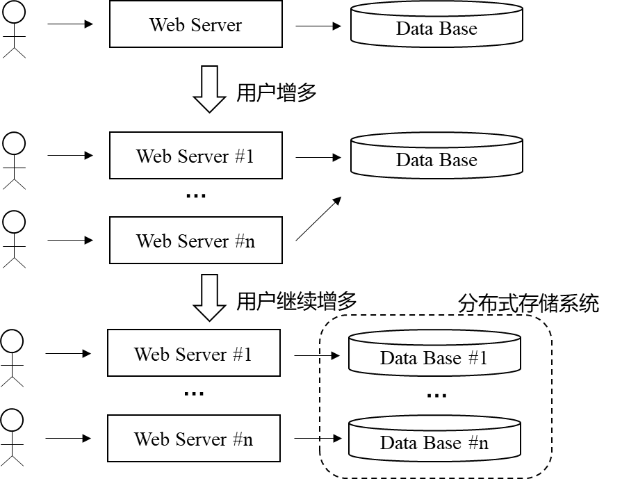
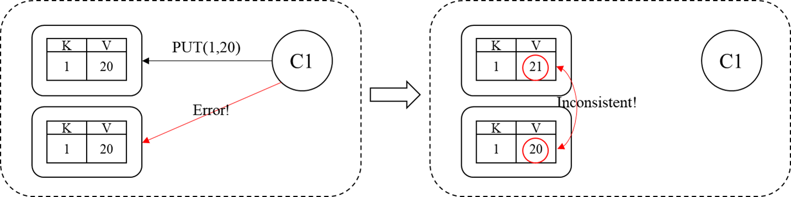
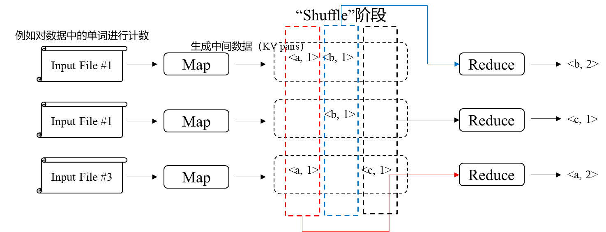
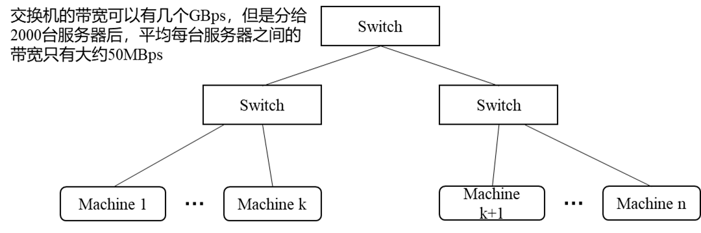

## 分布式系统简介

分布式系统需要考虑：

1. parallelism并行程度、性能
2. fault tolerance

3. physical，例如灾难

4. security，例如isolation

> 6.824这门课主要讲述前两个部分，即性能和容错性


分布式系统的挑战：

1. concurrency
2. partial failure，一部分宕机，其它还在正常运行

3. performance


分布式系统是关于应用的基础设施的一门课：

1. Storage，分布式存储
2. Communications，分布式网络
3. Computation，分布式计算

分布式系统应以非分布式系统的接口供用户使用。


分布式系统的实现（涉及哪些东西）：

1. RPC
   像调用本地函数一样调用远程主机的函数；
2. Threads
   线程提供了一种结构化并发操作方式，简化了程序员对并发操作的视角；
3. Concurrency Control
   例如锁等机制；


分布式系统的性能：目标是实现scalability，即有n台计算机则性能变成原来的n倍




分布式系统的容错性：
单台计算机可以正常运行很长时间，但是如果建立一个由数千台计算机组成的集群，每天就会有大概3台计算机故障。所以在分布式系统总会有一些故障。

1. 可用性（Availability）
   系统在遇到特定类型的故障后仍然可以正常运行，遇到超出范围的故障仍然会不可用；
2. 可恢复性（Recoverability）
   可恢复的系统是指比如遇到故障后系统不会再响应用户请求，但是通过修理后仍然可以继续工作，比Availability要弱一些。可恢复的系统通常会在系统崩溃前做一些工作，例如将最新的日志存盘等。
   涉及掉电非易失的存储设备、备份复制机制（Replication）等，例如**Raft**就是一个通过备份实现容错性、一致性的机制。


分布式系统的一致性：
假设正在构造分布式存储系统，只支持``PUT(key, value)``和``GET(key) -> value``两种操作，但是出于性能和容错的两方面考虑，分布式存储系统对一份数据通常会有多份数据副本，可能是复制和缓存的原因，会有可能出现同一份数据存在不同版本的情况。



不同系统的一致性定义各不相同，比如上图的系统就是每次``GET``请求都应该拿到最近一次``PUT``请求存入的数据。（**强一致性**）实现强一致性的代价非常大。
有时候将一致性的要求降低，可以获取到更高的性能，比如不再要求每次``GET``请求拿到最新``PUT``请求存入的数据，也可以是旧的数据。（**弱一致性**）


## MapReduce

MapReduce由Google设计、使用，用来在TB级的数据上进行大量计算（分布式计算），例如创建网页内容的索引、分析整个网络的链接结构以便识别出最权威最重要的页面、对网页数据进行排序等。MapReduce被设计的目的就是一种能快速完成以上计算任务的**通用框架**，能够让工程师把不同类型的任务交给它完成。



```python
Map(k, v): #k是输入文件名，v是文件内容
    split v into words
    for each word w
        emit(w, "1")
```

```python
Reduce(k, v): #k是单词, v是value组成的vector, 例如{"1", "1", ...}
	emit(len(v))
```

MapReduce需要配合网络文件系统来使用，使得任一Map Worker可以读取任意Input File，也使得任一Reducer Worker可以读取任意Intermedia File，例如Google的GFS。

> GFS可以把大型文件拆成64KB的chunk，并均匀分散存储到多个GFS服务器上，每一份数据实际上会有三份copy，后面会细讲。
>
> MapReduce2004年的论文中提到它们当时的性能瓶颈就是网络传输带宽限制，例如
> 
>
> 因此MapReduce论文中当时用了许多技巧来尽量避免数据在网络中传输，例如**尽量**将MapReduce Worker和GFS服务器安排在一起，这样Worker就可以直接从本地磁盘中读取数据。（一台机器可以同时运行GFS和MapReduce两种服务）

